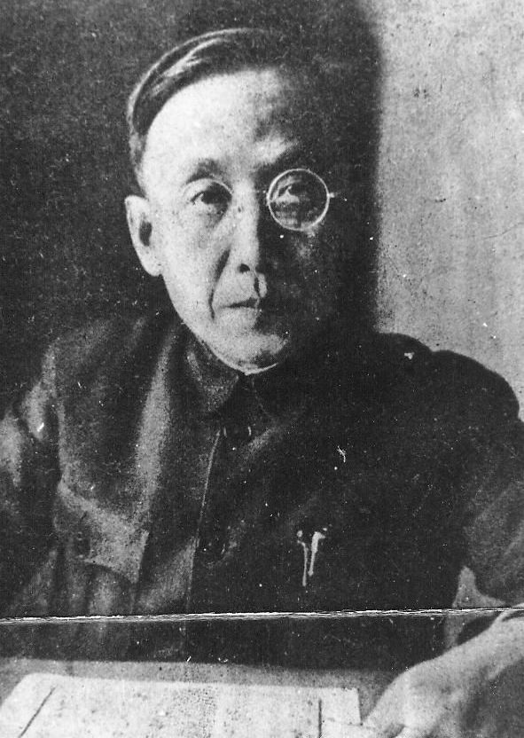
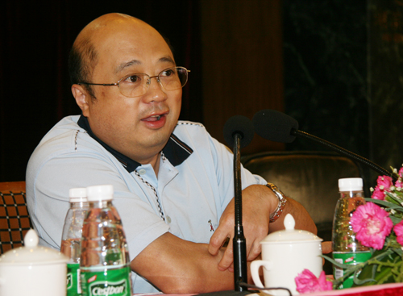

# ＜摇光＞法律人应该有眼泪

**我们曾一度相信我们是贵族，我们也曾一度相信我们可以斫作五弦琴，弹奏天地正音；我们曾经仰望星空，我们曾经有着与诗人一样的浪漫与天真，然而我们当中的诗人卧轨了，只留下面朝大海春暖花开，可是冬天还未过去！法律人应该是一盏灯，今天我们不知道自己是应该淹没在黑暗里还是照亮一片天空？或者在黎明的黑暗中这本来就没有差别。法律人，无奈也好，沦落也好，你是不是应该为这冬天与黑暗流泪？**  

# 法律人应该有眼泪

## 文/ 郭立伟（北京大学）

 

2010年最后一节行政法课，王锡锌老师用他依旧很个性、很潇洒的讲课方式结束了最后一节课。临下课，王老师播放了一个ppt题为“相信未来”。 不知道是何原因，看着那些惨淡的人生、淋漓的鲜血和与之形成反差的那些被我们憧憬过无数次的社会理想，整个教室哑然无声。只是任那首叫做《光明》的背景音乐敲打着我们心弦，叩问着我们的良知。不知为什么，思绪纷飞之间竟然有一种莫名的忧伤，喉咙哽咽，想要哭出来。抬头看，老师颜色凝重，但目光坚毅。

记得刘仁文先生曾经写过一篇文章叫《法学家为什么没有忏悔》，是文革后知识分子对于中国法学家、法学界的一次扣问，如同一声惊雷，又如力道十足的鞭挞，呼唤着文革时期那些所谓的“身不由己”的法学家良知的觉醒。今天，也许法学家，法律人已经没有了那个无法无天的时代的身不由己，今天似乎法律人作为一个群体已经不需要忏悔了，他们不再承受历史的厚重的责难。但是，自诩为社会公平正义象征的法律人，从历史的忏悔中清算后，是否已经忘却了自己的良知，忘却了“长太息以掩涕兮，哀民生之多艰”的情怀？法学家是不是也应该有些眼泪？

随着中国法制化进程的加速，法律人正在形成了一个共同体，已有学者发表所谓的《法律共同体宣言》，宣誓法律人的崇高，说他们是社会天生的贵族，他们独立于统治者与人民。我想任何一个法律人都会为这个振奋人心的口号感到自豪，都会为这个身份感到荣耀。但是稍微了解中外法制史的人都有这样的常识，那些盛赞属于外国的法律人，属于法治国家的法律人。那些盛赞是用血与泪的法制进程、政治斗争铸就的丰碑。那些光环之后有美国建国者的智慧与艰辛，有联邦党与反联邦党长达数十载的斗争；有英国革命国王和护国主的鲜血，光荣革命的妥协；有巴黎市民攻占巴士底狱的壮举（也许算不上壮举，就是个暴动），有拿破仑的功勋……我想这些荣耀不属于中国本土的法律人，这种“先天的贵族”气质，中国的本土没有，中国的法律人也从来不是什么贵族。

研究一下明清小说，甚至看看TVB电视剧，大家就知道中国历史上离我们最近的法律人叫状师。我们不管粤剧如何塑造广东四大状师玩弄刀笔，以三寸之舌“为民请命”， 我们且看看晚清那些讽刺小说，如《老残游记》、《儒林外史》、《官场现形记》等我们时常会发现状师的影子。他们往往有个秀才、举人之类的功名，但是不治学，不出仕。他们谲诈多谋，坏法乱纪，除了勾结官吏，包揽诉讼外，也经常每能以不可思议的机巧手段，在诉讼里获得胜利。虽然西学东渐给中国引进了现代法律和律师制度但状师这个职业也在中国乡土社会却仍有着顽强的生命力，至民国仍然余孽未除。之所以说这段历史，是要说明中国本土虽然引进了现代的律师制度，但是我们自己是先天不足的，不仅不足而且状师这个行业也间接导致律师乃至整个法律人群体在本土化过程中没有那么高尚、那么贵族具有贵族气质。中国没有天生的贵族，只有骑在人民头上的“贵族”。想起最近《非2》里面的一句话，哪有tm上流，全tm是下流。

法律人的崇高也如普通人一样，不是来自于他们天生的崇高性，至少在中国没有这样的历史正当性，二十来源于他们德行的高尚，来源于他们的担当他们的奉献。刚刚去世的蔡定剑先生，被很多人怀念、提及，为很多人钦佩，不是因为他是什么尊贵的法学贵族，而是他作为布道者的艰辛，期盼中国民主法治终将生根发芽虔诚，是他殒身不恤的坚持。蔡先生的离开，让许多人潸然泪下，我想最需要流泪的不是那些被感动着的个体，而是法律人这个群体。

法学家应该流泪。看看我们的同仁，有多少诸如黄松有、郭生贵这样的骑在人民头上作威作福的贵族，玩弄着法律的天平，蝇营狗苟，助纣为虐？法律人群体难道不值得为这样的不幸感到羞愧。不应该为那些因为这些新时期的“状师”给这个社会带来的不公，给受害人带来的痛苦流泪？

法律人应该流泪。我们自诩为社会公正的化身，但是宜黄拆迁的血与火还未消弭，黑龙江又起硝烟；开胸验肺，到剁手证明清白；从黑砖窑到智障包身工，从信访局跪到中南海，从杭州飙车男到保定李刚门，法律人难道你们只是看客？难道只有黔首的热血画出的问号，才能换来“贵族”们的一个不痛不痒的说法？乐清村长背后的遮遮掩掩，权力面前的唯唯诺诺，法律人你们头顶上的天空和心中的道德底线是不是值得留下两行泪。

法律人应该流泪。为弱势群体，为公平正义。今天扭曲的价值判断也许已经让我们开始怀疑什么是弱势群体。醉酒驾车处罚规定一出，竟有人恬不知耻称此条例不公，称自己是弱势群体。而那些求助无门，沧桑的人民只能用上访、用下跪讨个说法时，却被称为刁民甚至精神病。法律人呀，你们只知为弱势群体奋斗，可是谁又是弱势群体，指鹿为马岂不痛哉？法律人你应不应该无奈，应不应该流泪？

  

我们曾一度相信我们是贵族，我们也曾一度相信我们可以斫作五弦琴，弹奏天地正音；我们曾经仰望星空，我们曾经有着与诗人一样的浪漫与天真，然而我们当中的诗人卧轨了，只留下面朝大海春暖花开，可是冬天还未过去！法律人应该是一盏灯，今天我们不知道自己是应该淹没在黑暗里还是照亮一片天空？或者在黎明的黑暗中这本来就没有差别。法律人，无奈也好，沦落也好，你是不是应该为这冬天与黑暗流泪？

那些老旧的画作依旧在头脑中放映，独立战争、人权宣言、自由引导人民、雅典学园……霍布斯、卢梭、华盛顿、拿破仑、林肯……那些已经符号化了画作，与血拆、自焚、贫困、挣扎、哭泣交相辉映，还有教授那张虽然没有看照片但已经扭曲凝重的脸……汪峰的《光明》响彻教室，长歌当哭，法律人难道不该流泪？

直到今天才理解了法律人的职责与悲哀，理解了中国社会法学家的悲剧。我们是制度的维护者，更是制度的改革者，我们憎恶黑暗却又无往不在黑暗中，我们渴望自由却无往不在枷锁中。我们被社会寄予厚望，我们也相信未来，却发现原来我们永远是现在的一个赵氏孤儿……难道不值得为法律人自己流泪？

化用最后王锡锌老师ppt中一句话：让子弹飞，让虚伪的未来滚！（原句：让子弹飞，让考试滚！）

 以此文向布道者蔡定剑致敬，向传道者王锡锌致敬，向还相信未来的弃儿致敬！向未来致敬！  

（采编：安镜轩；责编：陈锴）

 
