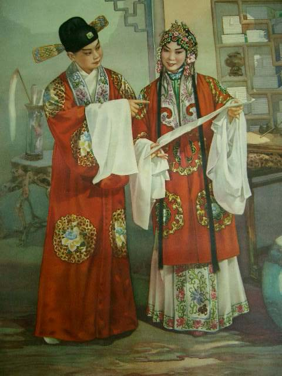

# ＜摇光＞浪漫的婚姻和伦理的婚姻

**两个人互相看对方不顺眼，或因为他把脚翘在了桌子上，或因为她把水洒在了书上，便大吵大闹，甚至于大打出手也是有的。于是，整日便以这些小事情吵来吵去，每次吵的时候，还要把以往的陈年旧事提兜出来，以加罪状。然而即便到了这地步，还是有人“忍耐”了一辈子，而没有选择分开。**  

# 浪漫的婚姻和伦理的婚姻

## 文/弓口（北京外国语大学）

 

婚姻如同地狱般，埋葬了爱情，这是从贤人那里听来的话。

因为还没有走向婚姻，所以对这句所谓的“哲性”的“真理”，如“花非花、雾非雾”般，将信将疑。

如此，在一种幻象中，试着去探求婚姻的形态。

生活中的现实里，浪漫的婚姻固然有之，然而伦理的婚姻却又更是多数。

鲁迅、胡适、张中行（燕园四大才子之一），均是我们熟知的大家。不同的是，鲁迅留东洋，胡适游西洋，而张中行却是土著。他们三人作为民国时代的人，在婚姻问题上，都沾了点封建“包办婚姻”的媒约之水。受父母之命，娶了所谓“封建妻子”。但作为一种结果，三个人走了不同的路。

鲁迅将“原配妻子”朱安归置在家中，自己到外面抨击政府，执教鞭于课堂之上。后深得学生许广平爱慕，而与之私奔南下广州，成就了自己的“浪漫婚姻”。对此，有人赞许鲁迅冲破封建的束缚，敢于向封建礼教开炮；而也有人批评其不负责任，让朱安孑然一身孤零终生。鲁迅朝着“浪漫的婚姻”去了，朱安却成了最大的牺牲品。

胡适据传在外也绯闻不少，其才气魅力必是少不了青楼女子的仰慕和爱恋的。不少同仁官贤也曾多次劝胡适与“原配妻子”离婚另娶。按理说，离婚这说法，是从西洋传来的舶来品，胡适游历西洋多年，对此应该容易接受，而胡适终究没有迈向“浪漫的婚姻”。虽其所学其妻或多未闻，但胡适却时常用容易理解的方式讲一些外边的趣闻，以增加情趣。最终，胡适以一种对“形式”的道德追求完成了他的“伦理的婚姻”。这与季羡林先生与妻子常年分居，说与之没有感情相比，多少是有些类似的。

张中行原是受媒约在家里结了婚的，后到北京求学并执教于未名湖畔。与家中妻子相见便是每年的寒暑两假。后其与写《青春之歌》的杨沫相识相知相恋，固然是没有认真考虑家中妻子的感受的。不过，随杨沫怀孕而让张中行为之无措，心中顿然生出自责与惊恐。于是，在杨沫产子之后，两人不断地冷冷热热，在文化大革命前正式分开，结束了“浪漫的婚姻”。此后，张中行回到了原配妻子那里，重启“伦理的婚姻”。

于此，有了婚姻的四个阶段之分。

先是“可意”，两个人在一起举案齐眉，相敬如宾。如不立文字，眉目传情，以心传心。你我相互意会言传，生活非常快乐。如能得“可意”之人与之结伴生涯，便是从“浪漫的婚姻”开启水源，“伦理的婚姻”便如水到渠成般修成正果。

其次便是“可过”。可意的婚姻固然美好，而纵观现实生活，那样的婚姻多是一种理想。两人无法做到心有灵犀，或是存在巨大的“鸿沟”，这种鸿沟或是价值理念，或是知识储备。说什么，对方听不懂，觉得你不可理解。这时就开始转向“伦理的婚姻”，听不懂就听不懂吧，得过且过。两个人还有孩子，还要做饭吃饭，就不讲那些价值观，讲些简单的生活。这个过程里，或多或少便开始有了烦恼，渴求理解。

再次便是“可忍”。有时候妄说“可意”，即便是“可过”也是不可得的。两个人互相看对方不顺眼，或因为他把脚翘在了桌子上，或因为她把水洒在了书上，便大吵大闹，甚至于大打出手也是有的。于是，整日便以这些小事情吵来吵去，每次吵的时候，还要把以往的陈年旧事提兜出来，以加罪状。然而即便到了这地步，还是有人“忍耐”了一辈子，而没有选择分开。抑或为了孩子有个完整的家庭，抑或为了父母的劝阻，就这样吵吵闹闹，忍了一辈子的人也是有的。他们在“伦理的婚姻”里选择了“热闹的坟墓”。

最后便是“不可忍”了。这是最易理解的。没有话可说，看之如臭粪，见之便生厌，想之愿炖之，游戏便结束了。这结束，便连“伦理的婚姻”也没有。或许开始享受一个人的“孤独”，或许重新开始新的“四可婚姻”。

从这“四可婚姻”里走出来，可以看出，“忍”还是婚姻中必不可少的。这也如同跑马拉松一样。42.195公里的马拉松，一般跑来，前10公里是比较轻松的，因为有体力。而到了14公里，便会感到体力下降，有的跑手或许就在此放弃了。这种放弃如同感情婚姻中的“分手”。不过很多跑手还是能够接着向前跑，这中间会因人而异出现多个或不同的“体力临界点”，而无法跑下去，从而选择放弃。有时候还可能在临界点出现了放弃的想法，但还是想跑完，便休息一会接着跑。感情婚姻中，好多人提出分手离婚但过了时日便收回了原话也是如此。而当跑到36公里时，将是体力的最大临界点。这时即便是最累的时候，但想放弃的人却很少了。因为已经跑了这么多了，这时放弃必然心里不甘。付出的多了，更不愿意轻易放弃。这也正是为什么他人看来很糟糕的感情或婚姻没有结束的理由所在。

一点不想忍的婚姻是没有的，不随随便便放弃，像马拉松一样，跑完全程，如若实在到了无法忍受的地步，那就半途而废，重新开始。

不过对于半途而废，还是少一些。有人三次信誓旦旦要跑完马拉松，不过却一次都没跑完，到第四次的时候，说什么也不跑了，累了，没信心了。对于感情，若是有太多的半途而废，到后来或许会觉得感情就那么回事，到最后无非是为了结婚。也罢，不要浪漫的感情了，最后找一个人随便结婚，完成“伦理的婚姻”。

但实际上，每次跑马拉松，其感受往往是很相似的，都会经历不停的放弃与挣扎坚持的过程。每一段感情，大多也是要经历“忍”。放弃了，重新开始，往往会发现，和此前的感情很多是相似的。因此，不轻易放弃，是一个原则。当然这个原则很是有限。

 

（采编：薄然；责编：黄理罡）

 
