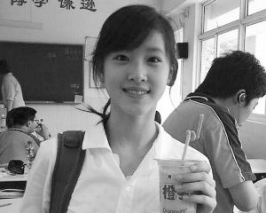

# ＜摇光＞清一色的低头锁车状

**总有一天，奶茶也会成为学姐，也会成为人妻，也会成为半老的徐娘，也会感伤于日薄一日的风韵，也会无奈于日胜一日的老年斑、鱼尾纹。几十年后的某一天，她是否会想起2011年的9月16日傍晚，有一小队男生为了能看她一眼，弯着腰在她行进的路上锁了半分钟的自行车？**

 

# 清一色的低头锁车状

# ——关于奶茶

## 文/杨竺松（清华大学）

 

前天晚饭后从紫荆回学院的路上，我看见紫操东南角的保安岗亭外的树下站着院里的三位师妹——注意，是师妹——手挽着手北面而立，笑脸上微扬的嘴角勾勒出满怀待望的神情。我好奇地问，三位干嘛呢，一位师妹答曰：等奶茶。好吧，蹲点布控、守株待人都用上了，原来奶茶不仅仅聚焦着师兄们的关注。

昨天晚饭前，骑车走在紫荆八号楼前的马路上，几个大一新生模样的男生骑着车，飞也似地从旁掠过。冲在前头的男生一边蹬车，一边扭头压着嗓子对身后追赶着的同伴说道：“快点快点，奶茶过去了！”我一惊，哦，原来奶茶就在我们身边。

我在紫荆前面弯腰锁好车直起身来准备上楼吃饭的时候，远远望见奶茶和一位同伴袅娜而至。显然，奶茶身边的同伴要比奶茶本人更加兴奋于远近的指指点点，也更加陶醉于周围“奶茶”、“奶茶”的低声惊呼以及路人擦肩而过之后的猛然回头。就在奶茶怀抱一小摞书本朝着紫荆五号楼款步徐行的时候，之前飞车掠过的那一小队男生早已经呼啸而至，先后在奶茶前边不远的地方来一个漂亮的急刹车，下得车来，摘下车锁，一边佯作弯腰锁车状，一边又略微扬起头来，想一睹奶茶的身影。怎奈年幼羞涩，担心自己是不是把头抬得太明显，于是抬起头之后又赶忙微微收颔，只用眼角的余光搜寻着奶茶的芳踪。

就这样，七八个男生，在奶茶前面五到十米远的位置均匀分布，清一色的低头锁车状，而且锁了半天也没锁好，这在紫荆食堂前那片空地上也算是一出值得赞叹的景致了。

可是，当看到同级的男孩子们目光游移、满世界地搜索奶茶甚至飞车尾随的时候，1字班的学妹们在想些什么呢？当看到身边的男生们都在津津乐道于奶茶面容的清纯、皮肤的白皙的时候，念博士硕士的学姐们、八九零字班的学姐们又在想些什么呢？有嫉妒吗？有不屑吗？有羡慕吗？有鄙夷吗？有向往吗？有失落吗？不得而知。

但不管她们怎么想，我总觉得有些不公平。

在清华这样一所理工背景深厚的学校，在这样一个男女比例从8比2到7比3，目前正朝着6比4艰难挺进的技术学院，每年来到这里的女生们几乎称得上是中国现行人才选拔制度带给这个园子的最大恩赐，正如之前一位记不清姓名的同学在日志里所写，来到清华的每一位女生，都值得给予关注、尊重和呵护。如果要对女生在男生心目中的印象评分，那么在清华，长相这一指标的权重应该显著降低。如果在这个日益浮躁的社会上，女性凭借一张漂亮脸蛋便声名赫赫、风生水起已是司空见惯的话，那么这样的事发生在清华的合理性，应该比在社会上低一些。毕竟，清华倡导的是从专业知识和职业技能上塑造内在人力资本，并以此作为人才评价的主要标准，而“善化妆”、“善美白”之类的能力，在清华这套标准里的权重，要比其在清华以外的社会对女性评价标准中的权重低。所以我以为，在清华所提倡的人才评价标准之下，奶茶单单因为清秀的容貌便吸引了远多于其他清华女生的注意力，对后者而言，有失公平。

退一步讲，以我个人感受而言，即便抛开清华这个环境的特殊性不谈而单论脸蛋，奶茶受到的关注也明显高于其容貌的档次。为什么这么多人关注奶茶？因为她出名。她为什么出名？因为炒作。各大网媒上的奶茶照，最开始都是从哪里来的？是谁拍下了这些照片，又是谁把这些照片放在了网上？TA为什么要把这些照片上网？这些问题尚没有确切的答案。但以我在清华五年生活中的所见，无论是认识的或者不认识的，无论是马路上偶遇的或者食堂里瞥见的，单论奶茶所属的清纯系女生，奶茶的容貌亦绝非其冠。所以在我个人看来，其受到的关注明显超出了其容貌的优越度。更何况，凭借和容貌相关联的名气以博得远胜他人的关注，似乎本不应该成为一个刚进大一的女孩子应有的选择。

不知奶茶对今天的自己在清华园中受到的关注作何感想。

总有一天，奶茶也会成为学姐，也会成为人妻，也会成为半老的徐娘，也会感伤于日薄一日的风韵，也会无奈于日胜一日的老年斑、鱼尾纹。几十年后的某一天，她是否会想起2011年的9月16日傍晚，有一小队男生为了能看她一眼，弯着腰在她行进的路上锁了半分钟的自行车？

编者注：主标题“清一色的低头锁车状”为编者所拟。

（采编：石三；责编：黄理罡）

 
