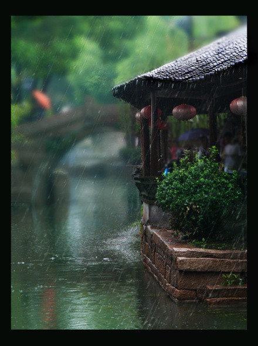

# ＜摇光＞清华之大，已经放不下一张平静的书桌了

**而我们从一入学就被教导清华的各种优良传统，比如最经典的“集体主义”精神，也正是因为这个集体主义精神，各种活动你必须得去，心在不在不重要，反正脸必须得露在那儿；因为这个集体主义精神，大家说神马你就得听神马，就得跟着说神马，大家怎么说的你就得怎么做，要是意见相左便要跟你“单挑”（一群挑一个）了** 

# 清华之大，已经放不下一张平静的书桌了

## 文/ 丁灵平（清华大学）

 

我本来是个不学无术的孩纸，好不容易兴趣来了，抽个时间泡杯茶找个教室坐下来静静读会儿书，不厚的《乡土中国》，啃得快完了，收到一条短信，要把某某某班级素拓的任务完成了。书读得正在兴头上，于是央求：“宽限一下，明晚交好不好？”回地斩钉截铁：“不行！”

于是，只好收起读了一半的书本，跑下楼来从明理楼骑车回到宿舍。读书正酣的人被打断估计跟睡得正香的人被吵醒是一种反应，心里那叫一个窝火啊！因此免不了要多说几句，评论也好、吐槽也罢，有理也好，无理也罢，如鲠在喉，不吐不快！

在最初的憧憬中，上了大学应该是可以有一种宁静而纯粹的生活的，早上图书馆开馆的时候进去，晚上闭馆的时候出来，饿了出来觅点食（据说钱钟书是自带馒头包子进去一整天的），渴了就去接点水，所有的时光都在书本里浸泡着酝酿着，芳香馥郁。大学，就应该是一个自主而自由的地方，可以做自己想做的事情，可以读自己想读的书，可以去关注自己在意的话题全身心地投入到自己兴趣所在的事业当中，尽自己最大的努力，把一件事做到极致。 

但是进了大学才知道，这些不过是憧憬罢了。现实之状况，大学甚至不如高中（所以又童鞋说用高中三年向往大学，用大学四年怀念高中）。高中之时，至少可以专注地去学好自己各门功课的成绩，每天做的事情不一定是自己喜欢的但是每一天都是单纯而有意义的。而在大学里，一本书读到一半，会告诉你班级有个活动，必须全员参加；会告诉你学院有个动员会，一个也不能少；正在全神贯注地听一个讲座的时候，发一条短信过来说晚上有个排练，不能缺席……一天到晚的各种事情使人想过一种简单而有规律的生活也不能够。而这些事情，又有多少意义呢？本来是连国歌都能唱走调了的人，非要拉着你去参加一二·九合唱，说这是学校的光荣传统；本来是一直标榜“自由精神、独立思想”的学校，却在各种政治课、党课上费尽心机，说我们是“红色工程师”的摇篮（我就郁闷了，红色工程师能建个世界一流大学出来？）

而我们从一入学就被教导清华的各种优良传统，比如最经典的“集体主义”精神，也正是因为这个集体主义精神，各种活动你必须得去，心在不在不重要，反正脸必须得露在那儿；因为这个集体主义精神，大家说神马你就得听神马，就得跟着说神马，大家怎么说的你就得怎么做，要是意见相左便要跟你“单挑”（一群挑一个）了……清华永远是集体主义的，在清华你永远不会是一个人，所以，不要祈求可以一个人安安静静读一天书，因为今天中午还有个会呢，尽管你很不想去；不要奢望你这个周可以赴半年前的约定去某地支教了，因为还有党课要上呢，尽管在你听来那个老师信口开河满嘴胡言……于是，在清华，一天天深刻感到——真正的自由不光是你想做神马就可以去做神马，还得你不想做神马就不用去做神马！然后很悲哀地发现，尽管你想做的合法合理合道德符合各种要求，你还是做不了，因为总是有一大堆于你而言毫无意义的七零八碎的事情等着你，不想做也得去做！ 

于是，只能疲于奔命了，连静静读本书的时间也难得了，哪怕周末也总会有各种组织各种活动穷追不舍地要来瓜分这么一点点可怜的原本应该属于你自我决定的时间。大学里的纯粹地学术追求变得越来越虚浮，反而是种种无谓的投入让你精疲力竭。

你一遍遍地读着王国维的纪念碑，发现尘封在历史里的精神在这个园子里可悲地死去，再也无法追回。自由思想被“又红又专”地政治唯上的办学理念所取代，独立精神更是在“集体主义”的大山之下奄奄一息。你听着老师在台上讲“concentration”的时候，还要拿起手机回一条你翻过一遍都完全没记住讲的是什么之看到最后“收到请回复”的短信。你想去荷塘边坐一坐，理一理今天读完的那本书的感想，却突然接到一个电话让你速去某个地方有个神马活动。你的日程表总是满满当当的，你晚上熬夜不到12点以后都睡不着觉，但是，你却不知道自己在忙些神马，不知道这些事情有啥子意义，只是睡前望一眼自己的书架，想起来该读的书还没有读，心里忍不住一些疲惫与愤懑。

明天，又是这样一个混乱的日子。 

恍恍然中，你像黛玉评宝钗般想着“往日里竟是我错了”，可是你又错在了神马地方呢？你只是想一个人静静地读一些书，踏踏实实地做些事；你只是不想为哪个人、哪个社团组织而生活着；不想为一些卑陋的蝇营狗苟的目的而活着；你只是觉得大学应该是一个培养独立人格的地方，是允许自由与个性的地方；你还觉得大学应该是一个淡泊而安宁的地方，是一个能让人静下心来专注地读书做事的地方……

然后，你就成了一朵奇葩，在园子里兀自开落，热闹是他们的，偶尔给你泼盆凉水…… 

（采编：应宁康；责编：陈锴） 

