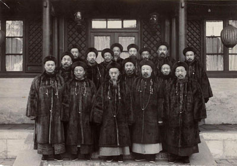
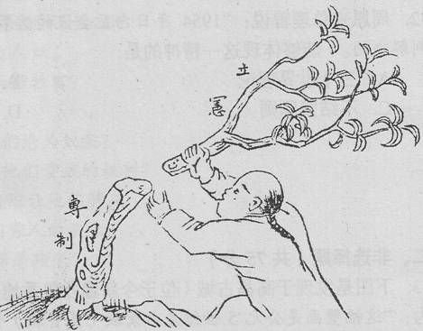
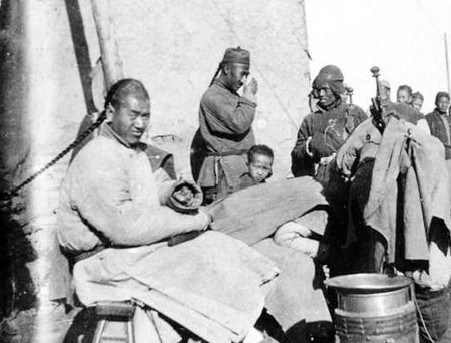

# ＜摇光＞清末立宪不靠谱，君主立宪不可行

**清末立宪，说白了就是一场耍嘴皮子的立宪。没有军队，一切都是白扯。几个爱新觉罗的后裔，坐在哪里喝喝茶，耍耍嘴皮子，成立个皇族内阁，这个国家就变好了？嘿嘿，我反正是不信。**  

# 清末立宪不靠谱，君主立宪不可行

## 文/王斐弘（北京电影学院）

 

辛亥百年，俺写了篇文章，说辛亥是个好革命。推翻皇权，建立亚洲共和国。刘艾琳博士看了以后，留言对我说不靠谱，说如果革命党人给满清多留一点时间，那就会出现东方的君主立宪。

这个论断不新鲜。在一百年前，汪精卫刺杀摄政王的时候，摄政王也这么苦口婆心的对汪精卫说：你要有耐心，要给我们时间，让我们立宪。

汪精卫回敬：“大抵各国之立宪，无论其为君主立宪，为民主立宪，皆必经一度革命而后得之。所以然者，以专制之权力，积之既久，为国家权力发动之根本，非摧去此强权，无以收除旧布新之效故也。”

汪精卫这话，说得文艺点，就是权力之根本，在于军队。套用老毛的话，就是枪杆子里出政权。谁手里有枪，谁就是最高统治者。谁想牢牢掌握住政权，谁就得把枪杆子握在自己手里。

军队，是国家机器相当重要的组成部分，是一个体制公众权利的最高来源。现代西方政府成立的标志，也都是以军队国家化为前提的：华盛顿当了大统领，干的第一件事就是把军权交给议会，立志不做皇帝，美国才能建立宪政制度。无论哪个总统上台，军队都听总统的。这就是掌握了军权。

刘艾琳博士很反感一点：革命必然导致流血。流血是不好的。

事实上，倘若你要搞真立宪，必须也要流血，甚至流的更多。比如说现在玩立宪玩的最好的英国，《大宪章》是诺曼男爵用剑逼着英王约翰签的。查理一世是克伦威尔带着新模范军把他送上断头台的，单单一个马斯顿荒原战役，就死了多少人。如果只单靠几个议员递个请愿书通过个法案就能搞宪政，也就轮不到克伦威尔们粉墨登场了。光荣革命倒是不流血，但玛丽不是赤手空拳上岸的，背后是一万两千个精锐士兵的支持。

至于刘艾琳博士喜欢的威权统治下由专制向宪政的完美过渡，大概说的是日德那样。说日本是“君主立宪”，这个词不靠谱，叫他们“军主立宪”还差不多。

日本天皇原来怂的一腿，因为军权在幕府将军手里。后来萨长土肥的维新党发动倒幕运动，废藩置县，建立了威权的维新政府。自己地位太低，就拉出原来的那些天皇大臣来充门面，跟武昌起义一个样。也就是盖盖章，给前线士兵发一发御用香烟，一天吃一顿饭号召大家买军舰什么的。日常事务无非就是签字，批准，调节调节海陆军的冲突。整个日本的实权，还是掌握在军人手里。

普鲁士也是这样，前身是一个条顿骑士团国家。团长是国王。国王背后是容克地主。所以有那句名言“其他国家拥有一支军队，普鲁士军队拥有一个国家”。

这几个搞君主立宪的国家，之所以搞的算个人样，最重要的一个原因，就是他们有一个从属于中央政府的庞大军队。

满清政府有没有呢？

绿营看大门都看不好。蒙古骑兵死了几万，砍死了几个英国人法国人。八旗军更不用说了。天天熬鹰遛鸟，捧戏子玩蛐蛐，好吃懒做，四处闲逛，阅兵的时候，一齐步走就顺拐。满清政府觉得应该有一只从属于自己的武装，花了大笔的银子给他们买了克虏伯大炮，毛瑟步枪，一打仗，革命党人拿着喇叭一宣传：我们不虐杀俘虏，我们善待你们。八旗子弟高高兴兴地排队上缴武器，开开心心地回家斗蛐蛐，只留下朝廷上那个小寡妇在那里流泪。

朝廷自己的中央军不好了，那就任由地方大员填补权力真空。太平天国，捻军，一次次冲击着满清的权力，鸦片战争，甲午战争，八国联军让清朝颜面扫地，地方大员以剿匪的名义，取得了独立的财权，军权，戊戌六君子的鲜血则让广大知识分子离满清越来越远。至于那个可笑的满清立宪，说的倒是很好听，立宪的内容倒也很不错，甚至一些直接被国民政府写进自己的法典，一句话，除了清末立宪没法实施以外，看上去真的不错。

清末立宪，地方权力的膨胀是它一辈子也迈不过去的坎儿。袁世凯一而再再而三的杀不死，任由他坐在自己的亭子里钓鱼，让满清很头疼。载沣为了收回兵权，任用铁良等一干满清亲贵，希望重掌兵权。可惜，满清贵胄的腐败懦弱无能已经渗入骨子里，他们一没有手腕，二没有智商，只能眼睁睁的看着袁世凯逼宫当影帝。

辛亥革命之后，孙中山的国民政府之所以号令不行，甚至毫无威信，就是因为没有自己的军队。南京国民政府，只是个各方势力均势下推出的空头政府。政权最后落到手握北洋精兵的袁秃子手中，不是众望所归，却是水到渠成。军队是袁世凯和地方军阀的私属而非统一于中央政府的国家军队，宋教仁等的宪政梦想也只能是水中月镜中花。至于后来，黎元洪之所以是虚位总统，因为军权在段祺瑞手里。至于护法战争孙中山之所以失败，还是因为没有自己的军队，所以才痛定思痛，创立黄埔军校，创立中华民国革命军，由南到北，一路打过去，逐渐统一中国。

清末立宪，说白了就是一场耍嘴皮子的立宪。没有军队，一切都是白扯。几个爱新觉罗的后裔，坐在哪里喝喝茶，耍耍嘴皮子，成立个皇族内阁，这个国家就变好了？嘿嘿，我反正是不信。

还有一点也很重要。现在来看，有君主立宪倾向的国家，君主都是作为宗教领袖的身份出现的。英国是国教领袖，泰国有佛祖，中东信真神阿拉。满清呢？满清有没有一个宗教来统一所有人的信仰呢？满清皇帝站在哪一种身份来领导大众呢？萨满祭司？还是佛教信徒？信安拉？还是信孔子？就算皇帝有自己的信仰，民众呢？宗教在清朝平民间的受众，其实很小。很多人也根本不懂教义。不少人今天在五台山上拜了一圈菩萨，明天就找个道观去拜老君。昨天拜的佛他也不认识几个。民众没有宗教仪式，皇帝缺少宗教领袖气质，你很难靠他来引导大众，走向团结，走向宪政。

 

（采编：麦静；责编：麦静）

 
