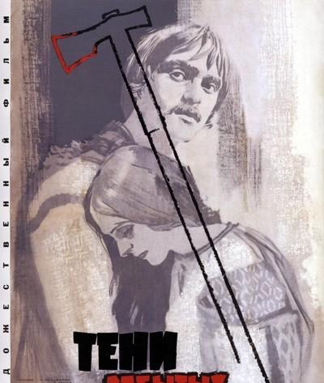
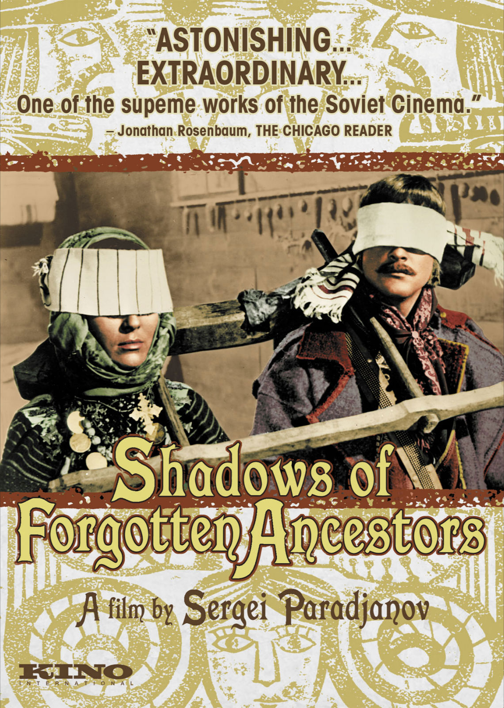

# ＜摇光＞独裁者不自信，看谁都像反动派

**独裁者厉行言论审查，是因为不自信。或曰：你自信点，不就完了么？独裁者答：放松言论审查，我就真的完了。共产主义的苏联完蛋了，独裁大明朝的亡魂还附着在某个言论审查极其严格的傻逼国家上。别多想，我说的是北韩。** 

# 独裁者不自信，看谁都像反动派

# 

# ——从《被遗忘的祖先的影子》说开去

## 文/王斐弘（北京电影学院）

在课上，老师说要放一个好片子。名字叫《被遗忘的祖先的影子》。据说这个片子的导演因为煽动乌克兰独立，被关进了监狱。

也许都是处在极权国家，一个电影学院的老学长又不小心走丢了，所以我对异议分子有着很深的同情，所以异常兴奋地看这部片子。

看了一半，我睡着了。

这片子压根就不是一个政治电影，一没有反极权，二没有民族独立情结。三没有呼吁言论自由，连苏联共产党的名字都没提。讲的是一个很男默女泪的爱情故事。为什么帕拉杰诺夫会因为这个片子进监狱？

故事本身的内容并不复杂。伊凡的父亲被杰诺科人杀死，但是他却爱上了杰诺科姑娘玛丽起卡，恩怨纠葛不允许他们在一起。伊凡远走他乡，后来才知道，玛丽已经死了。爱人的死使他痛苦，直到他又娶了巴拉格娜。但是巴拉格娜是个淫荡的女子，她背着伊凡与一个巫师偷情。最后，伊凡在与巫师的决斗中死去。

这是罗密欧与朱丽叶的翻版。只不过套用了乌克兰的民俗，采用了杜甫仁科所开创的诗意电影的拍摄手法，运用乌克兰民族文化中种种文化符号，使影片成为了不朽的佳作。

影片开场，大量的移动摄影，拍摄乌克兰皑皑白雪的荒野，白桦林，奔跑着的孩子，全然一幅移动的油画。

在影片中，鲜血流出，幻化为马，也成为不朽的隐喻。

整部影片，充斥着大量的乌克兰文化符号，东正教的弥撒，宴会，歌舞，服饰，给人耳目一新的感觉。

《影子》最令人赞叹的，是全篇异常丰富的宗教情感。电影中的主人公，帕拉让诺夫的镜头下具有庄严的美，乍看俨然如图画里的宗教圣像。让人称奇。

上面那些都是套话，是电影学院学生写影评不得不写的东西。没办法，为了交作业嘛。

我对影片的评价，大概就是如此：强烈的仪式性，宗教化，绘画色彩浓郁。说本片是诗电影，我比较反感：诗歌要的是人的想象空间，要的是人对文字的思考，幻想，一旦把诗用图像表现出来，诗还是诗吗？

我更关注的，是苏联当局对这部影片的封杀。

这样一部反应乌克兰民俗风情的影片，为什么被禁呢？

苏联当局给的罪名是：乌克兰民族主义倾向。

一个亚美尼亚的导演，怎么会有乌克兰的民族主义倾向呢？

究其原因，大概是影片中大量的影像，表达了乌克兰的文化符号：东正教的弥撒，宴会，歌舞，服饰。乌克兰人对苏联人的反感很深。1917年，苏维埃屠杀乌克兰农民，幸亏得到德国军队的救助才得以幸免。1922年，乌克兰爆发饥荒，列宁用毒气弹屠杀农民才制止住起义。斯大林统治期间，乌克兰是肃反的重灾区，据89年颜色革命之后的俄国调查显示，乌克兰饥荒饿死的600万人，是被斯大林有计划地饿死的。

苏维埃如此残忍的对待乌克兰，自然也就忌惮乌克兰的民族主义情感了。不做亏心事，不怕鬼叫门，做了亏心事，看谁都像鬼。

所以，在苏维埃看来，片中表现乌克兰的雪原翠柏，是煽动独立；表现弥撒，是煽动独立；表现鲜血流出，幻化为马，也是煽动暴乱。幸亏片子是拍在赫鲁晓夫时代，要是在斯大林时代，老帕估计早就惨死在莫斯科的疯人院了。

独裁者不自信，看谁都是反动派。

这里插一句，苏联人残酷地对待乌克兰，在文学上有所表现。比如那本三流文学作品《钢铁是怎样炼成的》，讲的就是苏联殖民者如何压榨乌克兰，同时压榨自己人性的故事。整本书都很2，就有一个情节我很喜欢：一个共青团员把自己的团员证扔进火炉，团员证被火烧成灰烬。好在后来乌克兰民主化了，当年反抗暴政的彼得留拉享受到了应该享受的待遇。这是后话。

独裁者不自信，看谁都是反动派。

无独有偶，苏联有独裁者，中国也有。同样不自信，同样有秘密警察，同样四处监禁。

明朝中叶，有一皇帝，名叫朱厚照，是历史上有名的荒唐皇帝。满清乱华的时候，如果皇子不好好读书，皇子就会被师傅斥责一句：你想学朱厚照吗？

朱厚照的荒唐事，数都数不过来。

在位十六年，他能撇下朝政大臣，多次偷偷地外出游玩题字；他能让后宫佳丽独守空房，派人到处抢夺妇女供其淫乐；他能放着皇帝不当，甘愿当一名小小的总兵官；他自己生不出儿子，就迁怒于皇妃，赐死者有之，却从亡虏走卒中认养了二百多个皇庶子。

大明朝到他手里不至于灭亡，只不过是借着他爷爷的余荫罢了。朱厚照的爷爷明宪宗，为人颇有能力，貌似冲淡平和，实则心狠手辣，为自己的不肖子孙打下了坐守的基业。孙子倒也很有自知之名，经常在别人面前提及，他对爷爷的感恩之情。

朱厚照，因为自己姓朱，又属猪，就下令禁止百姓养猪。民间百姓，但凡有养猪者，杀猪者，甚至谈论猪者，轻者打板子，关监牢，重则斩首示众。一时间，人人噤若寒蝉，纷纷以其他名字代替“猪”这个词。

当时有大臣提出，禁猪令是为了保大明江山稳定，外敌倭寇，内保民生。因为，有犯上作乱者，便会以"杀猪”为信号，或者隐喻侮辱皇帝，或者隐喻杀死皇帝。着实为欺君大罪。

现在想想，这句话挺扯淡的。如果你政治清明，百姓生活安定，就算有人在街上喊口号，要打到明武宗，老百姓也未必赞同。因为皇帝让他们过得好，吃得饱，想说什么说什么，他们为什么要推翻皇帝？一个王朝的安定与否，不是靠屏蔽一两只动物办得到的。

明武宗那会儿，之所以禁猪，就是因为当时的社会环境实在太黑暗，太腐败。

正德年间，宦官专权，吏治败坏，土地兼并严重，物价飞涨，工商农暴力抗税频发，整个大明朝，处处矿变，处处商变。收税的官员常常遭到暗杀，国家极度动荡，政权危机四伏。正德年间，宦官专权，东厂太监行于民间，刺探民众口风，但凡有百姓说了他们看来不利于大明朝的言论，轻者被打入大狱，重者死于非命，株连九族。一时间，人人噤若寒蝉，见面不敢说话。土地兼并又十分严重，地价昂贵，很多人劳动了一辈子，买不到一处田产。而皇庄却兴旺发达，大肆圈地，大明朝皇族的皇庄，囊括全国40%土地，更有皇族低买高卖，牟取暴利。至于各地的矿变、民变更是处处出现，举目四见。

明武宗天天出来玩，这种情况他是了解的。他看到人们杀猪吃肉，就会觉得不舒服，就会联想到自己被杀的惨状。通过禁止人们杀猪，可使自己在心理上得到一种莫名奇妙的慰藉感和安全感，这是明武宗发布“禁猪令”的真实心态。

环顾历史，这种昏君为数不少，几乎历朝历代都有。

宋末元初，山河沦亡。关于一种花的画在全国各地流行开来，这就是无土兰花。知识分子以此寄托山河破碎的哀思。元朝皇帝认为这有损统治，予以禁止。

是昏君，是明君，一眼就看出来了。国家的长治久安，靠的是你爱惜国民，不断改革变法，才能做到。出于对人民的害怕，禁止人民杀猪，甚至谈论花，这就能长治久安？大元朝基业虽大，时间却不过百年，不外乎是出自这种原因。

你养一头猪，东厂公公曰：大胆！这不是影射我朝皇孙么？该抓！

你种一朵花，西厂公公曰：大胆！敢煽动上街散步？该抓！

你请穷人吃螃蟹，锦衣卫sama曰：大胆！你敢吃我们这个社会？该抓！

不论是花，猪，还是螃蟹，都没法阻止历史。历史就是这样向前发展。连日常用语都被看成是对大明朝的颠覆，连提及花花草草会被公公们调查，连猪狗河蟹都禁止，大明朝世风日下，毫无前途，也是在所难免了。

独裁者厉行言论审查，是因为不自信。或曰：你自信点，不就完了么？独裁者答：放松言论审查，我就真的完了。共产主义的苏联完蛋了，独裁大明朝的亡魂还附着在某个言论审查极其严格的傻逼国家上。别多想，我说的是北韩。

民国百年，写于北京电影学院

(采编：佛冉 责编：黄理罡)

  
