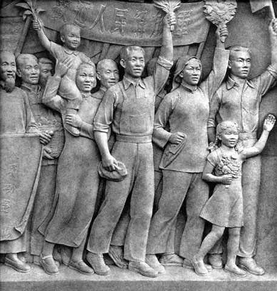

# ＜摇光＞现实在讽刺启蒙

**一个传播思想自由的人，却教出一位思维上的奴隶。唯一变的只是那句“凡是毛主席说的都是对的，凡是毛主席的指示我们必须坚决执行”的主语，而不变的是思维上的奴性。中国知识分子们所做的启蒙到底出现了什么问题，为什么这场启蒙陷入了久久的停滞？**  

# 现实在讽刺启蒙

## 文/邓辉（安徽大学）

 

#### 一、停滞的启蒙

今年毕业论文初完后，看到某人分享的韩寒关于“五条杠”的一篇杂文，觉得这是一个挺有意思的话题。我对“五条杠”其实不感兴趣，毕竟全国各地如此事件层出不穷，虽有些让人啼笑皆非，但它们的发生却总是在意料之中，而其实鄙人真正感兴趣的地方是韩寒的读者群。

韩寒的讽刺杂文在红朝算上品，但缺少必要的硬度——所谓的文章“风骨”。很早以前，我看过一名叫叶子风的人在豆瓣的影评，他的文章也是讽刺性的杂文。只是和韩寒的文章相比，叶子风文章的讽刺性更强些，当然文章也就没有韩寒的文章“厚重”了。去年段胖胖建议我看韩寒的文章，说有些深度；当时俺就是笑一笑，没有作答。因为我觉得红朝除了个别人的杂文，多数人的杂文都算不上有深度，包括韩寒的文章。鄙人当然不是想吹嘘自己，而是因为我是一个实用主义者，我觉得有深度的文章都是能够提供解决问题思路的文章，而不是简单进行价值判断的讽刺性文章。

如果喜欢读讽刺文章仅仅是因为想通过读杂文，找到宣泄自己对现实世界不满的共鸣，那么鲁迅、钱钟书的文章就已足够了。就连韩寒自己不是也说他的文章其实是模仿钱钟书的文章嘛。再比如上文中提到叶子风的文章，也和鲁文、钱文风格接近。他的一篇《枪杆子里出政权，出完政权就抢钱》，其实寓意和我们高中学的那篇《灯下漫笔》、《读》相似。现摘录如下：

“站起来挣钱”，的确是很有感召力的口号，许多受藐视的弱小心灵由此获得了释放。当年，伟大领袖在城楼上喊的也是这一句，中国人民从此站起来了。跪着的人，总是被“站起来”呼吁打动，他们可怜的想象也就只停留在那一刻：双膝离地。直立行走都成了梦，这是一种奴隶的幸福，既庄严又可笑。

在鲁迅的《灯下漫笔》一文中，也有一段寓意相似的话：

任凭你爱排场的学者们怎样铺张，修史时候设些什么“汉族发祥时代”“汉族发达时代”“汉族中兴时代”的好题目，好意诚然是可感的，但措辞太绕弯子了。有更其直捷了当的说法在这里：一，想做奴隶而不得的时代；二，暂时做稳了奴隶的时代。

从“公车上书”后的戊戌变法算起，中国的启蒙时代也有100多年了，可是结果不能不能令所谓的知识分子心痛。今天的多少知识分子还在摆弄昨日大师们的旧坛陈醋，而今日的百姓相比于他们过去先辈进步也是迟缓的。

艹圈人士多以思维进步而洋洋得意，可即便是在艹圈里，也有所谓的“乌合之众”。一天李硕发表了一段对中国现实的批判，而一个留言者回复道：“李硕我永远支持你！”“永远”二字多么的讽刺啊——一个传播思想自由的人，却教出一位思维上的奴隶。唯一变的只是那句“凡是毛主席说的都是对的，凡是毛主席的指示我们必须坚决执行”的主语，而不变的是思维上的奴性。

中国知识分子们所做的启蒙到底出现了什么问题，为什么这场启蒙陷入了久久的停滞？

#### 二、哪有启蒙的需求？

有人说我的文章就“两板斧”——分别从“供给”和“需求”的角度分析问题，而且从需求的角度分析问题往往能得出与众不同的结论。是啊，我连第三板斧都没有，不过由于人们分析问题往往从供给的角度入手，我讲一讲需求，自然就会显得自己有些水平了。那么就让我使用自己的两板斧，再问一问：大众有接受启蒙思想的需求吗？

没有吧！我们走进书店时，总是去挑自己感兴趣的书看，而对自己不感兴趣的书视而不见。坐在沙发上看电视，我们总是会用遥控器挑自己感兴趣的节目，而对自己厌烦的节目会马上跳过去。更有趣的是在2010年的考研英语阅读中，有一篇阅读是节选07 年“哈佛商业评论”中的《Accidental Influentials》一文。而此文恰恰提出一种观点：影响人士们的行为流行的最重要因素在于大众对此行为的需求，而不是存在影响人士本身。我想10年考研的衣领们，如果不从需求的角度分析启蒙，那么就有些说不过去了吧。

许多人抱怨大众分不清民主与自由，那么就让我们用“需求”这把利剑，分析分析为什么他们不懂民主。

中国农村的贿选问题，是有关中国是否适合普选的争论的焦点。如果你研究交通运输成本，你知道即便是最廉价的铁路运输，广州到西安的来回路费也要500多元。加上从西安到自己村子的来回路费是100元，；从广州到陕西自己家来回要花费最少3天，也就是工资损失最少150元。于是3年一次的农村选举，对一位到广东外出打工的陕西农村人的费用就是最少750元。可是他们回来参加选举得到的收益呢？假设一个村子有500个外出打工人员，此时他们只有能总共从选举中获得总共375000元的收益，他们才会选择回家。因为这样通过选举，他们才有可能平分村子的受益后，自己的受益是正的。而假设村子中没有外出打工的农民和外出农民工总数相同，那么只有当一个村子3年能够提供71万以上的收益时，对每个选民来说回家参加选举才可能是有意义的。

可现实呢？除了城市周边和因为建设道路土地被征用的少数农村地区外，中国多少地方农村的集体财产可以在3年里提供71万以上的收益？前段时间媒体披露的西安某地村委会贿选问题，披露的贿选票价是每张选票1000元。请注意，这可是中国大城市的农村啊！那么中国广大地区普通农村为村民们提供的受益有多少，就可想而知了。

而根据《选举法》，只要具有选民资格的50%投的人参加投票，且一位候选人获得参加投票选民中50%以上的选票，那么他就是合法当选的。于是对一个远在陕西不怎么富裕的农村来说，这个村3年可提供的公共收益如果低于71万元，此村外出打工的村民回家参加选举根本就没什么意义。同时由于有50%左右的选民长驻自己的村子，他们不需要750元得受益，参加选举都是有受益的。于是一个村霸就只要让全村25%的人选自己，然后把三年预计收益的分给这个25%的人和自己就好了。这便是贿选的分析，这也就是选举的细节。如果人们关心火车票价格，还有人还会说中国农民工不关心自己选举权吗？

#### 三、被夸大的启蒙

民众没有基本的政治常识，并不是中国特有的问题；根据统计，美国只有40%的人可以说出2个参议员姓名，我想中国民众中不人知道自己所在省省委书记和省长的名字人的比例也差不多吧。可是“术业有专攻”本来就是分工的产物，如果大众和专家学者的思维一样，那么还要所谓的专家学者有何用？既然是分工的产物，那么这种分工的结果自然不会太遭，于是我们就要问一问：一个人没有政治与经济学常识，那么他的政治与经济生活就会一团糟吗？

不会的。一个人不懂的信息多了，我们中没有多少人知道二手车的相关知识，也没有多少人知道何种电脑配置更合理的知识，于是我们就会选择谨慎购买这些产品。谨慎购买产品产生的结果就是厂商销售的产品少了，于是厂商就会为了自己的利益而选择做广告、请明星代言等等。是的，如果你不懂它，缺乏对它的信任，那么对你来说最好的方式就是限制和它的交易。

所以如果政府真是契约的产物，如果民众愚蠢，那么导致的结果无非是小政府而已。因为如果民众不信任它，那么最好的方式就是让它无关紧要，这样即便它出错了，对自己产生的影响也是有限的。我曾经说过，由于政府提供不同角度的信息太少了，所以中国的司法与政府信息对大众来说是“柠檬品”，大家对其缺乏信任，于是大众就会选择不信任它。于是我们常常听到大众关于官司的评价常常是“人家有人”等等论调。

看来在启蒙者眼里的大众愚昧其实不是中国问题的关键，因为大众可以在信息市场上理性，也应该同样可以在限制政府权力方面做出理性行为。于是我们就要分析“不信任政府信息”与“限制政府权力”，这两种行为有什么差别。

差别在于如果一个人不信任政府信息，那么这个行为本身的收益者就是他本人而已，其他人并不能从他的不信任中获得收益；同时，这种不信任行为本身，对政府的权利损害也是有限的。所以在此方面，大家都会“理性”。可是如果你选择限制政府的权利，那么其他的愚昧者也会从你的行为里获得收益；同时，限制政府的权利严重损害了政府的利益，政府自然会对其倍加反对。于是正是由于限制政府行为的外部性——每个人都希望从别人的行为中获得收益，同时政府的抵制使得此种行为的成本相对很大，所以就是大家都选择等别人先动手。

结果就是我们骂愚昧者“愚昧”。

#### 四、现实的玩笑

更为讽刺的是大众在大政府的道路上和政府利益达到了惊人的统一。因为大众可以借公平、平等、国家利益等等说辞，使得政府的剥夺其他产业集团的财富，再通过财富转移支付的手段使得自己获得收益。而同时政府也愿意扩大自己的权利范围。

回顾历史，英国最辉煌的时期是维多利亚时期（1837~1901年），而也正是在这个时期后英国开始走下坡路了。读英国史时，你会发现一个有趣的问题，那就是在英国1867年第二次议会改革后，英国走上了一条平等主义的道路。此时的英国仇富济贫可谓达到了极点，英国议会通过立法，对贵族征收最高令人瞠目结舌的80%的遗产税税率。如果贵族们拿不出这么多现金，还要按每年8%的利率交利息。而令人不得不反思的是，恰恰是在英国，它国内各个阶层的流动，少于其他西方国家，特别是美国。所以今年的伦敦爆发了少数移民族裔引发的“打砸抢”。看来政策的目的，和政策的现实结果开了一个玩笑。

现实常常这样开玩笑：我们在不断骂着贸易保护行为的愚昧时，民众恰恰是在做着“理性”行为。

 

（采编：麦静；责编：麦静）

 
