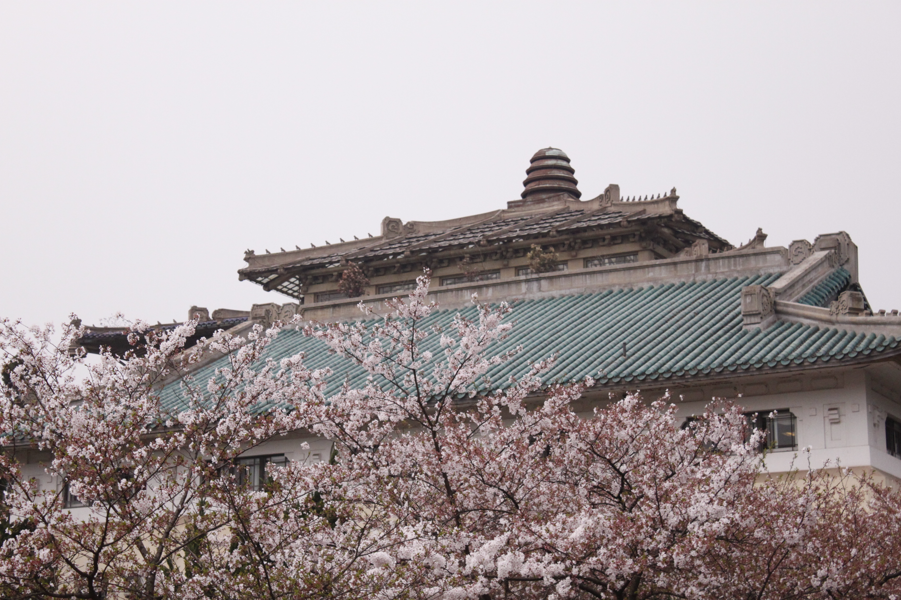
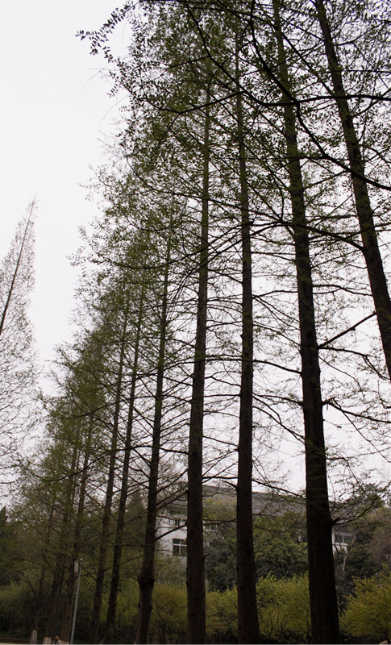

# ＜摇光＞珞珈山不是他的家

**珞珈山不是他的家，也不是我们的家，只是那些借着珞珈山的名号攀附上位、或是喊着建设成为中国特色、世界一流、国际知名的高水平大学的管理者们的家。**

# 珞珈山不是他的家

## 文/ 罗泽民（武汉大学）

我记得以前一个学姐的相册名字叫做 【珞珈山是另一个家】，看到的时候真心觉得心里好温暖 。因为家这个词一旦被用上，珞珈山的灵气和美景仿佛尽收于己，而自己与国立武汉大学的联系便会更因此而千丝万缕起来。 可是今天从教五走回湖滨的时候，看到标本楼和新闻院交汇的那里一个管理人员模样的男人正在吼一个老人。那个老人我相信很多很多人都见过，就是摆着十几只不一样的毛笔还有钢笔在一块干净的白布上，坐在一个小板凳上的老人。管理人员的表情和老人的反应明显告诉我那个人要老爷爷收摊并且不准在这里摆摊，老人默默的收好白布，眉头皱起来，脸上写满的都是一种忧愁。 我相信他肯定是有很多原因来这里摆摊的，因为光是经济原因根本站不住脚。这么大把年纪的老人家，卖的毛笔明显不是有规模有批次的，这么奇怪的天气也许是刚刚看到没有下雨就告别了家里操劳的老伴出来，甚至可能没有老伴一个人过生活。在武汉大学这样广阔的校园内占据一个小小的角落，默默的坐在那里，也许是喜欢看年轻大学生们蓬勃的身影，也许是喜欢樱花大道的漂亮景色又不好意思坐在黄金地段，或者是这里曾经是他读过书的地方新闻学院或者标本楼与他有某种联系，他就坐在这里放着毛笔而从不吆喝。虽然没有人买，但是坐在这里也是一种愉悦吧对他这样的老人来说。 

  可是那个粗暴的带着个牌标的校园城管一般的人就这样将他微不足道的愉悦给剥夺了，他觉得这没什么，觉得这是某某领导绝对称赞的一项壮举【营造优良的校园环境】。也许是某某领导开着车从樱花大道过的时候无意看到了这样碍眼的风景随口说的一句，变成为了这些校园城管马上必须做出动作的口令。这样的口令远远要比宿舍楼的改建，食堂的优化或者教室的整修更为重要。因为不知道哪位领导留下一个建设成为中国特色、世界一流、国际知名的高水平大学的口号之后，他们都在为此不停的奔波。可是奇怪的是，中国特色、世界一流、国际知名的高水平大学竟然与寝室无关，与食堂无关，与教室无关，偏偏就与路边微不足道的老人有关。 校园城管的面孔，我想很多很多的校友们都见识过的，而这样的在路边渺小不起眼的老人或者烈日下给游客们招呼明信片的妇女们很多很多的校友们也是见识过的，这并不是一种有碍市容的风景，相反，这也是国立武汉大学在1988年之前一贯拥有的自由和平等的风气从某些情境中的微不足道的体现，可是这种自由却妨碍了那些上位者们欣赏美丽校园风光因此必须被消灭。而他们那些日夜不息的私家车却从来不是阻碍校容的理由。可是我还是忍不住的想说些什么，虽然无计可施，但总比忍在心里要好。 武大不是城市，不需要遵守当权者要求的整齐划一——建校之初便不是走的其他学校暴发户一般的井方格规划，所以山水之间孕育的灵气远远要比其他大学要多，而山水孕育的学子们也一如既往的崇尚者自由。只是我想不合时宜的想写点什么，为那个老人，为珞珈山樱花城堡之间隐藏着的那些热爱山水的人们。 珞珈山不是他的家，也不是我们的家，只是那些借着珞珈山的名号攀附上位、或是喊着建设成为中国特色、世界一流、国际知名的高水平大学的管理者们的家。但是那些人好像忘了，在1948年，也就是国立武汉大学成立尚还只有约20年的时候，英国牛津大学致函国民政府教育部，确认包括国立北京大学、国立清华大学、国立中央大学、国立浙江大学、国立武汉大学、私立南开大学以及协和医学院的文理科学士毕业生成绩平均在八十分以上者，享有“牛津之高级生地位”。那个时候，珞珈山才真正是国际一流吧。    

（采编：陈锴；责编：陈锴）
