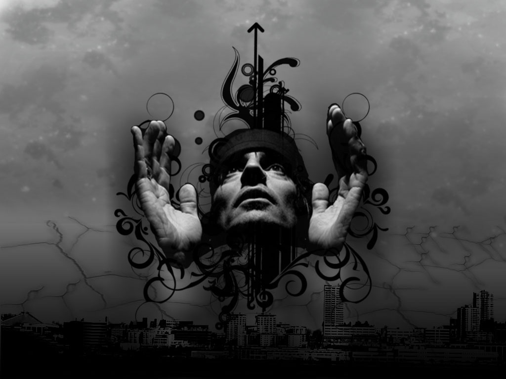

# ＜摇光＞理性是什么

上回老师课上举例的时候提到了“囚徒困境”：

两个嫌疑犯被抓，警察苦于证据不足，于是把他们分开审讯：如果两个人都招供，则遵循坦白从宽的原则，他们都被判2年有期徒刑；如果两个人都不招供，警察则因为证据不足只能判他们每人1年有期徒刑；如果其中一个人招了，另一个没招，则招了的那个因为有立功表现可以被立即释放，没招的那个判10年有期徒刑。

对于每个个体而已，不管对方招不招，自己的最优选择都是招供。所以结果就是两个人都会选择招供，都被判2年有期徒刑。但是如果他们都不招的话，每个人本可以只用被判1年。

老师因此得出结论：在这里，个体的理性导致了集体的非理性。

虽然“囚徒困境”听过很多次了，讲的人换来换去，但得出的结论基本不变，都是：在这种情况下“个体的理性导致集体的非理性”。但是这回听老师讲的时候，我脑子里却冒出了其他问题：

囚徒的行为真的是理性的吗？

当我们在说“理性”的时候，我们在说什么？

集体的非理性能说明个体的行为也是非理性的吗？

理性是什么？

于是，我尝试用字典的解释结合自己对“理性”的印象来说明“理性”到底是什么。

首先，理性应该是和良好的结果有关的，至少应该是有利于主体的结果。在上个例子中，我们说囚徒的行为是理性的，集体的行为时非理性的，都是从结果的角度来判断的。因为结果有利于主体，我们说他的行为是理性的；反之，结果不利于主体，我们则说他的行为是非理性的。

但只要有好的结果就够了么？

我们假想这样一个情节：一个莽汉跑到双色球彩票的代售点，拿着2块钱大喊：“给老子来张彩票，全TM选8”。老板瞥了他一眼，说：“每个数字只能选一个，选7个数字”，“那就1,2,3,4,5,6,8！”……然后……几天之后……莽汉中奖了……一等奖……

他有了一个好结果，我们会说他是理性的么？不会吧。因为我们会觉得，理性除了需要一个好的结果之前，似乎还应该有些其他过程，比如：思考。

在英语里，“理性”就是和思考相关的，它被翻译成reason，字典里的解释为：use one’s power to think，understand，form opinion。意思是人能用自己的能力去思考，理解，并形成观念。这里只是说“形成观念”，而不是“形成‘对’的观念”。这让我想起了另一个例子：空地上的奶牛。

一个农民担心自己的奶牛走丢了。这时送奶工到了农场，他告诉农民不要担心，因为他来的时候看到奶牛在附近的空地上了。虽然相信送奶工，但为了保险起见，农民还是亲自去看了看，他看到了远处熟悉的黑白相间的形状并因此感到满意。过了一会儿，送奶工回去时到那块空地上再次确认，奶牛确实还在，但是却躲在树林里，而空地上还有一大张黑白相间的纸缠在树上。很明显，农民把这张纸错当成自己的奶牛了。

那么，这里，我们能说农民知道自己的奶牛没丢么？虽然奶牛确实没丢。

接着上面的假想，一个记者事后采访莽汉买彩票中奖的心得，莽汉说知道自己一定会中，“为什么？”“因为我选了一组‘顺子’和一个‘8’。就是‘顺利发财’的意思”。记者拿纸巾擦了擦汗……

莽汉在行为之前进行了思考，并且也确实得到了一个好的结果，但我们愿意说他理性么？

似乎还是不会。我们会觉得他所谓的思考只是“他相信”，我们并不认可，因为我们“并不相信。”

那什么是我们相信的思考和理性呢？

期间我又查了一下《说文解字》，里面说，“理”这个字是“玉”字旁，在古代是治玉的意思。意思是按照玉石本身的性状（纹理）进行雕琢。到现在引申为世间万物本身的形状，属性。所以由它构成的词语如道理，物理，机理，条理，整理，理解，理想……都带有这个性质。而“理性”这个词似乎也就变得客观，智慧：能够熟识世界的客观规律，理性的人因此作出正确的判断，引起好的结果。

但事实上，世界上所有的客观规律都是人们通过主观的感受来认知。我们怎么能证明自己主观的认识就是符合客观的呢？

如果不能证明，那我们和莽汉的主观认识又有什么区别呢？

康德把这种对真实世界的认识分为三类：主观上和客观上都不充分的，叫做“意见”；主观上充分，客观上不充分的，叫做“信念”；主观上和客观上都充分的，叫做“知识”

按他的这种解释的话，我们就永远不能获得“知识”了，最多只能获得“信念”。就像爱因斯坦说的，我们能看见手表走动的样子，能听见滴滴答答的声音，但是我们只能想象它里面的构造，却永远不知道里面长什么样子。

虽然我们不能获得“知识”，但是我们却可以拥有所有人都相信的“信念”。这个“信念”自洽，而且融贯，有人按照它的内容来知道思想和行为，我们便愿意说他是理性的了。那莽汉的思考算么？得了吧，他的思考只是“意见”而已。

于是，“理性”的定义好像要呼之欲出了：按照大家都认同，理解的方式思考；并做出判断，行为；因此能收获有利的结果。

等等，不是有句话说叫做智者千虑，必有一失么。在这句话里，结果虽然是不好的，但我们似乎也觉得智者也还是应该理性的。

这是为什么？

这是因为世间的事情本来就是难以精确预测的（引用康德的概念，因为我们只是知道“信念”，而不是“知识”），而智者之所以成为智者，是因为他之前做过很多正确的事情和判断，所以才留给我们一个“智者”的印象。如果说，某智者千虑，每虑必失，那我们大概更愿意说他会扯淡，而不是理性了。

于是，这时，理性在描述人的时候，就变成了一种“印象”，这种印象建立在对象经常通过“理性”的方式获得好的结果。

但需要有多大的概率获得好的结果才让别人觉得他理性？我又想起了一个例子：一堆沙子。

我们知道1粒沙子不能称之为一堆沙子，2粒沙子也不是，3粒也不是……那多少粒沙子才算一堆呢？

不妨我们设一个未知数X（并不是一个确定的数）吧，说有X粒沙子算一堆。在1粒1粒累加沙子的过程中1,1+1,1+2……X-1，X,X+1，X+2……忽然，我们发现，不知不觉中，一粒粒沙子已经变成了一堆沙子。至于是什么时候变得，没人知道：它被省略号隐藏起来，埋在无尽的深处。

由此，理性是什么，成了一个更难回答的问题了。如果要是有人以“多大的成功率做成一件事来定义理性”问我的话，我大概也只能这么回答了：

它藏在省略号里，你去问省略号吧——

“……………………………………………………………………………………………………………………………………………………………………………………………………………………………………………………………………… ……………………………”

 

（采编：应鹏华；责编：应鹏华）

 
