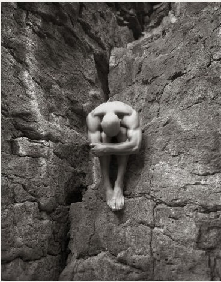

# ＜摇光＞理想与悲壮同行

**听他们讲自己的从业经历或者故事，也让我对这一行多了一些了解和感慨，他们是最有理想一群人也是最为悲壮的一群人，即便这样，我还是想加入这一行，成为他们的一员，无关成名，无关工资，无关现实，只因为心中那份沉甸甸的理想。** **向这群人致敬和看齐。**  

# 理想与悲壮同行

## 文/欧阳凯（暨南大学）

 

从未想过在担任报社通讯员的这段期间会遭来一片质疑，而质疑的声音一浪高过一浪，于我而言，更要命的是这些声音均来自新闻专业的学生，事件已经过去了整整一个星期，风波渐渐平息，但它带来的教训和思考无时无刻仍在提醒自己谨慎小心，直到现在，我才有有勇气把整个事件梳理一遍，并非想为自己开脱或者解释什么，相反，我想让这些文字提醒自己，倘若今后有幸从事这个行业，必定要恭恭敬敬、虔诚地尊敬你所做的每一篇报道。

事情是这样的：

4月3日，网友发了微博称暨大某个去川藏的哥们上了百度首页，并附上了链接网页，当时看到后，并无看到有何特别大的新闻点，毕竟现在去西藏的学生已经越来越多，因而并未向记者报题。

两天后的中午，记者跟我说在微博上看到这个线索，问我能不能联系到当事人，我回复说尽量试试看，记者的提醒让我想起了之前曾经作过的关于暨大硕士生毕业后骑行去西藏的采访，并向她顺便提供了线索，记者建议我可以一起做。

当天下午，我便从微博中联系到了这个去西藏的学生李四（化名），谈话间方才得知他是去逃课去西藏的，当时向他说明了我的身份，并询问能否接受我的采访，他最开始并不愿意，但在我的劝说下，他说只要不用真名以及不用露脸的照片便可以接受采访，于是在空闲的时间里，和他在QQ上“闲聊”了一下，从他的回答中，我能感受到这是一个充满理想的青年，也被他的举动所打动，当晚便一气呵成写成了新闻稿。

虽然把稿子和照片发给了记者，但并未在采访结束后的两三天之内见报，我想许是因为新闻点不大或者报纸版面紧张被毙了，便没有多问，因而这事也就被搁置了。

4月10日，记者询问我关于这个去西藏的稿子能不能补充点校方的看法，我有些震惊，而后才醒悟，媒体在做这样的新闻的时候，不能一边倒的弘扬这个学生，因为这其中涉及到学生是逃课去西藏的，当时确实未考虑到如果上报，会给这个受访者带来多大影响。对于这个事情，我未能准确采到校方的看法，只能询问教我课的一个副教授的看法（他是一个很喜欢旅行和摄影的教授），而后补充了两百多字给记者。

此后两三天，这个稿子也未见报。

直到4月17日，受访者李四（化名）QQ留言告诉我他被领导给盯上了，我才知道这个稿子在今天上报了，而关于暨大硕士生毕业后辞职骑行去西藏的稿子并未同并列在新闻稿子里头。当天打开微博，漫天转发的都是关于这个学生逃课去西藏的新闻，学生工作办公室的一个老师给我私信，问我怎么能做这个新闻，说我要“害死”这个学生呢？我才晓得事情的所带来的严重性，之后一个师兄告诉我，学生手册规定，逃课超过15天是要被开除或者劝退的。听到这个消息，着实让自己一阵害怕，事情已经演变到了自己无法控制的地步。

我马上跟学生了解了情况，并向他道歉，同时我也向记者那边反映了情况，询问报社能否帮忙，记者安慰我，并说会向报社领导

反映下，但此后我想，如果再牵涉进报社会不会跟麻烦，反而连累到报社，就又跟记者说这事情我先自己解决，实在不行，再跟领导说明情况。

之后，受访者李四（化名）被叫去写检查，我想再询问了解下情况，他只说没事叫我不用自责，并说领导的原话不能告知于我；而后我从一个师兄那里得知这个学生并未有其他情况，兴许是网上一边倒的支持这个学生吧。

此后几天，所带来的压力更是自己始料未及的，很多人质疑我的初衷以及做这个新闻的强烈的功利性，看着网友的评论和指责，我只能挨个挨个道歉并说明原因，但即使这样，我知道仍然弥补不了给这个学生造成的伤害，在强大的批评面前，才知道在犯了新闻行业中最严重的错误，同时也违背了自己当初想从事这行的初衷。

换一个角度思考：

其实真正导致学校对这个学生的处理，并不是新闻稿中采纳了校方的看法，也不是无意间写了这个学生的年级和专业，而是这个新闻上报后掀起的影响力不得不让学校要处理这个学生，倘若学校不处理这个学生，那么就说明了学校默认并支持这个学生可以逃课去西藏，无论如何，现在的身份还是学生，学业为重，这从教学还是管理上均说不过去，即便很多人早已认同大学并未学到更多东西。

早在这个学生出发去西藏之前，有些老师早已得知这个学生去西藏，也曾试图劝过他，但也在他的坚持之下放弃了。

这是我最致命的疏忽，并未考虑到新闻上报后所带来的巨大影响，兴许真的是不懂吧，兴许只是热情的做新闻忽略了新闻的很多本质东西在里面，都有吧，至少这一次，这个沉痛的教训会在今后中一遍又一遍的提醒自己要步履薄冰的做新闻。

某报的一个记者跟我说，做记者这行，就需要有抗压能力，记者常常会因为一些报道心理非常痛苦，需要承受内心很多煎熬。她跟我讲了她从业以来一段经历，曾经她做了一个关于光棍节的一个专题，在报道中，她写了自己的堂姐因为事业耽误了感情，直到近40岁还未嫁人。即便在见报后的新闻报道中用了化名同时也隐去了很多信息，也未用照片，但父母对此仍对她大发雷霆，说这样堂姐以及她的朋友还是能够认出写的是她，对于父母的不理解，她感到困惑和伤心。

形容这段经历时，她用了“众叛亲离”这个词来形容。她说，记者这行，常常会众叛亲离。众叛亲离，那该是多么严重的一个字眼啊，虽然言语或许有些夸张，但不乏这是对记者这行业最苦逼的一个写照。

做记者这行，常常会得罪人，就需要刀枪不入。我们常常看到新闻标题上某某记者被打，似乎已经成为了常态了，这只是新闻行业的一个表现而已，但做新闻中，我们看不到的内心的煎熬和来自社会舆论的压力更是这一行所真正的杀手，看到她的QQ说说这样写道，有同行说即使睡觉也是有压力的，需要有音乐才能入眠，足见这一行的悲壮。

听他们讲自己的从业经历或者故事，也让我对这一行多了一些了解和感慨，他们是最有理想一群人也是最为悲壮的一群人，即便这样，我还是想加入这一行，成为他们的一员，无关成名，无关工资，无关现实，只因为心中那份沉甸甸的理想。

向这群人致敬和看齐。

首先要对因为自己采访造成伤害的学生再次致歉，对不起，同时再次谢谢许多新闻专业的朋友给我的批评和建议，感谢这段经历，感谢所有的批评和指责，感谢所有的鼓励和支持，我在新闻路上，已经在路上了。

 

（采编自投稿邮箱；责编：应鹏华）

 
