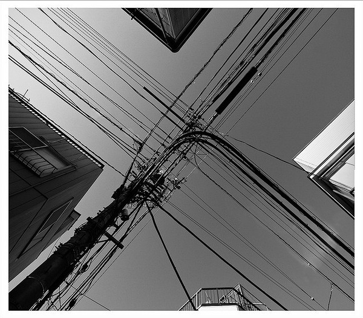
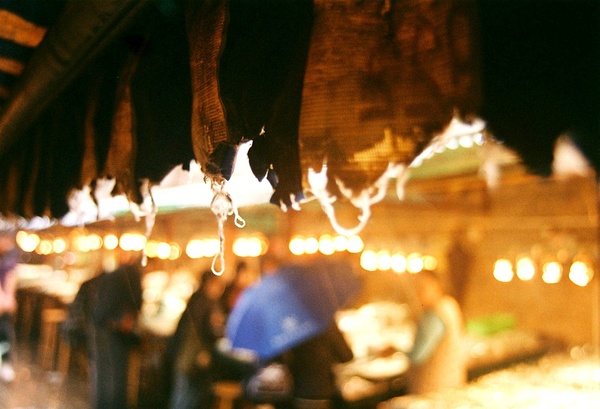
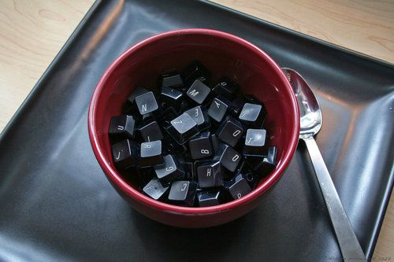

# ＜摇光＞理想是个奢侈品

**说理想是个奢侈品，不仅在于理想需要环境，需要机会，还在于理想只能给有能力有水平的人去实现。凡夫俗子，过好最基本的生活先最好。本来大学生已经从精英变成普通人了，其实就不用纠结什么“大学生理想的流失”这样的问题，理想不能也用不着赋予给每一个人。有的人有理想没能力；有的人有理想有能力，吃不饱饭；所以，不管有几斤几两，不妨先吃饱了饭再说。**

 

# 理想是个奢侈品

## 文/ 刘项（香港城市大学）

 

新一期的中国周刊封面题目是《稳一族——年轻人的务实与保守》。这个十分符合我最近的思考，以及现在的社会现实，和身边的同龄人交流，前途，赚钱香港绿卡什么的已经是经常出现的关键词；一读新闻，年轻人纠结于攒钱买房，公务员考试报名的人越来越多。理想、追求被当作保护动物一样也不时的在媒体里面被呼唤。

中国周刊的专题报道，采访了努力靠进公务员行列的大学生，采访了走进国企的高材生，还回访了八九十年代的大学生的生活。乍一看，感觉现在的大学生，现实而求稳定，二十年前的大学生，有理想有激情。考公务员的学生不怕赚的钱较少，而是想过的“规律、稳定”；而报道中当年的大学生，一个大学毕业远赴边疆发展，一个来到改革开放的前沿。报道里现在的大学生还在平庸而稳定的活着，而当年的大学生，早就闯出了一番事业，现在要么功成名就要么位居高位。老大学生对现在大学生的观察也值得反思，有一位说“看到蜗居，我很不以为然，我当年三个板凳上面放个板子就是床”，对于现实问题又一位说“什么房子，汽车，我们都没考虑过，一心想着就是梦想，奋斗。”

不过，我肯定不会说年轻人们一代不如一代了，毕竟现实条件确实变了很多。八九十年代，大学生是真正意义的天之骄子，是不愁工作反而被单位争的枪手货，房子有分配，户口有着落，基本上现实生存出路的问题，完全不用担心。可能，只有在这方面真正完全放心了，一个人才能追求更高层次的梦想吧。 

当年的年轻人除了不用担心生存，他们的机会也更加的充足，改革开放的中国遍地都是机会，思想解放，文化热兴起，做什么专业的年轻人都能趁着那个时代找到自己的位置。而现在，发展了这么多年，很多行业都趋于成熟，各种二代也加入了竞争行列，发挥的空间真是小了很多。比如挨踢行业吧，当年没什么IM，没什么搜索引擎，所以QQ,baidu逐渐发展壮大。现在有什么新创意，QQ马上会山寨你一个，百度问你收高额的排序费，一个只有技术创意的挨踢年轻人想成为下一个企业家确实是难了很多。

说理想是个奢侈品，不仅在于理想需要环境，需要机会，还在于理想只能给有能力有水平的人去实现。凡夫俗子，过好最基本的生活先最好。本来大学生已经从精英变成普通人了，其实就不用纠结什么“大学生理想的流失”这样的问题，理想不能也用不着赋予给每一个人。有的人有理想没能力；有的人有理想有能力，吃不饱饭；所以，不管有几斤几两，不妨先吃饱了饭再说。

不过实现理想，也不只有一条道路。在电影 摇滚学校 school of rock 里面，杰克布莱克理想是成为一命摇滚巨星，不过玩摇滚到了三四十岁还是一个无业游民。有一天他顶替做代课老师的室友去某高级小学上课，他打算教小学生们摇滚乐，让这只学生乐队帮自己赢取摇滚大赛的冠军。电影最后，小摇滚乐队的表演大受欢迎，杰克成了专业的“儿童摇滚乐老师”。这句话我没记住几句对白，但就这句话影响特深刻 “You know, maybe we are just not that good”。 杰克真有可能不是那么优秀，怎么热爱音乐，怎么为之努力也成不了摇滚巨星，但是他的学生里面说不定会出个一代巨星，你看,这么曲线的实现理想，不也是件不错的事么。

 

抱怨完环境，也还是该反思下自己，其实中国周刊吧这两代大学生放在一起对比本身就有些不合适。当年才几所大学啊，人家是真正的挤独木桥过来的，咱们好多人都是扩招过来的，论学习能力，现在的大学生多一半比不上当年的前辈。大学生群体早就成精英群体蜕变成了大众群体了，拿当年的任意大学生和现在的清华北大学生比比还能有些说服力。而现在的很多大学生的处境及面临的问题应该更和当年比较爱学习的普通工人相像。从这个角度想，年轻人更没有堕落多少了，当年的年轻工人们想的问题，应该和现在很多大学生想的问题差不多吧，都是保住铁饭碗，弄栋房子住而已。 

（采编：陈锴；责编：陈锴）

### 

