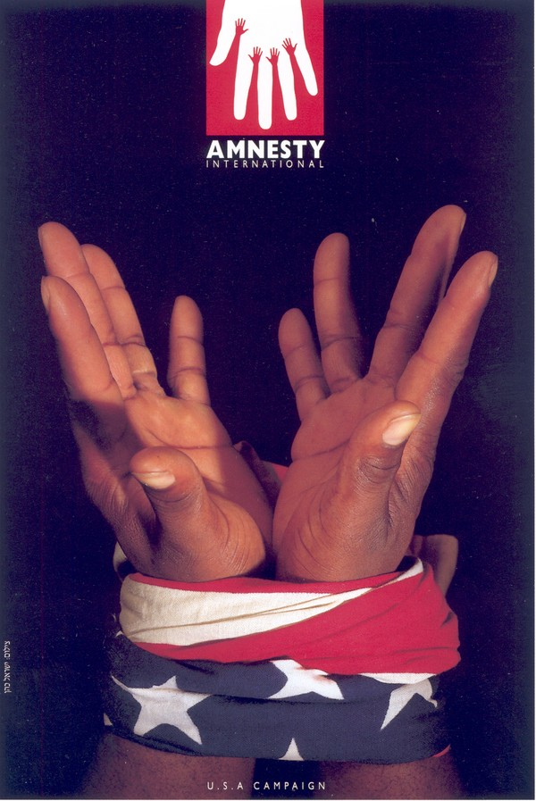

# ＜摇光＞皮诺切特的主权者决断

事实上，“皮诺切特困境”可以被视作是“能否强迫奴隶获取自由”这一经典自由主义困境的强化版。“强迫奴隶获取自由”暗示了在这个过程中，自由主义者们对奴隶们自由意志的侵犯。尽管这个问题常常引起自由阵营内部的争论，但在现实中如果真的遇上，却是可以束之高阁，不予理睬的。然而在“皮诺切特的困境”中，“奴隶”们的存在显然已经危害到了自由本身，自由人不再是对他人自由的施予者，而是对自身自由的捍卫者。这种情境下，决策者已无法置身之外，他必须做出一个决断。 

# 皮诺切特的主权者决断

## 文/丰钊（华中科技）

 

#### **从《三体》到皮诺切特**

前段时间，人人网的《三体》公共主页发布了一条不起眼的状态：

看过《三体》的人想必都很清楚这个状态背后所蕴含的深意，这两艘飞船在侥幸逃脱“水滴”的秒杀后，驶向了太空深处。为了生存和保证人类文明的延续，两艘飞船上的人相继跨越了人类道德文明的底线，建立起了一个极权而野蛮的小社会。

这让我想起了很久以前和一位朋友的争论。这位朋友和我一样，都是一个不折不扣的保守自由主义者。一番推杯换盏之后，我们饶有兴致地聊起了上世纪智利的军人独裁者皮诺切特。这位独裁者崛起于智利政府强制推行国有化造成的经济崩溃和社会动荡之中，上台后，一方面解散国会，实行高压统治，打击异己，另一方面，又大胆推行芝加哥学派的“休克疗法”，在遏制通胀的同时提升了国内就业率，带领智利成功走出了经济濒临崩溃的危局。更有意思的是，皮诺切特在执政几十年后高调宣布还政于民，在全民公投失利后，愿赌服输，兑现承诺下台，使得智利重新成为世界民主国家大家庭的成员。

然而，就如同其他独裁者一样，皮诺切特身上的污点也是显而易见的。当我指出皮诺切特发动军事政变，指使军队枪杀民选总统阿连德（当然，对于这一点还存在争议），同时在当政期间大量监禁和杀害左翼人士时，我的朋友问我，如果你是当年政变关口的皮诺切特，你会怎么做？我想了一下，只能回答道：我会选择出走。

我和我的朋友都笑了，因为这种答案与其说是答案，倒不如说是对问题的逃避。“皮诺切特困境”，如同刘慈欣笔下两艘飞船上的舰长所面临的情境一样，都是一种在非常状态下的两难抉择。

众所周知，自由主义者是讲求程序正义的，而非常状态却将自由主义者逼到了一个必须为了目的不择手段的境地。在这种情况下，一个自由主义者只有两种选择：要么为了坚守自由主义的程序正义信念而灭亡，要么为了最终挽救自由主义而暂时采用违背自由主义原则的手段。如果是你，你会做出哪一种选择？

事实上，“皮诺切特困境”可以被视作是“能否强迫奴隶获取自由”这一经典自由主义困境的强化版。“强迫奴隶获取自由”暗示了在这个过程中，自由主义者们对奴隶们自由意志的侵犯。尽管这个问题常常引起自由阵营内部的争论，但在现实中如果真的遇上，却是可以束之高阁，不予理睬的。然而在“皮诺切特的困境”中，“奴隶”们的存在显然已经危害到了自由本身，自由人不再是对他人自由的施予者，而是对自身自由的捍卫者。这种情境下，决策者已无法置身之外，他必须做出一个决断。

那么在“皮诺切特困境”中，拥护宪政秩序的自由主义者们，到底应该如何做决断？决断的标准又是什么？对于这个问题，整个西方学界20世纪中研究得最为深入的恰恰不是自由主义阵营的学者，而是被称为“纳粹的桂冠法学家”的卡尔·施米特。

#### **施米特的方案**

卡尔·施米特是20世纪德国著名的宪政法学家和政治学家。他的思想成熟于德国魏玛共和国时期。彼时德国刚刚从战争创伤中恢复，经历了斯巴达克团发动的武装暴动，1929年的经济危机，极端民族主义势力的此起彼伏，一连串的打击让这个新生共和国处在宪政秩序崩溃的边缘。由此，我们很自然地能够想到，生长在那个风雨飘摇年代的德国法学家们，所思考的问题就是在宪政的“例外状态”下，如何保证国家不至瓦解，宪政秩序得以维系。

为了解决这个具有紧迫的现实意义的问题，施米特引入了“主权者”这一概念，指出：一个国家如果希望自己的宪政秩序能够经受各种风波的考验维持下去，那么必须要有“国家主权者”这样一个角色的存在。它的作用如同一个“守夜者”，在宪政平稳运行的常态下隐匿在权力之幕的后面，一旦国家进入了宪政的“例外状态”，那么这个“国家主权者”就会走到台前，充当国家的“全能立法者”，使用强力排除一切干扰与纷争，迅速让整个国家恢复秩序。

显然，这样一个“国家主权者”是有悖于人们常识的。因为即使如中华人民共和国，也宣称没有任何人和组织能够凌驾于宪法之上。然而施米特所设想的“国家主权者”，却是根本不受到宪法约束的。事实上，施米特本人甚至他的那本著名的《政治神学》一书中说道：“主权者是决定什么时候出现例外情况”的人。可见“国家的主权者”不仅是非常状态下的决策者，也是开启非常状态下决策的“第一推动”。这样一个角色，无疑是非常可怕的。

施米特需要回答的问题，就是如何保证这样一个“国家主权者”实现对自我的权力约束，不至从一个宪政秩序的维护者，变为一个秩序的破坏者。然而暂时抛开这个问题，假使按照自由主义者们设计的宪政至上的游戏规则开展国家政治，结果又会是怎样？我觉得结果恐怕仍然不乐观。

因为在施米特看来，政治就是一种区分敌我的行为。正如施米特所言，“你告诉我你的敌人是谁,我就能回答你是谁”。而自由主义者们最愚蠢的行为，恰恰是让国家保持其中立性，“以冲突各方妥协与谈判的方式解决利益冲突；以理性化自由讨论的方式解决观念冲突”（北京大学李强教授语）。问题在于，如果自由主义者的对手们不是按照游戏规则出牌的人，而是局势稍有不利就掀翻桌子重来的无赖，妥协和谈判的方法显然已经失效，这时该怎么办？如果自由主义者们的对手所拥有的不仅是嘴皮子，还有拳头，“理性化自由讨论”已经无用武之地，这时自由主义者们该如何解决争端？

事实上，按照施米特的观点，自由主义恰恰是无法在上述的这类“非常状态”下做出正确决断的。因为自由主义者们不懂得区分敌我，仍旧在宪政的秩序框架下与那些妄图颠覆宪政秩序的敌人进行周旋，而不愿意采用非常手段迅速置敌人于死地。这样做的结果就是宪政的敌人们得以不断地利用宪政赋予他们的权利来毁灭宪政。

换句话说，如果没有皮诺切特这一军人出身的政治人物登场，智利只会在阿连德等激进社会主义者的不断折腾，和受到程序正义束缚的自由主义者的无所作为之中，一步步走向万劫不复。从这一点回头再去细细体会施米特如此醉心于“主权者”的原因，不难体会他在宪政体系中引入这一概念的良苦用心。

尽管施米特亲近纳粹，但一个自由主义学者绝不能因此以对其人品的质疑和抨击，来掩盖自己对施米特学说反击的无力。按照北大李强教授所言，施米特“对自由主义的批评恐怕是自由主义所遭受的最具学理性的批评之一”。他所提出的这个问题，是自他以后的所有自由主义思想家都不能回避的一个难题。

其实自卡尔施米特提出“主权者决断”与以消灭异己为主要任务的“政治神学”以来，西方自由主义学界就对此展开了一场浩大而绵长的争论，这场争论在20世纪90年代延伸到了国内，随着刘小枫等人不遗余力的介绍和褒扬，施米特在中国也渐渐成为一个被广大学者所熟知的人物。施米特所声称的自由主义在宪政秩序处在紧急状态下不能迅速决断的弱点，也成为中国本土自由主义者不能不面对的指责。

#### **历史的小概率**

以上这些远不是本文能够概括的。本文也不想就这个问题轻率地进行表态。然而必须指出的是，一个自由主义者也许并不能认同施米特对“皮诺切特困境”的解决方案，但卡尔·施米特独特而敏锐的观察，也提醒了广大自由主义者们需要明白如下几点：

1. 自由主义的政治秩序，也就是宪政，是精巧而又脆弱的。尽管很多人津津乐道美国政治体制中的权力制衡机制，但即使是对宪政游戏规则娴熟如美英者，都会在宪政的发展历程中一波三折，几次走在了政治秩序崩溃的悬崖边。

相比之下，皮诺切特的解决方案，则如同亚历山大大帝挥剑斩断那个传说世界上无人能解的绳结一般，是一种野蛮粗鄙，却又偶尔有用的手法。然而这种笨拙的统治即使建立，也无法适应时代的变化，所以皮诺切特在执政若干年之后，还是得选择还政于民，否则，他就得削足适履地让让智利退回几十年前发展的水平，以适应自己的军人独裁统治。做出后种选择的执政者，在世界上可能也为数不多了吧。

2. 按照皮诺切特支持者的说法，在1973年的智利乱局中，作为一个自由主义者，最好的办法莫过于让皮诺切特采用非常方式镇压左翼组织的激进社会改革措施，把国家秩序的恢复作为第一要务。但这样的解决方案也有很大的问题：如果把希望寄托在政治或者军事强人的身上，那么是否能恢复自由主义政治，很大程度上就取决于这个强人本身对自由主义的诸理念，如自由和宪政，在内心有多大程度的认同和坚持。需知绝对的权力是对人类理智最强有力的腐蚀剂。即使纯洁如天使者，面对撒旦的诱惑，也很难不动心。孙文在革命初期还是个热血青年，二次革命之后，尝到权利甜头的他也开始要求党员按手印向他个人效忠。1924年以后，国民党已经逐步被改造成一个苏俄式政党，几十年后，全体中国人终于失去了从人身到思考的自由，所有种种，可以说皆肇始于此。

如此，我们甚至可以得到一个稍显极端的结论：皮诺切特式的解决方案，很大程度上需要取决于独裁者对权力的成瘾程度。这听起来是多么的讽刺，也多么的无奈。

3. 我们现在的人评价智利在上个世纪的那场乱局，都可以事后诸葛亮地赞扬当时智利的自由主义者站在了正确的一边，但扪心自问，我更愿意相信，当年的自由主义者们所做的只是在绝境之中的最后一搏。有多大的可能性会成功，他们谁都没有把握。

与智利的侥幸成功相比，将建立自由主义秩序的希望寄托在军事强人身上，最终失败的例子却是屡见不鲜。无需多举例子，回顾中国近代史，二次革命中立宪派集体倒向袁世凯，为洪宪帝制铺平道路；段祺瑞执政期间，梁启超及其麾下的“宪法研究会”在段祺瑞的支持下排挤掉了“宪政商榷会”，最后却让段祺瑞如愿以偿地大权独揽；国共内战中，民主党派集体倒向中共，无一例外地凄惨收场。所以说，智利真的是一个受到上帝眷顾的国家，皮诺切特式的解决方案的成功者，或许也只有皮诺切特所在的智利一国吧。

#### **一点杂感**

行文至此，顿感紧急状态下的自由主义者们是何其无助。他们所面临的两个选项，一个是百分百的失败结局，一个是百分之一的成功概率。如果能幸运地度过这样一次宪政危机，自由主义者们就真的应该好好感谢上帝了。

闲来无事时仔细咀嚼过往的历史，不得不叫人感叹，不光是自由主义政治，人类文明能走到今天这一步，也实在是有太多的侥幸。如果南宋与蒙古的合州城之战蒙哥没有阵亡，蒙古说不定已经横扫欧洲，西欧很可能会步诺夫哥罗德的后尘，从一个典型的商业文明被改造成为沙俄一样浸透着野蛮血液的专制文明。如果特拉法加尔海战以法军的胜利告终，或者更早的“无敌舰队”取得了对英战争的胜利，英国本土遭受蹂躏，那么霍布斯，休谟还有约翰·密尔这些自由主义巨匠们能否诞生，也将是一件存疑的事情。

所以，自由主义者们唯一能做的，就是尽可能地不要让施米特所言的“宪政的例外状态”成为常态。频繁的战乱与社会动荡是不会让一个国家有机会建立起自由而公正的社会秩序的。因为在这样的状态下，自由主义者们会一次又一次像掷筛子般地赌国运，赌的次数多了，总会有一次失手，而失手一次，往往就是万劫不复。

社会的变革者，你们需要谨慎。

 

（采编：佛冉 责编：黄理罡）

 
