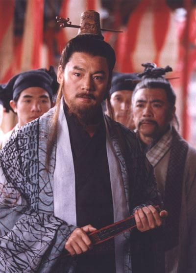
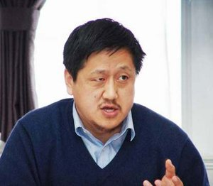
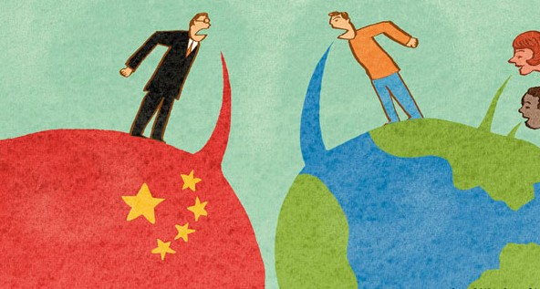

# ＜摇光＞真小人与伪君子

**我们今天所碰到的好像是一个“什么都可以”的时代。从一元价值的时代，进入一个价值多元的时代。但是，事实上，什么都可以，很可能也就意味着什么都不可以：你有知道的权利我就失去了隐密的权利；你有掠夺的自由我就失去了不被掠夺的自由。解放不一定意味着真正的自由，而是一种变相的捆绑。**  

# 真小人与伪君子

## 文/阿诺（华东政法大学）

  引言： “好像孩童般茫然而没有见识，好像巷口那个流氓，眼皮浅薄，算不了什么东西，可是，如果高级知识分子如此，就太卑鄙了。”（《易经之童观，小人无咎，君子咎》） 

1

有时候我会思考这两种人哪种更可恶：一种是满嘴脏话将现实的丑恶现象纷纷挂嘴边并以为理所当然不知廉耻甚至以此为特立独行标榜着这个社会崇尚多元崇尚自由；另一种是伪善地说着仁义道德暗地里却逆来顺受地按部就班地皈依这个体制表里不如一内外不对称的。

前者我们把他称作“真小人”吧，后者就叫做“伪君子”。

一开始，我会觉得“真小人”至少还有个“真”，至少活出自我活出个性，他坏故他在，社会需要这种特立独行的人；而“伪君子”就是个衣冠禽兽，特别是某些表里不如一的人白白浪费了大家一开始的一腔热情，到最后发现前期的感情投资都竹篮子打水了，这种人就是个情感骗子。

但是，渐渐的，我改变了这样的想法。

一来发现这社会没几个会成为“真君子”。“真君子”固然值得钦佩值得赞扬值得成为努力的方向，但是你不能要求每个人都是“真君子”。“伪君子”的存在就像你必须上那个无聊的马列课，但是允许你在课堂上不认真听讲可以看小说打游戏睡觉等等；就像选举人大代表存在着那么多看似虚张声势的程序虽然你并不了解代表是何许人或者代表能代表你什么权利，但是允许你去投票允许你赞成反对或者弃权。如果你现在硬要去说马列课不需要上因此罢课，或者说人大代表过于虚伪要求全民选举主席，那么往往弄得双方头破血流。

二来，更为重要的是，我发现“真小人”充斥着这个社会，层出不穷的“真小人”，从上到下，从里到外，从物质到精神，从阳春白雪到下里巴人，都在传递着、效仿着、乐衷着这种恶俗。这真是一种可怕的连锁反应。

2

孔庆东的“三骂”就是代表。

“一分钟前，《南方人物周刊》电话骚扰要采访我，态度很和气，语言很阴险。孔和尚斩钉截铁答复了一个排比句：去你妈的！滚你妈的！操你妈的！”（《人大的孔庆东》[http://share.renren.com/share/GetShare.do?id=10059366498&owner=230871940&ref=minifeed&sfet=107&fin=10&ff_id=230871940](http://share.renren.com/share/GetShare.do?id=10059366498&owner=230871940&ref=minifeed&sfet=107&fin=10&ff_id=230871940)）

众所周知，针对中国未来的出路，当代学者存在的左派与右派之争，前者以乌有之乡为阵营，后者以南方报业为阵营。孔老师高举着左派的大旗对南方报业不满甚至戏谑谩骂等等都无所谓，但是他忘了他的身份，北大教授。

特立独行固然可赞，另辟蹊径当然勇气可嘉。

对于凤姐芙蓉姐姐等人，我个人觉得没什么可骂的，当然我也不会去关注。因为人家是用生命在燃烧青春，对于个人他想干嘛就干嘛。当然，以此类推，骂他们的人也是正常的，因为骂人也是人的自由。

但是孔庆东则不一样，他的身份是北大教授，而且是北大灵魂人物之几。这身上有多少聚光灯在他身上，有多少人在效仿，在关注，在期待，在畅想。我们不期许他能做一个“真君子”，但至少应该是“伪君子”吧。

因为“伪君子”之所以“伪”，是因为有所顾忌才会去伪，倘若被逼到墙角，也许还有恻隐之心，但是“真小人”则是撕下了脸皮，赤裸裸的高举“真小人”的招牌，以此大快朵颐获取利益，那么就太过于可怕了。因为他已经声称他是“小人”了，而且是“真”的，以此让大家不要将其与君子对号入座，那么他就可以实无忌惮的小人了。

像孔庆东，就一直标榜着自己敢直言，粗话连篇四处谩骂。以此获取知名度，博得直言不讳大胆直言的美名。

但是他忘了整个北大的风气，整个社会的风气，渐渐被带成了这样。

凤姐之类人物，固然也是恶俗，但是往往是作为茶余饭后的谈资，并不为成为大众评价主流的标准，即使是效仿的人也往往是自甘或者自愿出名，并不可怕。但是孔之类的人，则是代表着塔尖的人物，如果是一种学术的特立独行我认为这是好事，但是无疑这并不是什么具有不可替代性的优势，只是一种甚粗俗的行为方式，根本没什么好歌功颂德以此为乐的，如此，为何呢?

3

前段时间新生导航中，针对小悦悦事件，程金华在讲座中抛出这样一句话：

“为什么现在规则越来越多，秩序却越来越少。 为什么现在的法律人越来越多，美德却越来越少？”

继而抛出这样一句话：“不要让技巧超越美德”。

人们总是容易在两个极端进行选择。当前在一味抨击着“人不应该是集体的人，而应该是独立的个体”之时，对于崇尚自由特立独行的人大力的赞赏，认为这是一种“文艺复兴”，关于“人的复兴”。

但是，走到另一个极端，就变成了现在这样。各种理论都能对各种行为找到支撑，例如认为孔是对的北大就应该“兼容并包”，例如判了“南京彭玉案”的败诉因为认为没有合理的证据等等。对此你还很难从理论上去反驳这样一种行为的不好，但是它就是不道德，它看起来就是那么恶俗，它发生了之后就是令人那么憋屈。更重要的，它还通过理论通过主流传达了价值观供人效仿公认仰慕。

我们今天所碰到的好像是一个“什么都可以”的时代。从一元价值的时代，进入一个价值多元的时代。但是，事实上，什么都可以，很可能也就意味着什么都不可以：你有知道的权利我就失去了隐密的权利；你有掠夺的自由我就失去了不被掠夺的自由。解放不一定意味着真正的自由，而是一种变相的捆绑。而价值的多元是不是代表因此不需要固守价值.

如此，是否有些东西是否应该是一层不变的是普世价值的，无论你是教授或者名人，平民或者囚犯等等。

4

可爱者不可信，可信者不可爱。

我想对于传统与激进或许有着这样的关系。

《易经》里面有句话是这样说的：“好像孩童般茫然而没有见识，好像巷口那个流氓，眼皮浅薄，算不了什么东西，可是，如果高级知识分子如此，就太卑鄙了。”（《童观，小人无咎，君子咎》）

与此类似的还有这样一句话：“荒诞的世界里，必须收起你的庄严，才能混过卡夫卡的城堡。但不要忘了，当你面对上帝时，严肃点！”

 

5

这让我想起另外一个故事：

很多年以前，北京前门大栅栏有一个卖冰棍的，每天大骂：“要不是爷爷我在这儿卖冰棍，丫的全北京人都得他妈的渴死！”

这就如同一只公鸡常常以为，只要它不打鸣，那么天就不会亮。

 

（采编自投稿邮箱；责编：麦静）

 
