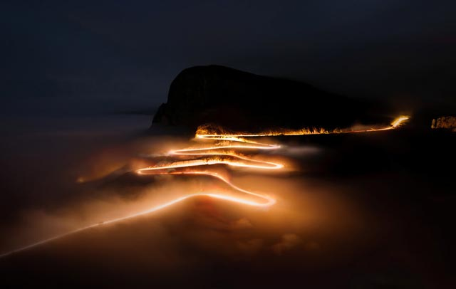
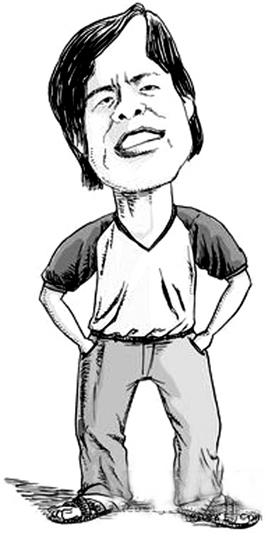
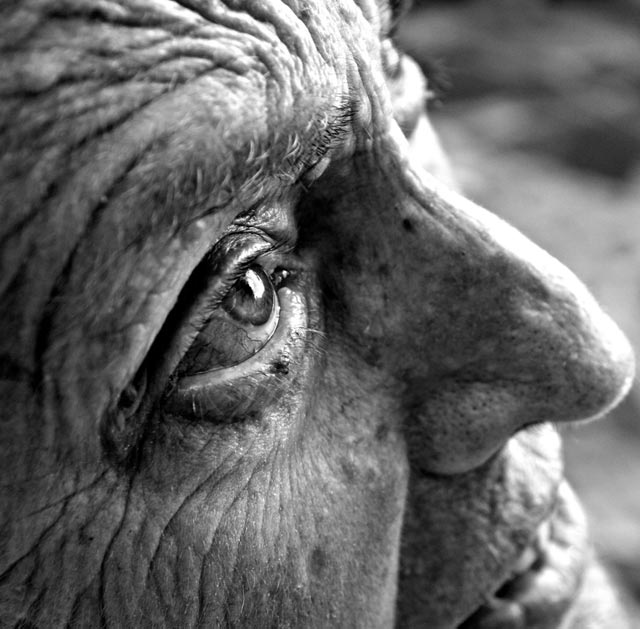

# ＜摇光＞真正的自信

**二十岁是什么年纪啊？是被回忆的年纪啊，而不是去回忆的年纪。它是很多年后书写回忆录时笔下暗暗划过的那个“曾几何时”，是在学生们面前尽情吹嘘的那个“想当年”。所以，年轻人就要做点对得起青春年少的事情，尽管这样的日子会有尽头。**

### 

### 

# 真正的自信

### 

## 文/王粤北（同济大学）

### 

### 

### 

“你会不会想过有一天突然惊醒，发现自己在高一的课堂上睡着了，现在经历的所有其实只是一场梦，阳光照的你脸皱成一团，你掏出手机给那些还在身边的朋友发信息，他们都骂你白痴，你发现现世安稳。”最近，很多人都在转发这条状态。有时，我会看到一些同伴对过去的怀念。过去，当然有快乐也有悲伤，不过由于它如河流般一去不再复返，所以，常常显得弥足珍贵。或许，我从来就不是个念旧的人，我总觉得，二十岁是什么年纪啊？是被回忆的年纪啊，而不是去回忆的年纪。它是很多年后书写回忆录时笔下暗暗划过的那个“曾几何时”，是在学生们面前尽情吹嘘的那个“想当年”。所以，年轻人就要做点对得起青春年少的事情，尽管这样的日子会有尽头。豆瓣上一个朋友说，生活就是百般追求，然后作出妥协，最后曙光不灭。我觉得说得好，没有百般追求，妥协就不够壮烈，而最后，人也只会被困于绝望的深渊。 最近看到有些朋友正为媒体上越来越多的负面新闻而担忧，说是天天看到些“腐败”、“黑砖窑”之类的坏消息，心情总是不由得变坏，怕我们的国民因为这些负面新闻丧失生活的信心，变得自暴自弃。在我看来，如果一国之民听到喜事就感到分外“自信”，听到“丧事”就一下子唉声叹气，那只能说明大家还不够成熟，还没有习惯这个真实然而不完美的世界。那些积极参与公共事件辩论的公民万万不会如此这般像气球一样，一吹就涨得不行，一撒气就瘪得妥妥的。他们看多了哭哭笑笑，必然会有一种平常心。那种只能建立在“喜事”之上的“自信”是真正的自信么？我可并不以为如此。乐观也好，悲观也罢，更多的是指人们如何看待这个世界，而不是指看待世界的哪个部分。无论是可喜的部分还是可悲的部分，只要它是真实的，我们或早或晚都要学会面对。 如果要找到一个人，把他当做乐观的榜样，我八成会选择王小波。十四岁上初一时“文化革命”开始，十六岁在云南兵团劳动，十九岁在母亲老家山东省牟平县青虎山插队，后来又当了民办教师，二十一岁在北京牛街教学仪器厂做工人，后在北京西城区半导体厂做工人。最好的一段青春，赶上了最倒霉的年代。最善于讲理的人，赶上一个最不讲理的年代。然而，当他回忆过去的时候，总是一副没正经的样子，在调笑和自嘲中化解着最深重的苦难，那种对于未来的信心，字里行间无处不在。 

### 

### 

09年，[格伦·克洛斯](http://movie.douban.com/celebrity/1031875/)和[雅克·甘布林](http://movie.douban.com/celebrity/1041660/)出品了一部纪录片《家园》。很多人对于自然类纪录片的印象都停留在绚丽的色彩、开阔的视角以及那些自然景观形成的抽象图形和线条，歌颂地球和谐美好还有大自然的鬼斧神工。然而在这部影片里却不是仅仅如此，也没有描述未来灾难的电脑特效，没有触目惊心的血腥暴力。那些实实在在的现世镜头，以及被放大字体的数据资料仿佛已经令观众陷入绝望。我们会不禁对比自己的年龄和那些资源即将消失的年份，惊恐地发现自己将不可避免地经历那些未知的状况；旁白语速均匀地陈述着人类的行为及其造成的影响，那种如上帝俯瞰人间的语气，让我们这些无神论者带着不安愧疚以及无奈，仿佛接受审判。怎么样，是不是足够沉重了？可是，我们真的能把这叫做“悲观”么？经过15年的筹备，历访50多个国家，导演的初衷就是为了让我们绝望？或是如某些反对者所说的“表现了资产阶级悲天悯人的虚伪本质”？在影片的最后，终于，打出了一行行的字幕：“既然悲观已经失去意义，让我们一起，承担责任，珍惜手中的财富，运用知识和教育的力量，依靠我们的智慧与努力，大胆尝试，积极应对，在极其有限的时间里，创造奇迹，扭转现状。” 一个人，他知道这世界有很多无奈与黑暗，但是还能睁开双眼看着这个苦难的世界，他不仅仅能够看着世界，他脸上还能有真心的笑容。待到人事已尽，一边自嘲“老夫能做的也就仅此而已”，一边还不死心的期望着“总有一天，总会有那么一天……”这，才是真正的乐观。 

### 

### 

### 

昨天友人问我，我理想中的中国是什么样子。我还能说些什么？无非是人的基本权利得到保障，在法制之上建立法治，每个人都发挥自己的价值等等等等。他给我的的评论是“你太贪了”，他问我“我们能看到那一天吗？”我说：“你死也别想……”说完，相视一笑。但是这两个人却都想做些力所能及的事，尽管，尽管我们都知道，最后可能真的是“死也别想”。 我们还不老，一切都尚早，以虔敬之心去了解这个世界，再尽己所能，做出改变。不论结果如何，至少可以在努力之后，写上一篇坦坦荡荡的墓志铭。 

### 

### 

（ 责编:黄理罡）

### 

### 
