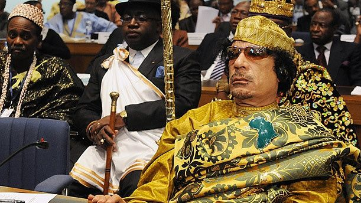
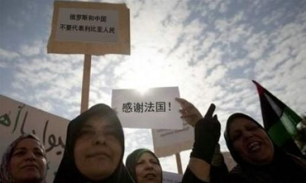
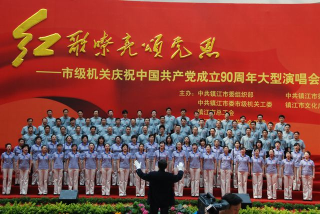
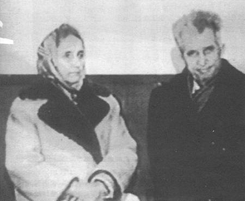
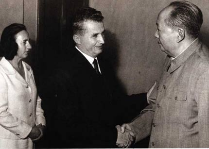

# ＜摇光＞社会主义的罗马尼亚

**说齐奥塞斯库似的混蛋又蠢又傻，其实不正确。每一个齐奥塞斯库都是心理学的高手，他们懂得恩威并施，随时用自己的嘴抚慰民意的jj。如果仅仅有威慑，民众还会反抗。所以齐奥塞斯库们也会提出一些人人耳熟能详，很简练却又很实际的口号，给民众以梦想。比如希特勒，就经常提出“住元首屋，吃上好牛排”“兴德国，灭犹太”，苏共也提出“打地主，分田地”“共产主义就是土豆加牛肉”，齐奥塞斯库也提出，“在2000年建成发达社会主义”。**  

# 社会主义的罗马尼亚

## 文 / 王斐弘（北京电影学院）

  穆巴拉克下台了，本阿里下台了，脑残卡扎菲马上要挂了，齐奥塞斯库似的独裁国家已经越来越少，渐渐成为稀有动物了。 

 写这篇文章，只是想提醒各位，在历史上曾经有过一批国家，他们比纳粹更嗜血，比日本人更无耻，比大清朝更荒唐，比沙俄更独裁。在社会民主化的今天，这种傻逼国家不应该被忘却。下面详细地说一说罗马尼亚独裁史上的荒唐之事。  荒唐事之一：可爱的计划生育政策，把每一个男人变成种猪，把每一个女人变成母猪。 独裁国家有一个特点，就是不把人当人，而当成国家的机器。 在罗马尼亚看来，人不是人，而是一颗螺丝钉。国家要把你拧在哪里就得去哪里，要怎么拧你就怎么拧你。你只能服从，个人利益服从国家利益。既然不把人当人看，人就失去了做人的基本尊严，人可以有计划的成批成批的被生产，也可以有计划的成批成批的被消灭。罗马尼亚人管这个叫计划生育。 跟中国的计划生育不同，罗马尼亚人的计划生育是动用暴力手段的生育。为了提高人口数量，1966年，齐奥塞斯库颁布法令：禁止堕胎。据他宣称，胎儿是社会的财富，不生育孩子的人就是背叛国家的人。禁止离婚，每对罗马尼亚夫妻至少要生四个孩子。紧接着，国家颁布法令，节育和堕胎都属违法，不能受孕的女性要交纳税金，堕胎者将受到判刑和囚禁，妇女月经期要受到严格地检查与盘问。 一时间，罗马尼亚的男人跟女人都成了全世界最悲剧的人。女人生育，很难保持自己的身材。生一个还好，让你最少生四个，嘿嘿，女人个个都是水桶腰，大象腿。又没法离婚，男人只能跟这样身材的女人ooxx，岂不是很悲剧？男人不愿意生，女人不愿意生。齐奥塞斯库为了保证自己的计划执行，派遣秘密警察进入各个单位，每个月检查妇女有没有自己偷偷避孕，有的话直接给予惩罚，轻者勒令辞退，重者蹲监狱判刑。 别的国家喜欢用可爱的珍稀动物称呼自己的秘密警察，只有罗马尼亚人用月经来称呼自己的秘密警察，他们被称作“月经警察”。还有的月经警察提供“特殊服务”。布加勒斯特的一位妇女对月经警察说，她丈夫有性功能障碍，无法生育。于是，一个由四人组成的月经警察小分队，轮奸了此妇女，美名曰帮助其生育，帮助她履行公民的权利。 实施计划生育的第一年，罗马尼亚婴儿出生率提高了近一倍。齐奥塞斯库为自己的政策感到高兴。可是没过多久，他就高兴不起来了：婴儿死亡率提高了1.5倍。因为医疗条件，育婴师，奶粉的严重匮乏，婴儿死亡率很高，民间痛斥：这是有组织的大屠杀。 于是，齐奥塞斯库提出了新的办法：所有婴儿，出生一个月才算是人。之前死去的，不算婴儿，不算公民。你生了，一个月之内死了，不算你生育。你还要再生。什么时候生到4个婴儿都活过1个月了，你才算完成任务。从此，在媒体上，婴儿的出生率倒是真高了。仅仅是媒体上。因为不仅仅是中国有ccav，罗马尼亚电视台也盛产av。 

 事实上，在西方，特别是信仰天主教的国家，实行禁止堕胎的政策并不奇怪。爱尔兰就认为为出生的婴儿也算生命，因此禁止堕胎。但在一个14岁的女孩儿被父亲强奸后，全国三分之二的民众都对女孩儿表示同情。最后这个事件有了个happy ending。爱尔兰政府支付了女孩儿的全部诉讼费用，并给了她一笔资金，让她去允许堕胎的国家旅游。 齐奥塞斯库永远不会这么干。原因很简单，自由主义社会，国家承认每个人的尊严。一切法律的实施，都是为了人。一切政策的实施，也都是为了人。在独裁国家，人皆为工具，能用则用，不能用则摧毁。指望他们给你们人的尊严？嘿嘿，可能么？  荒唐事之二：言论管制，毫无言论自由。 穆巴拉克虽然混蛋，但在他的治理下，好歹民众还能上上推特，上上facebook。在齐奥塞斯库治下，连打字机都限制使用。可以肯定。如果齐奥塞斯库活到今天，推特将会又多了一个营业地区的空白，什么facebook，什么youtube，在罗马尼亚肯定上不了。多修个圣齐奥塞斯库防火墙，也是可能的。 20世纪80年代初，齐颁布了《大罗马尼亚打字机法》，对打字机实行准入制度。法案规定，每个罗马尼亚的公民，机关，事业单位，要使用打字机必须得经过警方的许可。 有人说，看上去还好呀，只要到警方拿个许可证就是了。嘿嘿，这位兄弟大概忘了，曾经有个地方说游行也是自由的，但是你得去警方拿许可证。可惜，人家偏偏打死也不给你发，你就永远没法上街散步。罗马尼亚打字机法也是这样。只有对齐奥塞斯库非常忠心的人才能领取打字机执照，打字员也要领取执照。每份打印材料，必须多打印一份，上报警察机关。自领取执照的一日起，你就有可能成为月经警察监视的对象，今天哪里有点小骚乱，他们就可能找你喝咖啡。即使你的打字机坏了，也得上交政府，自己拿去修？嘿嘿，等着喝咖啡吧。 因为齐奥塞斯库的政策，罗马尼亚成了新闻严重管制的地区。在罗马尼亚只能看到本国官方新闻，而本国电视台又被齐奥塞斯库控制，所以他的每一次讲话都成了“纲领性文件”，报纸要登，电视要播，广播要说，群众要深入学习。 每逢重大节日，有影的，有声的，国内的，国外的，各种媒体一起上，民众耳朵里充斥着颂扬“齐奥塞斯库时代”的光辉业绩、歌颂“齐奥塞斯库伟大、正确”的各类宣传。齐奥塞斯库曾经有过一种创举。他开办了一批报纸，杂志，专门在外国新闻里搜集那些有利于他的新闻，或者不利于西方世界的新闻。把它们搜集，汇编成册，或者印成报纸。以环球新闻的名义，在国内发行。而那些有利于他的新闻，大多都是他用外汇，购买国外报刊的广告版面刊登的。 

 说齐奥塞斯库似的混蛋又蠢又傻，其实不正确。每一个齐奥塞斯库都是心理学的高手，他们懂得恩威并施，随时用自己的嘴抚慰民意的jj。如果仅仅有威慑，民众还会反抗。所以齐奥塞斯库们也会提出一些人人耳熟能详，很简练却又很实际的口号，给民众以梦想。比如希特勒，就经常提出“住元首屋，吃上好牛排”“兴德国，灭犹太”，苏共也提出“打地主，分田地”“共产主义就是土豆加牛肉”，齐奥塞斯库也提出，“在2000年建成发达社会主义”。 谎言重复100遍就是真理，何况在独裁统治下，民众接触不到任何外界新闻，而齐奥塞斯库们重复了不下一百遍，不由得你不信。至于灭了犹太能不能兴德国呢？没人愿意问，也没人敢问。所以，他每到一地，官方都要组织成千上万的群众进行盛大隆重的欢迎，群众必须提前几个小时到场，即使风吹雨淋、烈日暴晒也要参加。官方则组织一批政治“拉拉队”，坐在会场前头七八排，齐奥塞斯库讲话时，每隔两三分钟他们都站起来鼓掌、叫好。他每讲一次话，听众都得起立鼓掌、欢呼几十次。  荒唐事之三：家族统治，和谐的社会主义大家庭。 中国人古代讲究世亲世禄，一生为官，代代为官。作为一个中国文化的狂热爱好者，齐奥塞斯库大概学到了此中的精髓。齐奥塞斯库本人有几十个头衔，从党主席到军队领袖再到经济委员会主任不等。这个很常见，每个南美独裁政权就是这样。 但齐奥塞斯库比起南美军政府更加聪明。南美军政府常常是一个人独裁，自己权势不够，就被别人推翻。一个人的特权阶层，是很脆弱的，最好的办法就是培养一群特权阶层，特权阶层要大，要多。大家都是一条绳的蚂蚱，互相捆绑，有谁有异心，其他人共诛之。 谁最放心呢？自然是自己的家人，儿子最放心。总不能老子反儿子吧，总不能妻子反对丈夫吧。引用一段被引用烂了的材料“据英国《经济学家》杂志统计，齐奥塞斯库家族成员在党政军界担任要职的不下三十人。其夫人埃列娜·齐奥塞斯库任罗共中央干部委员会主席，第一副总理，实际上是罗共二号人物；其兄马林·齐奥塞斯库，任国防部副部长兼罗军最高政委；其弟伊利埃·齐奥塞斯库和安德鲁察·齐奥塞斯库，分别任内务部干部培训中心主任和罗马尼亚驻奥地利使馆商务参赞；其妻弟格奥尔基·波特列斯库任全国工会主席；齐奥塞斯库的小儿子尼库·齐奥塞斯库任共青团中央第一书记。”所以，每当罗共中央开会，就像是齐奥塞斯库的家族会议。好一个和谐的社会主义大家庭。 

 最可笑的就是他的母亲。原是一位普通的农村妇女，她住进了豪华的宫殿庭园中，尽享荣华富贵，可长期的农村生活使她很不习惯现代交通工具，齐奥塞斯库就专门派人在庭园中饲养她喜欢的毛驴，出门走动可以乘坐毛驴，还有大批保镖前呼后拥。 事实证明，就统治本身而言，齐奥塞斯库是成功的。罗马尼亚从来没有因为内部的分裂，把齐奥塞斯库的政权颠覆。  荒唐事之四：狗都能当上校，人民生活不入狗。 请注意，这里说的是狗，不是猪。是上校，不是少将。 齐奥塞斯库骨子里崇拜希特勒。他也学着元首养狗。齐奥塞斯库有一条好基友，名叫考布，是一条狗，知名度极高，连英国大使都认识，在罗马尼亚几乎家喻户晓，在公开场合人们一般称其为考布同志，以示尊敬。 齐奥塞斯库却不高兴了。并不是因为他觉得同志是gay的称呼，而是他觉得，只有屁民才叫同志呢，自己的亲密基友考布，怎么能跟屁民一样呢。于是齐奥塞斯库决定给自己的爱犬考布郑重授予陆军上校军衔，享受县团级待遇，从而使这条来自英国的拉布拉多猎犬成了世上乃至史上级别最高的狗官。从此，在布加勒斯特大街上，寒风中排队购买食品的市民们经常看到考布上校乘豪华小汽车，横穿闹市，扬长而去。英国大使曾这样评价考布:“这只黑狗独自坐在‘达西亚’车后部，仰面朝天，相当傲慢。” 

 齐奥塞斯库为什么对一条狗这么好？大概有两种可能。可能性A:他傻逼。B，他给臣民一个信号，一条狗对我忠心，我就给他这么好的待遇。你们对我忠心，我也像对待我的狗一样对待你们。 他对人民好不好，先不说，对狗是真的好。“齐奥塞斯库对考布宠爱有加，罗共中央办公厅的安排照应，可谓无微不至，考布的待遇标准显然已经超过县团级，看上去更像是罗共中央副总书记。行有豪华专车，住有豪华别墅，还配备秘密警察充当保镖，设有专职医生加强日常保健，考布进餐时，一如皇帝进膳，须有医生先行尝试确认无毒，考布才开始进膳。一位女仆后来回忆说:‘秘密警察告诉我们永远不要喂狗。有专门医生检查狗食(一种最好的肉)。只有医生尝过后，肉才能喂狗。’既然这头拉布拉多犬来自英国，那么狗食最好也从英国进口。英国学者杰弗里.里根在《愚昧改变历史》一书中，详细叙述了那荒诞的情形:为了齐奥塞斯库的爱犬，在官方授意下，采购狗食成了罗马尼亚驻伦敦大使的重任；大使每星期都要去一趟圣伯利公司，购买英国狗爱吃的饼干及狗食，然后用外交包裹打包，寄回布加勒斯特。 “晚上，齐奥塞斯库喜欢与考布睡在一起；白天，考布生活在别墅12号公寓，里面设施齐全，舒适的床、豪华的家具、电视电话，应有尽有。为避免考布孤独，齐奥塞斯库还要求把一只名叫“希罗娜”的黑色拉布拉多母狗送到宫中。” 在这样一个可笑的社会，狗权比人权更受人尊敬。 齐奥塞斯库是一个很爱形象工程的统治者。动不动拆了建，建了拆，处处暴力拆迁。为了建设一条“社会主义胜利大街”，他大拆布加勒斯特老城，结果有许多老人被逐出自己的房屋，露宿街头，挨饿受冻，有的人甚至绝望自杀。这些失去家园的百姓，被迫同意签署拆毁家园的文件，甚至有些人还要自己承担拆迁费用。一切有碍修建“社会主义胜利大街”的建筑物，齐奥塞斯库都将其彻底摧毁。 拆到后来，一家名叫布兰科温斯克的医院，成了这条大街上的最后障碍物，这是一所平民医院，每年有5万多名罗马尼亚人接受治疗，老百姓希望保留这所医院。但它的命运最终是由考布上校决定的。那天，齐奥塞斯库去视察医院，考布上校陪同视察。上校威风凛凛跳下车，发现一只不明真相的猫在围观，该猫是医院为了灭鼠而饲养的 ，考布上校杏眼圆睁，勃然大怒，一个箭步窜上去张口便咬。该猫不认识齐奥塞斯库同志，更不知道该狗正是享受副总书记待遇的考布上校，奋起还击，且战且退，考布穷追不舍，该猫一个勾拳将考布上校打出鼻血……齐奥塞斯库大怒，愤然乘车离去。考布很生气，后果很严重。院长吓傻了，该猫擅自攻击了总统最宠爱的、属于罗马尼亚军队的一位“陆军上校”，致使龙颜不悦，医院前途堪忧。果然，几天后，一纸拆除医院大楼的命令送到了医院。这所每年有5万多名普通老百姓接受治疗的医院随即被夷为平地。 荒唐事之五：秘密警察，精神病院 罗曼尼亚全国人口4000万，全国的安全警察多达76万。中国人口13亿，警察120万。小小的罗马尼亚，其警察总数是中国警察总数的五分之三。这些秘密警察拥有特权，喜欢在暗中把他人拿下，形同黑势力。知识分子和官员如果批评政府，得到的命运是失业、软禁或投入精神病院，与真正的精神病患者关在一起，直到无人能区分他们;反对派统统消失了，都被送进医院去治疗“政治偏执狂”、“老年痴呆症”了。1987年发生了一次罢工，组织者全部被逮捕继而统统失踪。谁要申请出国护照，都可能遭到解雇、撤销身份证。政府还规定未经批准不许与外国人说话。而最厉害的一招，就是书刊、报纸、信件一律实行检查制度。许多正直的新闻工作者，被认为患有各种各样的精神病，包括“被害妄想”、“偏执性格”等等。 其实，这很好解释。把精英人士，知识分子，都控制了。你行不成思想体系，形不成组织，形不成反对党，民间虽有抱怨，没有组织，能奈我何？  六 颜色革命结束了，齐奥塞斯库被杀全家。 别说民众暴力革命，别说民众同态复仇，是你齐奥塞斯库先犯贱的。 当一个国家，狗权高于人权，当一个国家充斥着贪污，腐败，颓废，寡廉鲜耻，当一个国家处处犯贱，民众权利没法得到丝毫保证，当一个国家把民众当成机器，它离齐奥塞斯库的命运就越来越近了。 我说的是朝鲜。 

### 【附】

原文地址：[http://blog.renren.com/blog/294401558/748026575](http://blog.renren.com/blog/294401558/748026575) 视频——齐奥塞斯库倒台的七日革命：http://www.tudou.com/programs/view/PIDKOCt_fd8/  

（采编：管思聪；责编：管思聪）

