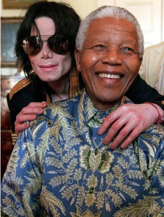

# ＜摇光＞种族隔阂之一斑

**我一直对种族主义者、地域歧视者怀着鄙视的心情，不管他们歧视的是日本人、黑人，还是河南人。在我看来，只有无脑者才会根据别人的肤色或者出生地去判定其人格，因为他们的智商不够用，不能通过一个人的言行举止来做出判断。** ** **

# 种族隔阂之一斑

## 文/陶媛媛（清华大学）

朋友跟我讲过一个笑话：他上的小学是比较好的小学，同学基本都是家境不错的中产，这直接导致了他12岁以前的世界观完全是扭曲的，他以为世界上的人不是犹太人就是天主教徒，而剩下极少数的黑人则不是律师就是医生——因为班里唯一的黑人小孩父亲是律师，母亲是医生。于是当他上了中学，发现竟然还有那么多种不同的人的时候，不得不对自己的世界观进行彻底的改造。 在波士顿地区混了两年多之后，我搬来费城的时候，也发现自己也面临着类似的困惑。在WPI的时候接触到的黑人屈指可数，回想起来这几个人都是很聪明很酷，跟我在费城地铁里遇见的无家可归者、在我做义工的医院遇见的被打18枪的可卡因贩子、满嘴脏话声音比喇叭还高的同事完全就是天壤之别。 我一直对种族主义者、地域歧视者怀着鄙视的心情，不管他们歧视的是日本人、黑人，还是河南人。在我看来，只有无脑者才会根据别人的肤色或者出生地去判定其人格，因为他们的智商不够用，不能通过一个人的言行举止来做出判断。不久前我写过[一篇日志](http://blog.renren.com/blog/236299296/712170207?frommyblog)说明为什么对黑人和墨西哥人的歧视是没有根据的，为什么这两种人在美国的社会地位低下是历史遗留与法律倾斜的结果，而不是他们 “不努力”、“素质低”。

 后来慢慢跟医院的同事熟了，也发现一些以前没有想过的有意思的东西。一次跟同事聊起奥巴马的中期选举，她很激动地说，奥巴马选举失利是因为“我们黑人”没有像08年总统大选的时候那样出来给他投票；所以要吸取教训，12年大选我们一定要都出来投票。我理解她的种族认同感，但是仅仅因为奥巴马是黑人就给他投票，跟仅仅因为某个候选人是白人就给他投票也没什么区别。 一群人一起聊天的时候，如果我是唯一的非黑人，他们的对话就会变得非常难懂。一次，那个身中18枪的病人跟我聊起他被埋伏的经历，他说在他的社区里，很多人因为他在“eating”都很嫉妒他，最后他被几个拿着步枪的人隔着街扫射，幸亏他反应快，用手臂挡住了头部才捡回一条命，到现在脊椎里还有一颗子弹没取出来。我的同事也插进来，说她的儿子也是因为 “eating” 遭人嫉妒，有天从自己的车里出来的时候被人从太阳穴打了一枪。他们说了半天，才问我说 “你知道 eating 是什么意思吧？” 我尴尬地摇头，他们才解释说，是买可卡因赚钱。同样的俗语还有很多，以至对我这样的外国人而言，黑人的语言无异于又一门外语。 细心的话，还会发现他们中很多人听的歌手、看的电影、追看的秀都和我知道的白人或者中国人完全不一样。在美国的中国人多数都会给小孩取白人的名字，像我的中国裔前室友Kathleen，但是在美国有更长移民史的黑人却更多有着“明显”的黑人名字，好像他们很不情愿跟白人共享名字。黑白配的婚姻也远没有亚裔/白人的婚姻多，我从长辈那里听来的一对黑白夫妻，却是顶着黑人这边家庭的压力结婚的，白人家庭这边反而没有意见。 

上周看了一部叫 The Lottery 的纪录片，讲述纽约市一个社区推行 Charter School 的故事。事情的缘由得从美国大城市公共教育系统的无能开始说起 （顺便说一句，小学教育系统是我认为中国政府干的比美国政府强的不多的几件事之一，当然洗脑教育那部分除外）。美国的教师工会极为强大，政府开除每一个教师都得跟跟教师工会打交道，花无数的钱无数的时间；另一方面，与企业工会不同的是，企业工会很清楚如果他们过分压榨企业，那么企业倒闭了他们自己也跟着倒霉，而教师工会知道政府永远不会倒闭，所以跟政府谈判总是得寸进尺。于是，很多无能甚至品行恶劣的教师都不会被开除，而美国的小学生，尤其是教师工会的势力范围，即大城市里的小学生，学习成绩与世界上其他国家的同龄学生相比阅读和算术能力都差了一大截。为了提高小学教育的水平，有人开始推行 Charter School，即得到政府批准，从教师工会之外雇用老师的小学。这些小学的学生成绩明显高于普通的小学，所以建立者们想要把 Charter School 开到更多的社区。在我一个外国人看来，这对于社区里的父母们来说是天上掉下来的好事，因为孩子上小学家长不花一分钱，何不选择质量高的小学呢。可是在一个社区 Salem， Charter School 却遭到了抵制。教师工会反对倒是可以预料的，令人吃惊的是 Salem 社区的很多居民竟然也反对在他们的社区开 Charter School。在听证会上，一个黑人大妈声嘶力竭的喊：“这都是 Mrs Moscovitz 的阴谋！” （ Mrs Moscovitz是 Charter School 的推行人，自己也住在 Salem 社区）。看到这里，我才开始明白，这位黑人大妈那么强调 Moscovitz 的犹太人名字，是为了激起她的黑人邻居的认同感，一起排斥一个犹太人在他们的社区开学校。这背后的逻辑，除了本能地排斥白人、富人在自己的社区开学校，还有害怕好学校会吸引更多的白人、富人，以至抬升房价、地价，最终把他们原来居住在那里的黑人排挤出去。绕了这么大一个弯，Salem 的黑人们成功地实现了他们损人不利己的计划，搁浅了 Charter School 在Salem的扩展计划。我忍不住要问，费这么大劲把白人挤出去了，你们给自己的孩子争取到了一个更好的未来么？ 这种对白人的动机持怀疑态度，什么事情都要在背后找“阴谋”的态度对整个黑人群体而言无异于自戕。这种态度对于我来说也是非常非常之熟悉：和我一样从小被逼看《新闻联播》的80后们，大概都记得一个词，叫做“和平演变”吧，中国人那么害怕“被演变”，有没有人想过，演变的内容是什么？会不会给我们的孩子带来一个更好的未来？“和平” 演变既然是和平的，那可怕在哪里？“中国特色” 真的那么好么？我们会不会也在像那个黑人大妈一样，在声嘶力竭地拒绝一个更好的可能性？ 原文地址：[http://blog.renren.com/blog/236299296/730833223](http://blog.renren.com/blog/236299296/730833223)

（采编：陈轩 责编：陈轩）
