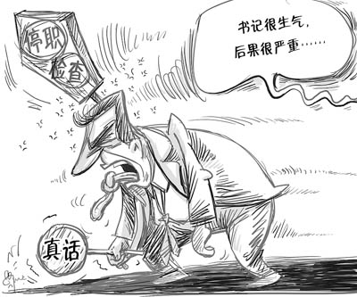
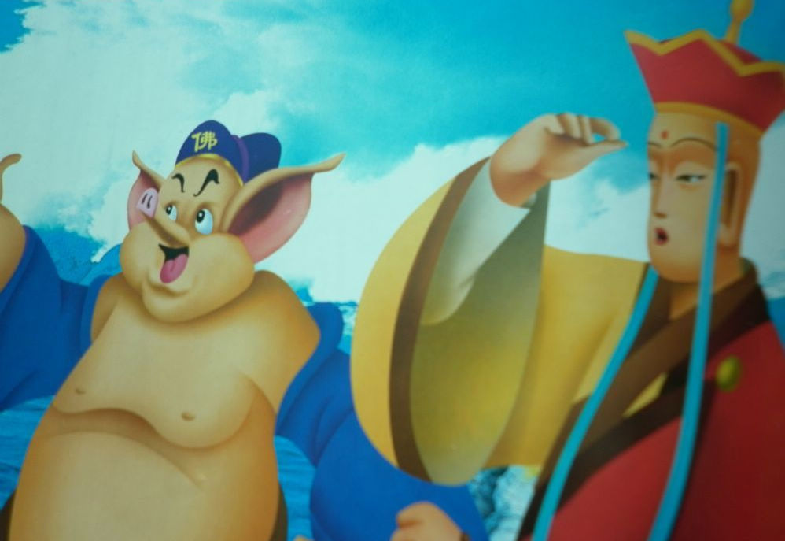

# ＜摇光＞窃国者猪猴

**就算说错了话，也只不过轻轻摸摸你的头，轻轻地告诉你，要乖哈，不然请你喝茶哦。你看看你看看，这种肚量，我相信这茶一定没有毒，而且还是在一个密封的包厢里，幽暗的灯光极具情调，有时还有皮鞭等道具挑逗气氛，对面坐着三个制服服侍着，帝王般的享受了。**

 

# 窃国者猪猴

## 万尹恪（南京中医药大学）

 

窃钩者诛，窃国者诸侯。语出《庄子·外篇·胠箧》。

从字面意义上也不难理解，偷一件稍微值钱的东西可能会被杀，而谋权篡位者倒名留青史。

就像当年的许霆案一样，许霆从取款机里拿了17万，被判死刑；相反，很多的官员，从公家财产里拿了成万上亿，被判死缓，然后在里面体验下别样人生，几年就低调出来了。

窃是门艺术，窃得差了叫偷盗，窃得好了叫借鉴，而窃的至高境界便是窃国了。予人玫瑰，手留余香；窃人东西，嘴软手短。拿人家东西，名不正言不顺怎么办？要么篡改，篡改不了的就掩盖，盖不住的就否认，否不了的就辟谣。

窃国有两种，第一种就像朱棣，直接窃王位，这种算明抢，因为世人都知道这王位来历不正；第二种就像朝鲜金家三胖，窃整个国家和百姓，绑架鱼肉他们，这种算暗偷，因为百姓根本不知道自己被偷了还美美地享受着。

已处绝境的中国人民的老朋友卡扎菲，此时此刻多羡慕同是中国人民的老朋友金正日啊。金胖国内受到顶礼膜拜，出外中国俄国到处玩，日子一如既往地开心。想到因去年年末“茉莉革命”而逃亡的中国人民的又一位好朋友本阿里，卡扎菲兴许还心存侥幸，因为“不怕，有兵在。”就算把卡扎菲逼到绝路想投降，但一想到中国人民的另一位好朋友穆巴拉克，前段时间被关在笼中受审，菲哥想到这点不寒而栗，又重新戴上墨镜，擦擦手中的Ak47，“要投降，宁勿死。”实在不行，也要学做中国人民的另一位好朋友——萨达姆，去躲猫猫。

其实，卡扎菲是一枚优秀的社会主义的接班人，贫下中牧出身，69年领导“自由军官组织”，推翻伊德里斯王朝，建立了阿拉伯利比亚共和国，任革委会主席兼总司令。他亲口说他的理论和毛泽东思想如出一辙，都想尝试消灭剥削与强权。他说他专注革命40年，不是他在执政，是人民在执政。

卡扎菲带领利比亚人民，摆脱了贫困，走进了小康社会。不过利比亚人民不懂感恩，政治觉悟不高，姿势水平不够，卡扎菲下辈子投胎来中国吧。他瑞士银行存款才16亿美元，但在原铁道部部长副手张曙光的28亿美元存款面前，还是有差距啊。总的来说是瑞士银行太坏，变相地侵蚀了我们社会主义的财富，间接了搅乱了我们社会主义阵营，让我们自相残杀，他坐收渔利。

窃国者之所以可以成诸侯，因为做了诸侯就掌握了话语权，就可以颠倒黑白，为所欲为。而要掌握话语权，就得让别人噤声，要让你因言获罪，要让你不敢多说。清朝文字狱就是活生生的例子，以前历史老师跟我们讲过一个例子，一阵风吹进屋子，把桌上一本书翻开了。秀才看见了，随性做了两句诗，“清风不识字，何必乱翻书。”被人听到后，告他映射满清不识字，没文化。后果可想而知，碰到这样的小人，秀才还不如遇到傻大兵了。此人正是顾炎武的甥孙、刑部尚书徐乾学的儿子、翰林院庶吉士徐骏，被雍正斩立决。

历朝皆有之，轻则发配，重则处决，甚则抄斩。可见封建皇权极端得可怕，如今，我们在共产党的领导下抬头挺胸走进新时代，想说什么说什么，想唱什么唱什么。就算说错了话，也只不过轻轻摸摸你的头，轻轻地告诉你，要乖哈，不然请你喝茶哦。你看看你看看，这种肚量，我相信这茶一定没有毒，而且还是在一个密封的包厢里，幽暗的灯光极具情调，有时还有皮鞭等道具挑逗气氛，对面坐着三个制服服侍着，帝王般的享受了。相信历史上因言获罪的大小官员们后悔早生了几百年了。哎，其实也真是，要怪，得怪我们共产党生得晚，我们伟大领袖毛主席生得晚了，没有更早一点让更多的中国百姓沐浴到自由民主的雨露，得自罚三杯。要毛主席早出生5000年，我们现在哪有那么多历史要背，什么朝代什么皇帝的复杂死了，根本不用公元几几年，直接毛历5000年中国共产党第500届主席胡主席，这名头甩出去，不得把西方资本主义那些小辈分的直接吓哭啊。

窃国者不是别人，窃国者猪猴。

“贫僧的两位徒弟又给国王添麻烦了，悟空八戒，休得无礼，还不快快把国还给人家。我们还得早日去西天。”

 

(采编责编：黄理罡)

 
