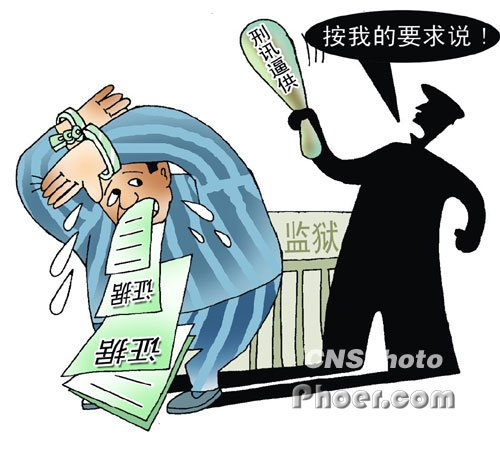

# ＜摇光＞答张舸文

**在可能的价值冲突中如何取舍，依循什么样的原则来判断，各家学说都有各家的观点和看法。如果说非要找出一条颠扑不灭的真理，我比较认同的是边沁所主张的，“民主和专制都是手段”和“一切为了最大多数人的最大幸福”。当然了，这种原则性的表述如何具体化实现又需要深入的思考和研究了。**

 

# 答张舸文

## 文/奥布莱恩（中国人民公安大学）

 

在讨论之前，我想引用胡适先生所言“宽容比自由还重要”来表明这样一个态度，那就是思想不论立场不分主义均应该是可以平等自由地交流讨论，不求趋同，但求相互认知相互理解。而当今在一些自诩自由主义、民主主义的意见领袖的言论中，他们一方面大肆攻击当局“钳制”言论要求自由的表达自己的观点，另一方面却把所有对立意见都妖魔化为五毛言论，不是就思想的内涵进行思辨，而是对不同意见者人身攻击。这才是最无耻的。

接下来我们谈正题。

首先，我想为国情论辩解。张同学以及其他一些同学似乎对国情论嗤之以鼻，认为国情不应该是我们限制沉默权抑或是其他一些西方国家实现程度比较高的人权的理由。否认国情来讨论社会问题，光从应然价值出发能否找到解决之道？梁启超先生在与革命派论战的时候，所持的最大理由也就是“国情论”。他坚持认为，中华民智未开，若轻言革命，则江山易色，流血飘杼，而革命之理想——民主宪政又不可建成。但革命派不听，结果后来中华数十年的历史就是一部血的革命史。

我们之所以观点迥异，不是在于我们是否承认国情论，而是因为我们对国情有不同的理解。

其次，我不否认沉默权的价值，并且承认这些原则的人文精神和人道关怀。不论沉默权也好，一事不再罚原则也罢，这些旨在保护人权的原则都是和西方与此相适应的一整套司法制度紧密结合的，互为体用，不可分割。作为老生常谈的辛普生案，如果该案在大陆发生，那是毫无争议的铁案，我们肯定会把辛普生送进监狱，甚至剥夺他的生命。但是在美国，在美国司法体制的运行之下，辛普生案由于严格的证据排除规则而使检方败诉，辛普生获得了他的公平与正义。那么死者高德曼和尼克的公平正义又由谁来实现？辛普生信誓旦旦的无罪辩解难道就比苍老的高德曼夫妇在败诉时悲愤落寞的表情更令人信服吗？

就同样的问题我和我的老师交流过。实体正义和程序正义，自由与秩序，公平与道德，这些法律所保护的价值不一定是对立冲突的。但确实存在一些情况，两种同样被我们所希冀珍视的价值之间的对抗是如此激烈，以至于我们不得不在二者中做出艰难的抉择，选择一个，放弃另一个。美国著名的小伙米兰达，作奸犯科的证据已经如铁证一般不可撼动，但最后美国高等法院却因为程序问题无罪释放了米兰达。我不想纠缠于程序正义与实体正义孰轻孰重的问题，只是想说，美国司法因为其自身的理念，选择了保证程序正义而放弃了实体正义，这只是美国的选择。这样一种选择能否适用我们，我的答案是至少在当前，这是不可能的，云南的赛家鑫案，云南高院二审因为没有判处被告死刑立即执行就引起了社会和舆论的广泛关注，人民要求改判死刑的呼声直接导致了云南高院迅速启动再审程序改判死刑。这样一种社会环境和社会文化，显然不是产生米兰达法则的土壤。

在可能的价值冲突中如何取舍，依循什么样的原则来判断，各家学说都有各家的观点和看法。如果说非要找出一条颠扑不灭的真理，我比较认同的是边沁所主张的，“民主和专制都是手段”和“一切为了最大多数人的最大幸福”。当然了，这种原则性的表述如何具体化实现又需要深入的思考和研究了。

对于张同学指出的“‘不废弃沉默权，即不能维护正义’”以及“要求放开刑讯”等说法，实在是张同学主观臆造并强加于我的，相信是误解我的意思了。

最后，据前些年的数据，世界主要发达国家的配警率是万分之三十，我国是万分之十三。当然北京上海等大城市的配警率是超过全国平均水平而接近国际水平的。武装警察除了极少数的公安现役外，都是没有执法权的，他们并不负责社会日常秩序的维护。所以，我国警力确实是严重不足。希望可以减少你对这个行业的偏见和误解。

时间仓促，来不及斟酌，如有不对的地方，请指正。

即日。

 

（采编自投稿邮箱；责编：麦静）

 
