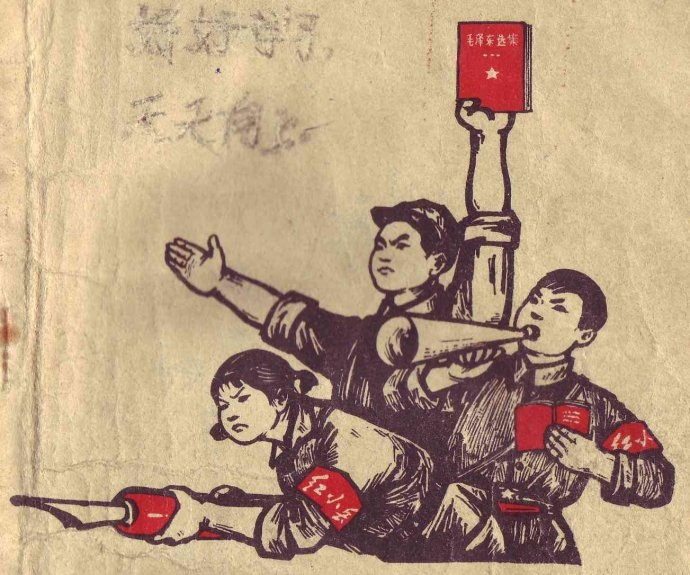

# ＜摇光＞红袖章

**那些所谓的学生党员，有几个是真正的信仰马克思主义和共产主义的，能有几个能够背诵《共产党宣言》，能有几个能够深入理解唯物主义辩证法？学生中唯物主义者很少，倒是有很多唯物质主义者，有很多唯心主义者，并且在争权夺势的时候违心得很。混个党员，无非就是考取公务员容易些，考个老师容易些，为自己增添所谓的发光点罢了。**  

# 红袖章

## 文/卞海鹏（重庆三峡学院）

 

新学期开始，已有一段时间了。各社团招新的大旗早已被扯破，新生入学指导也化为碎屑，全校师生应该说是应该进入教学的状态了。

近来在学校餐厅吃饭，在餐厅的走廊上兀自出现了一些只能在电影中出现的人物形象。也不知道是何处的哪个社团成员带起红袖章，在督查学生吃完饭后把餐具放在固定的位置，以方便餐厅阿姨收拾。吃饭的时候这些“红袖章”就会出现在你的周围，让我产生一种“我吃着，他看着；我坐着，他站着”的权势错觉，但是当我看到那“红袖章”盛气凌人的模样后，这种错觉瞬间也就化为乌有了。在食堂吃饭，看着《步步惊心》，我还以为我真的穿越了！

我所知道的“红袖章”是血迹斑斑充满血腥味儿的东西。在那些年代，全民参与政治，喊声震天，红旗飘飘，动辄“打倒反革命”、“打倒孔家店”……那些所谓的反革命在今天看来全是对社会有贡献的人物，而那些趾高气昂根正苗红的“红袖章”却不知犯下多少令人发指不寒而栗的血案。

这几天晚饭过后，便有一群人在图书馆前面大唱革命歌曲，毫无生气，死气沉沉，狼哭鬼叫。我至今没有听明白唱的什么。要是国家充满了一帮子这样的人高唱革命歌曲，那国家明天只好革命，否则会有亡国的危险。

秋意阑珊，冬日渐进，自习晚归时竟自觉甚至清冷，沿途经过的实验楼下，一群大姑娘小伙子们伴着不知所云的韩国舞曲，卖力练习着将要在迎新晚会上表演的歌舞。对他们来说，这也算是很好的露脸的机会。而看过几届所谓的迎新晚会，大多恶俗不堪，丑陋不堪，俗不可耐。各个活动的积极分子，浓妆艳抹扭摆腰肢，台上装纯卖骚。台下则欢呼雀跃，呼声阵阵，为之沸腾。除了看出恶俗二字，实在看不出别的什么来。

可能是我太过于保守了吧。大学几年，遵循“君子群而不党，小人党而不群”的至圣训导，从未加入如何党派社团，也没想过加入任何党派社团。不参加活动也就罢了，从各社团招新的牌子前走过，虽没有吐口口水，但也心中甚是鄙视。哪怕是我早已具有满足了学校加入共产党的条件的资格，却也未奔向组织，向组织靠拢。

同学一个个去听党课，预备了，宣誓了，然后向组织靠拢了。最初我以为这是神圣无比的事情，像是黑白电影中英雄面对党旗，自豪宣誓，斗志昂扬。但当我帮我同学（替我同学）参加七月一日的入党宣誓后，我豁然开朗，原来根本不是那么回事儿，完全不是我理想中的模样。就像江南水乡，仅仅留在中国人的文化基因或者文化回忆中而已，江南水乡迅速万丈高楼平地起。

那些所谓的学生党员，有几个是真正的信仰马克思主义和共产主义的，能有几个能够背诵《共产党宣言》，能有几个能够深入理解唯物主义辩证法？学生中唯物主义者很少，倒是有很多唯物质主义者，有很多唯心主义者，并且在争权夺势的时候违心得很。混个党员，无非就是考取公务员容易些，考个老师容易些，为自己增添所谓的发光点罢了。

团员这个我无法选择的政治身份让我一次次填入各种表格，已经十一年了。但是我连团员的全称都不知道是什么，唯一知道关于共青团员的事就是胡耀邦做过一段时间的共青团员的头。这么多年，我很疑惑，我已经是奔三的人了，有些孩子气的团员什么时候才能让我摆脱，免得让一群小孩子看我的笑话。档案上说我是团员，那我只好是团员，而且别无选择。尽管团费交给谁，怎么交，交多少，我都忘记了。

考研刚开始看政治的时候，因看了太多的异己言论，以至差点精神分裂。现在考研政治看了大半也算是有所理解，猛然抬头发现，考研政治是反政治的。

政治哪有选择题四个选项那么简单。像我这些案头摆满政治的考研学子，有几个是马克思主义者，倒是很多人研究生后出国，奔向“万恶的资本主义”。

政治是硝烟弥漫、杀机四伏的战场，动辄背后捅刀子，动辄落井下石，动辄你死我活……哪是四个选项那么简单。你看那些玩政治的人：

有些人像康有为那般维新失败后远离家国，逃到外邦；有些人像屈原那般无奈地升入天堂；有些人像有点结巴的诺贝尔和平奖获得者那般身陷囹圄，披枷带锁。更有些人像郭沫若那般今天改造明天改造后天改造。

有些知识分子为为政者提出的革命性的建设性意见，那也只是知识分子的一厢情愿而已，完全如同镜中花，水中月。不会引起所谓的革命或者建设，到会被玻璃割伤，被水呛着。

动不动就写某某宪章的那些人，只能会远走他国、身披枷锁；参政议政的那些人意见多了，会被拔掉扩音器，给你一虚职，像个优伶般囚禁起来，让你老实下。

玩政治参与政治的那些人哪有像政治选择题那般容易，选择错了，那可是会掉脑袋的。即使不掉脑袋也会机关枪哒哒哒，坦克车喀喀喀。瞿秋白先生，英年早逝，壮烈牺牲，用个中性词来说：是政治斗争的牺牲品。

学校各院系的迎新晚会也已多半结束，那些所谓异己分子的书，因远在香港、台湾，我一时也无法买到。那个用来翻墙的软件，也因多次未更新而翻不出去了。快到考试了，我也只有在图书馆反复背诵马克思主义辩证法，直到“艰苦朴素美名扬，领导人民的解放”的放学铃声响起。

听设计史的教学视频，视频上老师讲：在美国的一所设计学校中（洛杉矶设计艺术中心），教授设计史的老师有五六个，每个人都有不同的教学风格及方式。其中的一位老师课程的第一节课就要求学生读《共产党宣言》。因为设计史中的现代主义就是以共产主义为精神基础的。

纵观国内高校，领导、教授、学生中共产党员不在少数，有几人能在非政治课上大讲《共产党宣言》呢？

 

于雨后初晴的图书馆自习室中

 

（采编：佛冉 责编：黄理罡）

 
