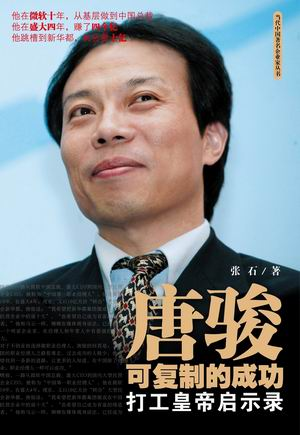
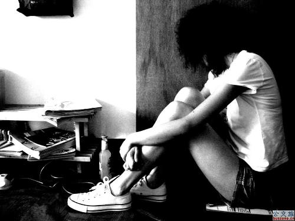

# ＜摇光＞红颜为何多薄命

**现在长大了，我还是对自己说，这样的生活也挺好的，只是自己不会去做渔夫罢了。这样的社会也挺好的，只是假象罢了。当诸位表达出对各式底层人类的钦佩时，是需要自己的幸福生活作靠背的。如果我是一个无一技之长，居无定所的无业青年，恐怕我对老渔夫就只会剩下羡慕和嫉妒。** 

# 红颜为何多薄命

## 文/孙凯士（诺丁汉大学）

国人大都有这样的毛病。失意的时候，大半夜对着镜子里的自己说，“你丫很坚挺”，然后回到被窝里偷翻《杜拉拉》。成功的时候，却奔走相告说，“哎，这其实不是我想要的”。骨子里一坛子中庸的酱菜。每当遇到这样矛盾的极品，我也很无奈，给其打一针鸡血转眼又要奉承几句，搞得自己也很精神分裂。 

这种纠结，大都事出有因。比如终于盼到当当上市的李国庆，就发微博矫情地说：“当我作为成功人士站在纽约，真为大陆崛起自豪。我在结婚前有过几任女友……每任都出国了，每次机场告别，我们都相拥哭泣，但我都拍着对方后背说：不是我们不爱，是大陆太落后，那里能带给你更精彩的人生。不是个人的是民族的悲剧啊。以至我的老司机一见我恋爱就说：这回别被骗了。”创业再上市，报复前女友，然后谈政治——似乎是每个中国男人的梦想。在这个梦想2.0里，我看到了一个中国企业家悲惨的青少年时期和惊人的记忆力。据说纽交所外当天下起了瓢泼大雨，李先生不顾身边工作人员的劝阻，冲出纽交所在雨中狂奔，喜极而泣，雨水湿透了他的衣裳，有激凸。 这么做应该是有快感的，不然也不会有这么多人，还没成事儿就表现出一些初级病灶。每天我打开新鲜事，就有一票文艺女青年上传湿呼呼的自拍说，“我又憔悴了”。你丫上这么多粉我怎么看得出憔悴不憔悴。我再一次刷新，就有一票文艺男青年写日志说，“我很迷茫。奖学金，这不是我想要的。”大有拿钞票擦眼泪之势。这种求拥抱求安慰的自摸行为，让我再也不能相信自己的眼睛，让我忽然觉得偶尔晒晒自己的GMAT和六级成绩的行为也是可以接受的。 

所以我觉得，东施效颦，是个很操蛋的故事。“西施病心而颦其里”，胸部胀痛，还在大街上游走，大有发春的嫌疑。唐代的成玄英却义正言辞地说，西施本是“端正之人”，嚬眉苦之，“闾里见之，弥加爱重”；而丑姑娘见而学之，是“不病强嚬，倍增其丑”。可见世人眼里，美丽是人品的保证，是作践自己的权力；丑陋是智力的死刑，就算真的病死了，也没有人理你。我以为，一个正常人当真憔悴的时候，应该去覆张SK吐的面膜；当真不想要奖学金的时候，应该汇给阿凯。可惜古已有之的价值观，不断地教唆着傻B们精神自虐，一次次地翻过像这篇一样的文章之后淡然一笑说，“还好说的不是我”。 有个老渔夫的报道感动了我，正如其他感动中国的烂俗故事一样：“老渔夫，对着镜头，自豪地说，我每天出海两次，有时大风大浪很危险，捕鱼是个技术活，我年收入两万，靠的是我三十多年的经验。”我对自己说，这样的生活也挺好的，有初阳，有风浪，有鱼有钱。我对自己说，这样的社会也挺好的，人人都有一技之长，各司其职，和谐共处。那时候我还小。 现在长大了，我还是对自己说，这样的生活也挺好的，只是自己不会去做渔夫罢了。这样的社会也挺好的，只是假象罢了。当诸位表达出对各式底层人类的钦佩时，是需要自己的幸福生活作靠背的。如果我是一个无一技之长，居无定所的无业青年，恐怕我对老渔夫就只会剩下羡慕和嫉妒。 红颜为何多薄命呢？我想西施长得太美了，也有苦衷的，怕人嫉妒怕人恨。还是那句老话，“都是他妈逼的。”嫉妒心重的邻里们愣是把她逼上了无病呻吟的文艺女青年套路，以至于在我生活的年代里，再也看不见真正的红颜了。在阿凯的完美世界里，她完全没有必要上街嚬眉，大可慷慨地裸奔一回，向邻里展现她与生俱来的美丽。如果她成绩还不错，那就更好办了——学学我们的广隶兄，学位证书成绩单什么的，都传校内嘛。 

（采编：佛冉 责编：黄理罡）
