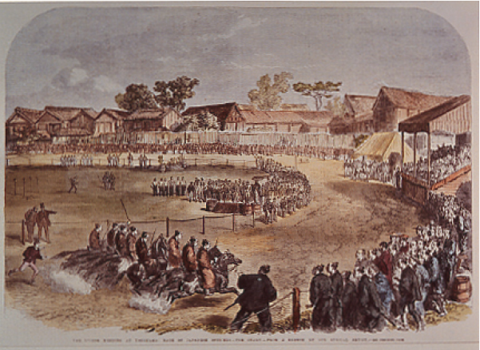

# ＜摇光＞纪念伊藤博文

**而日本的近代史是总有那么一些人能够让这个国家先走一步，而后步步占先。那些天才们总能将一切能够将国际形势、国力运用到极限，赶上工业化时代最后一班便车。**  

# 纪念伊藤博文

## 文/ 周圣哲（北京大学）

 

一个伟人，无论有怎样的国别、立场冲突，都还是伟人。

——且算是题记

大概是前几天，乔布斯死了，也许是个人太过落后于时代，也许是个人受腐朽的封建思想流毒太深，对于匠人之流实在很难有什么崇敬之情。为了纠正我的错误思想，昨天有人跟我说了一段话，全文如下：

如果没有乔布斯的图形界面技术，那么我们现在还在背DOS命令。 如果没有乔布斯的商用鼠标，那么现在我们还只能靠键盘输入.如果没有乔布斯定义了现代笔记本电脑，那么今天我们只能用台式。如果没有他哪来今天的改变世界的苹果手机iphone?

只是固执地以为，没有他，总有其他人，我们或许没有现在的iphone，不过顶多晚上那么几年，我们必定会有类似的产品。更何况于我而言iphone与几百块一个的手机实在没什么差别。

却总有那么一些惊才绝艳者，如果没有他，也许一个民族至少几个世纪的历史就必然会完全不同。

再过十几天就是伊藤博文的忌辰，不知道到时有几个人会记得。

前天，刚从威海回来，基本上除了打牌、吃东西，大部分时间基本上就花在对北洋水师的怀古上了。总的来说，最大的感触还是在于，伊藤博文的伟大。

现摘录，北洋海军左翼左营都司、“经远”舰驾驶二副陈京莹在甲午战前的家书如下：

敬禀者，前书因心绪荒（慌）乱，故启衅之事未尽详陈，兹复录而言之。日本觊觎高丽之心有年矣。兹值土匪作乱，高兵大败，将至王城，危在旦夕。高王请救兵于中国，中国兴兵靖难。日本乘此机会亦兴兵，名为保商，实为蚕食。现日兵有二万多，随带地图、浮桥等械，立炮台、设营垒，要中国五款。一曰高丽不准属中国；二曰要斧（釜）山；三曰要巨文岛；四曰要兵费二十五万；五曰韩城准日本屯兵。如不照所要，决定与战。且此番中堂奉上谕，亲临大阅海军，方奏北洋海军操练纯熟，大有成效，请奖等语，自应不能奏和，必请战。亦饬北洋海军及陆营预备军火水药候战，海军提督请战三次，各陆营统领亦屡次请战，但皇上以今年系皇太后六旬万寿，不欲动兵，屡谕以和为贵。故中堂先托俄国钦差调处，日本不听；后又托英德钦差，亦不听，必要以上五款。然此五款，系中国万不能从，恐后必战。以儿愚见，陆战中国可操八成必胜之权，盖中国兵多，且陆路能通，可陆续接济；但海战只操三成之权，盖日本战舰较多，中国只有北洋数舰可供海战，而南洋及各省差船，不特无操练，且船如玻璃也。况近年泰西军械，日异月新，愈出愈奇，灵捷猛烈，巧夺天功（工），不能一试。两军交战，必致两败；即胜者十不余三，若海战更有甚焉。所以近年英与俄、德与法，因旧衅两将开战，终不敢一试也。北洋员弁人等，明知时势，且想马江前车，均战战兢兢，然素受爵禄，莫能退避，惟备死而已。有家眷在威海者，将衣。

红色字体，为我想强调部分，不是他对海战的不看好，而是对于中国陆军实力的信心。请注意，他是一个中国军人，虽然是海军，对当时的陆军实力必然较之常人有更为深刻的认识，且不说淮军系统错综复杂的裙带关系，至少在威海各炮台协防的陆军至少有个直观的认识。

他得出的结论是中国的陆战有八成还是必胜，但在几乎独自主持和战大局的伊藤博文那里，显然不是如此认识。虽然大概伊藤也自认为是在赌国运，但再如何疯狂也不可能将举国运数压在两成的胜算上。

那么只可能有一个结论，伊藤博文对于当时北洋陆军的战斗力比陈京莹有更加深刻、具体的认识。试想现在的日本野田佳彦或者美国奥巴马对于中国陆军战力比一个服役十几年的中国军人更加了解，很可怕不是么？！说句不敬的话，我甚至怀疑那些搞政党政治的家伙都是否知道中国现在有几个大军区。再说，在那样一个时代，几乎没有可以帮助获得信息的现代技术，在甲午前后伊藤本人没有来过中国，只是从无数情报人员的报告当中获得信息并得出结论，这该是怎样一个让人无比畏惧的人物！整个人类历史煌煌几千年，能与之比肩者屈指可数而已。

曾经很多次感慨，就如一句很老套的话所说，天才从来都是论拨出的。比如，三国演义到了后几十回名臣猛将都死绝了，就剩下了姜维、钟会寥寥几人来凑凑数。又比如从早一点的佐久间象山、吉田松阴到伊藤博文，日本的明治维新时代，确实是英才辈出群星璀璨的时代，到了大正、昭和年间剩下的也就只有东条英机这种脑残了。

记得战后的某任首相岸信介曾经感慨，在那样一个时代，要是有伟人的话也许会不一样。之前读史的时候，隐隐约约觉得，伊藤博文之后，凑合一点把山县有朋也算上，之后，山本权兵卫似乎本来有那么点伟人的影子，只是运气实在差了点，首相任期内老能发生一些近似不可抗力导致的事件。

扯远了，只是想说，在那样一个时代的日本实在需要一个伊藤博文式的人物。

人们经常喜欢做的一件事是把伊藤博文和李鸿章放到一起进行对比。或许是因为他们都被称为过东方俾斯麦？

说实话，至少在我看来，伊藤博文与俾斯麦能称为一时瑜亮，李鸿章与俾斯麦就相差甚远了，李在接替曾文正公任直隶总督处理天津教案的时候，还似乎是很有头脑的。之后，大概是受天津教案成功的例子影响，似乎从来没有管过实力对比、没有战力统计、没有对国际形势的分析就迷信上了以夷制夷。

记得，大概是梁任公先生曾说，李鸿章只是一只脚迈入了新时代，实际上还是旧时代的人。就如后来他所选定的接班人袁世凯一般，在壬午、甲申之变当中表现得如此雄才大略的人会错误判断甲午年日本的战略意图，会在政府的统治根本还没有得到稳固的时候就脑残的闹着登基。

某次跟人吃饭闲谈的时候，曾经说，如果西方人的入侵是发生在明朝的话，应该情况会很多。至少，我们有锦衣卫。他稍有一愣，而后点头称是。

1891年俄国的西伯利亚大铁路从海参崴开始奠基修建，这必然预示着双头鹰对于远东统治的加强，英国人就需要找一个在远东挡子弹的把俄国人给堵回去。那么俄罗斯与正在飞速崛起的德国在巴尔干半岛上的天然矛盾就是必然引发矛盾，这样才能更好的抑制德国对于日不落帝国权威的挑战。

而在远东，能够用来抵御俄国的就只有中国与日本，中国太大，窄小的日本显然更容易控制。

伊藤博文的日本就主动成为了大英帝国在远东挡枪子的小兄弟，根据日本官方公布数字，甲午战争日本共支出军费200,475,508日元，甲午战争中日本募集的公债达11，680万日元，而各国认购的公债就达到966万4900英镑（日元与库平银比价为1．4：1）[1]

即，日本甲午战争的花费有一半是由国际金融资本支出的，显然，这些战争公债如果日本战败就将成为废纸，也就是说，在那些国际金融资本看来，甲午战争日本必胜。再回到之前的陈京莹家书，一个服役13年的中国军人认为中国陆军至少有八成胜算，即算没有了制海权也顶多是和局，凭什么这些大概都不知道中国有多少支部队的金融巨头们会那么确定日本这样一个小国能够取胜。当然，这些战争公债是分批次发行的，许多后续公债是在已经取得制海权、取得朝鲜战场胜利的情况下发行的。那么问题是在胜利曙光还不那么明显的时候，金融家们凭什么能够相信日本。

回到伊藤博文，当年伊藤博文任大藏少辅（财政部第二副部长）的时候，做的第一件事就是力排众议借100万英镑修建东京到横滨的铁路。从这件事上是否可见端倪。或者说，英国银行家们除了压制俄罗斯在远东的野心，对老旧中国的认识之外，支持日本的信心源自伊藤博文。或者说，伊藤让欧美银行家们确信，日本能够取胜。要知道，那就是在中法战争我们打垮了一个法国内阁的几年之后。很可怕的人不是么？！

日本人有一种我们也许永远也无法理解的天然危机感，这大概是那样一个资源匮乏、灾害频繁的自然条件所赋予的。正如1840年的鸦片战争，对于中国，对于中国人实际上没有多大影响，而对于一向将我视为天朝上国的日本确有着相当影响。在佐久间象山认识到鸦片战争的重大意义的时候，爱新觉罗家还在享受着万物升平，一天还是那么两晌的过着，就连曾、胡、左、李这帮中兴名臣都还是在两耳不闻窗外事地学术着经史子集。

记得是陈寅恪先生在谈到两次鸦片战争时说，从第一次鸦片战争到第二次鸦片战争是我们失落的二十年。

二十年间，偌大的国家只是依照着巨大的惯性在前进，几无改变。也确实显然，洪杨之乱（太平天国运动）对于大清的影响要远大于两次鸦片战争，藓疥之患与肘腋之变上位者们从来都是分得很清的。

年来读史，总有一个感觉中国的近代史就是被人推着走的。曾经看有人说，如果在甲午的时候我们有袁世凯的北洋六镇的话会如何如何，可问题是，没有甲午又怎么会有袁世凯的北洋六镇？没有庚子年哪有慈禧的新政，连最后给大清续命的几国出访回来搞的内阁都那么愚蠢与短视之极。

而日本的近代史是总有那么一些人能够让这个国家先走一步，而后步步占先。那些天才们总能将一切能够将国际形势、国力运用到极限，赶上工业化时代最后一班便车。

曾经YY的时候，常常在想，如果，在中国早有一个伊藤博文式的人物，如果，曾文正公、李文忠公能稍稍更有国际视野一点，我煌煌华夏文明之胄又怎会有如此耻辱动乱的百余年。

再过十几天就是伊藤博文的忌辰。一般来说，对于刺杀这种事，我一向是很反感的。因为，一般来说，刺杀者都近乎打了鸡血似的热血上涌，早已没有理智可言。比如说一战时的那个塞尔维亚刺杀者，比如说刺杀大久保利通的家伙，再比如说汪精卫。

但不得不说，不管是不是没有脑子的热血上涌，那次刺杀，刺杀得很精彩。把伊藤杀掉，于是日本就让那群脑残们折腾去吧。那个叫安重根的家伙，实在是朝鲜历史上少有能拿出台面的民族英雄。

当然，最后这段话是我站在敌人的立场上讲的。正如法国人再忿恨也得承认俾斯麦的天才，欧洲人再不满也得称赞萨拉丁的伟大一般，伊藤博文公，何其不朽。

[1] 〔日〕大藏大臣官房财政经济调查课编：战时财政经济参考资料第一辑，《日清日露两战役及世界大战に于け■我か战时财政》。 

（采编：应宁康；责编：陈锴）

 
