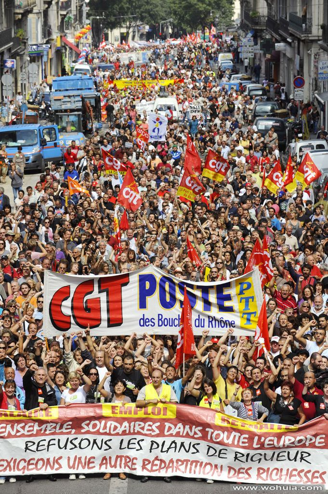
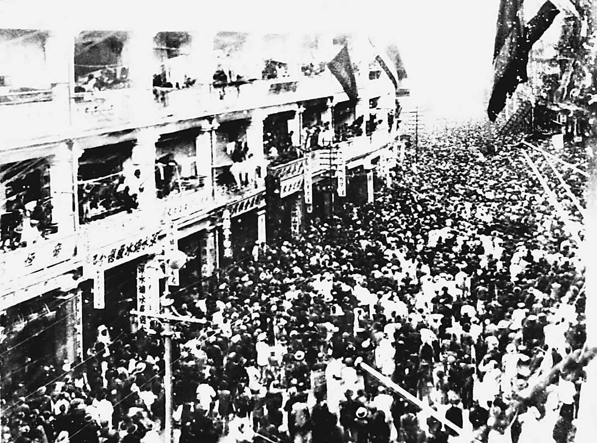
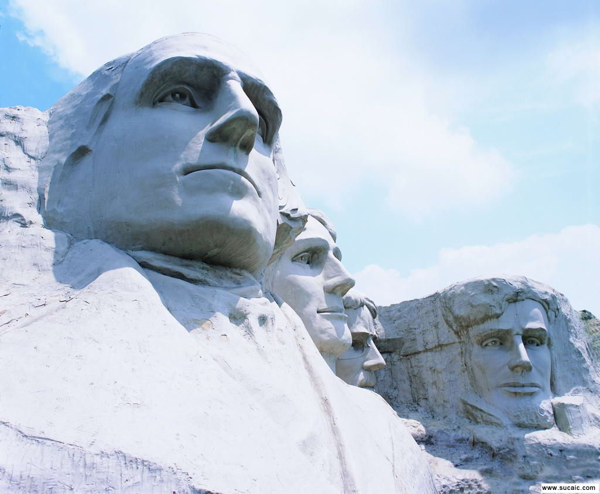

# ＜摇光＞罢工与罢税

**纳税人这个范围太大了，包括了所有阶级，所以很难有一个能使大家动起来的公共物品，在累进税制度的国家，纳税人本来就是倾向互相倾轧而不是跟政府博弈。穷人希望富人多缴税，自己吃白食，富人当然不情愿，所以想方设法避税，政府一般从中渔利，两头忽悠。社会各阶级都把争夺利益的焦点放在其他阶级上而不是政府身上。即便是单一税的国家，由于纳税人人数庞大，所以集体行动能力极低。** 

** **

# 

# 罢工罢税

## 文/李硕（Truft University)

据说Canada Post罢工了，按说Canada Post这种国营单位工资其实很高，比当地最低工资标准（大多数没学历没技术的劳工都拿最低工资）高出一倍，而他们的工作也毫无技术含量，送信有技术含量么？拿这么高工资还罢工，在纳税人眼里这就是无理取闹，非常遭人恨。

同样的事情也发生在美国，今年2月威斯康星州公立学校教师大罢工，抗议州长以及议会削减政府雇员工资和福利，与此同时民主党支持者大闹议会，掩护14名民主党籍参议员逃跑到临州来阻止决议的通过。难道是政府雇员工资低？事实上威州政府雇员平均工资比该州私人部门雇员高出30%，福利也高一大截。明明州政府要破产了，为什么还要闹？所谓“由俭入奢易，由奢入俭难。”吃到嘴的肉绝对没有吐出来的道理。换我我也要闹。假设我是政府雇员，州政府破产顶多让州长焦头烂额，完全影响不到我的福利，由于美国的种种法律限制，政府雇员是铁饭碗，几乎不可能被解雇。这就叫稳扎稳打，步步为营，我是政府雇员我只管吃，从我嘴里往外抠食，嘿嘿，我就闹。成功了就能争一分利，即便不成功我也不会被解雇。这是只赚不赔的买卖。 政府的钱是哪里来的？纳税人给的啊！即便政府发债券，利息也是用纳税人的赋税还的，而且政府的信用与政府的税收能力挂钩，说白了发债那点信用也来自纳税人。纳税人就是政府的大老板。政府是纳税人花钱雇来的保姆。如果你雇了一个保姆，工资贼高，干活不卖力，然后动不动就要求涨工资，不涨工资就闹，结果你家垃圾满地，你怎么办？答案很简单，解雇她！

  但是政府就是这样一个好吃懒做的保姆，实际上解雇起来却很难。因为集体的行动与个人行动的逻辑是完全不同的。 私人企业的资方是股东，相对于劳工是个小群体，比如一个2000个工人的工厂，股东可能只有10个人，他们的利益基本一致，而且沟通成本低，比较容易达成意见和采取集体行动，相对而言，2000个工人组成的劳方在博弈的过程中就会处于劣势，他们人数太多，不但不容易采取集体行动，群体的公共物品对于他们的incentive也很低。举个例子，如果董事会决定压低工人工资，只压低1块钱，那么每个月资方就会省下2000块，平均每股东能得200块。2000个工人每人只少得了1块钱，现实生活中很少有人为了1块钱去找麻烦，如果有某个员工因为这1块钱去找资方理论游说，即便他最后成功了，也仅仅拿回了1块钱，其他1999人全是搭便车的。也就是说，在博弈过程中，越小的集体越有优势，因为集体的公共物品分摊到每个人头上的更多，激励比较大，集体的沟通和行动成本也很低（当然，这种博弈不包括打群架）。正是由于劳方在博弈中处于劣势，所以劳方才想方设法的找到可以促成劳方集体行动的组织方法，这就是工会。不同于苦逼的欧洲，美国在1776年成立之前，人民的整体生活水平就高于英国，换句话说，高于欧洲任何国家，再换句话说，高于世界上任何国家。19世纪，美国工人的工资比欧洲就高多了，由于经济自由度高，旧等级制度利益集团比欧洲弱，就业机会也多，谋生不难。所以工人运动和社会主义运动掀不起波澜，同期的欧洲则是另一番景象，不然马克思恩格斯怎么都诞生在欧洲呢？巴黎公社也没发生在纽约不是？1835年，新泽西州出现要求限时十一小时工作的童工罢工。当时，现代意义的罢工，也是新事物，合法还是非法，也曾经是个问题。一开始，在美国工会组织罢工不仅不合法，还把这种“有组织破坏生产”看作是“有组织犯罪”。 1842年，马萨诸塞州高等法院的首席法官雷姆尔·萧，已经在“联邦诉亨特”一案中，作出了关于波士顿鞋业工会领导罢工的一个历史性裁决。法官依据“结社自由”，裁定工人有权组织工会，并且裁定，工会不能强迫工人罢工，却有权号召工人罢工。既然这次鞋业工会只是号召而不是强迫罢工，作为被告的工会组织者就是合法行为，应宣告其无罪。与欧洲相比，这极具美国特色，就是从一开始，就由独立中立的司法介入，根据宪法来给劳资冲突给出一个裁决。美国的工会发展了100多年，这其间大小罢工发生了不少，无产阶级劳方并不就是天然伟大光荣正确的，都是为了争这一口利，工会最后变成土共一样的欺压工人违法犯罪的黑社会组织也不是没有发生过，工会过于强大拖垮大企业甚至整个行业的例子也不是没有，比如美国的汽车行业被广泛的认为是被工会给搞垮了。 好在随着法律的逐渐健全，现在的劳资纠纷大部分都是通过法院和仲裁解决，大规模罢工很少发生，也是因为美国产业工人比例下降了。如今，仅仅成立工会也是劳方要挟资方的利器，工会挡是挡不住的，所以很多雇主就以种种好处来讨好劳工，以达到工会不进门的目的。目前为美国私人部门仅仅有7%的人参加了工会。 但是政府雇员和纳税人的劳资关系与工人和股东的情况很不同，工人是大集体，行动能力差，股东是小集体，行动能力强。工会的组织弥补了大集体行动能力差的劣势。虽然近年来美国政府越来越庞大，但是与全国或者是全州的纳税人比起来，政府仍然是小部分人组成的，是个小群体，而纳税人是个大群体。而政府雇员的老板是纳税人。本来政府就是小集体，然后美国居然有36%的政府雇员参加了工会，要知道私人部门工会的巅峰期不过33%的参加。也就是说，在博弈中，政府是处于优势，纳税人处于劣势，政府的公会有加强了政府雇员的行动能力，提高了政府的优势。所谓罢工，一定是要有组织的，大家一起来才叫罢工，你一个人不上班不叫罢工，叫旷工，老板可以直接解雇你。而且罢工还要有经费。1892年卡内基钢铁公司工人罢工，当时美国钢铁工人联合会（AA）就实力很强，积累了雄厚的运作资金，地方工会拥有146000美元的积蓄。当时工人工资很低，工会的积蓄足以把罢工坚持得旷日持久。那场罢工坚持了一百四十三天。到底还是资方妥协。也就是说，如果工会筹得足够的资金，罢工不会影响工人的生活，却会严重影响资方的生产。

  作为纳税人，我们可不可以像工人罢工一样罢税呢？很难。首先纳税人几乎包括了全国除了政府雇员的所有工作的人。纳税人作为一个集体，公共物品就是减税。但是纳税人这个范围太大了，包括了所有阶级，所以很难有一个能使大家动起来的公共物品，在累进税制度的国家，纳税人本来就是倾向互相倾轧而不是跟政府博弈。穷人希望富人多缴税，自己吃白食，富人当然不情愿，所以想方设法避税，政府一般从中渔利，两头忽悠。社会各阶级都把争夺利益的焦点放在其他阶级上而不是政府身上。即便是单一税的国家，由于纳税人人数庞大，所以集体行动能力极低。试想如果加1%的税，政府雇员的福利可能因此增长20%，两边incentive明显的就不成比例。而且纳税人似乎没有组成过像工会这样的组织，一般情况下没组织的话就没有集体行动。就好像没工会就不能有罢工一样。你一个人不交税那不叫罢税，那叫抗税，直接被警察逮起来。不但纳税人不能组织起来，政府雇员却能，而且他们提供的服务往往是垄断性的，对广大纳税人生活具有较大的影响。比如Canada Post罢工，很多邮件就会被耽误，所以很多纳税人宁可多交一点税来提高政府雇员的工资。 所以说，罢工容易，罢税难。 话说回来，所谓宪政，既是限政，宪政的发端，很多学者都追溯到英国的《大宪章》，其中非常重要的一条就是由贵族和教士组成的“大议会”对王家征税的否决权。13世纪的英国贵族就意识到了自己的权利和自由有必须依靠自己的财产，《大宪章》赋予了国王征税需通过大议会这一传统以法律的地位，而《大宪章》的签署则是英王约翰在贵族们的武力胁迫下才签署的。这不就是贵族们集体罢税的结果么？尽管13世纪英国贵族对王权的削弱远谈不上宪政的标准。因为英国贵族也是个小集团，所以在与国王博弈的过程中并没有什么劣势，通俗点说就是串通一气反水国王很easy。后来的几百年，贵族，城市工商业者与英王的斗争就没断过，不过议会对征税权的控制始终是第一要务，从来就没放过手。1629年，英王查理一世与议会失和，作为议会的召集人，他解散了议会，并且在没有议会的情况下统治了11年，因为这11年里没有什么战事，国库的负担并不重，1639年苏格兰叛乱，1640年查理一世不得不重新召开议会。这是为什么呢？差钱儿！ 之所以宪政会发生在英国这样的封建国家而不是中国这样的中央集权帝国，绝非巧合！封建的英国，国王的征税对象是贵族和城市工商业者，这些人算是人口的少数，而且有财力有武力，有共同利益，又是一个小集团，所以很容易就组织起有效的集体行动打破国王对权力的垄断。中国呢，好么，皇帝的征税对象直接就是是农民，人口基本上亿，每个人的力量又都很小，跟蚂蚁一样，根本无法阻止有效行动。从博弈的角度讲，忍受暴政苟活着是最佳策略，一旦反抗就是死。但是如果这样中国也应该“万世一系”才对。关键是最后暴政+天灾的共同作用会使农民苟活的成本变大，最后大到苟活都活不成，最后给农民造成“等死，死国可乎？”的局面。也就是说横竖都是死这种局面促成了农民的集体行动。农民起义这种把人逼上绝路才能产生的行动是没有建设性的，既然都堵上命了，就不在乎玩儿一票大的！什么限制王权？中国根本不会发生这档子事儿，所谓“光脚的不怕穿鞋的，皇帝轮流做，明年到我家。”英国贵族最开始限制王权并不是要推翻国王，只是为了保住自己的既得利益而已，人家都是穿鞋的人。于是王朝更迭周期律变成了某国的铁律。宪政却在遥远的欧洲萌发。

  话题回到美国，美国是世界上最接近理想的国度，这一得益于盎格鲁撒克逊人的优秀传统，二得益于优渥的自然条件和广阔的与旧大陆纷争隔绝的领土。但是自FDR总统以降，美国传统中崇尚自由和个人奋斗的精神正被人性中好吃懒做均贫富的思想所击败，政府越来越大，政府开支也越来越多，越来越多的人把自己的福祉托付给政府而不是自己的大脑和双手，希望政府来解决一切问题摆平一切困难。殊不知天下没有免费的午餐，选民把责任过多地推给政府，政府必会相应地扩大权力，而政府作为一个强有力的小集团，权力扩大之后的后果就是以权谋私，事实已经充分地证明了这一点。如果选民们赋予政府重新分配财富的权力，政府首先做的既不是讨好富人也不是接济穷人，而是肥了自己。里根总统说：“政府不是解决问题的方法，政府本身就是问题！” 政府罢工容易，选民罢税困难，看似荒谬的结果，在集体行动的逻辑下，却成了无可辩驳的事实。 弃黑保平安。

( 采编：尹桑；责编：陈轩)

  
