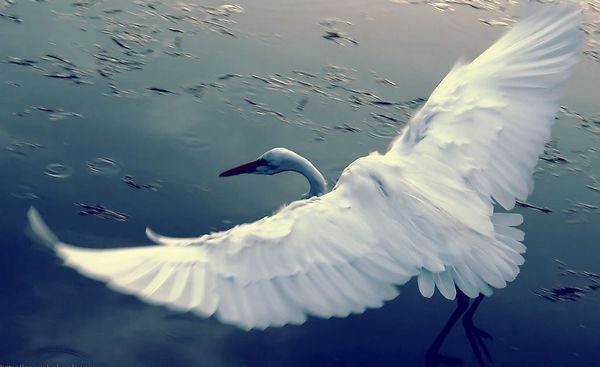

# ＜摇光＞美

**我希望有这样一种可能，有一天我们可以美感为基础来审视这个世界和我们自己。有一天，自我利益不再是人类唯一的根本共性，而代表柔性力量的美感可以对这个世界重新施魅。那时，连自我利益和欲望都变得有质量。我们用心的环视自己的日常生活，我们可以看到物品和话语背后的本质，我们会被一次又一次的感动。那时，美感会像《风之谷》里的娜乌西卡救世主一样，穿着蓝色大衣行走在金色草原之上。我们都是被她拯救的臣民。那时，我们终于又重新做回了健全的人。**  

# 美

## 文/王意扬（Brown University）

 

做为一个从小臭美的人，要我说，这个时代的问题就是没有了美感。

曾经在一个假期，我去当平面模特。我被人打扮，被人涂上深色眼影，在镜头面前摆弄自己的肢体和表情。摄影师们尤其喜欢我的腿，我也知道怎么做出相应的动作，以展现最完美的角度，最顺滑修长的肌肉线条，最不肥不腻的脂肪，和最玲珑的脚裸。

我符合了主流市场对于“美”的认知，我是美女经济里的既得利益者，所以我并不想造反，但这并不妨碍反形已现。把自己身体的一部分变成产品，凭众人消费，被赋予美女的标签。这个过程，如同其他职业行径一样，如同学习某种技能，凭公司消费，被赋予“清洁工”或“金融精英”的标签，都是市场的一部分。市场的逻辑，人挡杀人，佛挡杀佛。而美感做为一个最孱弱的对抗者，并没有被谋杀，而是被化上浓妆，穿上露沟的短裙，被摄影师呼来换去，只知为欲望服务。

然而，当我们只能对着肉欲横流的大胸垂涎三尺时，当我们只能对着茅台小蜜的生活方式妒火中烧时，连我们的欲望都不美了。要我说，欲望和美感本不应该对立。欲望本不应该奴役美感，欲望和美感应该相互牵制，甚至相生相依。

美感的被奴役造成了人的异化。

如果在浪漫主义诗人眼中，人的异化体现在人与自己的无邪童心之间的隔阂；如果在黑格尔眼中，人的异化体现在人和栖居于自身的世界精神之间的隔阂；如果在费尔巴哈眼中，人的异化体现在人和自我本性之间的隔阂；如果在马克思眼中，人的异化体现在人和自我能量之间的隔阂；那么，在爱美之人的眼里，人的异化体现在人和栖居于自身的天然美感之间的鸿沟。

所以我们把内心的童年拿出来制造了理想化的自然；所以我们把对融入世界精神的渴望拿出来展开了历史；所以我们把对于自己的崇拜拿出来造了神；所以我们把自己内心的力量拿出来造了君主和政体；所以我们把自己内心的美感拿出来，在这个市场经济的时代，制造了艺术产业和时尚产业。

我们不再相信自己天然的美感，而是把美感拿出来，放到了画廊里，放到了T台上，放到了拍卖行里变成了名贵画作。

我们去朝圣美感，把审美的标尺交给资本家，让他们把美感兑现成橱窗里的奢侈品，小资的生活情趣，以及杂志封面上被千锤百炼出来的诱人表情。我们生怕自己得不到美感，所以我们需要保证资本家可以将其转化成产品，然后我们可以急急消费。

我们去朝圣美感，把审美的权力交给权贵，让他们把美感转化成上层建筑里的精英意识，变成高尔夫球场上的谈笑风生，变成马利奥巴塔利餐厅的白松露。我们生怕自己离美丽太近，以贬低了美丽的价值，所以我们需要那些爬得更高的人给我们关于美丽的传说和光环，以激励我们爬得更高。

美感被金钱的符号和贵族的傲慢所奴役，被腐蚀成了短平快的锥子脸或诲测莫深的艺术史行话。美感要不被降格成了粗鄙的实用主义，要不被镂空成了华而不实的形式主义。

形式与内容反目成仇，过程与结果互相挑拨，主体与客体同床异梦，此岸与彼岸弩张剑拔。美感，就这样在冰火两重天的炼狱里被撕裂。被肢解的美感，以不能靠美学理论来恢复她的生机，以不能靠资本来编织她的皇帝新装。美需要在生命的一呼一息被感知。美感，还剩最后一口气，需要被心与灵的力量重新缝合在一起。

美有八万四千种姿态，我又岂敢用自己的钝拙一叶障目，但我仍有窥豹一斑的冲动。请原谅我在向美感致敬的过程中，对她的损毁。

美感是玫瑰花茎上的刺，它的存在没有任何矫情，只为了在自然界生存下去。可它那要保护自己的样子和它头上顶着的美艳之间的强烈对比，却赋予了人们世世代代无限的叹惋和诗意。

美感是成熟时变紫的葡萄。在还未成熟之时，它小心翼翼地藏在青色的皮肤之下，唯恐天上的鸟儿会看见自己，吃下还未发育的种子。在成熟之时，它满面涨紫，展现出诱人的光泽，好让鸟儿来吃下自己，以传播自己的种子。紫色，是那么的必要，是那么的充满食色之欲，却又是那么具有食色之美。

美感是英国酒吧里搭在扎啤桶龙头上的抹布。老板马上要打烊了，但他并没有挂出信息冗余的招牌“还有十分钟关门”，而是把刚刚用来擦干水壶的抹布顺手挂在扎啤龙头上。而经常到店里来的熟客心知肚明，默默喝完最后一口酒，自行离开。此时，抹布此时也有了自我表达的力量，发挥了它做为一块抹布的作用，又毫不害羞的展现它做为抹布的形象。

美感是穿梭于越南菜市场上的摩的。为了能够做更多的生意，为了每顿饭吃上新鲜的食材，越南人在自己摩的后面放上了满满的负担——无论这负担是乳猪，鸡鸭，轮胎，呼拉圈，还是门框。摩的告诉我们这是一个没有冰冻食品的世界，摩的上钢桶里的鱼还在翻滚；摩的告诉我们本地的市场生机勃勃，在人流车流沆瀣一气的马路上，摩的有着自己的交通规则，自信地快速行使着；摩的告诉我们他们的驾驶者对生活抱有巨大的热情和想象力，他们让这些物品以不可思议的数量和方式叠加在一起放在摩的上，令外来者瞠目结舌。这一切的表达和诉求都汇聚在了摩的奇异景象中。这景象中没有欺骗，还有一种当地自豪。这景象以最赤裸、最不怯场的方式展现在街道上，让现实的沉重都被美感超越。

美感也出现在更抽象的空间。美感是一句没有出现堆砌词藻，狡猾辩解的话语。美感是在万分之一秒间找到让人痛哭流涕的真相。

美感是对于理念和现实之间做优雅的处理。美感是知行合一。“说一套做一套”不具有美学价值。美感不会把生命从皮肤下釜底抽薪，不会为了一己之利——为了自己理论帝国的绝对正确性——而去忽略那些现实中细微的生机。没有了美感，思想就会变成教条。教条有深有浅，“学这个还是那个能挣钱”也可以和“世界是唯物的还是唯心的”分庭抗礼。教条是一个坚硬的槽，把意识和灵魂的流水逼入槽中，而丑陋就在其中绽放。

美感不光是形式和实用的水乳交融，也是过程与结果的胶漆相投。美感对时间抱有至高尊重。所以美从来不是现成品。所以美既是青春逼人的面孔，更是备受摧残的容颜。所以美是盛世盛开，也是含苞待放，更是从容的枯萎。美是“一代人只能干一代人的事”，也是“世界潮流浩浩荡荡”。美感很耐心，因为美感知道，在此岸和彼岸之间，炼狱不光必要，而且美。美感站在中间，站在非此非彼的边缘，垫着脚，姿态不卑不亢。

美感还是主体与客体的琴瑟和谐。因为有了主体的关爱，兰花现身为君子；因为有了客体对关爱的渴求，君子的影子里有兰花。因为有了平民的感动，马背上的Godiva夫人的裸体变得神圣不可侵犯——天，美感竟能够施魔，竟能降伏人性眼中的肉体。美感秉古今之所怀，充斥着有情感和神性的力量。

美感是被另一种质量的吸引，却对另一种质量发乎情止于礼，与之保持着窈窕的关系。任何自恋的、妙玉般顾影自怜的事物或艺术，都并没有那么美。任何把穷人的眼泪制成Andy Warhol般的后现代伎俩，让客体的一切血泪都沦落为的空泛形式，都没有那么美。如同最好的红酒，一定会用尽全力在你的口中绽放，唤起你所有的感知，而不是高傲地把精髓裹在红色液体里孤芳自赏，唯恐攀上舌苔后沾上口腔环境里的细菌——仿佛那些出世的清流，那些误以为轻微淡远是古琴最高境界的雅士，唯恐世界的混浊沾染了他们倨傲的羽毛。

啊！我对美还有多少赞叹，我对丑还有多少入骨的蔑视和恐惧！艳红苹果上的化学残留物，文字和视觉上的奇技淫巧，电动削笔刀，贫乏的短信交流，到此一游的欧洲文化旅，指甲盖上的精致文化。把书香当成脂粉气，把梵高的星空拿来当成装饰。扭捏作态的不仅是女人的肢体，更是意识形态。酒局上只能通过大醉获得的共鸣，没有经过帐帘包裹的荷尔蒙，还有贫瘠走样的打情骂俏。那些掐住大众喉咙的流行语。那些跪拜在商业标志下的小喽啰，拿着最新季款式的皮包欢欣鼓舞。那些防水油光书皮上的标准化微笑，那些字红画绿的剑桥爸爸哈佛女孩。那些沦为洗钱工具的字画瓷器，那些陈列着若干日内瓦表柜的单色客厅。

没有了美感的指引，这个世界的群像混乱不堪。被异化了的美感，导致了被异化的历史观和价值观。美感被市场、技术、和少数人夺取了话语权。我们一日不把被五花大绑的美感夺取回来，重新栽培在自己身上，我们一日便要替代美感被他们五花大绑。

我仍对美感寄予希望。我希望有这样一种可能，有一天我们可以美感为基础来审视这个世界和我们自己。有一天，自我利益不再是人类唯一的根本共性，而代表柔性力量的美感可以对这个世界重新施魅。那时，连自我利益和欲望都变得有质量。我们用心的环视自己的日常生活，我们可以看到物品和话语背后的本质，我们会被一次又一次的感动。那时，美感会像《风之谷》里的娜乌西卡救世主一样，穿着蓝色大衣行走在金色草原之上。我们都是被她拯救的臣民。那时，我们终于又重新做回了健全的人。

 

（采编：佛冉，责编：佛冉）

 
