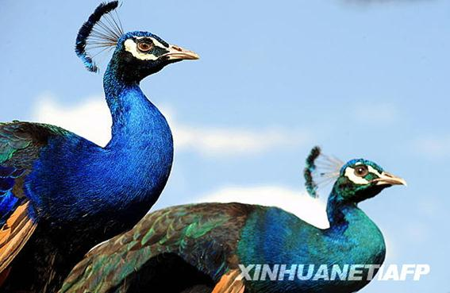
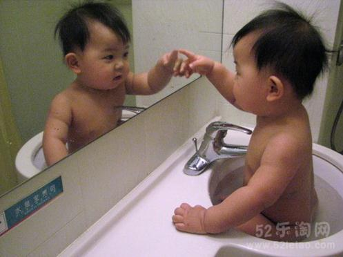

# ＜摇光＞自我暴露

**我决心，用一生的时间来塑造一个自己，而不是追逐另一个人的复制品；悦纳别人的赞美，但明白真正的快乐必须来自自己的内心；做令自己心灵歌唱的事，而不是大家都在做的事；接受任何样子、任何形象的自己，因为他们都是不可或缺的一部分；期待有人相伴，接受我们生来就是孤单；理解自己世俗的担忧和痛苦，但永不放弃自己的追求。**

### 

### 

# **自我暴露**

### 

## 文/ 曾琛（北京师范大学）

### 

### 

刚才在微博里发现了一位女士，名字旁边是亮闪闪的V字。于是心里泛起华丽的好奇嫉妒羡慕感觉，刨根究底地找到了认证介绍，xx公司xxxx主管，于是好奇嫉妒羡慕感觉变得更重，进而演变成对其私生活窥探的强烈欲望，于是乎遍历其微博、校内……直到看了她一篇日志，有了别的思绪，才能停止。 那篇文章她说到因为自己外型的改变，喜欢自己的人就完全不同了。以前她是短发的时候喜欢她的大多是女的，当她变成了长发之后，再没有女人喜欢她，男人慢慢多起来。其实她什么都没有变，从想法到着装，只是变了头发的长短而已，事情就变得不一样了。 所以说看女人不看外表都是扯淡，其实看男人不看外表也是扯淡。随着年龄和阅历的增长，我们学会了怎样装扮自己，却妄想吸引别人的是自己本真的灵魂。女孩说“即使我刚睡醒，什么也没打扮的时候，男朋友也是喜欢我的”，我相信。但我不保证如果你第一次出现在你男朋友面前就是这个样子，他还会喜欢你。 

 所以那些只追求外表和物质的人反而比较真实和开心吧，他们认清楚了生活的本来面目，并且乐观地作战。而剩下一些人，像我们，在日常生活里无处不显得矛盾。一方面希望在赤裸到只剩灵魂的尺度上，仍能有人赞赏自己；一方面又担心自己的躯壳会不如人家好看。得到别人肯定的欲望在体内活着，实在不如撕了痛快。可是要他死又谈何容易。 所以大多数女人还是沉浸在别人不经意的恭维之中，那话甜过蜜糖。“你的清纯打动了我”小姐，你敢露出你的纹身吗?“有范儿小姐”，你敢现在接你的Hello Kitty手机么？你是不是已经被别人的赞美架着脖子行走，花个三五分钟就能想明白。也有风格百变、混搭成瘾的可人儿，但那也不过是另外一种风格罢了。 于是我们告诉自己要活出个“自己”来么。自己，代表着不管装配什么服装、发型、彩妆，我们给人的感觉都是同一的。但这好像不太符合我们女性的生活哲学啊，世界创造这么多妆容和装束，不就是为了女人像花蝴蝶一样想变就变吗。尤其是当你知道，“自己”对这个世界其实毫无价值，因为世界需要的也是不断变化的你的时候，你还想要它吗？ 我想我们之所以对“自己”还有渴求，是源于对失去现有生命财产的恐惧。谁都跑不过时间，我们怕丈夫不再爱我们，怕我们走在寻求帮助不会再有好心人，怕给好姑娘的免费午餐不再轮到我。我们需要寻求一种方式得到永久的安全感，这也许才是“自己”的意义。 总是恨没有人真正了解自己，甚至没有人愿意来了解自己。如果一个人全部了解你，那你俩恐怕就是一样的了。世界不需要重复，连叶子都有不同的纹路。了解你其实对你是无意义的啊亲，你只是想要人来保护你吧。你怕没有这样的人，所以你找“自己”来保护你自己。 那这个自己，是什么样的呢。是现在长发翩翩偶尔能得到异性几句赞美的你，还是中学时代实在令人没有办法的大胖子。你敢让陌生人看你学生证上的照片吗？你会在成功人士面前没有自卑感吗？你会站在高高在上的位置时有害怕被友人提起的囧事吗？ 有人选择诚惶诚恐地活一辈子，怀揣着自己的秘密过一生，甚至伪造历史，只为成就当下的辉煌。大多数人都这样，于是就能沉浸在相对弱者的优越感、相对强者的优越感之间，过完充满比较和追逐的充实的一生。比较是动物本能啊，我知道我无法战胜它。只是人生的路定还有其他走法，我希望我走得不那么依赖于外人的目光和口舌。 在我选择的林荫小道上，曾走过一些可敬的前辈，他们的结局或幸福或不幸，但我想他们一定对自己的选择不曾后悔。我决心，用一生的时间来塑造一个自己，而不是追逐另一个人的复制品；悦纳别人的赞美，但明白真正的快乐必须来自自己的内心；做令自己心灵歌唱的事，而不是大家都在做的事；接受任何样子、任何形象的自己，因为他们都是不可或缺的一部分；期待有人相伴，接受我们生来就是孤单；理解自己世俗的担忧和痛苦，但永不放弃自己的追求。 

 与其把时光当成麻醉剂，不如戳戳自己，练成刀枪不入。若干年后啊，我躺椅边的小外孙女能听我说，你外婆，美过也丑过，哭过也笑过，成功过也失败过。但从生到死，一直很真。 

### 

### 

（采编：陈锴；责编：陈锴）

### 
