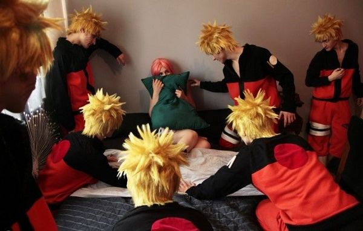

# ＜摇光＞自由的代价：走向虚无

**但若问我们，是否愿意为追求自由献出生命？献出青春？献出世俗眼中的优秀成功？我们普遍会选择沉默。谭嗣同陈天华汪兆铭周树人都愿意为了自由献出生命。我们嘲笑他们，在内心深处鄙夷他们，或者认为完全没有必要。我们既骂这个国家不好，也没有想过切实的改变它。当然，我们有榜样，我们要的是人人有车有房能够普选，我们希望一场改天换地的变化，但是前提是，我们得要有车有房。**  

# 自由的代价：走向虚无

## 文/张亮（北京大学）

 

很多年前，一间70年代的筒子楼，里间住着一对夫妇，外面住着一个我，每天晚上，我都会撑起身体，穿过隔板，进入里间的厕所，某一天晚上，烂醉的我突然被一根床上伸出来的大腿绊倒，我栽倒的一瞬间，酒醒了，模糊中那两人正躺在床上，一时间很寂静，大家默不作声。我意识到我也许搅坏了一场春梦。第二天我惶恐地打电话，向那男生道歉，想确认这条腿属于他还是她的女朋友，但他告诉我，昨天晚上他根本没在家，而是在两百公里以外的一个地方。

三天后，他们分手了。我从此没再见过他们。

因为有过这种遭遇，今天的许多人世间的八卦或者扯淡对我就丝毫没有杀伤力。比如昨天你如果被一个男人强骗到床上，而你的男朋友还在千里之外的某个小岛辛辛苦苦为你写程序，赚一起去马尔代夫渡蜜月的车马费；又比如而那个把你骗到床上的男人竟然是你的老师，他的正牌女朋友竟然是你的师妹，而你的师妹竟然因此抢走了你出国留学的名额；再比如，你辛辛苦苦追到一个女朋友，突然之间发现，这个女人不是你理想中的，于是你背着她出去跟人打了一炮，而这个和你打炮的人竟然是你女朋友最好的闺蜜。等你约好最后在一起的前一天，你发现，你的炮友又跟另一个男人好上了。

这一切，都不会让我感到惊讶。在一个欲望主导的世界里，这一切理应是常态，虽然我的一个朋友告诉我，假如他跟一个女生上了床，一定会娶她。我也不怀好意地揶揄，那还得看别人愿意不愿意。

王小波曾经说。秩序在混沌中存在，智慧在混沌中存在，但是今天看来，我们虽然混沌了，却还是没有秩序，遑论智慧。

一切坚固或者永恒之物正在离我们远去。

一切虚无与欺骗正在包围我们的生活。

我们正在失去价值判断的能力。

尼采比我们提前一个多世纪看到了我们的今天。他说，报纸取代了现代资产阶级生活中的祷告，这意味着忙乱、廉价和短暂之物取代了他日常生活中沉积下来的永恒之物。后来，电视又取代了报纸，今天，网络又取代了电视。缺乏教育的直接后果，我们见到标有“启蒙”或者“文化”标签的东西就想去追，满足饥渴，却分不清楚精华与糟粕。我们今天一个小时内在网络上认识的人，也许远远超过过去一年。认识的越多，越感到惶恐，翻翻你们的QQ聊天，还有站内信，有多少男盗女娼，有多少调情暧昧，有多少不堪入目？很多年后，当我们坐在电脑面前，用QQ、人人同时跟一堆人打情骂俏，看着QQ上密密麻麻的人头攒动，我们一定不会想到，很多年前，当网络刚刚普及，人们排在宿舍里仅有的一台电脑面前，等待网聊，有如肯德基刚刚登陆中国时门口一公里的长队，虔敬肃穆。很多年后，当我们为电视上《非诚勿扰》里的男嘉宾女嘉宾唏嘘不已，转瞬间却发现他或者她其实只是一个托儿，我们不会想到，很多年前，我们的父辈花两毛钱去买张电影票连个手都不会牵，但一牵手就是情定终生。

诚然，今天，我们比许多过去的人享有更多的自由，占有更多的资源，但我们已经失去了价值感。什么是善？什么是恶?活着究竟意味着什么？如果你爱一个人，是否值得为他舍弃你既有之物？如果你追求自由，是否应该为自由与现实妥协？

每当我翻看我外公的遗物，就会想起他那一代。他33岁丧妻，因为三年自然灾害。身为一个国家干部，上世纪50年代的大学生，从此一个人把我妈妈带大，未曾再娶。

一个原本陌生的人与另一个原本陌生的人相处，激情或者欲望也许能点亮一时，却往往让我们误以为月亮就是太阳。

真正发出光和热，指引我们生活给予我们力量的责任与信仰，正在成为遥远的一千零一夜，阿拉丁的神灯，阿里巴巴的芝麻开门。是的，我们貌似也有信仰，比如拜物教；我们也信神，比如韩寒。

我们也有我们的旗帜，我们爱生活爱凡客爱韩寒，不因为他爱自由，而因为爱自由成了WINNER，只因为他一个声音数十万个回复，他博客4亿多流量，他可以边泡妞边赛车边凡客边写文边骂政府，他从不攻击省部级以上单位，他懂得适时删帖，懂得跟文坛老前辈骂娘时给贴个网址让几十万粉丝帮着骂。总之，他懂得把握机会，他有惊无险，他是WINNER。我们爱的是WINNER，爱的是因自由之名的WINNER，不是爱自由本身。谭嗣同陈天华周树人在今天都将是LOSER，是殉道者，不值得我们模仿。生命苦短，及时行乐，前人栽树，后人乘凉，我们不爱LOSER。

我们只爱WINNER。

这就是我们的信仰。

但若问我们，是否愿意为追求自由献出生命？献出青春？献出世俗眼中的优秀成功？我们普遍会选择沉默。谭嗣同陈天华汪兆铭周树人都愿意为了自由献出生命。我们嘲笑他们，在内心深处鄙夷他们，或者认为完全没有必要。我们既骂这个国家不好，也没有想过切实的改变它。当然，我们有榜样，我们要的是人人有车有房能够普选，我们希望一场改天换地的变化，但是前提是，我们得要有车有房。

我们一边骂一边等待，其实我们不贪心，我们要的只是舒适的物质。如果信仰不导向舒适，我们不需要信仰。

我们也普遍不看书，至少我们中的大部分人是这样，但我们懂的很多，从埃及动乱到突尼斯政变，我们有网络。我们习惯于成为网民，在网上听到些风吹草动，蛛丝马迹，我们就开始联想，有的是联想政治，有的是联想女人，大部分联想都是子虚乌有。但是我们习惯于贩卖立场。立场给了我们骂娘的动力，我们可以不懂什么叫自由，什么叫民主，什么叫集权主义，什么叫社群主义，保守主义，什么又叫新自由主义，但我们有网络，我们每天都有新的立场，于是我们互相骂娘，我们的生活是充气娃娃。我们不追求真相，我们只追求骂娘，一时之痛快。

我们显然也听音乐，我们这代人迷恋靡靡之音到了骇人听闻的程度。流行音乐和摇滚音乐作为性与爱的发泄，主宰着我们的精神生活，让所有对意义的思考得以被逃避。

与网络中疯狂参与政治相反，现实中我们对政治避之唯恐不及，而普遍渴望性。我们觉得自己势单力薄，对集体生活影响甚微或者根本没有影响。但是我们在取代了政治的行政管理中过得很惬意。大学里普遍存在的学生官僚和学生，我们一边骂他们，一边不痛不痒。

我们在追求个人主义和避世的过程中，家庭的衰落成为必然。和上一代不同，许多学生来自单亲家庭，这些学生今后离婚的几率会比一般家庭高。在这个幅员辽阔的国度里，一旦进入大学，就意味着父母原有家庭的日渐疏远——没有人知道自己将会漂泊何处，而今后的人生目标和价值趣味，将和父母渐行渐远。然而，除了北京、上海、广州等大城市，尽管少部分人喊出了“逃离北上广”，但我们大部分人认为没有适合发展的地方，我们接受这种社会的安排：用一生打工，然后用一生买一套房。我们不愿意回到家乡，饿死也不回，因为丢人，我们习惯了中产阶级的价值标准。我们大骂这个社会，竭力适应社会主流。但当我们越发主流地生活，却进一步加深了无根感。我们大多怀念故土，但大多只是作为一种历史记忆的珍藏，甚至希望通过寻找相同地域的异性伴侣的方式，来获得地缘与血缘的固着。现实中，这样的企图也往往失败。我们没有可以扎根之处，天知道我们会去往哪里。如果某人恰好在什么地方找了份工作，或者是情趣有了变化，都可以让他摆脱以往的一切联系。因此，我们对过去和周围人的感情投入必然是有限的，暧昧成为我们的常态。昨天还在热恋的情侣，今天或者明天就可能仅仅因为异地劈腿出国一套房劳燕分飞。

我们没有安全感。

因此，我们更多习惯沉浸在对未成年时代的怀念中，我们怀念80年代童年时代的小生活，变形金刚、圣斗士、机器猫、不干胶贴画、街机游戏……那是我们最沉浸投入真挚感情的年纪。

身为年轻人，我们自己决定一切，决定是否恋爱，是否结婚，是否性生活混乱，决定是否离开家乡，是否选择一样工作。我们可以自由选择做街头混混还是勤学人士。没有必然，没有道德，一切选择都可以理解。我们逃避了必然性，选择了自由。却没有因此插上轻松的翅膀，反而，被世界上最沉重的虚无压迫。

我想起人类洪荒的初民时代，亚当一个人站在伊甸园的山岗上眺望这片土地，这一切都是它的，又都不是它的。在无所傍依的孤独里，这一切都没有意义。

我们是否能重新回到伊甸园，我们是否能重新回到秩序，我们是否能沐浴着智慧之光快乐的生活？我不知道，我只知道，我所处的这个时代，正在不可避免的走向虚无。

 原文链接：http://blog.renren.com/blog/305460099/800167708  

（采编：楼杭丹；责编：应鹏华）

 
