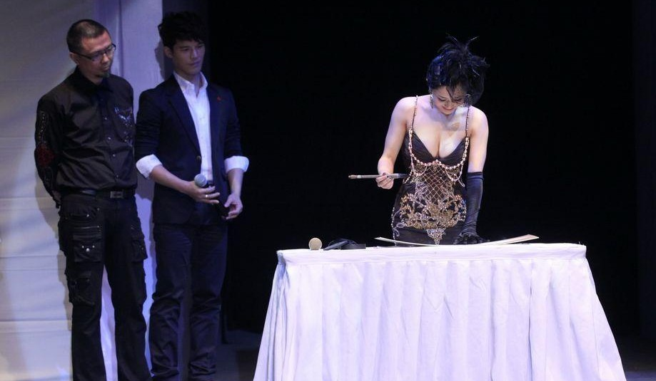
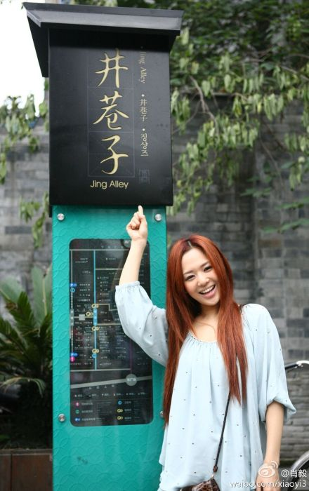

# ＜摇光＞苍井空经济学（作者版）

**在过去的几十年里，偶像的定义已经发生了戏剧性的变化。从高大全的英雄人物，变成了那种唱片大卖或者获奖无数的明星，接下来，主流之外的人物，也成了偶像，比如艾未未和左小祖咒，又或者如苍井空。当然，不论哪个年代，人们都会在心里按自己的需要制定偶像，并过滤掉不喜欢的一面。**  

# 苍井空经济学（作者版）

## 文/谢梦遥（中国政法大学）

 

（最终出刊的报道，是编辑王晓玲、执行主编商思林编过的，结构上有很多调整。事实上，这稿子共大改过四次。但作为每一个写作者，肯定最中意的，还是自己的版本。）

当苍井空走上台时，全场已沸腾了。Hold不住的，甚至包括了坐在最前排那些身家亿万的资本界大佬们。要知道，之前韩寒、王珞丹等登场时，这些大佬们安安稳稳地坐定在椅子上。

这是2012年1月15日，凡客年会的现场。过去一年，凡客受到了很多质疑，而这场主题为挑战与信心的年会，是一次提振士气，彰显实力的时机。

整个下午，苍井空都在休息室里戴着小围裙练毛笔字。她感到很紧张。之前在中国也参加过一些商展、音乐节，但在这样一个汇聚了百余媒体与诸多资本精英的重大场合登场，对她来说，还是第一次。

按着事先约定的流程，苍井空向大家问好，然后表演了书法。但到了提问环节，意想不到的场面出现了。

在台下此起彼伏的起哄声中，凡客的CEO陈年走上前来，动作有点拘谨地抱了她一下。接下来，投资人薛蛮子、雷军、杨东，也一一主动上前与她拥抱。

苍井空一下子蒙了。除了陈年，她不知道这几位满脸笑容的人是谁。当然，她也不知道，其实在现场，想与她亲密接触的人多了去了，甚至包括了几位传媒界的老总级人物。他们私下找到凡客方面，要求跟苍井空合影，作为私人收藏。

除了“苍老师”、“人民艺术家”这些半开玩笑的称谓，在正式场合被介绍时，苍井空的前缀往往是“日本艺人”。事实上，相对于大多数的人的共识，这个称呼语义含混、故作端正。她是一名AV女优。

一股苍井空热，正在中国这个传统上对性讳莫如深的国度里，迅速升温。从2011年4月底的南昌车展，到9月的泰山MAO国际音乐节，她的每一次出场，都几乎令场面失控。

2011年4月底，苍井空出现在南昌车展。南昌车展的规模和北京、上海两大国际车展无法比拟，为吸引观众，这个江西的地方车展以香车美女为主题，2010年时就邀请了因公布“性爱视频”出名的车模兽兽。但主办方显然错误地把苍井空和兽兽放在了同一个量级上面，苍井空的出现，吸引了主办方完全预想不到的约20万人进场，将主席台前后包围。不断涌进的人潮，把后台的音响和前台的花盆一并踩得稀巴烂，甚至舞台都摇晃起来。为了避免发生踩踏事件，苍井空只在台上留了3分钟，即被主办方匆匆带离。主办方负责人沮丧地抱怨，“最郁闷的是我们组委会，几十万请苍井空来，原本是三天的活动，结果只小露一脸。”

三个月后，泰山音乐节吸取前车之鉴，事前对苍井空的行程严格保密，没有发生挤爆体育场的惊险。这个首次举办的音乐节因此名声大噪，在国内众多音乐节中脱颖而出。承办方负责人对此表示满意，之后许多业内同行对他说，就是因为苍井空，才对泰山音乐节格外关注。

**传输带上的寿司**

相对于苍井空在中国缔造的神奇效应，她在自己的国家，反而并没有享受到万人空巷的待遇。在日本，她也有着固定的粉丝，但正统商业领域的大门对她关闭着，也很少见到主流媒体对她的长篇报道。

日本作家兼AV评论家中村淳彦对苍井空中国走红感到震惊，“AV女优在日本就只是AV女优，跨出这个领域她们就什么都没有了。”

2010年热播的大河剧《龙马传》中，曾计划让AV女优Mihiro出演，立即遭到社会舆论的强烈批评，因为大河剧是日本NHK放送协会每年重点拍摄的历史剧，可供全家人一起观赏。

AV拍摄的合法性在日本也一直存在争议。《卖春防止法》对卖春的定义是“得到报酬，接受约束，和不特定的人进行性交。” 理论上说，AV事务所的经营也存在法律风险，确实曾有AV事务所被查封，但是还没有女优被抓的先例。

日本的AV产业从1980年代兴起，初期的女性从事者，大多是迫于生计，后来有很多女孩自愿加入，苍井空即使其中之一。2002年出道的苍井空很快成为最具人气的女优之一，连续在2003年及2004年蝉连日本《VideoBoy》杂志年度AV女优第一名。一般女优的工作时间只有短短几年，但苍井空却成为长青树。

这的确是一个传奇，“女优的存在就等于一枚寿司，一旦在传输带上搁久了，便只落得扔进垃圾桶的命运。”这是活跃于上世纪90年代的著名AV女优小室友里的名言。

最近几年，苍井空拍片逐渐减少，年均只有五六部。上一部的面市时间，已经是2011年的8月，她自己从未宣布不再出演。

即使是出名的女优，在日本仍然是边缘化角色。苍井空与日本偶像演员赤西仁传出绯闻，这令她受到很多舆论的攻击指责 ；被通知参与电视剧拍摄，也因身份敏感，被广告商强制要求撤下。

中村淳彦认为，中国和韩国等没有AV产业的亚洲国家也需求强劲。他的代表作《没有名字的女人们》，主要内容由对500位以上的AV女优的采访构成，从2002年到2009年共出版4册，去年出版了精选集。2010年，佐藤寿保导演的同名电影在第33届莫斯科国际电影节正式上映。

可惜AV碟片不可能通过正式渠道出口，长期关注AV产业特别是女优命运的中村感到遗憾，中国巨大的市场需求对日本AV产业没有任何帮助。

于是通过网络上破解的AV视频，无数中国人认识了AV女星，在很长一段时间里，这些名字不便公开讨论，更不会出现在新闻中，它们静静的藏身于在硬盘的角落里。

对于力求转型的苍井空，舒淇或者是她的模板。但在日本，AV女优的上升空间无疑是十分有限。

当她把目光转向亚洲其他地区市，苍井空发现，身上的标签同样给她带来麻烦。2009年5月，她赴韩安排在韩国的宣传活动，被当地的《中央日报》指责“我们必须警惕代表日本低级偶像文化的艺人为了金钱访问韩国”。

镜头切换到中国，苍井空已经红得滚烫。她站在万人中央，被亿万双眼睛热切注。

**德艺双馨**

一个无需质疑的事实是，百度员工用百度搜索苍井空的次数，远远高于用于搜索他们的掌门人李彦宏。但在诸多知名的AV女优中，只有苍井空在中国完成了从AV到明星的转型。而且这是一个很难复制的成功。

几年前苍井空在中国还谈不上什么影响力，她曾出席过上海的演出活动，并和一位摄影师合作推出T恤，但参与者寥寥。2009年，参演的香港电影《复仇者之死》，作为香港亚洲国际电影节2010开幕电影，同样没有得到大陆观众的太多关注。

直到2010年4月11日的夜晚，命运轮盘悄然转动。

这晚，苍井空打开推特，发现一个月前开通的帐号，粉丝数终于爬到2000。她想什么时候能够上一万啊，并开玩笑式地在把这个想法写了上去。

奇迹出现了。突然之间，页面开始不停地出现提示，无数的人在转发、回复。有些是她看不懂的中文，有些是英文，还有些不大通顺的日语。通过翻译软件，她看到一则留言说，一万那不是很容易的事儿嘛，应该以十万为目标。她明白了，这些人在帮她实现愿望。

现在已经无法考证，究竟是谁最早发现苍井空的推特。但那一夜，无数中国网友加入了这场狂欢。 苍井空用翻译软件回复，“谢谢我的球迷”。这个错误反而让中国球迷沸腾了。和菜头、安替、连岳等著名ID，也纷纷加入进来，号召大家一同跟随。这些有着影响力的ID，更加令传播的速度加剧，几小时后，苍井空的推特粉丝破万。几天之后达到4万。

在中文推特界，这已经是极高的数字，因为登录推特需要用翻墙软件。一些网络意见领袖认为是苍井空促成了翻墙技术的普及，让国人有机会进入未经过滤的世界。于是，他们不再忌惮热烈而善意地谈论苍井空。

翻墙和关注苍井空在当时是一种被压抑情绪的释放。从2009年开始，中国政府加强网络监管，从年初开始的网络反低俗专项行动，以其后工信部下发《关于计算机预装绿色上网过滤软件的通知》，关闭BT中国网站，再到央视对某些含有低俗内容的网站的曝光，大力度的整治行动中不难看出政府整顿互联网的决心。

但在这个夜晚，被禁锢的欲望与被封锁的言说一一打开，显示出了对反低俗运动的强劲的反作用力。苍井空无意中制造了一场狂欢，那一夜她成了自由的象征。

济南的在校大学生刘佳，在苍井空之夜关注了这个AV女优，如果事情到此为止，她或许很快就会忘记这个名字。

3天之后，玉树地震了。苍井空在电视上看到了这个消息。她不知道玉树的地理位置，但几天来与中国网友的互动，让她决定给灾区捐款，通过出售自己的写真壁纸的方式募集善款。

请求网友支援玉树地震灾区的呼吁，出现在苍井空的推特和官方博客上，没有如其他博文一样翻译成中文。苍井空强调，因为海外的信用卡可能无法使用，所以这次慈善活动主要是面向日本人。

2010年6月初，她募到的10万多日元，以“苍井空”的名义捐到了日本红十字会，然后再转到中国红十字会。“德艺双馨”从这时起成为网友加诸在苍井空身上的另一个标签。这个词终于有了新意，在此之前，它更多的是出现在郭德纲的相声里，当包袱用。

刘佳从这时喜欢上苍井空。苍井空之夜的打酱油转为当下的感动。刘佳注意到，苍井空的善举，还换来了审查甚为严苛的百度贴吧的宽容。百度几乎无法容忍任何有歧义的贴吧名称，例如在生肖吧中，“鸡吧”是不存在的。“之前百度有过苍井空吧，但一直被删除。直到玉树捐款事件之后，苍井空吧才得以存活下来。”

敏感的营销专家们也开始注意到苍井空。在捐款后不久，“德艺双馨”的苍井空亲临中国，出席网游公司久游网的勇士发布会。

有人批评这是庸俗的炒作，但他们的声音被更多的欢呼湮没。当苍井空和另外两位网络红人——芙蓉姐姐和罗玉凤一同出现时，人们纷纷表达了对苍井空的喜爱，把嘲笑留给后两者。活动之后，罗玉凤恼羞成怒地攻击苍井空。苍井空没有加入骂战，反而是网友杜撰的答复广为流传：“我脱光衣服躺在镜头前，是为了生存。而你衣冠楚楚的站在镜头前，却只是为了私欲和欺骗。”

**进驻微博**

为了能更方便地与中国网友交流，27岁生日那天，苍井空开通了新浪微博。这天2010年的11月11日。苍井空的微博成为所有光棍们的礼物。

由于没有翻墙的限制，微博粉丝数量呈几何级数爆炸增长，短短6个小时后轻松超过她Twitter几个月来的12.9万人。开通首日，这个拥有超过22万粉丝的日本女孩，刷新了新浪微博粉丝单日增长量记录。

落地生根的微博，拉近了苍井空与国人的距离。人们没有想到，原来这么容易，就可以和原来藏在硬盘里的那个姑娘聊点什么。她随便发一句话，就有成千上万的转发和回复。一张吃紫菜卷寿司的照片，被转发9600多次，12500个回复。一句“洗面奶挤在牙刷上了”，被转发五千多次，一万多个回复。

微博最能反映一个人的真实一面。在日本AV界，苍井空就以工作认真、性格开朗，在导演和制片人中备受欢迎。苍井空参加凡客诚品年会时，提前几个小时就来到休息室，扎上自己带来的小围裙，反复练习书法。

她不会忘记在中国的传统节日送上祝福，甚至她还会在高考的时候为考生加油。她不吝在微博展示她对毛笔字的热爱。应网友要求，她曾写过“不挂科”、“给力”、“一师是个好学校”等流行语，晾到微博上，写得已算相当漂亮。她读小学时即学过书法，但字体上的进步，要归功于她的勤练，即使在录音室录音的间隔，她都会拿出来工具写几笔。

她也很快意识到了自己和商业的关系。“当我在新浪微博中上传自己喝红牛补充能量的照片，或者上传去听演唱会的照片后，大家会问我这是不是广告。所以在那之后我不会轻易上传一些和商品有关的照片。”

进驻微博，苍井空就进驻了人们的日常生活，她的名字不再是禁忌，可以被更公开和坦然地谈论，由网上开始，向现实扩散。

大连市公安局西岗分局的官方微博开通后，只关注了她一个人。复旦大学某选区选举人大代表时，不少学生在选票里填上苍井空的名字。民谣歌手李志、陕西的说唱乐队黑撒、香港摇滚歌手的李嘉强，风格迥异，但都把苍井空写入了自己的歌中。

日本infobridge公司去年5月发表的中国市场调查显示，“中国人最憧憬的日本人”中，苍井空和山口百惠并列第四，前面是酒井法子、木村拓哉和滨崎步。

“我比较讨厌那种装腔作势的写微博”。苍井空说。于是“真诚，不装”成为粉丝心中苍井空的又一个标签。“总是有人问我对男人的看法？现在我可以告诉你，见过很多类型的男人之后，最终觉得，男人最大的特点是单纯。即便年纪大了，还是像小孩子的感觉。” 这句苍井空的话，一度成了传播率极高的名言。

很难说苍井空不是在有意经营着这个“自媒体”，从她的自传《坦白说苍井空》中（目前没有中文版本），可以看到另一个相对陌生的她。

在自传中，苍井空反复提到的一个词是“野心”：“我是一个成长在普通家庭，特别普通的幸福的女孩子。可不知怎么，‘野心’这个东西始终在我心里的某个地方蠢蠢欲动。而我野心的表现形式有点特殊，就是做爱给人看。”

那一年，在决定和AV事务所签约时，她对母亲说，“‘刚开始可能是拍AV，但我决不会就此满足。’我拼命地，一遍又一遍地解释。为了说服母亲，为了减轻母亲的难过，为了安慰母亲，也为了说给自己听。”

当时已经从大专毕业，并且拿到保育师资格的苍井空最终说服了母亲。

**新的偶像**

这本来不是一个好选择。日本目前150家左右AV事务所平均每家拥有50位女优，女优总人数在7-8千人，而其中像苍井空这样能够独立拍片的只有1-2％。8成以上的女优仍然需要剧情的包装或是集体合作才能成立，报酬更是少的可怜，平均月薪只有15-20万日元，相当于日本普通大学毕业生的最低工资。

更糟的是，AV的整体社会需求也在下降。随着互联网的普及，AV业最主要收入来源的DVD销量骤减，营业额和制作费用也因之大幅下降，只有2000年-2002年最高峰时期的1/3。“日本的AV行业正走向衰落。”中村淳彦对《财经天下》说，“女优除了年轻漂亮，一无所有”。

日本社会倒是对AV越来越宽容。1990年代，AV行业是为了生存“不想做但不得不做”的职业。随着小泉时代推行的市场万能主义导致贫富差距加大，日本社会出现了比AV女优更劣势的人群，没有正式工作，没有生活保障，生活在社会的最底层，这群人等于是为AV女优“垫了底”。

但中村直到现在仍然不赞同也不理解自愿成为AV女优的女孩子们的想法，“她们明明可以不用做AV过上正常生活的”。

也许原因正是在于，女孩们不愿意过“正常的生活”了，中村先生一边说一边摇头，“我觉得这社会简直是越来越奇怪了”。

他也看不懂苍井空的中国奇迹，现在她拥有960万微博粉丝。在人气排行榜中，排名第18，榜单中其他前二十位都是传统的演艺明星。

苍井空毫无疑问已经拥有一线影星的影响力。大多数人不知道，凡客和苍井空之间早有渊源。2011年年中，凡客曾邀请苍井空为设计一款T恤，主要创意是她的毛笔字加签名。这个项目由于苍井空与中国经纪公司签约而被拖延，否则印着“有梦想，爱凡客”的T恤去年夏天就摆上凡客诚品网站的货架了。

和其他明星一样，苍井空有忠实的粉丝。已经成为苍井空吧吧主的刘佳房间里贴满了苍井空的海报，她毫不掩饰的在朋友面前赞美偶像。每当心情不好时，她会翻翻苍井空的照片，“因为她笑起来很温暖。”

刘佳每天花5个小时，管理苍井空吧。她自己也说不清，怎么有这么大的热情。“主要还是看眼缘。喜欢一个人是很自然的一种感觉。感觉这种东西谁也解释不清楚。并不是所有明星一眼就喜欢。”

建立于2010年6月的苍井空吧，已有近7万粉丝，远远超过柏原崇等日本明星。常活跃的会员里，男女比例基本平衡，他们是真正的铁杆粉丝，会就苍井空微博里的一句话展开讨论，会追着看有她客串的综艺节目。

他们有着默认的共识，既不谈苍井空的过往，也不议论AV产业。“有一个女孩，收集苍井空的AV，但从来不看。”他们会用“邻家女孩”、“小可爱”来定义苍井空，但其中没有“AV女优”。

在过去的几十年里，偶像的定义已经发生了戏剧性的变化。从高大全的英雄人物，变成了那种唱片大卖或者获奖无数的明星，接下来，主流之外的人物，也成了偶像，比如艾未未和左小祖咒，又或者如苍井空。当然，不论哪个年代，人们都会在心里按自己的需要制定偶像，并过滤掉不喜欢的一面。

**操盘手**

如果把苍井空比如一支快速飙升的股票，那么它的操盘手，在哪里？

苍井空在日本的经纪公司Prime Agency，是一家专职做AV演员的经纪公司。中村淳彦认为，Prime Agency不可能也没有能力策划苍井空进入中国市场。

由于苍井空的特殊历史，她的新经纪公司竹书娱乐对于包装这位当红偶像也显得遮遮掩掩。正式签约前，竹书已经与苍井空多次接触。2011年初，网上流传的苍井空第一支中国单曲《毛衣》，即是公司帮助录制。

虽然在业内这已经不算什么秘密，但媒体还是要费些力气才能联系到苍井空在中国的幕后推手。见面后，竹书娱乐副总裁张佑荣倒是大方承认已于2011年6月与苍井空签约，负责她在除日本外的亚洲所有地区的事务，但又表示这只是出于“老板的关系”以及“苍井空对中国的热爱”。

这家位于北京东郊的草场地的公司，“老板”也就是总裁沈永革在日本旅居多年，曾任职日本著名唱片公司JVC。现在主业是音乐制作以及国内外文化艺术交流活动的策划和推广，推出过陈琳、杨坤等歌手。

竹书到目前为止对苍井空的宣传异常低调。他们从未公开宣布签约的消息，在苍井空出席的活动中，也隐身幕后，不和媒体打交道。

张佑荣在采访中刻意回避商业价值这个话题。“她就是喜欢中国而已，我们就是在帮助她。”他甚至称凡客年会，泰山音乐节等活动都是苍井空“恰好”在现场。

但苍井空不但有商业价值，而且还在迅速增值。记者在竹书办公室等候时，看到了键盘下一张皱皱的报价单上，列明了凡客年会的出场费是50万。这比大半年前在南昌车展的参加三天活动的费用，已经增长近一倍。一位圈内人士表示，这个价格可以比肩国内一线明星，“50万让天后级歌星来唱歌还是不够，但是像这样站站台没问题。”

另一位接近竹书娱乐的人士透露，苍井空在现阶段不会过多参与商业活动，“邀请非常多，去年还是几天接到一个，现在已经是一天几个电话。”

竹书签约之后，确实能看到改变。凡客年会之前，双方曾反复沟通，具体到苍井空表演什么节目，写什么字，上台路线，从休息室到后台怎么走，苍井空的经纪人要亲自走一遍，掐着表看走多长时间。泰山音乐节时，为了达到日方的安保要求，造型师从外地请来，来之前都不知道给苍井空化妆。从北京聘请的保安公司，对苍井空贴身保护。像老狼、谢天笑这些大牌歌手，也不过是在后台等候上场，而苍井空则是安排在体育场旁边的宾馆休息，直到在上场前半小时才出发。这一切安排，都是为最大程度带来正面效果，这已经于南昌车展——那时竹书尚未正式签约苍井空，截然不同。 苍井空虽然已经有了广泛的人气，但在商业活动中即时折现还存在障碍。

2010年7月，苍井空参加久游网勇士发布会之后，久游网公开道歉。2011年11月，国际搏击赛事K1创始人石井和义在北京举行移师中国的启动仪式，苍井空与杨澜、宋祖英同台出现，这次跨界相会，更是引发了热议。之后，K1创始人石井和义曾邀请苍井空出席向有关当事人道歉。

凡客也小心的将苍井空的出场安排在内部年会而不是之前的“凡客盛典”，避免与韩寒、黄晓明、李宇春等凡客品牌的代言明星同台。

进入21世纪第二个十年的中国社会，整体趋势是愈发包容。但那些一脱成名的故事，仍难免遭遇一种古老的敌意。汤唯，即使不能言说太多的一例。

**加仓操作**

进入中国之后，竹书娱乐为苍井空安排的工作主要是录唱片、拍电影，以打造正面形象。“她在努力转型，舒淇当年也是拍三级片出身，但现在已经成为国际品牌的宠儿。”上述人士说。

有这样远大的目标，竹书娱乐的谨慎不难理解。苍井空已经懂得如何不触碰政治红线。曾有人提出希望她抱着草泥马的玩偶为杂志拍照时，她礼貌地拒绝了。而且，在经纪公司的帮助下，苍井空的发展越来越“本土化”。

日本一些AV女优也在试水中国。她们在香港的艳情电影客串出场时，或者在大陆夜店里偶尔露脸，与之不同的是，苍井空正在向着人们更喜闻乐见的方向成长。

不单是毛笔字，她对中国的一切似乎都表现了强烈的兴趣。她去梅兰芳大剧院看京剧并拜访梅葆玖，为中网赛场看李娜的比赛加油助威，2012年的春节也是在中国度过的。

炒股术语“加仓”的意思是，当持续看好某支股票时，就在该股票上涨的过程中继续追加买入的行为。苍井空对中国的感情，就如同加仓操作，不断地补进、拓展、加强，顺势而为。竹书娱乐已经为她分别找了中文老师和书法老师，每次苍井空来中国时，都会上课。

“苍井空的很多活动都是自己感兴趣才去的。她先在电视上知道了梅兰芳，很喜欢京剧，就自己买票去了。结果遇到梅葆玖，就合影了。没想到，第二天，照片就传得到处都是了。” 张佑荣介绍说。

有圈内人士不以为然：“如果梅葆玖没听说过她，可能跟她拍照吗？之前沟通了很长时间。还有中国网球公开赛，主办方没邀请，她怎么坐在贵宾席呢？”

日本小说家兼AV评论家本桥信宏，乐见苍井空在中国的引发的商业热，“对中日关系也是件好事。毕竟裸体不会引发战争”。

但裸体的苍井空或成为绝版。按照竹书文化的计划，苍井空今后不会再拍AV了，去年的演出成为告别秀。

整个2011年，苍井空只接受了《时尚》和《男人装》两家内地媒体的深度采访，谈事业、谈生活、甚至谈两性关系，但已经绝口不谈AV。

时间回到苍井空出道之初，那一年她在日记中写下誓言，“希望2年后苍井空不再只是个AV女优。可以继续从事裸体的工作，但希望不是必须做。”

本桥信宏至今还记得2003年采访刚出道的苍井空的情景，她“留着短发，穿着运动上衣和牛仔裤，看上去就像个垒球队长”。

如今28岁的苍井空，重新出发，去寻找那个多年前的自己。而她写在日记里的那句誓言，正在照进现实。

 

（采编：徐海星，责编：麦静）

 
