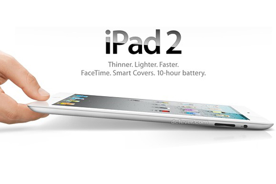
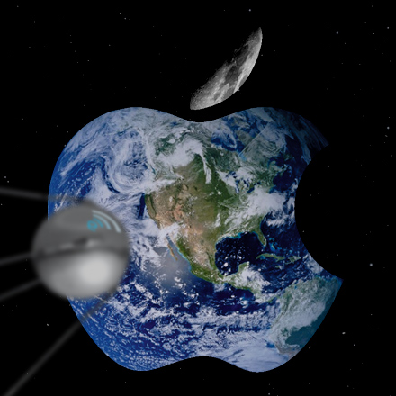
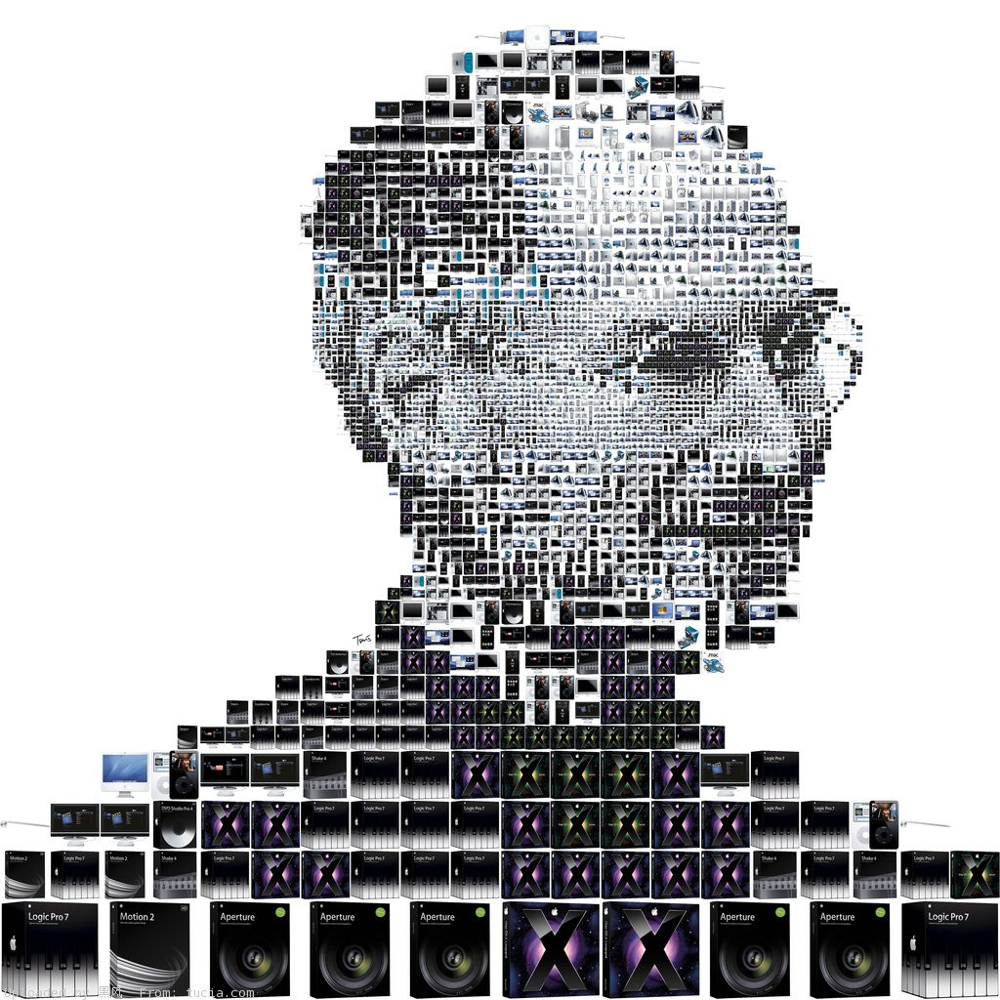

# ＜摇光＞苹果的骗局—我对苹果哲学的理解

**总结起来，苹果的思路是，先用鲍鱼龙虾把你吸引来，然后饿着你，饿够了再高价给你加个宫爆鸡丁，你还激动的要死。殊不知如果你不贪那鲍鱼龙虾的面子，可以在别家吃的酒足饭饱。**

### 

# 苹果的骗局—我对苹果哲学的理解

### 

## 文 /吴天际（清华大学）

 （借iPad2发布的契机，把这篇长久以来的构想落在笔头。就像我在状态中所说的，我佩服苹果的技术，却不能接受苹果的哲学。） 骗局？你肯定不信。待我问你，iPad2最大的卖点是什么？你会说，加上了摄像头，前后两个，减小了厚度，加了盖，“2x/9x”的速度提升。好，我们单说加了摄像头这一点。想一想，当今世面上的电脑、网本、智能手机，能找到一款没有摄像头的么？难。摄像头已经成为移动电子产品的标配，为什么iPad2上装了摄像头，大家就无比激动？因为iPad1没有摄像头。那么请想一想，为什么iPad1没有摄像头？ 如果你还没有被骗的感觉，请继续往下看。 

### 

### 

苹果的技术与营销 任何一家依靠技术立足的公司，都必须有源源不断的技术创新。然而，大家能在市场上买到的所谓“新”产品，其实并不一定是那家公司的最新技术。新技术是市场竞争中的筹码，筹码一定要攒在手中，适时的试用。如果产品在市场上业绩不错，一个公司没有必要用出筹码。只有当产品推出时间长了，销量下滑了，人们开始淡忘了，或者有竞争产品推出时，一个公司才会把之前已有的研发成果包装成新产品推向市场。总而言之，所有企业在推出新技术时都是有所保留的，这是基本的策略，不足为奇。 苹果却将这种策略退向了极致。苹果的技术保留，往往不是它的新技术，而是陈旧成熟的技术，或简单易得的技术。 iPad2的摄像头是一个明显的例证。摄像头是非常成熟的技术，安装摄像头对于苹果这样的公司简直没有任何技术难度可言。从工程设计上，恐怕苹果只要1个星期的时间就能搞定，增加的成本也忽略不计。那么它为什么不在iPad1上安装摄像头？难道Jobs喝醉了忘记要求了？明显不是，这就是为了让iPad2显得有所进步。 再说iPad2的HDMI接电视的功能。在苹果的官方网站上，有一个iPad1的VGA输出附件，利用这个附件，可以把视频和Keynote输出到电视或投影。然而，如果你留意一下这个附件下面的留言，几乎所有用户的评价都是2星一下，因为大家都希望共享其它App的显示。但对于iPad1，这是不能做到的。是技术上的限制么？显然不是，明明在发布会上，Jobs都可以吧自己的iPhone/iPad屏幕投影到大屏幕上。用户不能这么做，完全是个软件上的限制。现在，iPad2支持了这个功能，从技术上，或许仅仅是注释掉了几行代码，1分钟的成本都用不了。 这样的例子有很多，诸如iPhone4的Video Call，录像。 这样做，苹果得了大利益。它开发一代新产品的成本非常低廉。不了解技术的用户纷纷以为所有新产品的亮点都是技术革新，从而觉得新产品远远超越了原产品。这是一个假象。大部分新产品中的亮点，都是原本理所当然出现，却硬生生的砍掉的。的确，新产品远远超越了原产品，不是因为新产品高端，而是因为原产品低端。 总结起来，苹果的思路是，先用鲍鱼龙虾把你吸引来，然后饿着你，饿够了再高价给你加个宫爆鸡丁，你还激动的要死。殊不知如果你不贪那鲍鱼龙虾的面子，可以在别家吃的酒足饭饱。 

### 

 强势控制 

### 

### 

所有企业都号称以用户为本，苹果也不例外，号称每个产品的更新，都听取了大量用户的反馈。但是苹果真的在乎用户么？苹果其实很强势。 苹果的每样产品，多样性都极其匮乏。并且这少的可怜的多样性也仅仅体现在一些“硬”指标上，诸如内存大小、闪存大小。消费者没有在功能上的选择余地，硬件软件皆如此。苹果的产品，充斥着这样的信号：“我说有的就有；我说没有的就没有；我说有但是不给你的，你就别想要”。 Mac OS X不支持最大化是众所周知的。“我们认为窗口的大小应该适合里面的内容。” 好，就算你认为这是合理的，那么你应该考虑到世界上还有很多认为“内容应该被调整以填满整个窗口”的人，给个选项不好么？苹果的回答是，给你什么你就用，抱怨也没用。 又如上一节提到的，苹果故意在产品中保留一些非常廉价、简单、理所当然的功能。“大家都有的功能我偏不装”，一样是强势的表现。 苹果之所以这样强势，是为了树立威信。人总是对待弱者很专横，而对待强硬者就服服贴贴的。苹果做出强硬的面孔，反倒利用了人的这种本性，让人觉得“苹果的概念都是真理，是我自己没见过世面、太老土；苹果的产品都是最高端的科技，是我自己的要求太科幻、白日梦。” 于是，人们也就不再吭声了。 

### 

### 

封闭的产品 苹果的野心可谓无穷。它试图以它的产品建立一个完全封闭的系统，以形成垄断。微软也曾经被指浏览器的垄断，和苹果相比，简直小巫见大巫。苹果经常藐视业界成文或不成文的标准、规范，藐视人们的习惯，只为建立自己的垄断之势。 iPhone和iPad都有1G甚至更高频率的处理器，却不支持flash播放。flash已经成为目前互联网上最常用的多媒体交互平台，没有之一。即时我个人也不主张不必要的用flash，但苹果直接选择不支持flash，无疑又是挑战标准的一例证。为什么？因为flash本身是一个完善的多媒体交互环境，很多iPhone/iPad app其实完全可以在flash中实现，况且flash是完全跨平台的。如果开放了flash，就意味着开发人员或用户可能放弃苹果自己的环境，转而直接开发flash版本，使得苹果成为一个空壳。为了商业利益，还是牺牲一下用户吧。 iPad没有SD卡槽。SD卡恐怕是当今最流行的存储卡格式。即便Sony的笔记本，也在支持记忆棒的同时支持SD卡了。iPad不支持，是为了避免用户买一个8G的iPad再配一个8G的SD卡，这样的价格远远低于16G的iPad。 用过iPhone的人都知道，iPhone号称支持蓝牙，其实只支持蓝牙耳机。市面上几乎全部蓝牙手机，都支持通过蓝牙共享文件，唯独iPhone不支持。猜测这是为了迫使用户用网络传输，产生流量费用。 苹果的软件也极其封闭。这无需我解释了。 营造产品的生态圈是人们所提倡的，但应该允许其它厂家的产品参与到竞争中来。苹果却努力排斥目前通行的行业标准，从而故意制造和其它厂商产品的不兼容，以便形成自己封闭的生态圈。这是明显的垄断。 （值得一提的是，苹果也服软。它不敢不支持doc/docx/ppt/pptx，不敢不支持youtube。） 

### 

### 

### 

### 

总结 我承认，苹果拥有绝对领先的工程技术。然而，苹果却没有利用这样先进的技术千方百计造福人类，它想的全是如何敛财。我不否认敛财是一个公司的最重要功能之一。但是作为苹果这样一个世界上名列前茅的公司，理应在敛财之外，担负起站在这个位置的社会责任来。 苹果拥有领先的技术，却故意人为的制造产品的瑕疵，以期为后续产品赢得市场。苹果故意抵制对自己垄断事业不利的行业标准。要知道，一个规范的定型是一件非常不易的事情，标准是人类智慧的结晶。只有有了标准，竞争才有准绳，技术的发展才有所依据，才能减少重复开发和浪费，提高效率。 作为消费电子的用户，我感到不被尊重，因为每当使用苹果的产品，就有被强迫、被束缚的感觉。作为电子工程师，我感到羞耻，因为我看到人们梦想的技术不能得以实现，不是被技术本身所限，不是被成本所限，而是被企业的野心与利益驱使所限；看到人类智慧的结晶被藐视，只因为企业的垄断野心。 苹果拥有领先的技术、地位、市场，却不能承担起应有的社会责任。这就是我对苹果哲学的看法。 

### 

### 

（采编：陈锴 责编：陈锴 ）

### 

### 
