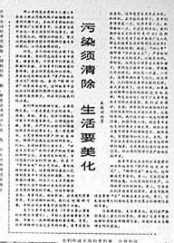

# ＜摇光＞草民的冒险——从邓丽君说起

**草民们在做出自己的选择时，恐怕不会虑及这些形而上的因素。牵引着他们向前走的，总是那一丝看不见的线，那发自人性深处的，最简单、最单纯的渴望。总有那样一种歌声，能凌驾于意识形态之上，那就是属于我们自己的《莉莉玛莲》。而我们今天所享有的自由，各种贴近人性的自由，莫不是前辈的草民们一次次冲撞禁区而来的。这种冲撞或许并不激烈，也不总是要遭杀头的，但却如蚁群一般，一次一小口，将自由越吃越大，将禁区越咬越小。**  

# 草民的冒险——从邓丽君说起

## 文/迦南（北斗特约撰稿人）

 

2009年，在一项名为“建国60周年最具影响力文化人物”的网络评选中，台湾已故歌手邓丽君获选“新中国最有影响力文化人物”。这一结果，在今日开放之中国，并非什么惊奇的事。然而，对于30年前通过走私磁带或“敌台”认识了邓丽君的人们，这多半是一件无法预见的事。

改革开放之后，大陆与港台间的联系及往来日益频繁，这其中自然也包括文化层面的交流。在前30年中整齐划一的国人，在港台传来的“奇装异服”及“靡靡之音”中，个人意识逐渐觉醒。而邓丽君的歌声便是这“靡靡之音”中的代表。

许多经历过那个年代的人，至今仍能忆起初闻邓丽君歌声时，那份糅杂着矛盾与紧张的意外喜悦。广东因临近香港，通过走私磁带并不断翻录的过程，较早地接触到了邓丽君的歌曲。其时的广州，每至周末，总能见着一些在商业区徘徊的年轻人，他们的目的便是从盗版商或走私者处购得邓丽君的磁带。而在福建的人们，则借着临近台湾及其外岛的优势（受到的干扰信号较少），躲在被窝中通过短波收听“敌台”，期望在对岸政治宣传的间隙，能听得那销魂蚀骨的歌声。

邓丽君的歌，涉及政治较少，多是对个人情感的表达。时人初听邓丽君的歌，第一感觉是细柔、绵软，对于习惯了《红色娘子军》一类革命歌曲的人们，这无疑是一个新的世界——原来歌还可以这样唱啊。刚从文革中走出的人们，在思想文化上，还颇为保守，听着“情”“爱”一类的字眼从邓丽君口中娇滴滴地唱出，一时间，难免脸红心跳。但也正是这一份刺激，让人们从革命的宏大叙事中走出，关注个体的缠绵之情，回归人性的本真。

邓丽君在大陆的风靡，并非一个孤立的事件，而是在整体开放的大环境下的必然结果。同一时期，人们的着装习惯也悄然发生着改变，反传统的喇叭裤出现在了大街上。各类报刊杂志上，逐渐形成了自由讨论的风气。而在政治上，许多曾经禁忌的领域也出现了日益活跃的讨论。

邓丽君的大陆歌迷们所不知道的是，此时发生在党内高层的一场争论，将要为他们带来困扰。

1983年1月，时任《人民日报》副主编的王若水在上海《文汇报》上发表《为人道主义辩护》一文。1983年7月，中央宣传部副部长周扬发表讲话，内容涉及“马克思主义与人道主义的关系” （演讲稿由王若水起草），受到热烈欢迎。随后，胡乔木、邓力群等对周扬及王若水提出批评，认为周、王过多宣扬了资产阶级的人道主义，“不论作者的主观动机如何，但其客观效果势必是在思想界引起混乱”。

同年10月12日，邓小平在第十二届二中全会闭会讲话中提及“精神污染”问题。随后第20期《红旗》杂志发表评论，道：“当前思想战线首先要着重解决的问题，是纠正右的、软弱涣散的倾向，坚决地把清除精神污染的庄严任务担当起来”。这篇评论引起了国外媒体的广泛猜测，其中日本《每日新闻》记者推测说“这也许是表明有可能调整自1978年12月召开的十一届三中全会以来确定的政治、经济、社会等各方面的开放政策。”

此后，各报纸开始连篇累牍地报道“防止和清除精神污染”。一件小事很能说明情况：“精神污染”一词的使用如此频繁，以至《人民日报》排字房的这四个铅字都不够用了。（王若水：《“清除精神污染”前后》）

更有甚者，宣传文教单位接到指示，要清理本单位从1981年以来发表过的文章和出版的书刊，还要检查工作人员在各种讨论会上的讲话。问题严重的单位，上级可以派出工作组，对其领导班子加以整顿。后来扩大到各系统、各部门、各单位都要检查自己的思想问题和精神污染的情况。每个党员都要检查自己近几年的言行。某省的社会科学单位党委觉得要清理的文章太多了，决定凡是论文题目中带“人”的先检查。有人开玩笑道：现在是“谈人色变”。（王若水：《“清除精神污染”前后》）

“清除精神污染”运动迅速从政治、思想领域向文艺领域延伸，甚至粗暴干预了一般民众的日常生活及娱乐方式。

这种延伸绝非偶然。其实早在此前，一些老资格音乐人曾在北京召开了一场专门针对当下流行音乐取向的讨论会，称为“西山会议”。在会上，一些专家对于以邓丽君为代表的港台音乐表达了否定的观点，称其软绵绵、萎靡不振，是含低级趣味、反映腐朽颓废情调的乐曲。李谷一的《乡恋》因在唱法上与邓丽君的歌曲有相似之处，也成为受批判的典型，甚至被称作“李丽君”。在这次会议上，邓丽君的歌曲被正式冠以“黄色歌曲”和“靡靡之音”的称呼。

因时因势，一本名为《怎样鉴别黄色歌曲》的书出版了，书中汇集诸多老音乐人对当时流行音乐的批评，并将邓丽君的《蔷薇处处开》、《何日君再来》等歌曲列为“黄色歌曲”。

而轰轰烈烈的“清除精神污染”运动，则将对邓丽君的围剿上升至了行政层面。各单位、学校要求党员带头上交持有的邓丽君磁带，以“抵制歪风邪气，抗拒腐蚀”。派出所、街道居委会则鼓励民众主动交出“黄色歌曲”。那个年代的过来人，或许仍能忆起当时派出所宣传车、居委会大妈的喊叫声。

有人上缴了，有人舍不得，有人谨小慎微，有人“顶风作案”，还有人忌惮“是否又要来一次文革了”。同一时候，工人纠察队在街头日夜巡逻，剪去那些不羁的喇叭裤，似乎如此，便能将人们求新求变的心一并剪去。

其实，若求诸于历史，便不难发现，在任一时期，总有些入不得官家眼中的文艺作品，受着各式的钳制与打压，却依旧在民间兴兴向荣，并流传至今。例如明清两代，便有诸多未刊刻印行于世的手抄本，在民间流转不息。及至文革，允许出版的书籍数量较少，内容也趋于单一，且多散发着意识形态的浓郁气息。因此，有一批手抄本小说在民间流传着，其中包括后来为人熟知的《少女之心》及《第二次握手》。尽管中央文革小组一再追查封杀，乃至将作者或传抄者批斗、下狱，手抄本却依旧不死。若要细究起来，无视当权者禁令的草民们，绝大多数并无与政权唱反调的初衷，却不知何来的勇气，干起了这危险的事。在传统印象中，我们的老百姓，总是不喜欢冒险的。然而彼时，则似有一丝细得看不见，却又韧得断不了的线牵着他们去了。若要问他们，害不害怕因此而承担代价，他们当然害怕。若论被抓着后是否后悔，当然也是会后悔的。可在那个无法改变的当初，他们就是要失了魂似地去这样做。至于为什么，大概很难给出一个标准的答案，但有一点，是可以肯定的，即人性中所喜好的，就是我们难以拒绝的。那些温情、萌动，是我们所深深渴望的，尤其是在经历了一个严酷、刚硬、摒弃了个人性情的冬天之后。

经历过明清、文革的草民们，这次仍要被这一丝线所牵引，因为这是深埋在骨子里的东西，抗拒不得。邓丽君的歌声并未因政治上的阻力，而从草民的世界中被剥离，反倒穿透了“清除精神污染”的铜墙，为更多人所熟知并喜爱。

而同样深受“黄色歌曲”所累的李谷一，也从未离开过草民们的视线。就在《乡恋》遭到猛烈攻击的时候，李谷一收到了1000多封来自听众的支持信。其中一封信写道：“他们说你唱黄色歌曲，说你是黄色歌女，但发生在演出大厅里的奇迹，那无数次的谢幕和经久的掌声，是对这种污蔑的最有力的否定。”

1983年，中央电视台举办了第一届春节联欢晚会，这是一个值得纪念的日子。当时，晚会现场设置了4部观众点播电话。晚会刚开始不久，记录电话的小姑娘就端着一个盘子走到春晚导演黄一鹤面前，上面放着的点播条都是点《乡恋》的。黄一鹤为难了，“因为这是禁歌。禁止的东西如果在电视里播出去，特别是在春晚上播出，那是捅破天之罪，一个人的政治生命就要出问题了”，但是“电视点播，点了不播，不是欺骗群众吗？”，他事后回忆道。于是黄一鹤聪明地将这个难题丢给了同在现场的广电部长吴冷西。起初，吴冷西看了之后摇摇头。几分钟后，小姑娘又端来一盘，还是《乡恋》，吴冷西还是摇摇头。又过了一会儿，又端来一盘。连续递了五六盘后，吴冷西也坐不住了，他在黄一鹤面前走来走去。经历了一番思想斗争之后，吴冷西一跺脚，操着南方口音说：“黄一鹤，播！”

当李谷一在台上，听到主持人姜昆、刘晓庆拉长了音报：“乡——恋——”的时候，她晓得，解禁了。

民意如此，官又奈何。“清除精神污染”闹剧在草民们无声的抵抗中，仅仅持续了27天，便草草收场了。11月17日，根据胡耀邦的意见，《中国青年报》发表题为《污染要清除，生活要美化》的文章，提出不能把烫发、穿时装、跳集体舞视为“精神污染”而加以禁止。

在这个国家的历史上，御用的理论家们总能找到无数理由，论证一首歌、一幅画、一篇文章的所包藏的反心、阶级性，乃至创作者“不可告人的险恶用心”，然而草民们在做出自己的选择时，恐怕不会虑及这些形而上的因素。牵引着他们向前走的，总是那一丝看不见的线，那发自人性深处的，最简单、最单纯的渴望。总有那样一种歌声，能凌驾于意识形态之上，那就是属于我们自己的《莉莉玛莲》。而我们今天所享有的自由，各种贴近人性的自由，莫不是前辈的草民们一次次冲撞禁区而来的。这种冲撞或许并不激烈，也不总是要遭杀头的，但却如蚁群一般，一次一小口，将自由越吃越大，将禁区越咬越小。

中国向来不乏“哀民之不幸，怒民之不争”的文人，似乎本国的民众天生对冒险充满了排斥与恐惧，但凡还能得一口饭吃，便绝不越雷池一步。然而，只消在夏日的凉亭下，抽空听听老人们那段发黄的往事，便晓得，草民们的冒险，可从不曾停止过。在那个年代，国家将要向何处去，尚不为普通民众所确知。但总有这样一群草民，他们穿起了喇叭裤，守着收音机，等待来自“敌台”的美妙歌声，提心吊胆地参加地下贴面舞会，干着主流观念中离经叛道的事。诚然，草民们的冒险之路上总有人手持剪刀要剪去那宽松的裤脚，亦有“清除精神污染”和“流氓罪”的滋扰。可终究，这离经叛道之事渐成了主流。

当年如此，今朝亦然。

本文参考材料：

《王若水：清除精神污染前后》

《中国新闻周刊：李谷一唱乡恋，被高官点名批评 》

《怎样鉴别黄色歌曲》

 

（采编：麦静；责编：麦静）

 
