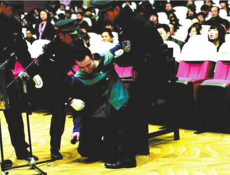
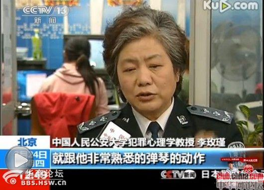
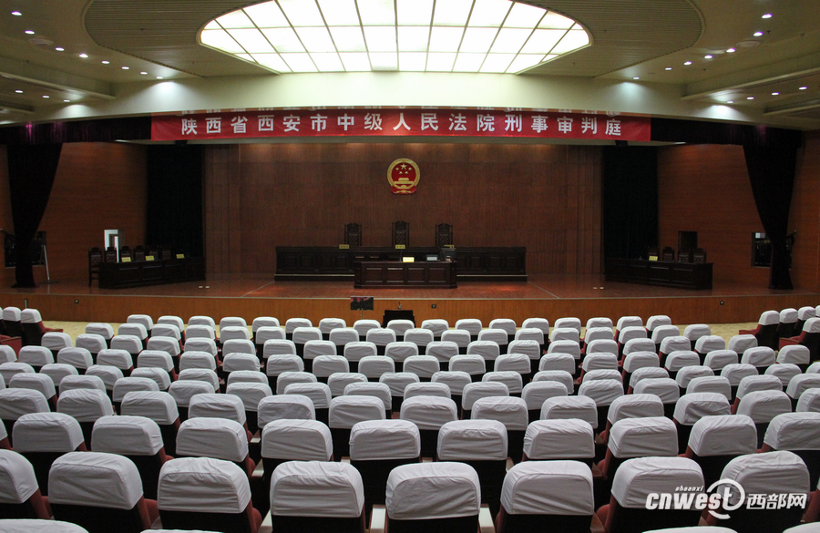

# ＜摇光＞药家鑫案——我思考着​我的思考

**喊杀还是喊留，我说了不算，你说了也不算，法律说了算。在公众的眼目之下，我相信司法公正还是有可能的。但是我想用死亡来应对死亡是法律的目的么，法律的目的更应该是救赎，而不是用国家暴力去摧毁一个生命。**

### 

### 

# 药家鑫案——我思考着​我的思考

### 

##  文/joachimbene（上海海事大学）

### 

### 

犹记得药案是和李案差不多时候爆出。时至今日，李案差不多尘埃落定，而药案才刚刚把自己的帷幕给拉开。各方说法不一，刀下留人有之，主张决不饶恕的亦有之。对于此案，我也有一点观点和大家探讨一番。 药家鑫到底犯罪属不属于“激情杀人”范围。关于激情杀人，是指行为人在主观上原无杀人的故意，只是在情况急迫，且精神受到强烈刺激的情况下，失去自我控制的能力，将人杀死的行为。 我觉得先回顾一下案情：被告人药家鑫驾驶红色雪佛兰小轿车撞上前方同向骑电动车的张妙，后药家鑫下车查看，发现张妙倒地呻吟，因怕张妙看到其车牌号，以后找麻烦，便产生杀人灭口之恶念，遂从随身背包中取出一把尖刀，上前对倒地的被害人张妙连捅数刀，致张妙当场死亡。 对于药家鑫主观上无杀人之故意，相信没有多少人有什么异议。作为第一次发生事故的人来说，肯定是惊慌失措，并且希望这件事情没有发生，那么唯一的反应就是掩盖事实真相。可以选择肇事逃逸，但是药却下车查看。而当他发现张妙在记住其车牌时，（这是一个诱因）他的内心一定是觉得自己要被抓住了，对于一个学生来说肯定认为自己的人生要完蛋了。在他的主观臆想中，农村人比较难缠，一定会把他搞得很糟糕。在此时他的内心受到了强烈刺激，自己要被抓住了，自己的人生毁掉了。那么怎么使这件事情没有发生，他采取的掩盖事实的方式是使这位妇女死亡。 

### 

### 

法学界普遍拿激情杀人的一个条件说事：必须是因被害人严重过错而引起行为人的情绪强烈波动。那么我在这里问一句什么是严重过错，严重过错又有何定义，严重过错究竟是案犯眼中的严重过错，还是社会普遍公认的严重过错。而且以前适用于激情杀人判决的先例中，那些严重过错普遍是以案犯为第一视角。 人的本能分为两种：一种是先天所习得的本能，比如婴儿的喝奶，另外一种是训练出来的。而训练出来的本能在一些紧急情况下，往往有转化为习惯性反应的可能。在本案例中，我比较倾向于药家鑫的连续捅八刀是一种习惯性动作。大家如果仔细去观察查看那些持刀杀人案件的话（前提是主观上并无故意），往往被捅的刀数不是很多，大多是以一刀或者两刀为界限。同样对于这个案件，对于以后的几刀只是用一种训练出来的本能在起作用来解释，在本案中表现出来就是机械般的又捅了几刀。诚然，人不是钢琴，药拿的不是音符，但是这里有一种处于疯狂状态的角色混乱认识问题。每一个杀人犯都是当时状态下的精神病，一种处于在他自我想象的危难之中的纯粹自我拯救本能。 药家鑫有心理疾病没有。舆论普遍质疑药家鑫怎么随身带了一把刀，现在可以了解这把刀是被告在超市里面刚刚购买的，这一点可以凭借警方的证据得到证明。我们不能因为美国军事演练就推断美国要攻击某个国家，同样我们不能因为药身上带了把刀就妄下判断买刀就是为了预谋杀人。买刀的缘由我没有在可见资料中找到，但是有一点我想大家也是肯定：买刀绝对不是为了杀人。在我猜测看来，买刀如果为了自卫的话，只能说明这个人生活在极端恐惧之中，内心极度缺乏安全感。他的杀人行径只能说明他心理上的自私与遇到事情时内心的脆弱。他的成长经历也可以不难推测他一直生活在强权体制中，内心的心理处于极端压抑状态。但是在这里有一个观点必须肯定：心理有疾病从来不是免于罪责的理由。 社会舆论究竟站在谁的那边。很多人凭借CCAV(请原谅我的道德倾向)的一个专访，就武断地去判断受害者不被舆论所重视，CCAV为罪犯争取道德上面的舆论同情。我想问一句：舆论真的对于受害者不利么？事实当然不是这样，CCAV的节目道德操守早已被许多人所怀疑，现在占据舆论中心点的往往是南方报业集团。而随着主流媒体的话语公信力逐渐丧失，民间社会的崛起正逐渐把握了话语权，甚至是一些道德上的制高点。君不见孔庆东不知所云的在电视里乱喷一起，迎来阵阵喝彩叫好之声。君不见网络媒体上众人拍砖，大有把药家鑫“不杀不足以平民愤”之态势，而为药家鑫辩护之声音更是鲜有耳闻。舆论到底站在谁的那边，相信大家看看最近的一些网络态势，就有一个比较清晰的认定。 

### 

### 

药家鑫师妹的话有没有过错。在这里我不想否认，师妹们的话有点触碰到了我们的道德底线，那句“她也捅的话”的确有点骇人听闻。但是她大可不必为她所说的话所道歉。以赛亚.柏林说的很清楚，如果特异的思想与行为明明被社会大众认定有害于社会稳定，在自由主义原则下，他们仍然受到保障。而且约翰密尔也同样申明了一点“人之为人在于他的选择能力—同等地选择善恶的能力”作为个人本无权去干涉他人的选择，只要这种选择没有侵犯我们个人之利益。药家鑫师妹只是纯粹的“自我干涉”范围内的言语，她的话有没有错，在我们看来，这有错。而这只是她自己的错，我们所应该做的只是“劝告，教导，说服，甚至敬而远之”，但我们没有权利去指责她，甚至是社会舆论加以压制。 中国的学校教育制度有问题么。社会一直存在这样一种倾向：学生一做了有违道德的事，舆论矛头就一直指向中国的学校。仿佛一切都是中国学校所教授的，学校教育往往充当了替罪羊，成了一切学生罪恶的源泉。这是既定之事实么？当然不是。一个简单的反推就是：并不是所有人都是药家鑫，那么学校的教育制度就没有什么值得过分指责。况且在个人的社会化过程中，存在影响的往往不只是一个学校而已。还存在着同龄群体，家庭，大众传播媒介诸如此类的因素。学校教育并不是替罪羊，该反思的是这个社会上的教育才对。药的家长到底扮演着什么角色，社会舆论又给药渲染什么样的价值观？从师妹的话语中我可以看到同龄群体也有着类似的想法，那么药家鑫就在一定程度上肯定收到了这种亚文化的影响。社会本身就有原罪，学校教育本来就不应该一把子把所有的罪责揽下。 为什么要取得受害者原谅。主张不废除死刑的人总喜欢拿一个事情来说事：国外的一些被害者家属总是能原谅作案者，而作为与此案无关的人士，没有什么发言权。很明显这混淆了一个概念，个别案件还是事实现象的问题。杀人现象明显不是个案，不能否认每个人都有成为被害者的可能，那么实际上每个人都是杀人现象的事实相关者（隐性可能）。每个人都有资格在这件事情上发挥自己的观点，因为被害只是一个家庭的事情，但杀人事件是一个社会的事情。其次在我看来中国一直没有宽容的土壤，在国外受害者家属为杀人犯求情已经不是新闻。基督教教义下的人们往往用普遍的济世情怀去看待这个世界，而现实中国中戾气犹在，碰到这种事件，往往是对于那些家属“严惩”之声不绝于耳，而求情的新闻则是鲜有耳闻。与其寄希望于家属的自我意识的觉醒，还不如借此为契机，用法律制度来加以完善。 

### 

### 

喊杀还是喊留，我说了不算，你说了也不算，法律说了算。在公众的眼目之下，我相信司法公正还是有可能的。但是我想用死亡来应对死亡是法律的目的么，法律的目的更应该是救赎，而不是用国家暴力去摧毁一个生命。最后，我想用我比较喜欢的作家—熊培云的话作为此篇的结尾。 “砸刀落在别人脖子最轻，落在自己脖子最重；你可能不只在表达一个观点，而且在杀一个人；废除死刑不等于废除刑罚，死刑外刑罚之余威犹在；比死刑更可怕的是此社会无宽容，无对生命之敬畏；若我被杀，请宽恕杀我者，他的生命有我余生” 

### 

### 

（采编自北斗投稿邮箱 责编：陈锴）

### 

### 
