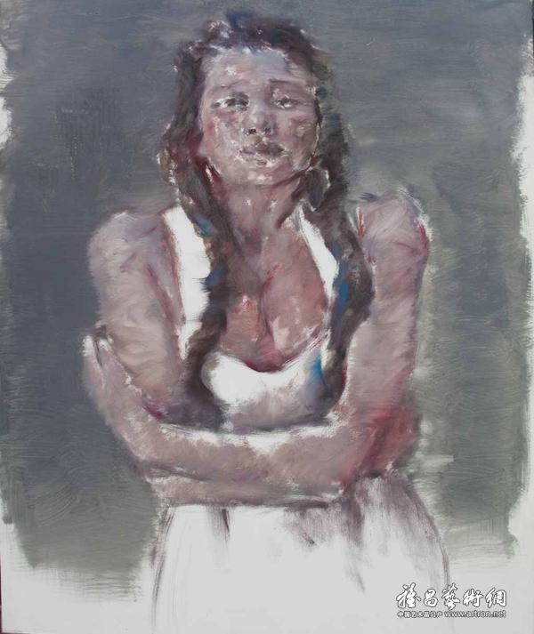
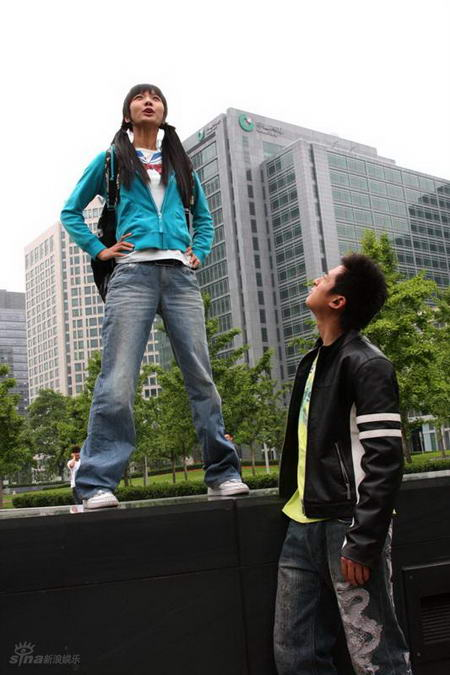

# ＜摇光＞荷尔蒙的青春

**人的生命有另一种可能，即在黑暗和混乱中，凭心灵的诚实和纯净走出一条路来，在荷尔蒙的青春衰朽之际，建立起永久的灵魂青春。**  

# 荷尔蒙的青春

## 文/兔A

 

昨天下午，我们班的学生结束了最后一场考试。我赶往教室，嘱咐了一些安全事宜后，宣布他们自由了。在最近一二天内，所有这些学生都将回到家乡，度过大学时代的第一个寒假，而我也将结束我教师生涯的第一个学期。

工作后有很多次，我被问到是否对学生感到失望。我总是回答“并不”。这并非由于乐观，而是过去十多年做学生及兼职教书的生涯中，我从未成功地唤起过一个人对求知的热情。我现在的境遇，总比那时候好得多。

应该说我运气不错，学生入学成绩都在重点线以上20分左右。因此，当本学期之初，我希望能借助“读书会”的方式，将他们带入阅读和思考的世界时，他们在每一次读书会上表现出的学习能力，都足以使我感到惊讶。在每次读书会上，每个主发言人借助PPT做30分钟左右的发言，而背后阅读书籍和搜集资料的时间常常需要两周以上，发言稿整理为文章，往往内容充实、文辞简明、条理清晰。我将之与我大学一年级时的论文和日记对照，不得不承认，写得比我当时好。

我因此不敢轻视他们。认为假以时日，这些学生应当比我知道更多、走得更远。但是很快，另一件事情给了我提醒，使我知道，在这里，时间未必能直接叠加为知识，何况是智慧及人格。

上个月，学校指派给我数名正在写作毕业论文的大四学生。我首先是很惊讶地发现他们不知道发邮件需要署名、后来则渐渐发现问题不仅如此——他们开始逃避来找我谈论文、试图说服我“论文不必当真”。在三四次面谈的僵持后，他们中的一些甚至和我在“看两本小说还是看三本小说”“读十篇论文还是读五篇论文”上争执不休。我听见自己的声音一点点失去柔和，看着她们头发油腻地歪在椅子上，手里拿着从我这借的笔，就着从我的打印纸上扯下的一小个角落一边记录一边讨价还价。忽然间我完整地明白了自己为什么生气。

——你们怎么除了“什么都不要当真”其他都没学会？

——你们怎么能把自己浪费成这个样子？

在时间的坐标轴上，他们也曾是那个千辛万苦迈过重点线进入大学的孩子。她们也曾整日泡在图书馆里，准备第一个presentation；也曾在掌声中逃下讲台，用紧张得冰冷的手捂住通红的脸颊；他们之间也曾有过心领神会的默契——就像在我们班上，一个女孩拿着《昨日的世界》走出图书馆时，偶遇一个男孩正在翻看《茨威格自传》（二者是同一本书的两个译本），因此他俩合作了一个presentation。但是这些，在大四的他们身上都看不见了。

在离开学校之前，有个学生来找我拿一本书，那是因为我将她的发言稿交给书作者阅读之后，作者认可这个年轻学生的思考和表述，让我带回给她的鼓励。她用几乎是悲观的调子谈起她的阅读，说她渐渐意识到读书会使她显得像个异类。这是一个古典的、传统的、关注内在和审美，甚至对外在世界显得迟钝的学生。陪她来的另一个学生则更为关注外在世界，曾选择《正义之前》作发言，她的困扰则来自于在大学社团中看到和听闻的黑暗。不同的关注和不同的性情却使得她们问出了同一个问题：老师，你说读书可以使人获得心灵的坚实和单纯，但这种单纯在现实的黑暗面前有什么用呢？

她们是有天赋的孩子，却不敢认领自己的天赋。因为有太多的传说告诉她们，选择天赋，选择独异和单纯，将会把她们送上一条危险而孤独的道路。她们眼中的光明明灭灭，一边不满于上大学以来每天蜷在床上的时间越来越长，一边下不了决心走一条严肃的追寻之路。

我知道，在人的青春岁月中，会有一个时期感受到孤独和黑暗，就算不涉及对社会黑暗的认知，仅仅出于生命本身的诚实，也无法祛除植根于存在的苦痛。而阅读常常起到推波助澜的作用，使这种感觉更为清晰。它不但使自己难受，还会使人变得不那么可爱，走到哪里都被人认出浑身的刺尖和冰渣。因此，“对什么都不必认真”反倒看起来是更为理性的选择。在所有时代，都有一些人，将他们告别天真，走向成熟的时间点确定在获得这一认识的时候。

但我知道，如果如此选择，人就不仅失去了他的青春，也失去了走向成熟的机会。

我记起在不久之前，学校曾经举办过一场优秀班级的评选活动。决赛当天，我们这些被抓去当评委的青椒本无甚兴趣，但当大幕拉开，群舞的学生将一种甚至是磅礴的青春气息砸向台下时，坐在第一排的我们真是被惊呆了。我身边坐的青椒某，从头到尾都在絮絮叨叨地感叹自己老了，老得简直是不行了，而我也在不断地问自己，我是否有过这样青春洋溢的时刻。直到比赛正式开始，一个个班级举出入党率、学生会干部率等数据，甚至用了“我班多位同学在学生会担任中高层职务”这样的词时，我的头脑才开始清醒，认识到从台上倾泻下来的，不过是荷尔蒙的青春而已。

荷尔蒙的青春，朝生暮死。每个年轻时住过集体宿舍的人，大概都能记起青春退场之前，弥散在空气中的慵懒破碎而腐败的味道。也有无数的小说电影用情欲和暴力描述这个雨林般的时期，那既是对原始生命力的颂赞，也记录了有机体在时光中必然的衰朽。

但人的生命有另一种可能，即在黑暗和混乱中，凭心灵的诚实和纯净走出一条路来，在荷尔蒙的青春衰朽之际，建立起永久的灵魂青春。我不知道其中的诀窍，但我知道，就像圣经中所说，必须行过死阴的幽谷，才能到达可安歇的水边，获得灵魂的苏醒（诗23:4）。这种建立于黑暗、孤独、怀疑、冲撞之上的灵魂成长之路，被那个色彩斑斓的舞台、被欢快的音乐、被脱口而出的口号、被同质化的评价体系和简单粗暴的励志方案遮盖地严严实实。

如果学校在此时发挥的作用只是让他们回避这些青春中本该面对的危险课题，那我们能看到的青春狂舞，也不过是盛极而衰时的青春挽歌。

他们在最好的时光中到这里来，然后飞快地结束成长史，既不奢望改变世界，也不愿意改变自己，他们被生活随意揉成颓废退缩的样子，并将他们的经验当做真理转告给所有正在步入青春的人。

某个依然在愤世嫉俗期的青椒前天对我说：“他们才来了一学期，就已经开始被败坏掉了。”他说出了我心里的话，而且用的是同样的语言。是啊，在我们眼中，他们就是小番茄、小菜瓜，那么鲜艳活泼，未来还像蓝天的边际一样遥远。可他们的学长以自己的霉斑为证，告诉他们，“你们什么都不是，你们什么都别想，你们什么都不要相信，你们首先要抛弃的，是你们的单纯”。

可是我想说，单纯本身是坚不可摧的力量，它能给你的，远超过励志口号宣称能给的、电视连续剧和网络小说宣称世上没有的。

文章来源：[http://www.douban.com/note/193030951/](http://www.douban.com/note/193030951/)  

（采编：宋晓慧 责编：佛冉）

 
