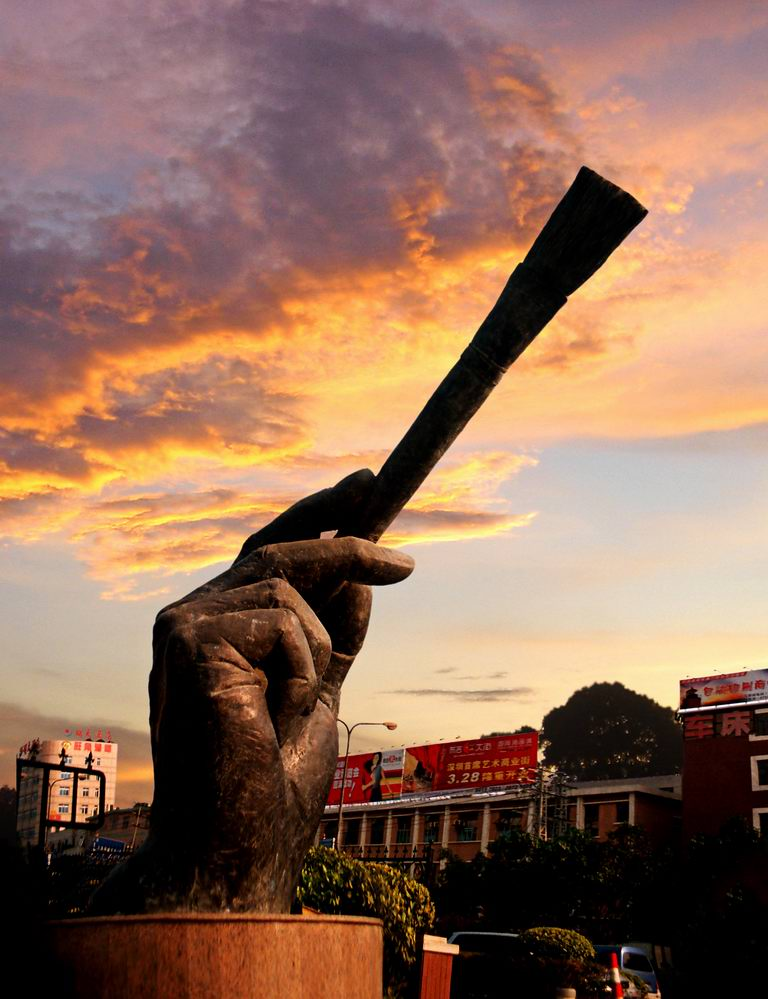

# ＜摇光＞虚伪和崇高

**从当时我就开始认识到，每个人都是有他自己的崇高水平的。我的崇高水平没有我妈高，所以有些时候不能对崇高的感情产生共鸣。而当我一定要表现出超过我崇高水平的道德觉悟时，我就逃脱不了虚伪的嫌疑。我妈就是一个崇高而不虚伪的人，阮籍是个不崇高而不虚伪的人，而我是个不崇高而虚伪的人。如果生活在阮籍的时代，我估计是那种白天披麻戴孝，晚上偷偷溜去喝酒吃肉的人。对此我感到感到深深的内疚。**

# 虚伪和崇高

## 文/ 黄振奇（University of Illinois Urbana-Champaign)

 

晋朝有个人叫阮籍，他死了母亲。在服丧期间，阮籍完全无视礼教，酒照喝，肉照吃，棋照下，造成了很坏的社会影响。顺被说一下，当时西晋社会风气比较不好，贪污腐败严重，官僚权利失控，各地藩王不受中央约束（当然房价还是比较低的）；所以皇帝很注重三从四德八荣八耻的宣传。阮籍这种做法简直是冒天下之大不韪，完全可以判个死罪。

当然通过史料我们可以知道阮籍是相当悲痛的，他至少吐了两次血，每次数升，几乎丧命。不过这是后话。

如果我能回到过去和他对话，我当然可以这样教育他：你母亲死了这是一件多么令人悲痛的事情啊！你作为一个有孝心有良心的儿子，有责任有义务通过服丧表达对母亲的哀思。你现在这样的做法严重影响了社会道德风气。

这件事表明，阮籍不是一个道德崇高的人。当然我们不能怪他，崇高这种东西不像GDP增长是努努力就可以有的。

说来惭愧，我也是这样一个不崇高的人。小时候，我和我妈一起看电视，等到倪萍阿姨出来的时候，没说两句话我妈就开始泪流满面。我这时也想表达一下自己崇高的道德觉悟，但是就是哭不出来，所以我只能皱紧眉头做欲哭无泪状。

从当时我就开始认识到，每个人都是有他自己的崇高水平的。我的崇高水平没有我妈高，所以有些时候不能对崇高的感情产生共鸣。而当我一定要表现出超过我崇高水平的道德觉悟时，我就逃脱不了虚伪的嫌疑。我妈就是一个崇高而不虚伪的人，阮籍是个不崇高而不虚伪的人，而我是个不崇高而虚伪的人。如果生活在阮籍的时代，我估计是那种白天披麻戴孝，晚上偷偷溜去喝酒吃肉的人。对此我感到感到深深的内疚。

到了青春期后，我才发现以前的理解实在是有些片面。我体会到，遇到悲惨的事情就感到痛苦就和看到美女就产生性欲一样，是再自然不过的、人人皆有的朴素感情。遗憾的是每个人的审美情趣参差不齐。比如说唐太宗看到丰腴美人会很鸡动，但是我就欣赏不了。

我们还可以设想这样一个例子。一个同学偷偷上草榴bbs，看到了一个被无数网友称赞的贴图。遗憾的是，他对这个美女形象完全提不起性趣，所以只好对着图SY来获得与大家相同的快感。我认为他这样强迫自己是没有必要的，他完全可以把SY留给自己感兴趣的贴图。而且强扭的瓜不甜，这样对身体不好。

强迫自己是不对的，强迫别人却是有所道理的。比如说在一个道德标准比较高的社会里，群众常常被动的提高自己的崇高水平。比如在国难日，全国人民的道德水平就在默哀中提高了。

我们学校有个口号叫为祖国健康工作五十年。虽然我是个爱国的、健康的人，但这个号召我恐怕难以相应。听说现在中国男人的平均寿命是邪恶的69岁，我不是一个幸运的人也不是好人，估计很难活的比平均值长。我是个读PhD的人，要工作都快30了，再加50恐怕难堪重负。为祖国工作个三十年倒是完全可能且应该的。

提高崇高水平和武侠小说里的修炼内力差不多，通常要循序渐进。当然也不是没有捷径，比如得到一些诸如读者故事会之类的武功秘籍，勤加修炼，可以很快成为纵横六百年的武林高手。还有些人拜入少林明教，通过信仰的力量获得醇厚内力。有信仰的人很容易变得崇高而不虚伪。然而佛缘飘渺，觉者寥寥，这不是通法。由此言之，提高自己崇高水平只能各显神通了。

我虽然涉世不深，但也知道一些提高崇高水平的办法。但我不愿做。有时候不得已做一下，有时候唱唱反调，有时候不能说得太细。

 

（采编：陈锴；责编：陈锴）

 
