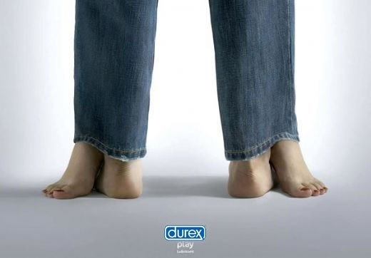

# ＜摇光＞虚假盔甲

**好比那些买安全套避孕药时的窘迫，好比那些去无痛人流的羞耻横溢和满心狂乱，好比那些被室友看到看黄片而顿时的脸红耳赤。再好比，礼貌谦逊对待傻逼时内心的操他妈，背后说人坏话爽死自己时潜藏的被当事者知道后的尴尬。再比如，20多岁的女生听到谈论性生活的内容要捂着耳朵摇头说自己没有听见，自己写了情色状态后发出之前还在前面加个“转”字，没有勇气在页面上打出A片、阴道、阴茎这样的正名，默默地只说出了“下面”这样的隐喻。** 

# 虚假盔甲

## 文/米粲（武汉大学）

最近遇到几个男生都说不喜欢女生烫头发，说还是长直发最好看，一副长直发的妹子才是纯粹清纯的好妹子的样子。正好我也在留头发，走在路上我经常瞄别人的头发。长直发明显分两种情况，一是自然的长直发，大部分发质一般的女生的长直发看起来都是有些毛糙的，洗完甚至是干燥的，发尾也是开叉的，自然状态下大部分都是像马尾巴那样蓬松的，略有些纠结的，确实谈不上美感强烈。而另一种情况是那种妥帖柔顺，根根都很贴合，黑黑亮亮，所谓丝绸一般的头发。有这样头发的美女，被称为清纯的典范。我也很感到，触摸这样的头发，就像触摸大腿内侧那些细嫩的皮肤一样，让人爱不释手。但就我所知，至少很大一部分这样的头发，都是烫过离子烫等等更为复杂的折腾程序的。

这样看来，男人们不喜欢女人烫头这样的说法，多少是被某些潜在的道德观洗脑之后产生的错觉。既要求妹子是那种21世纪的漂亮，又要求妹子心态纯洁简单，不怎么打理自己也气自华的样子。这一点我之前在老米身上就发现了，他最烦老陈烫头、买衣服之类的事，但是出门吃饭的时候，又要求其穿好看一点，不要穿那些太过时的衣服，打扮也要精心一点。 我的主题并非要谴责以老米为代表的男人的这幼稚的虚伪，甚至副主题也不是，更喜欢走在一个攒劲的人身边也是人的本能，是虚荣心的需要。或者我不要使用“虚荣心”这个贬义明显的词语，换成是“自我实现的需要”好了。其实我想说的是，当我们生理心理的确实需求和道理观里某些符号化的规则产生了冲突，我们该如何挣扎？ 好比那些买安全套避孕药时的窘迫，好比那些去无痛人流的羞耻横溢和满心狂乱，好比那些被室友看到看黄片而顿时的脸红耳赤。再好比，礼貌谦逊对待傻逼时内心的操他妈，背后说人坏话爽死自己时潜藏的被当事者知道后的尴尬。再比如，20多岁的女生听到谈论性生活的内容要捂着耳朵摇头说自己没有听见，自己写了情色状态后发出之前还在前面加个“转”字，没有勇气在页面上打出A片、阴道、阴茎这样的正名，默默地只说出了“下面”这样的隐喻。 

这种无损于他人，甚至很难让人深刻反思的道德感越强烈，越让人的自我认识之路徒增坎坷，或者说自身成长就越矛盾。我在我老娘面前出演一个性无知的老萝莉就已经够辛苦，自然厌倦了自编自导自演的桥段，无理由的道德感将人束缚地连自己独处的时候都感到面前坐满观众。 有人说谣言可怕，但我觉得别人在不知不觉中给你潜移默化的生活定式更为可怕。好比说我有个朋友，她能戳破很多辐射方面的谣言，但是她却坚决认为，男朋友应该像达西那样，默默地为她做了很多好事却从不炫耀，如果他炫耀了，说出来了，那么他就不好。好比我有个ex， 拒绝让他朋友看到我校内，要求我必须扮演一个所谓传统的女孩儿，这种躲躲闪闪遮遮掩掩最终导致我对他好感全无。再好比开篇男生认为的，女生烫头不好。这些深入人心从不质疑也没有必要的谣言或是生活定式，就像一副盔甲，总觉得穿上之后别人才能认为我雄伟壮力，没有弱点，无坚不摧。而换个角度，它不过是一所人形监牢。  

（采编：陈锴；责编：陈锴）
