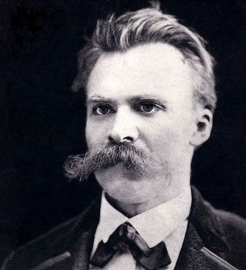
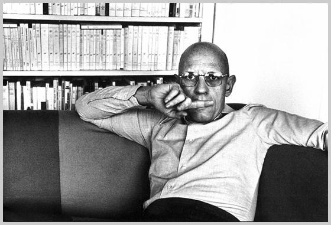
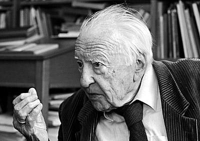

# ＜摇光＞虚无主义——我们的深渊与命运？

**福柯一再强调思想的任务是反思我们自己的历史性现在：什么样的历史构成了我们的现在与现在的我们？我们的现在处在什么样的历史之中？如何才能走出我们的历史性现在而成为另一个自己？一句话，我们自己的历史性现在是一个什么样的现在？**  

# 虚无主义——我们的深渊与命运？

## 文/水底火焰（暨南大学）

 

在思想史上，人们对欧洲虚无主义（Nihilismus）的论述可谓丰富多彩，每个人站在不同的立场下会产生不同的理解，这当然是很正常的事情。然而，站在现代性的入思进路并与神学维度相结合来观照与考辩欧洲虚无主义的历史与流变，则不得不说是一个很新颖的视点。

欧洲虚无主义紧紧的关涉到柏拉图主义的思想传统，直贯启蒙运动到尼采、海德格尔，甚至当下的政治哲学家列奥.斯特劳斯等人对传统丰厚遗产的反思与批判。现代性思想可谓其中的一根红线贯穿其中，各个时代的思想家联系其当下的历史任务和社会发展进步的方向等都对虚无主义做出了不同的探讨和某种程度上的践行。人们还在这些对抗与斗争的过程中一方面享受了现代性（虚无主义）的好处的同时，另一方面也尝到了自己种下的苦果。

与现代性密切关切的虚无主义的进程与后果，尤其是在启蒙运动以来，一直遭到思想家考量与测度社会进步与人们走出历史虚无、走出蒙昧的价值尺度与标杆。在十九世纪末期，随着尼采等人开创的非理性思想盛行，在宣称“上帝死了”之后，人们心中的价值和真理遭到了无情的贬黜，人们更是深深的切身体会到虚无主义弥漫的两面后果，且更多的是陷入到这个深渊中不能自拔。启蒙现代性的物质层面的无限度发展使得人们对的内心即精神世界对外界的感悟与体验发生了巨大的倾覆与翻了个个儿。现代性自身产生了自我难以克服的后果，虚无主义在思想界弥漫开来，其直接后果就二十世纪的两次世界大战，还有伴随而来的奥斯维辛这个沉痛的心结。

因此，对现代性与虚无主义的诊断与克服就提上了人们尤其是思想家的思考的显著位置。这个精神危机一直困扰伴随着大哲们的思考。传统的价值和真理遭到了怀疑，并在一片批判的声中摇摇欲坠。既然旧的价值体系已经不适合了新形势变化的需要，那么新的价值尺度又是为何呢？人们再也拿不出一套整一的且具有统领位置的标尺，这样的后果是人们各自站在自己的立场上都拿出自己拯救方案，无疑人们不得不再次陷入众声喧哗的尴尬时代。

尼采宣称，虚无主义就是最高价值的自行贬黜。尼采在《权力意志》中就明确指出：“虚无主义就站在门口，这个最不可思议的不速之客是从何而来的呢？虚无主义意味着什么？——意味着最高价值的自行贬值。”尼采说的最高价值与真理有相同之处但是也存在着重大的区别。尼采一反柏拉图主义，站在柏拉图主义的反面，海氏说尼采主义就是“颠倒了柏拉图主义”就是这个。理念与超感性、真理、理性相连，而假象则与感性、虚无等相接，两个世界（真实世界与假象世界）的划分是尼采主义反柏拉图主义的地方，而海氏则断言如此的诊断最终也没有克服形而上学带来的灾难。海氏与尼采不同，认为存在的别遗忘才是虚无主义的本质，所以重新的规定存在、为存在去蔽并让其走向澄明才能从根底上来克服虚无主义的蔓延，才能拯救人类自身的危机。

对虚无主义的克服的前提是首先对其有清醒的认识，因为对其进行一番爬梳与考辩测度便成为了我们深入其中的当然问题。清楚了问题的所在才能开出更好的诊断方案，而每个人对此的不同了解有造成了不同的人开出了不同的方案。我们也对此进行一一的考辩与钩沉。

余虹对西方这一传统有着自己精到的了解，并在其梳理中融入了自己的态度与立场。那就是余虹的《虚无主义——我们的深渊与命运？》这篇文章了。让我们思及余虹所思之处，以期对此也获得警醒的言述路标。

文章一开篇就说：“福柯一再强调思想的任务是反思我们自己的历史性现在：什么样的历史构成了我们的现在与现在的我们？我们的现在处在什么样的历史之中？如何才能走出我们的历史性现在而成为另一个自己？一句话，我们自己的历史性现在是一个什么样的现在？”这个问题的追问，开始思的涌动。对现代性的追问就是对历史性的现在的描画与定位。以此引出了现代性的虚无主义，从而进入反思现代性的论域。尼采是虚无主义却是最引人瞩目，也是最为恰当的。文章认为，作为一个时代标记的“虚无主义问题”可以分解为三个方面：1.虚无主义是一种否定性的精神态度，即对曾有的生存世界之基地（传统信念）的否定。如此“否定”意味着什么？2.虚无主义之虚无指一种缺失地基的世界状况。如此“缺失”意味着什么？3.虚无主义给当代思想界提出了重建生存世界之地基的难题。“重建”如何可能？这几个问题是思想上极为棘手的问题，也是此文要解决的。可以说，余虹此文作出了一种有益的尝试。

文章在屠格涅夫的《父与子》中追溯了虚无主义的起源，进而分析介绍了美国学者尤金.诺斯《虚无主义：现代革命的根源》一书对欧洲虚无主义的剖析。尤金.诺斯分析论述了西方虚无主义的主要形态：自由主义（liberalism）、实在主义（realism）、生机主义（vitalism）和毁灭主义（the nihilism of destrction）,并在此基础上论证了它们的内在辨证关联。其中实在主义包括自然主义、实证主义、唯物主义和科学主义。文章认为，诺斯站在基督信仰的立场上来考辩描画西方虚无主义的面相与本质，把虚无主义的实质揭示为一场反抗并杀死上帝（超自然的真实或绝对真实）的现代战争，并显示了诸面相之间的历史与逻辑的辨证关联。与诺斯站在基督信仰的立场不同，唐纳德.A.科罗斯比在《荒诞的幽灵：现代虚无主义的来源与批判》一书中则站在哲学的立场上将西方的虚无主义一分为五：政治上的虚无主义、道德论的虚无主义、认识论的虚无主义、宇宙论的虚无主义和生存论的虚无主义。余虹对每一种形态进行了具体的钩沉，并与诺斯的论述进行比较分析，认为他们对虚无主义面相的描画是貌离神合的，虚无主义的实质是对哲学-神学传统的否定，也就是对西方文明的否定。接着，文章还分析了列奥.斯特劳斯《德国的虚无主义》一文对虚无主义的勾勒，列奥.斯特劳斯站在历史主义的立场上对之前的虚无主义及其代表人物进行了审察批判。但是余虹指出，他们三人对虚无主义的描画实质基本上是一致的：那就是将虚无主义看做是对奠基西方文明之基础的传统信念的否定与摧毁。

文章第二部分对尼采的虚无主义思想进了详细的考察和审辩，在具体的清理中，逐渐的彰显尼采对虚无主义思想的态度与立场，从而也为大多数人对尼采的虚无主义的偏见进行重新的纠偏。在对“最高价值的自行废除”的驳斥之后，作者分析了尼采意义上的虚无主义的两大后果。其一，虚无主义导致最明显是后果对作为传统文明之基础的哲学、宗教与道德以及虚构的最高价值的否定，对此，尼采是认同的。其二，虚无主义导致的最为隐秘的后果是存在论上的洞见掩盖了生存论上的盲视，尼采对此坚决不认同。因为在尼采看来混淆了存在论与生存论，以存在论的洞见掩盖了生存论的盲视，或者说，以一切存本无意义与价值的“事实性”掩盖了确定一切生存论之意义与价值的“必要性”。尼采在对虚无主义的反思中，结合着酒神精神与日神精神，用权力意志的思想来对抗苏格拉底-柏拉图之后雄踞西方两千年的形而上学对人造成的羸弱，据此，他区别了消极虚无主义和积极虚无主义两种虚无主义。因此，重估一切价值，要彻底的克服虚无主义，就要做重建的工作，重建价值、意义和真理，抛弃那种只是一味地否定而没有肯定的态度。只有这样才能消除上帝之死留下来的巨大虚空，才能为生存提供新的条件与基础。

接着，余虹又对海德格尔的相关思想进行了一番梳理，尤其是海氏对尼采虚无主义问题的回应、阐释与批判。海氏站在其“存在被遗忘”的立场上对虚无主义进行了清理，认为尼采对西方虚无主义的批判还没有跳出原有的窠臼而落入它力图克服的虚无主义之中，还是站在苏格拉底-柏拉图的哲学形而上学立场上作出的批判，因而是另外一种形式的虚无主义，它还没有从根本上克服虚无主义。具体来说，尼采从价值角度揭示了柏拉图的虚无主义，因而看到是价值之虚无，也因此忽略了存在之虚无，其对存在的遗忘而没有抓到问题的根本。在此，海氏在指出尼采对虚无主义的洞见的同时也揭示了他的盲视。海氏认为，虚无主义的本质是遗忘存在，克服虚无主义的方式就是“回忆”，或恢复对“存在”的思，而有关真理、价值、意义等问题也必须联系到“存在”之思。海氏提出了命运的安排，确立天地人神的游戏以求达到栖居本真的共在状态，如此才能克服上帝之死带来的虚空和无家可归的精神漂泊漫游状态。余虹在肯定其重大意义的同时也指出了海氏对此的两个弊病，一是此条道路无法上路，显得神妙莫测，人对意义、价值与真理的确立无所作为；二是，人是聆听者与接受者，人的位置被降低，神的地位物抬高了。列奥.斯特劳斯与此二者不同，他历史主义出发，对此进行了另外一番的批判，认为，要克服虚无主义则必须去除尼采式的癫狂与海德格尔式的神魅，在清明的古典理性中去寻找真理、意义与价值的恒常基础。就是要回到对“自然正当”与“超越理性”的朴素信赖，即回到对“天理”与“良知”的朴素信赖。显然，斯特劳斯主张回到传统中去，并在传统中重新解释传统，为现代的思想困境寻找思想根基。所以，余虹在此更为倾向于斯特劳斯的诊断与克服方案。余虹说：“在尼采、海德格尔和斯特劳斯之间，我更愿意靠近后者。”如陶东风所言，余虹在论述斯特劳斯的思想时候，显得由此而局促，捉襟见肘，没有了如前面论述阐释尼采与海德格尔时候表现出的大气磅礴与诗性激情，这些与其对尼采与海氏的思想在骨子里产生共鸣有很大的关联。

在此，余虹的批评思想（诗的思）反映出其浓厚的神学-神性之维，入思路口与方式，处处都表现出对宗教神学的视角与立场，加上其与后现代主义思想的结合，使得其思想更加的深刻与厚重，也更富于穿透力和张力。

或许，这一点正是余虹思想的迷人与光亮之处。

这篇文章对虚无主义的梳理与把捉，有自己的学理进路也有其自己的批判立场，使人们对之前曾有的但是模糊的关于虚无主义的认识得到了一种更为清晰与深刻的认识与沉思。余虹的清晰爬梳让人看后豁然开朗，有一种顿悟的快感，像是久爬崎岖山路而一下子来到了一马平川的辽阔平地的舒畅。正如其文章的开头所引福柯那句话一样：“福柯一再强调思想的任务是反思我们自己的历史性现在：什么样的历史构成了我们的现在与现在的我们？我们的现在处在什么样的历史之中？如何才能走出我们的历史性现在而成为另一个自己？一句话，我们自己的历史性现在是一个什么样的现在？”

我想，这些问题也切身的关涉我们自身。感谢余虹那精深的沉思。

 

（采编：许鹤立；责编：应鹏华）

 
