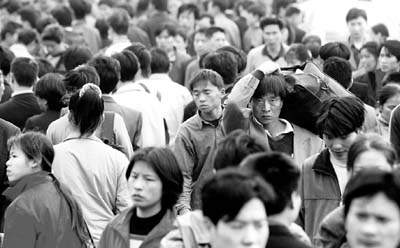

# ＜摇光＞观念在下，现实在上

**人与人之间，竟然是如此的相似。乡下的想去县城，县里的想去省城，小城市的想去大城市，大城市的想去国外……每个人都有爬不完的楼梯，但你必须得去选一个爬，因为人活着本来就没什么意义，我们不是释迦牟尼或耶和华，我们很难通过精神的阶梯爬向天国，我们只能顺着现实性的阶梯爬向远方。**  

# 观念在下，现实在上

## 文/董泽宇（中国传媒大学）

 

**1.**

那天和几位朋友聊天，其中有要出国的，便说到了留学的话题。我随口说了句，“能出国留学的大多家里有底儿”。没想到，一位朋友反应颇大，大吃一惊的表情像是在说“我们家可没底儿”。

Ta的吃惊让我也很吃惊——我不过是说了一句大实话么。固然出国留学有公费的，有全奖的，也有家中条件不佳举债支持的，但“大多家里有底儿”这话，想来应该没错，起码就我认识的情况来看，是没错的。

后来我想，可能是ta和我对“底儿”的观念不一样。在我看来，能支撑出国留学的家庭条件，在中国城市家庭中绝对算有“底儿”的，遑论整个中国。可是在ta看来，没准儿那也就是一般的水平。考虑到ta们学校的学生构成，我似乎可以理解ta的想法了。

在之后的聊天中，我一直有点心怀忐忑，生怕自己“说错”了什么——交流，哪怕是没有共识的交流，也是建立在起码相近的一套话语体系上的。当我们说到诸如“财富”和“贫穷”这样的词汇时，也许应该先抽出点时间探讨一下双方对其的理解到底是什么。这世界充满隔阂和不理解，一个人的不言而喻，往往是另一个人的不可理喻。

**2.**

既然说到出国，不妨说一件发生在我身上的真实故事：直到上大学有好一阵子，我都分不清GRE，SAT，托福，雅思的区别是什么，我只知道，要出国的话，需要考这些。

如果你和我一样，在一个三线（确切地说，是三线弱）城市长大，虽然上着当地最好的高中，但一切学习活动的安排和目标都以高考为核心，那我想，你会理解我的这种局限性。

比如前不久就有朋友和我说，小城市视野就是局限，如果高中的时候就知道出国这回事儿，知道SAT这种考试，没准儿现在已经在国外了。可那会儿周围所有人都在考虑高考的出路，完全局限在了里面，他的一个高中朋友那时候去了澳洲，现在已经是精算师了。

再之前，另一个朋友抱怨说，现在有点后悔自己以前没下功夫把英语实践技能（听说读写）练好，现在发现和同校的许多同学比，明显有差距。而在他们的行业中，无论是工作还是学习，英语实用技能都非常重要。

我当时说，这差距当然存在，但也不全是自己“没下功夫”的缘故。因为我和那朋友一起念的初中高中，我们那会儿的英语教学的确很少有实践技能的传授，绝大多数是考试技能（选择题如何排除选项，完形填空如何蒙词等）的反复练习。所以考试成绩都相当不错，但实用性方面，真的就是哑巴英语罢了。

更关键的是，当时没有实践英语的观念，固然老师偶尔会念叨“英语是一种技能”或“要敢于开口说”这类话，但在我们（起码是我）看来，英语真的就是一门高考科目罢了。诸如听力这种东西，能听懂固然好，听不懂也有考试技巧可以套用，至于口语嘛，反正又不考，随它去吧。再退一步讲，就算英语（考得）不好，我还有数学和理综嘛。

所以直到今天，我的英语一直很烂，口语听力暂且不提，就算是词汇量，也是少得可怜。很多时候我在阅读一些留学同学写的日志时，得调出词典查他们文中夹杂的一些单词的意思，然后方能恍然大悟：高中学过这词的！

也经常有人劝我“看美剧练听力”或“每天早上去操场晨读”，我除了刚开始有点儿激动以外，很快便偃旗息鼓了，后来索性笑笑就过去了。这里面固然有我个人的惰性这一因素，但我想，多少也会有一些少年时代养成的观念的影响——将一种观念替换成另一种观念，远远难于直接在一片空白中竖立起一种观念——我从小到大接触的人多和我一样，没什么特别远大的目标，小学的时候想去个好点儿的初中，初中时想考个重点高中，高中时想考个重点大学，大学志愿根据当时什么专业比较热门，再综合就业因素，由父母定夺——我的志愿算是完全自己填的了，那也只是选了中意的学校，专业近乎瞎报，只是想着学便是了。

更麻烦的是，观念这玩意儿，是无法擦去的，它只能被部分的掩盖。很可能兜兜转转绕了一圈，你才发现，你认识世界或处理问题的基准观念，还是最早的那个，你所谓的已经革新了的观念，只是在老墙上刷了一层新漆罢了。

**3.**

有一次我对朋友说，就算是坐地铁这种看似微不足道的事，对人的观念也会有影响。

朋友大惑不解，问怎么会。

我说，从小生活在北京上海这样大城市，会对乘坐地铁出行感到非常自然。而对于对其并不是习惯性生活经验的人来说，会产生种种不同的感受。

没错，可能你十岁的时候和父母去北京旅游过，也搭乘了几次地铁。但那于你而言，是一种生活的非常态，一种“旅行”的心态，与真正生活期间，差别是非常大的。

比如，我经常在北京地铁里看到穿校服的学生，他们对于距离的理解，肯定就和我十几岁的时候大不一样。对于他们来说，搭乘地铁（没准儿还要转公车）去上学，是十分自然的事，班级里许多同学也要这么去上学。但对于十几岁的我来说，上学就是出了家门骑上五分钟单车。

因此，他们幻想的和喜欢的姑娘的剧情，可能是一起站在轰鸣的列车里分享同一个iTOUCH，窗外是黑漆漆的墙壁，偶尔闪过一帧广告牌，空气里混合着不同人散发出来的不同气息；而我则是骑着单车，带着心爱的姑娘穿过低矮的郊区平房，远方是宽广的麦田，空气中有潮湿的泥土气息。

直到现在，只要不是赶时间，我出行仍会优先选择坐车，虽然北京的堵车时常让人崩溃，但相较于在罐头似的地下铁中不觉天日地穿行，我还是更喜欢透过窗户观看外面世界。

窗外的那个世界，大概我已经习惯了，但这种习惯，只是在原先的习惯上临时搭建的盆景罢了，在其之下，有一个慢慢远去却更加实在的世界。

而这些，其实也只是生活的一个微小细节所造成的区别罢了。我们的生活是由难以估量的众多琐碎所组成的，其影响也是错综复杂难以理清的，我们时常挂在嘴边的所谓“因果”，很可能只是强行提取出来后进行粗暴推导的探讨罢了。如果世界上有“因果”的话，我更倾向于认为“因果”是一个系统，或是“因果池”。我们只能很模糊地了解一件事的“因池”和“果池”，绝难知道到底是这个池子中的哪个“因”决定了另一个池子中的那个“果”。而因果池之间的传导机制，相当大的一部分叫做“观念”。

**4.**

世界上当然有林林总总的不同观念，若是大家各安其分，相安无事，倒也互相无碍。问题就在于，总有现实性的因素对观念世界予以倒逼。

比如说我这种异乡人，来到北京，自然会有很多观念上的冲击，期间必然存在很多迷惘和纠结。也许有人会说，“那何必非要来北京呢？呆在家乡不就好了”，问题是，“考上大学走出去”就是我们那儿的环境从小灌输给小朋友的“观念”啊……（笑）

有一次我和一个以前的同学聊天，问他会不会考虑回去。他说：像我们这样的，都已经回不去了，你在北京念书，家里人提起来都特别自豪，突然有一天亲戚朋友们发现你又回去了，心理上就过不去。

我说，这些都是外在的因素了，可以不在乎。

他说，那这么问你，以后你有了小孩，是让他随意生长，还是也希望他以后能去大城市呢。

我愣了一下，随即发现虽然我自己是个不太喜欢强求的人，但一牵扯到以后孩子的事儿，那种典型中国式家长的望子成龙心态不知怎么就冒出来了。尤其是我这种体验过大城市（这也是孤陋寡闻了，“香港人”也会看不起“北京人”）生活——其实只是很小的一部分——的人，起码希望后代可以有体验过后再做选择的机会，而不是直接命定在了何处。可一想到以后他们也要和我一样一级一级重点中学重点大学地往上考（也许中国的教育环境二十年后会有重大变化，但我不确信），和我一样以后在异乡做一个无户口的漂流之人（也许中国的社会环境二十年后会有重大变化，但我不确信），和我一样现在和以后忍受各种不平等对待（也许中国的政治环境二十年后会有重大变化，但我不确信），突然就感到自己真是没法回去了。况且我还绝不是那种典型的“进城青年”，若是真真正正从农村考到都市，怕是更加难以回去。

而且，就算回去了，也会有种种难以言明的不适应。前一天，你在听朋友谈论今后要如何纵横四海弄潮时代，一夜卧铺之后，耳旁已是母亲在和你絮叨亲戚之间的人情账该怎么计算和偿还。他们的观念都自有其道理，或可说是智慧，只不过环境不一，一者适用于全球化的国际都市，一者适用于封闭性的熟人社会罢了。只有你，夹在这两个世界中间，夹在儿时根深蒂固却逐渐模糊的观念与现时新鲜可感却终有隔阂的观念之中，慢慢被包围，挤压，窒息。

**5.**

贾樟柯拍《小武》的动机是上世纪九十年代末他回到家乡汾阳，发现那里正在进行大改造，许多旧房子被拆了，他突然意识到：中国的现代化进程已经推进到了三线城市。他决定用未经审批的剧本和临时拼凑的团队纪录下最后的汾阳与那些幼时的人。

我去年回家时，发现从前骑单车上下学路旁的田地，已经变成了商品房，标价5888一平米；而从前经常和玩伴们一起溜达的郊区平房群，已经变成了一片废墟。据广告牌说，那里会有舒适的居民楼，据广告牌说，那里会有繁华的商场，据广告牌说，那里有无穷的商机。有时候我出门转悠，竟会有些失落：高楼大厦已然见过太多，又何必非要掩盖我们童年回忆的自留地呢。

然而，这一切又都是无可非议的，只要你承认城市化是一个“应该”发展的方向。而我们，大多是承认这一点的。

我只是突然想到，人与人之间，竟然是如此的相似。乡下的想去县城，县里的想去省城，小城市的想去大城市，大城市的想去国外……每个人都有爬不完的楼梯，但你必须得去选一个爬，因为人活着本来就没什么意义，我们不是释迦牟尼或耶和华，我们很难通过精神的阶梯爬向天国，我们只能顺着现实性的阶梯爬向远方。

当然，你可以选择原地驻足，甚至嘲笑那些不断爬行的人：哈哈哈，你们是多么可笑，你们以为人可以达到什么么？！

但总会有现实性的因素打破你的停留。古老国度的栖居者再怎么从竹子和鲲鹏中获取人生意义，洋人的炮声还是会将他们的现实性碎尸万段，现代化由此成为前进的方向；江湖荒野中的少年再怎么沉湎于乡土气息与单纯人际，户口和税收还是会将他们的现实性倒逼到墙角，城市化由此成为前进的方向。现代化和城市化必然会造成许多裂缝与疼痛，况且，国家的现代化与国民的现代化，物质的城市化与心灵的城市化，从来都不是等价的。

也许我们只能在心灵的世界中为自己的观念世界留一亩三分地了吧，因为在现实性的世界中，故乡早已不复存在，未来又是难以揣测，我们必须顺着那天国的阶梯一级一级往上爬。

 

（采编：麦静；责编：麦静）

 
