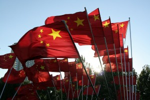
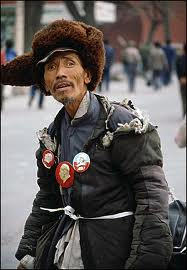

# ＜摇光＞言无不尽

**牺牲自由做一个合谋的沉默者能换来的最多也只是与自由的代价极不相称的当下的安逸，不受遏制的权力其恶是无限膨胀的，我们终将在这种膨胀之下发现自己的生活渐渐地逼仄起来直到透不过气。很多人在最近怀念起了先帝的时代，这种现象其实就在向我们揭示，这个country的确是在不断地侵占我们的自由和权利的，比起上个10年，上个20年，如今的我们更可以感受到国家机器的越来越贴近耳边的聒噪轰鸣。**

### 

### 

# 言无不尽

### 

## 文/戴冕（南京GFW大学）

### 

### 

大一的时候辅导员找我谈话，闲聊中他举了个例子说，像鲁迅韩寒这样的人，他们成天写文章鞭挞社会的丑恶黑暗，但实际上他们也只会说，从来不会做什么，也做不了什么。其用意无非是告诉我要少说话多做事。恕我心高气傲，我当时就觉得辅导员虽然研究生毕业，实际上肚里的货也顶多就是他的废物老师给灌输的那么点“妊娠哲理”，顶多“当代大学生”的水平。如今还要灌输给我，实在恶心。况且，我也不是没做事，我这不一直都在加强革命理论的学习么。 且不论诸如鲁迅韩寒们到底是不是只说不做或者说得多做得少，这种认为知识分子光说不做的观点本身就是极其错误的。知识分子是一种身份，身份赋予了一定的责任，他们的责任就是讲良心说真话。这种责任定然是与官员和政客的责任不同的，因为官员和政客是另外一种身份。辅导员的观点可笑的地方就在于他非但不去问责有责任办实事但只许了空头支票的官员政客（比如某旅游鞋湿人），反而指摘以说真话为天职的知识分子们光说不做。可能是因为知识分子比较文弱头上背后也没什么人，好捏些吧；而官员政客们都膀大腰圆且手握重权，要捏他们说不定就得挨一记重拳。但纵使好捏，也不代表就有理由去捏他们；纵使难捏，也不代表就毫无底线地向其妥协。 怯懦者不敢问责于强权，不要紧，有人在帮你说公道话，他们是“鲁迅”，他们是“韩寒”。但操蛋的是怯懦者竟然还去指责那些帮他们说话的人“光说不做”、“就会攻击黑暗面”，这真是神奇得令人发指！无怪说支国人贱。支国奴隶们深受奴役，竟然还见不得他人批判奴隶主，即使是为了奴隶的利益。若是内部有奴隶痛陈主人虐待奴隶的罪行，温和的就会说我就觉得我活得挺好啊，你不要听外边的人胡说八道，他们就是想把我们支国灭了然后让我们当奴隶。主人总是在进步的，你要相信将来奴隶的生活会改善的，若是没有主人，我们还不知去哪里做奴隶呢，要知道感恩；性子狂躁的便不会多说什么，直接跳起脚来破口大骂，你这奴隶奸，你这叛徒，你这外国狗！甚至还要痛揍那人一顿才高兴。 

 若是主人被外人说三道四，情形也类似。性子温和的奴隶会说我主人也不容易，毕竟要管这么多奴隶呢。我们奴隶country的事应该由我们全体奴隶自己决定（这话是最好玩的，奴隶country的事居然不是由奴隶主决定的！），外人不能干涉。性子狂躁的奴隶便跳起脚来，大骂关你屁事，老子就爱这个奴隶country，它怎么样老子都爱，你们外人不要想挑拨分裂趁虚而入搞和平演变！信不信老子打到你领土去！温和的奴隶总是表现得对主人十分体贴，可主人是丝毫不会为之动容的，相反，动容的倒一直是奴隶，为了奴隶主赐予的一点恩惠；狂躁的奴隶总是一副恨不得挣脱枷锁同攻击主人者拼个你死我活的架势，可主人是不会让其挣脱枷锁去拼命的，一旦尝到了自由的快感，奴隶们就会找主人拼命了。所以主人一般都是用链子拴着奴隶，让奴隶为其辩护同时朝批评者狂吼以显示支国奴隶的伟大力量。 好在这个country并不是所有人都甘于为奴的，异见还是顽强地存活着，并且一直在竭力表达许多人最基本最正当却竟无法得到满足和保护的诉求，誓死不屈服妥协。虽然在这个country里，异见并不能直接改变当局的行为立场，很多时候都显得苍白无力。可倘若没有异见，当局便会更加厚颜无耻堂而皇之地以“代表人民利益”自居，行更加苟且卑劣之事，因为大家都沉默了。全体的沉默代表每一个人对当局的行为都是容忍的，赞同的，拥护的，纵使是忤逆人性的恶行。恰恰是这些押上生命赌注的异议者们发出声音，13亿人的全体沉默才开始被打破，房间里的大象才得以从“背景”凸显为一个“图景”。异议的声音一方面鼓励着我们去公开地承认这头大象的存在，从而敢于公开地去谈论它以助其被消灭；另一方面也打破当局的自我意淫，让当权者意识到他们根本无法玩弄代表全体人民的把戏，他们所能代表的，只有他们自己这一群蛆虫而已。 事实上，我们现实的弊病多少都有了解。强拆是广为人知的，腐败是广为人知的，煤矿事故是广为人知的，高税收低福利是广为人知的，不合理的收入差距是广为人知的，食品安全漏洞百出是广为人知的，物价高涨是广为人知的，教育的各种不合理是广为人知的，法制环境恶劣是广为人知的，就业压力大是广为人知的，资源浪费是广为人知的，环境被严重地破坏是广为人知的。还有我们不知道的吗？即使对于一个不怎么关心政治的普通人来说，不知道的事情也很少了。上述的那些问题在每天的生活中都能有所体验。因此，从这个意义上说，每个人都有能力去关心政治，每个人也都有动机去关心政治，因为这些问题事关每个人的权益。正所谓你不找政治政治也会找上门来，当我们去找政治的时候，争取到的将会是更多的权益更可靠的保障，而当政治找上门时，我们只能是被动地忍受侵害坐以待毙。牺牲自由做一个合谋的沉默者能换来的最多也只是与自由的代价极不相称的当下的安逸，不受遏制的权力其恶是无限膨胀的，我们终将在这种膨胀之下发现自己的生活渐渐地逼仄起来直到透不过气。很多人在最近怀念起了先帝的时代，这种现象其实就在向我们揭示，这个country的确是在不断地侵占我们的自由和权利的，比起上个10年，上个20年，如今的我们更可以感受到国家机器的越来越贴近耳边的聒噪轰鸣。 

 出于礼貌的沉默是人际关系的润滑剂，但出于怯懦和逃避心理的沉默则会为自己编织牢固的灭亡之茧。波士顿犹太屠杀纪念碑上的话我们都清楚，但不妨再重温一遍： 

“When the Nazis came for the communists,

I remained silent;

I was not a communist.

When they locked up the social democrats,

I remained silent;

I was not a social democrat.

When they came for the trade unionists,

I did not speak out;

I was not a trade unionist.

When they came for the Jews,

I did not speak out;

I was not a Jew.

When they came for me,

there was no one left to speak out.

不在沉默中爆发，便在沉默中灭亡，幸而我们都曾在语文课本里读过这话，可惜而可恨如今的学生们恐怕再也读不到了。的确如此，对于沉默者来说，若是不从现在开始试图打破沉默，最终的结局必然是灭亡，献出自由换取苟安的行为是极为天真幼稚而又毫无意义的。世道崩坏，和每一个人无底线地容忍与缄口不语分不开。 马丁•路德•金说，我们这一代人终将感到悔恨，不是因为坏人的可憎言行，更是因为好人的沉默。既然如此，那么就请从现在开始，打破沉默，言无不尽。 

### 

### 

（采编：佛冉 责编：黄理罡）

### 

### 
