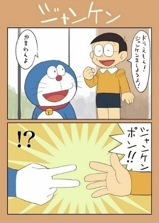

# ＜摇光＞让我们回归真实的世界

**为什么要这么复杂呢？为什么要时刻记挂着博弈论呢？无论如何，男生和女生都必须要首先明确自己的立场，并不是掏空心思地去揣摩别人。博弈论最多是一个技术问题，是达到目的的手段而已。况且，双方都知道，无论怎么猜测，都无法百分之百确定对方出什么，因为人类就是这么的复杂啊。**  

# 让我们回归真实的世界

### ——关于“男孩出剪刀，女孩出布”的第四种解释

## 文/ Annia Lee(北京大学)

 

有一对情侣，他们高中开始相识，彼此相爱，大学去了美国，那个城市有一个杀人狂，专杀恋人，他们成为了杀人狂的牺牲品，他们被装在机器上，一分钟腰部的刀会撕裂腹部，生还的办法是一个剪刀石头布的游戏机，胜方生存，他们决定共同摁拳一起死，可是女孩死了，因为他出了剪刀，女孩出了布。

这个故事今天在校内疯传，故事本身连同人们对它的三种解释。然而，不管是哪一种，你都会带来些许遗憾读完。或者，当你带着这个故事回归真实世界的时候，不禁毛骨悚然。

第一种：男孩为了救女孩决定自我牺牲，出了剪刀。女孩自私，使坏，一开始就谋划出布，结果害人不成，自己死了，活该。如果你的第一反应是这种解释，会把男孩的伟大和女孩的算计无限放大，最后变成女孩罪有应得。她已经死了，她失去了生命，连同她的名声。而男孩却收获了这两者。你会说，这是因为女孩的狭隘。但这何尝不是自己现实生活观念的投射？其实，很多男生都是这么看女孩子吧。不同人眼里这个故事的结局本就不同，如果你想到了这样的结局，不妨问问自己原因，是否曾经错过了什么。

第二种：男孩为了救女孩决定自我牺牲，出了剪刀。女孩凭着对男孩的了解，知道他一定会出剪刀，所以她出了布。这是一对相爱的恋人运用博弈论，想方设法要牺牲自己、让爱人活下来的故事。听起来，故事多美。但是，又多遗憾。男孩那么爱女孩，对女孩的了解却远远不够。他没有想到，他深爱的她竟然也这样深深爱着自己，甚至，这个女孩对他的理解与爱比自己更甚。男孩自由了，但是他却是悲伤的。女孩死了，但是她却是宽慰的。于是，他们有的有失，读者怅然若失。投射到现实生活，第一反应是这个解释的人，都是善良的孩子啊。但是，这种善良是否会让他们错解很多现实呢？即使这种善良能够真实地反映现实，大家有没有觉得男孩懂女孩懂得还不够呢？也许都爱，却注定伤痛，永远遗憾。

第三种：女孩为了活命，出了布；男孩知道女孩一定会出布，所以男孩出了剪刀。多么厚黑多么经济学的解释。两个人都在算计，最后女孩的死最多也只算是技不如人。没什么遗憾，带着冷漠，男孩离开女孩，女孩离开这个世界。如果你想到的是这样的解释，你自然不会觉得遗憾，反正不管结果怎样不过是算计，算计，再算计。然而，投射到现实生活中，也许给出这种回答的人他们已经对“理性人”的经济学假设习以为常了吧。然而，这种理性是病态的理性，它只应该活在课本中，成为简化分析的工具。人的复杂又怎能让它来概括？

是的，如果博弈，博弈，再博弈，解释可以是一轮一轮又一轮，不管道理都是一样的。并且，每种解释都摆脱不了一维性，即目的的单一性。每种解释，都或多或少留有遗憾。

这里的每一种解释，我们都可以问这样一个问题：男主人公看到女主人公的选择，他会怎么想；女主人公看到男主人公的选择，他又会怎么想。比如，第二种，男主人公可以认为女主人公是真的爱她懂她，所以才牺牲自己；也可以认为女主人公是不够了解自己，不够爱自己（虽然在本题中这是假象），他甚至可以很“变态”地反复循环思考。于是，误会就产生了，看吧，误会有的时候就是这么产生的。也许女孩希望自己被误会，但是误会就是误会。呵呵，不赘述。

于是，我想到了第四种解释，并且我也愿意相信第四种解释。

其实，男孩这么想的：

1）我出剪刀。如果女孩真的爱我，愿意守护我和她的承诺，她会出拳，然而深爱她的我又怎么能让她就这样死去呢，所以我出剪刀，让她好好活下去，而我宽慰地离去，为了她的坚持和守护。

2）我出剪刀。如果女孩真的爱我，愿意为我牺牲，她会出剪刀。然而，我又怎么能抛下爱我的女孩独自存活呢？所以，我不会出拳的，我也会出剪刀，因为我爱她，我要跟她一起死去。

3）我出剪刀。如果女孩不够爱我，如果那曾经的爱是山盟都只是逢场作戏，她会出布。这样，也罢。让我留下，让她离去。其实，这样做，我并不想，我只是更愿意相信，你是前两种人，而不是第三种人。所以，除了出剪刀，别无选择。

第四种解释的妙处在于它是组合决策，充满了理性，又充满了情感。它愿意相信美好，也不会对世界的丑陋毫无洞察。映射到现实，这样的人，往往才会得到真正的幸福。因为，他们珍惜爱他们的人，同时也能认清世事的不如意。他们冷静，但是却冷静得很有人情味。

不过，这种解释的潜在假设是，男孩必须让女孩相信他一定会出拳，并且男孩也知道女孩会相信自己会出拳。这是有可能的，比如男孩从不跟女孩说谎，所以女孩对男孩有与生俱来的信任。（所以说，信用啊，对于经济的发展是多么的重要；所以说，信息啊，对理性决策是多么的重要）

不过，如果这一假设并不成立。女孩也可以做出组合式决策。然后第四种决策同样可以无限循环。四种决策还可以组合演化出更多的可能的解释。

不过，循环不是我的重点，演化不是我的重点，想象力更不是我的重点。重要的是，我们如何去看待这个世界。带着理性的善意去看待这个世界，也许我们得到的会更多。

一些补充：

其实这篇日志最初并不是为了进行博弈论分析，而是想说明立场的重要性，即双方的动机是什么，双方愿意付出什么，又不愿付出什么。又因为，读者看到这个故事后的第一反应往往是自己内心倾向性的流露。所以，立场是最重要的逻辑起点，无论是对分析男孩女孩，还是分析读者自己。

其实，这四种解释只是众多解释中的一小部分。你还可以认为，当时男生吓死了，女生也吓死了，所以手一抖就出去了。什么都可以。这种想法的人，一般可能比较关注事物随机和不确定性的一面。你也可以说，可以一起把杀人狂干掉啊。那么可能你是一个喜欢think out of box的人。你也可以说，在那种情况下根本无法理性分析，不过这也许说明你也是一个性情中人啊。

不过，似乎Game Theory真的很受欢迎，很多人的都会想到这个。如果要玩，可以做这样一个假设，男生和女生都学过并且精通博弈论，这就可以变成博弈论中的博弈论了。再进一步，不妨做这样一个假设，男生和女生都熟悉这篇日志，因为正巧这是他们在博弈论课上反复读到的案例呀，于是他们清楚地知道剪刀石头布的结局有太多种可能。然后，他们都哭了。

为什么要这么复杂呢？为什么要时刻记挂着博弈论呢？无论如何，男生和女生都必须要首先明确自己的立场，并不是掏空心思地去揣摩别人。博弈论最多是一个技术问题，是达到目的的手段而已。况且，双方都知道，无论怎么猜测，都无法百分之百确定对方出什么，因为人类就是这么的复杂啊。

那么，你希望得到什么？又愿意为此付出什么？

 

(采编：傅旦妮；责编：麦静)

 
