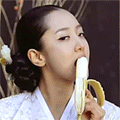
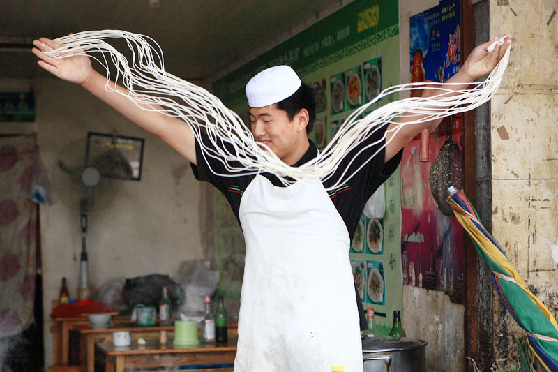

# ＜摇光＞论优雅与粗俗

**在一个优雅的社会里，人们可以收获精雕细琢的浪漫；在一个粗俗的社会里，人们可以收获到黑色幽默。无论是优雅还是粗俗，浪漫还是幽默，都应该殊途同归，让生活变得有趣。不能当做武器，去攻击他人，彰显自己。只要大家讲道理，抓实质，无论用哪种方式，总可以为同一个梦想走到一起。我的意见是，想法相同，手法不同，没有关系。求同存异嘛。**  

# 论优雅与粗俗

## 文/ 傅益东（东南大学）

 

小学三年级的十一假期，我第一次来到大城市上海。在去西郊公园的公交车上看到一长发女孩，坐在窗边吃佳宝话梅。只见她用拇指和食指伸进话梅袋，夹起一粒，送入口中。接着，女孩微微的捻捻手指，粘在手指上的话梅粉纷纷飘落。阳光透过窗照进来，很是好看。当时我心里就想，乖乖，到底是大城市，城里头个窝头切话梅都切则嘎优雅。

从此以后每当我吃起话梅，总会想起这个美丽的画面。这是一种优雅，但是如果让我选择一种吃话梅的姿态，我会毫不犹豫的选择把手指放入嘴中，吮吸一番。我觉得，手指头上沾上的话梅粉的味道，比话梅本身还要好。因此当我模仿起这个优雅的姿态，总会心痛手指头上那些话梅粉。也就是说，姿势虽然优美，但是若让我拿手上那些话梅粉换这么一个优雅的动作，我舍不得。我就这么安慰自己：在吃话梅这件事上，优雅已经有人干了。我干起来不会比他们好，何必多此一举呢？

我的意见是，优雅不能以牺牲舒适和乐趣作为代价，不能为了营造一个妩媚的画面，毁了那些利己的实惠。我并不讨厌优雅，如果那个女孩不这样吃话梅，我不会到今天还记得她。

优雅不讨厌，讨厌的是故作优雅。明明没有创造优雅的实力，还要摆出一副欲遮还羞的架势，通常让我们感到厌恶的，不是西施蹙眉，而是东施效颦。

我有一篇日志，把这个城市比作鸡巴的。有人当面指出这个比喻粗俗不堪，我问她可曾有优雅的比喻，她说可以比喻成糖葫芦嘛。特么你家的糖葫芦是中间一根棒，葫芦放两旁的啊？这位同学，两千字的日志你就记住个鸡巴，你让我情何以堪？

《让子弹飞》上映后，央视主播郭志坚在博客里痛批该片 “把手放在女性敏感部位，让观众感觉极不舒服……血腥场面和性暗示把我这个普通观众折磨的只能提前离席……..”郭主播，两小时的电影你就记住了把手放在女性敏感部位，您让梁朝伟情何以堪？

有一次吃完晚饭送一女孩回家，车子经过新天地，堵车。面对无边无际的车流，我说了句操，她正襟危坐的看我：你说脏话。接着扭头看着窗外说：爸妈从小就教我要优雅要有修养。我一时间无言以对。如果操字后面加个“你”字，的确不礼貌。但是在如此拥挤的路上，我怎会有此番心情？归根到底，说操是因为我想说，而不是因为我想操。我操什么？这么多车，傻逼也能看出，我就是再猛，也不可能下车把每辆车操一遍。你这么优雅，而我这么粗俗，坐在了同一辆车上。本以为可以求同存异，让彼此更和谐。结果却如此让人遗憾。霎时间觉得世界上所有优雅的事情都被别人做完了，留给自己的只有粗俗。看见没有？盘古鲁莽的开天辟地，刑天粗俗的操舞干戚，东施优雅的效着颦，南郭有修养的充着数。

故作优雅的人总是喜欢揪出一些他们看不惯的东西，贴上粗俗的标签，以此彰显自己的优雅。优雅有千万种表现形式，但是自我标榜绝不在此列。

在一个优雅的社会里，人们可以收获精雕细琢的浪漫；在一个粗俗的社会里，人们可以收获到黑色幽默。无论是优雅还是粗俗，浪漫还是幽默，都应该殊途同归，让生活变得有趣。不能当做武器，去攻击他人，彰显自己。只要大家讲道理，抓实质，无论用哪种方式，总可以为同一个梦想走到一起。我的意见是，想法相同，手法不同，没有关系。求同存异嘛。

总之无论在怎样的社会里，都应该反对庄严肃穆的假正经，都应该鄙视那些故作优雅。

因为人活着是为了做些事情，不是为了作秀。

**我来到这个世界，就是为了遇见一些有趣的事情，明白一些道理。**

小时候有过许多理想，捏糖人卖爆米花当修车师傅…..做个优雅的人不在此列

长大后发现有许多事情要做，看书逗猫，抽烟吃茶，自慰放屁，娶妻生子…..创造优雅的氛围亦不在此列。

人活着是为了什么？罗素说，是为了爱，为了对知识的渴望和对人类所遭受苦难的同情。这个优雅的英国绅士，同样没有把优雅算进去。我很荣幸和罗素先生殊途同归，不把优雅当做人生的大事去做。

故作优雅的人认为这世界上有两条路，一条叫做优雅，优雅的人走在优雅的路上，称另一条路叫做低俗……我才不在乎他们怎么讲呢，在我看来，高雅有高雅的好处，粗俗有粗俗的乐趣。选择那一种手法实现想法，那是你自己的事情。我是把利己的实惠放在外在形象之上的人，说我优雅，还不如挖出一块大的耳屎开心咧！

其实世界上只有一条路，优雅的人和粗俗的人走在同条路上，不断的创造出精致浪漫和黑色幽默，让世界变得有趣。优雅的人不以消灭粗俗为己任，粗俗的人不以鄙薄优雅的人为乐趣。我希望有一天醒来，优雅的人和粗俗的人各行其是，各不相扰，各得其所。他们一起，过着幸福的生活。

恩，这就是和谐社会。

 

（采编：陈锴；责编：陈锴）

 
