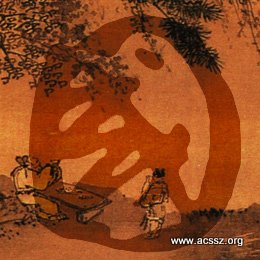
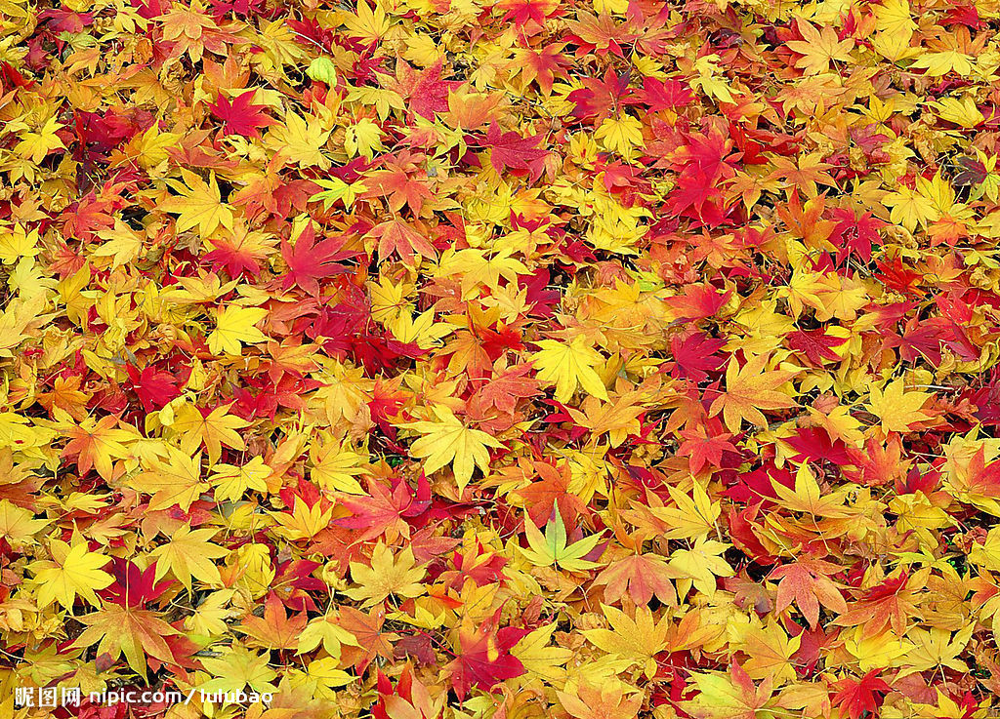

# ＜摇光＞论儒学的当代价值和使命

**儒学是活的，随着你思考的深入，它如同一个巨大的太极，生生不息。在文章的最后，我引用一段很简练的文字，去描述我们如何融入儒学：人做任何事情都有回报，再艰难的时段都可以经历过境。它只是在沉默的警告你，希望你自首，以此才可以面对后续。反省。等你纯净，再给你下文。时间就是这样的态度，人必须信任它。**

### 

### 

# 论儒学的当代价值和使命

### 

## 文/景玺龙（宁波诺丁汉大学）

### 

### 

我想起那样一个时代，诸子百家，竞相争鸣。 我面对这样一个时代，国学残古，嗤之以鼻。 所以，请容我先以墨翟的信念作为我文章的开端。 兼爱。 以兼爱之心，悟亲亲之理，识儒学之本，行仁义之道。就是我接下来想表达的一切。 书读得越多，越能清晰地感受到孔子的可爱之处。可爱，亲切，是众人给的评价，不用我在这里赘述。我想说的是，他是一个火种，能点燃你内心深处的欲望，从善如流的欲望，因为他离我并不遥远。也正因为如此，嘲笑儒学，你可以有很多理由，而其中最多者莫过于“大道理”三个字了。 姑且先不论这其中的是非曲折，先说说九零后吧。 我想我这一代人，起码是我所能接触到的同代人，他们都是受过漫画文化的影响的。没错，漫画，也是一种文化。也许这其中大多数人，对“格物”二字，连一个概念也没有；但是他们都曾为漫画中被称之为“燃”的剧情或坚持，打湿了眼眶。甚至不夸张地说，漫画影响了一部分人的是非曲直。当然，让我们为之心动的，大多不是坏事。如若说得明显一点，也许《大学·中庸》并不为我们所熟知，但是齐家、治国、平天下我们未必没有听过，也未必不懂。 所以当有人惊呼国学已死的时候，我说是他把只欠点燃的烟火踢进了汪洋大海。很多人说，中国文化有根深蒂固的奴性，那我想说，这个奴性是在庞大的文化认同体的基础上，才能得以实现，正如历史能让中国的政权交换更迭，却不能让中国长久地分裂。 

 所以我想说的是，儒学文化在当代青少年身上并非没有价值或不存在的，但是也许他们自己也都没有意识到。以此为基础，我将试图给出一个简单、直接的解释，去阐释我们如何去理解并运用儒学。 可能对国学稍微有点兴趣的少年，往往比起儒学，了解墨家更多一点。一个非常可爱的原因，墨家比较帅。他们都是侠客，有武功，能打仗，会创造，我们看过电影也看过电视剧。所以从阐述墨家着手，再基于儒墨之间的关系来展开，我认为这是一个非常好的关于儒家文化的切入点。 直接来说，儒墨之别在于他们核心信仰的不同，兼爱与仁爱。 兼爱，就是要平等的关爱你身边的每一个人。 仁爱，则有着相对复杂的过程，具体来讲就是亲亲。对待你的父母要最好，对待你的兄弟比这个少一点，对待你的妻子再少一点，对待你的朋友更少一点。 直观地看，当然都是看兼爱更顺眼一点。因为后者里面有种匪夷所思，无法被现代人立刻接受的思想。但是我想说，这也是为什么儒学千古不朽的地方。它牵扯到一种凌驾于知识之上的内容，我将它形容为，如同中医般的行为直觉。 也因为比起读书，我们更要生活。 而儒学，其实最为贴近生活。 三十而立，而我们相信每一个活过三十岁的男人，都很难去否定思维方式。他们的生活经历告诉他们，一个对父母不好的人，是几乎不可能爱别人胜过爱自己的。我相信古人在习读圣贤的时候，未必没有怀疑过这其中的种种，但最终说服他们的，不是儒学，而一定是他们的生活。 所以说，儒墨并不像表面上那样分野。这个世界有着无穷无尽的道理，而我甚至都不认为其中哪一个有错。只是儒学教给你的，往往是能让你自己说服自己的，而它并不与佛学道学所冲突，因为儒学的本质不是信仰，而是生活。这也是墨学与儒学的差别：兼爱只能是一种信仰，仁爱可以是你的生活。 我对于现代儒学的伤心之处，不在于没人懂，而在于没人身体力行。当一个道理在人脑中被闲置的时候，那它一定会成为大道理；但当你亲身去实践的时候，那不过是种会感染他人的习惯。所以孔子可爱，所以朱熹也能让自己的儿媳妇大了肚子。若是二人对视，只怕是孔子冷笑一声，你格竹子的物，看瞎了你那对招子，也不懂我为何周游不止。 那我为什么要讲兼爱呢？因为不止有一个人会发问，我为什么要坚持这些。这种时候，我倦于一个款款而谈的解释，更乐意奉劝你，这可以是一种习惯，如同兼爱般信仰的习惯。 “故君子和而不流，强哉矫！中立而不倚，强哉矫！国有道，不变塞焉，强哉矫！国无道，至死不变，强哉矫！”（中庸第十章《明道》）就是这么一段话，如果它是漫画中主角的独白，是电视剧中剧情的高潮，你我都会为之心动。这也是我为什么从不试图为善找一个阐释，因为它本该就在你心里。《论语》，就是一本注释，是一本用行为去阐述道理的书，而非用道理去解释行为的书。 以兼爱之心，悟亲亲之理，识儒学之本，我已经讲完了。但最后的行仁义之道，也是我们要追寻的一个使命，一个作用，却是需要契机的。 我在这里，要借用一句感动无数的人的歌词： “生活像一把无情刻刀，改变了我们模样；未曾绽放就要枯萎吗，我有过梦想。” 而我相信，历史上很多人，在他们之间做出的都是傻傻的选择。如同无间道里刘德华对于梁朝伟的一句，我想和他换。归根到底，生活是自己过的，所以感觉也是自己的。生而为人，没有谁亏欠谁的，如果这样，你能活得下去。 我读儒学的时候，机缘巧合接触了两个古人：王守仁和张居正。王守仁有一个很妙的心学，而张居正有一句知行合一。他们只有一个共同特点，就是让一个王朝往前延续了百十年。张居正也很可爱，他是嗑春药嗑死的，无怨无悔；药是一个叫戚继光的人送的。他们的根基，依然都是儒学。心学的东西较为繁杂，这里不提。仅说张居正的一句知行合一。 我问，什么是知行合一。 我再问，什么是欲望，什么是梦想，什么是理想。 我答，知行合一，我悟出了三层。第一层，就是你知道什么，就要去做什么。如同读万卷书，行万里路，书读得多了酸，路走的多了俗，两者相辅相成，不可偏颇；第二层，过程不重要，但目的一定要明确。如同荆轲的公子献头，这个过程可以不忠不孝不义，只用一死换世间太平；第三层，谓之傻。再聪明的人，也需要有那么一刻，明知不可为而为之。 所以，我的欲望是我的衣食住行，我要满足它，才能让我有动力继续前行；我的梦想是成为什么，让我的心得以自由；而我的理想和这一切都无关，无论我是什么，我都要为别人做些什么。 当把这一切返回头去看孔子的时候，我惊叹一句，这就是他，只是我当初没有看懂。活得洒脱，活得自在，却活得不妥协。所以，我希望每个同龄人都能先养好自己，照顾好自己，然后你闲了，迷茫了，儒学在这里等你。仁义之道就是仁义之道，哪怕只是给人解闲的，它也是乐意的。 从经济学的角度来看，这是一个OPPORTUNITY COST，如同物质守恒一般，天下没有免费的午餐；但是我给出这样一个定义：如同流动的经济可以凭空产生价值，儒学是教你体会一种，从每个人的十分中抽取一分传递下去，期望达成一个巨大循环的精神守恒。而作为中华文化，它的巧妙之处就如同中药相比于西医，他用一个简单的直觉，达成与一系列复杂的步骤同样的结果。这个巨大的精神循环，就是最直观的儒学的价值，不分过去还是当代。 儒学，其实很简单地改变了我的说话方式。我不会说，我花四年时间去爱一个人；而是我爱一个人，爱过了四年时间。在三维的空间里，长宽高是固定不动的，而将它流动在一个时间轴上，就构成了我们生活的四维空间。时间轴本身是不动的，动的是我们本身。这本身是一种对于蝴蝶效应（混沌理论）的印证，却也是一句简单的，明知不可为而为之。所以，儒学的当代使命，是产生一种在物质快速流动的生活条件下，产生一种对自我认同的效用。因为它可以给出一种方法，让人心安理得。 儒学是活的，随着你思考的深入，它如同一个巨大的太极，生生不息。在文章的最后，我引用一段很简练的文字，去描述我们如何融入儒学： 人做任何事情都有回报，再艰难的时段都可以经历过境。它只是在沉默的警告你，希望你自首，以此才可以面对后续。反省。等你纯净，再给你下文。 

时间就是这样的态度，人必须信任它。 

### 

### 

（采编：安镜轩 责编：黄理罡）

### 

### 
