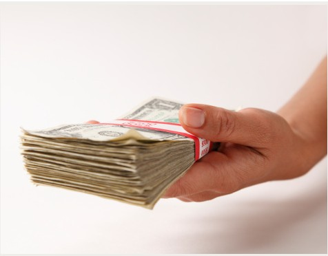
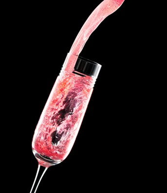

# ＜摇光＞说说“自私”和“理性”的问题

人就是理性的，人也是为了自己的目的理性着的，这个目的可能是为自己也可能是为别人也可能是兼而有之。这是人类行动的基本模式。正是这种不可消除的人的独特性、人与人之间的差异性，市场才会出现，这是人性使然，不是谁的发明创造，因此市场不是一种可以招之即来挥之即去的外在于人类的“制度”，可以随意调控和宰制，它和计划、调控、伟大理想、人间天堂什么的绝不是一个层次的东西。某些人当然可以蛮横地用这些东西来妄图控制甚至消灭市场。但“生活将把你们打败”。  

# 说说“自私”和“理性”的问题

## 文/刘学浩（天津师范大学）

经济学假定人都是“理性”地“自私”的，即我们总是为了自己精打细算。这句话非常刺耳，每每让人奋起反驳，举出一大堆理由说明人其实有各种各样的利他举动，同时人还会做很多傻事，因而也不总是“理性”的。进而有人相当蔑视经济学，说这门学问竟然建立在这样一个“不堪一击”的假设之上，而经济学家竟然还频频越界，可见多么愚蠢。我的一位老师在课堂上甚至说，由此可见西方经济学不牢靠，还是马克思的经济学靠谱，从商品这种实实在在的东西开始分析。。。

这些评论总体而言是错误的，但不全错。说不全错是因为人当然有很多利他行为，否认这个也没什么意思，另外人们也常常会做很多不可理喻的事情，我们称它们为“非理性”在直觉上也说得过去。说错误是因为经济学这个基本假定的意义并不在于它多么真实，而在于它多么好用，因而拿这个否定经济学也是图森破，嗷喂字耐异物。

因为这个假设用着方便能够较为成功地预测人类行为，配合一些局限条件能千变万化，“失灵”的地方也可以用一定方法补救。这方面的行家是张五常大师——实际上这个问题在他的经济解释里说得很清楚，我虽然学得不精却乐于重复这些东西。另外根据张大师的老师阿尔钦的说法，不会为自己精打细算的会被淘汰掉，剩下的都是为自己精打细算的。

这是一种解释，在我看来已经足够有力了。但我们还可以再细想一下。

我们常说别人不理性、非理性，但我们未必留意我们嘴里的理性究竟是什么含义。譬如有人大骂某人做事荒唐，常有人说此人“不理性”，背后的意思无非是言辞激烈情绪激动，不够体面罢了；譬如有人后悔自己当初不该斥巨资投资古董，现在赔个精光，当初真“不理性”，这里理性与否是跟着结果变的完全没准儿，如果这次大赚皆大欢喜理不理性的少有人提了；又譬如有人说方舟子打韩寒的假是“不理性”，这可能是指一、说话的人不乐见这样的局面；二、说话者觉得方的行为荒唐理由不能成立。这些常用的“理性”加不到一起去，有些是价值判断，理性的=合意的，你的话我爱听你就是理性讨论，不爱听就是非理性，环球时报最谙此道；有些是妄自尊大，自以为比别人想得周到想得多，却忽略了“人家是有苦衷的嘛”，别人这样处理自然有Ta的利弊权衡；有些是事后诸葛，结果不妙就全然忘掉在之前的精打细算中熬死的脑细胞。

因此在我看来，正常人都有审时度势精打细算的能力，甚至动物也知道要趋向温饱躲避灾祸，只是不同的人不同的动物在这方面有能力的高下分别，有不同的信息费用。有些人对人性的把握到位通过缜密推测能够根据他人的可能行为确定有利自己的计划，有的人消息灵通能先下手为强，至于是不是如愿并不重要。因为瞎猫碰上死耗子就说点儿背的黑猫警长略逊一筹是不合适的。另外，既然谁也不是谁肚子里的蛔虫脑子里的血栓，故而谁也不可能全然知道他人所面对的决策环境特别是信息费用，因此替别人的“非理性”捉级只能是一厢情愿地自以为是。因此人就是理性的，即会精打细算的，结果好不好别人爽不爽不重要。 再说自私。上面提到谁也不能完全彻底理解别人，因为一千个“钢丝”眼里有两万多个于谦老师的形象。每个人都自己面对（自己所处的）外界环境、加工（自己得到的）信息，用（自己的身体和资源根据自己的身体条件和资源水平）做出行为，比起他人Ta更懂自己，因此不从实际出发实事求是，而是从自己出发自以为是便是再正常不过的现象了。这就解释了为什么父母为孩子操碎了心跑断了腿磨破了嘴还落不着好儿，因为父母自以为为孩子勾画了美好明天，但对孩子而言那些都是明日黄花。我们当然可以把父母的行为说成是自私自利——孩子出息给自己长脸、可以光宗耀祖，更合理的解释是他们是在自己面对的一系列局限里“妄图”做对别人好的事情，做得好固然皆大欢喜，做不好也在情理之中。另外，不难理解，对于怎么更好地利他的争执不断（有人说靠市场有人说靠政府）并非全然是因为这些人是有私心的（譬如更多的政府慈善官僚们可以大捞油水故而政府官员总爱扮演救世主），而是因为现在利他成为“我的”目标，因此，我便要根据我的情况去实现它，很可能就与“你的”“他的”不一样。因此我们可以把人是自私的修改做人的行为是有自己的目的的。

当然，反对者仍旧可以说有些疯人、神志不清者精打细算审时度势的理性能力都弱爆了，意识混乱得可能连自己是谁都不知道了，何谈什么行为的目的。太有道理了，但我们的世界绝大多数人都是疯子么？你面对的世界中的人行为都是随机的么？当然不是，绝大多数人都在为了自己的目的或自私或利他地精打细算审时度势，他们成功获得利润乃至腰缠万贯名利双收，失败裤子进当铺乃至身败名裂家破人亡。因为资源相对人的欲望总是稀缺又因人们对不同的物的需求程度不同，故万物皆有不同的价且总在变动，又因人的禀赋不同，各专一门，在价的调节下，人们各展所长互通有无，他们为了实现自己的目的交换、合作，也为了实现自己的目的抢夺、欺诈，也学会设计预防抢夺、欺诈的诸种措施来保障更好地实现自己的目的。而且在合作交流竞争的过程中，人们的知识更加丰富，精打细算审时度势的本领也会逐渐升级，目的也花样翻新，在这些新的目的和手段的驱使和帮助下，人类会收获更多更大的繁荣。

所以，人就是理性的，人也是为了自己的目的理性着的，这个目的可能是为自己也可能是为别人也可能是兼而有之。这是人类行动的基本模式。正是这种不可消除的人的独特性、人与人之间的差异性，市场才会出现，这是人性使然，不是谁的发明创造，因此市场不是一种可以招之即来挥之即去的外在于人类的“制度”，可以随意调控和宰制，它和计划、调控、伟大理想、人间天堂什么的绝不是一个层次的东西。

某些人当然可以蛮横地用这些东西来妄图控制甚至消灭市场。但“生活将把你们打败”。

 

（采编：何凌昊；责编：尹桑）

 
