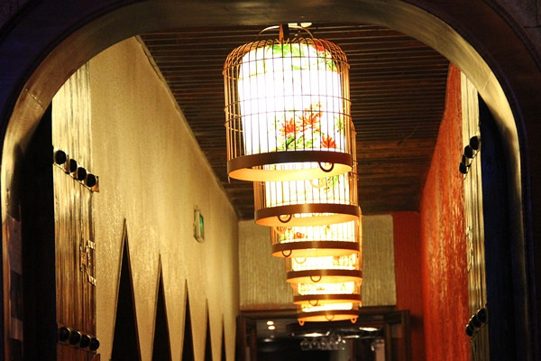

# ＜摇光＞请不要将社会气输入大学！

**“仁、义、礼、智、信”作为中华传统精神，本应该是读书人所必备之品质，现今，却成为读书人所不具备而必须要在社会生存中养成的习惯。那在这个全面发展，和谐盛世的国度里，我们真的进步了吗？** **** 

# 

# 请不要将社会气输入大学！

## 文/ 李俊霖 ( 上海海事大学)

晚饭时分，无意之间将电视调至新疆卫视，首先映入眼帘的，正是自己十分喜爱并认为是中国最优秀的激情足球评论员黄健翔。黄兄此次身着黑色短T恤，发型依旧，戴着麦克风，一脸正气，与张亚哲，孙虹钢侃侃而谈。屏幕右下角印有“天山论见”四字，遂知是谈话类节目。仔细一听，原来是三位同志正就“大学生职场礼仪学习”发表自己的看法。因本为大学生，自然多多关心大学生的学习，生活，工作以及大学的学术发展，教育改革问题，故未匆匆带过，认真听三位辩论许久。 入学以来，我便由衷地对大学校园全民热衷官场、职场规则培训厌恶。即便，本身这种培训没有多大问题，只是商人手段。有头脑者，在这浮躁求学风气，迎合市场需求，面对“有志”学生，你情我愿，你侬我侬，你唱我和，你卖我买，校园内外，一片繁荣，好不欢乐。自古至今，国人都有跟风习性，上至领导，下至百姓，连一向受人尊重的叫兽、砖家们都开始与权贵们通力合作，登台露脸，宣扬主义，以“开启民智”，稳定民心，更何况不明真相的广大学子，故而其中有无势力者都能一呼百应，培训机构收入滚滚，求学者则乐此不疲...... 可要问，学生在培训机构里真正能学到了什么？以我这“五好青年”的思维去思考，也只认为，培训机构帮家长，启蒙教育者补了二十年前欠下的道德礼仪课。 我对于“大学生职场礼仪学习”与节目中的三位谈者具有相似的观点，职场、官场礼仪自古以来就有，（虽处于万民眼压切齿痛恨官僚，却朝思暮想成为党员、公务员的现实里，这并不是一件坏事）这种政治生态方式深深植根于中华几千年来传统礼仪道德，授业于孔孟之道，君子遗风，所以职场、官场礼仪对于求职者，为官者必不可少。 可现实中，大多数青年人不仅不懂得高深的职场、官场礼仪，甚至连基本的礼仪都不知晓，即使有所知晓，从小也并未如古时读书人那样受到系统的礼仪训练，甚至毫无半点儿道德教育。在这个时候，却为了谋一个更好地出路，盲目跟风，匆忙在培训机构里学习职场、官场礼仪，接受社会教育，未免可笑。我不禁要问，接近二十年的教育何在？道德教育的缺失的原因？应有谁负责？该如何改变？匆忙的政治生态方式教育，这种灌输，对于涉世未深的大学生有用么？即使有用，能保证学生踏入社会后面对更复杂、更险恶现实成为两面三刀之人，重复上一代的错误，最终导致社会整体素质的低下？ 

再者，在如今官本社会里，官僚风气腐化，基于礼仪道德教育的缺失，这种培训灌输式教育很可能会矫枉过正。果真如此，我不敢想象，几年之后，我和如今纯真的朋友会变成唯唯诺诺，谄媚领导却对百姓死活不管，对亲朋心狠手辣之人......

我们中国人，都是一群优秀的投机家，我们都会整天渴望在既定的规则里投机获利，正如股市泡沫中，人人都希望赚上一笔，可人人都有极大可能做那个泡沫发酵后的承受者。我们不愿改变，更不愿接受自己是受害者的现实。所以我们即使深受磨难，也更愿意在体制内赌一把，成为最后灾难的受益者。可我们低估了风险的能力，这样的投机在巨大风险来临时，人人只会是待宰的羔羊，最后无害、获利的永远是拿着利刃的那些人儿。  几日前，见一同学的分享日志，名曰：《不要把学生气带入社会》，其作者认为进入社会后应具备七点：沉稳，细心，胆识，大度，诚信，担当，内涵。见此，甚是可笑，“仁、义、礼、智、信”作为中华传统精神，本应该是读书人所必备之品质，现今，却成为读书人所不具备而必须要在社会生存中养成的习惯。那在这个全面发展，和谐盛世的国度里，我们真的进步了吗？这是何等的悲哀...... 又想起了本校的一些同学，平时几乎没有阅读的习惯，如“叫你如何处理人际关系”，“看透别人的心”，“职场厚黑学”之类的书却看起来津津有味。我并不理解这种行为，并且对行为者惋惜甚至鄙视。愚以为，良好的人际关系并不要多少特殊技巧，其应根据亲疏关系而不同，但根本的一点肯定是真诚，善良，要说真的有技巧，那就是做人的礼仪，这，会让对方看到轻松自在，使自己变得更易于亲近。而看透人心的书籍更是扯淡，自己千方百计叫人看透人心，却不想让别人看透人心，何等流氓无理。至于厚黑学，则是特定人群的红宝书，对于一般的平民百姓最没必要...... 所以，最后斗胆询问一句，当你还是中国少年时，学会了勾心斗角，唯唯诺诺，你真的觉得这是一种成就吗？ 大学，是思想的圣地，由不得半点的玷污。有人警告吾等涉世未深却胆大包天者不要将大学气带入社会，可我仍做一次胆大妄为之人，请不要将社会气输入大学！  

(采编：陈轩 责编：陈轩)
