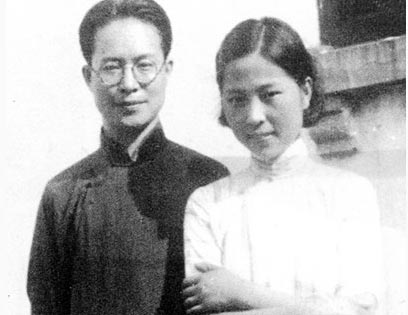
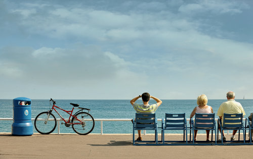

# ＜摇光＞读《人生容不得两个人都正确》

**爱情终结了孤寂生活，它所要求的就是我们交出那一份还带着体温的自私。纵使疲惫，颓丧，茫然，清贫，只要始终不改那个饱含英雄主义情结的二逼笑脸，就已经足够。**  

# 读《人生容不得两个人都正确》

## 文／高见（吉林大学）

 

“六十多年过去了，面对书桌上这几组文字，我不知道是在梦中还是在翻阅别人的故事。从文同我相处，这一生，究竟是幸福还是不幸？得不到回答。我不理解他，不完全理解他。后来逐渐有了些理解，但是，真正懂得他的为人，懂得他一生承受的重压，是在整理编选他遗稿的现在。过去不知道的，现在知道了；过去不明白的，现在明白了…太晚了！为什么在他有生之年，不能发掘他，理解他，从各方面去帮助他，反而有那么多的矛盾得不到解决！悔之晚矣。”

这是一九九五年八月，《从文家书》成稿之时，沈从文遗孀张兆和在后记中的一段感言，我就是在看到这里的时候忽然想哭的。爱情给了每一个人以唏嘘和说教的权利，但说及自己的抉择，又有几人不带有一丝遗憾与歉疚？终其一生，对于这样庞大的命题，我们所作的全部都不过是修改自己以接近真实，真正的完满爱情，恐怕并没有人见过，只求此时此地的相许心安，便是死而无憾。但这并非是每一对夫妻或恋人所能体验到的，甚至对很多人来说，那份痛楚让人求死不得，其间的挣扎，无奈，隐忍，困惑，沉淀在本已经兵荒马乱的岁月间，苦不堪言。

既然要说爱，那么就没有道理可讲。我这么好，你为什么不爱我，这样的问题，那些爱到深处的人根本不好意思提，毕竟谦卑到了尘埃里去，哪怕唯一一件衣服都可以脱下来给对方擦鼻涕，哪儿还想得起自己有什么可稀罕？但这也是理所应当——恐怕，爱情确实不稀罕那些。只要她不爱他，哪怕他名满天下，狂热女粉丝能绕赤道几圈，在她眼里也不过是个穷丑矮猥琐男。一个人的怦然心动，是两个人的三生之幸。

女人是个矛盾的综合体。她们内心深处期待一种被征服的无力感，本能地受到强有力的男人的吸引。但是，又不希望这个男人在自己面前永远强势！罗曼·罗兰说：“在女人眼里，男人的力遭摧折是特别令人感动的。”女人最骄傲的事就是亲手包扎她所崇拜的英雄的伤口，亲自抚慰她所深爱的强者的弱处。这唤起女人的母性，这种能量一旦激发，就没有她所承受不了的苦难！但是，如果面对一个臣服于自己的男人，伤口、弱处又忽然成了她们鄙夷的对象！冷漠，就是与母性最不搭边的姿态。而这也是张兆和对待深爱她的沈从文的姿态。尽管她说话总是温言软语，但是丝丝寒意仍然从张兆和回避与沈从文相见的说辞中渗出来！容不得沈从文不自卑，如黄永玉所描绘的：沈从文“一看到妻子的目光，总是显得慌张而满心戒备。”

爱情中最大的遗憾，就是当男人日复一日地为女人打磨着自己的自尊，而女人则在日复一日的理所当然中，忘记了这男人曾经是，也一直是多么的骄傲和刚强。事情总是两面的，反过来看，假如男人够聪明，就该知道一面提醒着女人他其实依旧力拔山河，一面偶尔展露出倦容和伤口，给女人以接近的机会。只是，一旦聪明到了那个程度，这警惕多猜的女人，又终会在慧黠的男人眼中找不到了安全感。人人都是矛盾体，但这句话太多时候被我们用作借口，去掩饰自己内心失衡的事实。生活是一种艺术，要紧之处就是在于维护生命中两种相反而又相成的力量的平衡。相反相成是既定的，而维持平衡是应尽的责任。一个人的时候，失衡折磨的是自己；两个人的时候，失衡折磨的是整个关系。

快餐的年代，办事说话想问题，都求的是一个方便痛快。以上的一番话，其实挪到现在的语境说起来过瘾得多，无非就是讲，女人很贱。这话难听得很，但是很多时候女人的心思确实让人咬牙切齿——就如同男人的外貌协会，和挑三拣四。在所有人当中，选择接受心智成长的挑战的人，永远是少数，因为面对现实总要伴随梦想的破裂，和欲望的压抑，没有任何一个不想长大的人能咽下这口气。爱情简单，因为大多男女到了年龄总要去发展出一段来；爱情也很复杂，因为谈着谈着就枝节横生，纵横交错；爱情了不起，因为世上能有那么一个非亲非故两不相侵的人，有一天竟然能同床共枕血浓于水；爱情没什么了不起，因为就算爱到死，也还是有一点不亚于爱情的东西要去珍惜和奋斗，比如事业，比如友谊。

不知道从文一生中是否想过，假若当初没有用那低得离谱的姿态去追求张兆和，会不会让自己免于遭受这六十年的孤寂和委屈。假如我们都认同爱一个人就是要用对方所需要的方式，或许他真的不曾给过兆和一样东西，那就是一个女人在感情中所必须的棋逢对手，哪怕是装出来的。然而就是这一点让我心痛：人说自尊心是最肮脏的，我同意。那么沈从文换个追法，谁能告诉我那将成全张兆和的是什么？我们大多希望爱上自己的人也是个不差的选手，就算没能成功。因为对手总是最能抬高一个人的身价。然而是我昏了头吗，竟然要去认为真心爱一个人，本就是卑微到语无伦次，被追求者无论是男是女，总该先体谅这份苦心。毕竟都是青春年少，没有任何一个正当年纪的人的尊严就活该被踩在脚下，只因他或她先动了情。兆和假如在遇见从文之前也有过一段那样的情感，或许之后与从文会更美满？毕竟人总是自己痛过，才格外疼惜其他痛着的人。胡适试图做两人月老，结果有点折翼，写给从文的信里倒是一针见血：“你千万要挣扎，不要让一个小女子夸口说，她曾碎了沈从文的心…此人太年轻，生活经验太少…故能拒人自喜。”

我没谈过啥五花八门的恋爱，但听说过太多的故事，与我相仿年纪里的孩子，少有几个与爱人之间没出气斗狠过的。从文兆和当年也正是那样年纪。只愿一年比一年聪明的年轻人，总有一天可以提前放下那份只为自己的骄矜，温柔对待身边那一位，以免醒悟来得太迟。对的你没有看错，一个在厕所里便秘的胡因梦，还是胡因梦。一个一激动就流鼻血的沈从文，也还是沈从文。如果对爱人的崇拜会随着接近而崩塌，那不是说明爱人不值得崇拜，而是说明那人不懂得崇拜是什么。面对现实并依然感觉那很美丽，偏偏就是那么难。

我坚信，爱的期许不在那些腻得慌的小细节，虽然那确实很甜美。你爱，或者不爱，苦逼就在那里，不增不减。甚或说一个有了爱人的人生，要比单身的人生更具挑战，因为从此以后一个人的生命牵涉到了另一个人，尽管没有人能为其他人人生负责，但大家还是纠缠在一起，所以向前走的时候就需要更加小心。假如一个人对我吹嘘已经有了家室，但却依然保持着和单身时几乎全等的生活状态并且全家上下相安无事，这人无法得到我的羡慕，因为他不如干脆单身。假如一个人对我吹嘘成家以后的日子好过了多少多少，任何事情都有老公老婆宠上天，这人更是幼稚得离谱。虽然说起来老气得很，但爱情确实意味着很多，爱情对于成年后的我的意义，大概相当于入队对于七岁的我的意义——都是1找到组织了，2人生不一样了，3以后要承担责任了。

原本是粪土当年万户侯的少年，原本是四十五度角自拍连续一百张不够的萝莉，心甘情愿拜倒于儿女情长，愿意鞍前马后，愿意洗衣做饭，愿意将当年天花乱坠的梦想一一收起而挽起买菜筐，愿意为丈夫洗足有自己两倍大的袜子，愿意学着怎样为妻子挑选棉质而非网面的卫生棉，愿意抱住满身是汗还没洗澡的他，愿意偷拍窝在椅子上剪脚趾甲的她，愿意早早生孩子，愿意给领导拍个马屁，这不是生活的倒退，而是一种开始。爱情终结了孤寂生活，它所要求的就是我们交出那一份还带着体温的自私。纵使疲惫，颓丧，茫然，清贫，只要始终不改那个饱含英雄主义情结的二逼笑脸，就已经足够。

“有一天晚上睡下，我说晚安。他说，晚安。他伸出右手握住我的左手，呼吸渐渐均匀，我以为他要睡着了。过了几秒我感觉他的指尖在丈量我手指的长度，然后说，真的比我的小好多。顿了顿，又说，再不让你干重活。”

你不知道，有多少男人女人，会在身后的几十年漫长跋涉中，用这样的温暖片段维系着一个弱女子的英雄气概。

 

（采编：麦静；责编：麦静）

 
