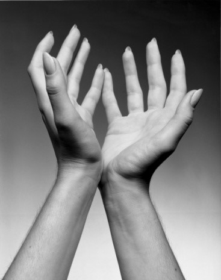
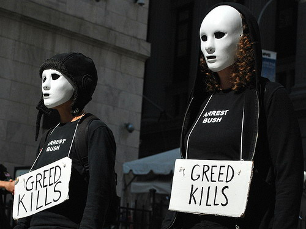

# ＜摇光＞贪婪症患者的自白

**我对现在的自己充满着否定和怀疑，而对想象中未来的自己进行无限度的意淫。我希望我以后能变成一个更好的人，精神上更加充实，心智上更加成熟，谈吐上更加优雅且有内涵。我曾一度觉得，我现在活下去的唯一动力，就是我还年轻，我还有时间有机会来达到对未来自己的那个高要求。但反过来说，以我现在的心态，我无法想象自己该如何面对一个已经老了但还没有到达我认为足够好的自己。其实不难想象，一定会崩溃的。**

# 贪婪症患者的自白

## 文/李东哲（吉林大学）

 

注：深度自省文，赤裸且血淋淋，不适者自行回避。

不常上Q，于是签名就想着得换一个比较能够长久代表我心态的话，于是常年挂着“Life is shit”。时常觉得自己活得很累，但自己总能被一句自我安慰的“活得有意义”掩埋掉所有的牢骚。直到前一段看一部电影时偶遇“精神贪婪”这几个字，才突然如梦初醒——这就是我一直寻找的那个词。

就好像知道我被医生告知得了某种病之后，身体才传来隐隐的不适。

在谷歌里搜索“精神贪婪”，结果很多，却没有一个是四个小红字连在一起的。贪婪似乎被限定在一个有限的空间和使用范围里，拥有其不容置疑的固定搭配和语义联想。而这样僵化了的用法则让人忽视了“贪婪”与其他词语的搭配，比如“精神上的贪婪”。处于一个无知的状态的人，是无法对自己想象力之外的概念进行分析和思考的。

我所谓的精神贪婪其实就是一种强烈要求自己变得更好的诉求，以及觉得自己恐无法达到的焦虑。想要自己变得更好这是人之常情，但倘若过了度，则就变成所谓的精神贪婪症了。

五大症状

姚远曾经提醒过我，说“不必每分每秒都活得深刻”，实实在在地戳在了点子上。我在生活中俨然是一个Fighter，但fight的不是什么挫折和打击，而是Fight for meaning。我会婆婆妈妈地替生活中的每一个细节寻找其意义，为每一件事情挖掘其深层次的原因。且不论对与不对，这样的强迫足矣让我疲惫。以至于在找到微博这样一个绝好的平台之后，这种趋势呈现井喷式的爆发，朋友不得不经常要忍受我矫情且略带酸腐气息的自以为饱含哲理的深沉感慨。时刻寻求意义却也因此陷入巨大的迷茫，此乃精神贪婪症症状之一。

我经常睡得很晚，躺在场上久久都不能睡去。辗转反侧都是在为自己、为自己的未来会成为什么样的人、为自己如何才能变得更好而焦虑不堪，像是有块石头压在胸口，不断喘着粗气。多虑失眠，此乃精神贪婪症症状之二。

我不怎么玩游戏。不是因为我不喜欢那种玩的过程中的愉快和成就感，而是在结束游戏那一刹那，我难以面对内心的内疚和自责如猛兽般对自己的拷问。荒废时间的愧疚感轻而易举地击溃立足未稳的快乐。我深陷于这种负罪感之中，以至于之前的快乐和满足在这一刻都无阻挂齿。一心埋头于深刻从而忽视单纯简单的快乐，此乃精神贪婪症症状之三。

我会尽可能地去读书，以满足那个更好的自己在精神上的需求。但我很少反复读一本书，哪怕我如何赞不绝口。我所做的就是读毕，匆匆在豆瓣上标记过后，再匆匆地打开另一本书，不会留下太多回味和咀嚼的时间。而看着豆瓣已读上数目一天天的增长，就好像是看到希望中未来那个更好的自己在朝自己一步步走来，于是便才安心。幻想一口气吞下所有书籍变身精神上的胖子，功利，此乃精神贪婪症症状之四。

我的交友观也受此影响。我会偏向于选择年长的朋友，仿佛这样就能受到更多的启发或是获得更有意义更有营养的沟通，意义在我看来大于天。我也会时常觉得，人从本质上来说就是孤独的，因为基本不可能找到所谓的Soul Mate来真正的理解你、懂你。我会刻意去寻找那些能在在精神层面上和我交流的人，去找那些能和我进行一些严肃问题讨论的人，已满足我在精神上的追求。但从而也无形中排斥了很多在我看来毫无营养但却真情实意的友谊。畸形的交友观，此乃精神贪婪症症状之五。

我对现在的自己充满着否定和怀疑，而对想象中未来的自己进行无限度的意淫。我希望我以后能变成一个更好的人，精神上更加充实，心智上更加成熟，谈吐上更加优雅且有内涵。我曾一度觉得，我现在活下去的唯一动力，就是我还年轻，我还有时间有机会来达到对未来自己的那个高要求。但反过来说，以我现在的心态，我无法想象自己该如何面对一个已经老了但还没有到达我认为足够好的自己。其实不难想象，一定会崩溃的。我全身心地活在未来的那个优秀的无可挑剔的自己的世界里，所想所做的唯一目的就是让它成为现实，而对现在的自己不管不顾。活在当下？呵呵，我会对你说，对不起，我正忙着让自己变得更好呢，没空。

虽说有“只有偏执狂才能生存”这句话的存在和安抚，但我病态的在精神上的贪婪和追求还是让我在生活中举步维艰。我变得更加自私，更加自我，也更加自我怀疑自我焦虑，而在生活的其他方面上，则多少显得力不从心。强烈且病态的贪婪导致我在生活中各个方面眼中的分力不均，我太容易被精神上的东西迷住双眼，而忘记了生活中的琐碎，悬在半空中，活在半空中。

那部让我顿醒的电影里面的台词是这样的：“被设计成那种对什么都很不满意的类型，好像永远都在试图改善自己的现状一样，当我满足了一种欲望，就会立马燃起另外一种欲望。我就是这样，精神上很贪婪，我想变得更好。永远也逃不出去。”

我想变得更好，但在“更好”这条莫比乌斯般的不归路上，我却迷失了自己，怎么逃也逃不出去。

 

(采编：何凌昊； 责编：尹桑)

 
