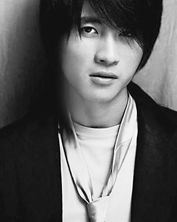
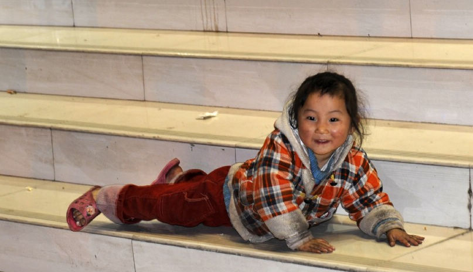

# ＜摇光＞闲话韩寒&黄思路

**而我们的官媒并不喜欢这样的人，他们喜欢的是“听话”的人。所谓的听话，更进一步讲，就是唯利是图。小孩子之所以选择听话，选择变乖，并不是因为认为听话正确，做乖小孩高尚，而是因为听话有糖吃，不听挨棍子。所谓趋利避害，不过如此。于是，道德就这样一点一点的消失了——我们只有在讲道德有利的时候才讲道德，比如说，范跑跑同学，跑是应该的，出来说就是你的不对了。于是，各种媒体上依然是讲述所谓“成功者”的故事，各种书架上摆放的依然是各种“励志类”书籍，各种的，可以复制的和不可以复制的成功。**

#  闲话韩寒&黄思路

## 文/ 丁栩翔（北京大学）

 

今天和各位亲们说起，我现在消息相当闭塞，不逛书店不走报亭不看新闻，即便是办公室的报纸全部都堆在我的桌上，我也表示无爱，了解世界的唯一渠道就是人人网上的各种分享，各种状态。

毕竟，有那么一些帖子，就像是大姨妈一样，时不时就要冒出来一下，比如说韩寒同马楠、刘亦婷、黄思路的PK帖。十年前，一群人对着韩寒指指点点，更多的人等着看韩少的笑话，结果准备看笑话的人自己成了笑话。

仔细想来，很多难以理解的事情都是很好理解的。先说说马楠，这逼现在自己都承认了，当年痛斥克林顿是为了让远在美国的前男友注意到自己。本来装逼就不是因为爱国，而是为了一己之私，那么后来的事情也很好理解了。骂克林顿是为了自己，嫁给美国人同样是为了自己，马楠和真理媒体无非是相互利用一下而已。顺便说一句，这逼当年对克林顿说的话是“所谓真正的自由，应该是人民有权自行选择他们想要的生活和发展方式”。这句话的正确表述应该把“人民”换成“人”，或者把“自由”换成“民主”，都是成立的。没文化不是她的错，还出来秀就是她的不对了。克林顿当时一定很郁闷，因为和人辩论不怕楞的，就怕没文化的，因为见到没文化的就要给他解释一些东西，一解释气场就弱下去了。

再说说刘亦婷。只要哈佛等名校在中国招人，就一定会有中国的中学生被录取，刘亦婷的出名只是在于其父母比较能来事，出了一堆书在那边装逼，外加一炒，就卖出了无数的书。人家既然大学都不想在国内念了，后来留在美国也是顺理成章的事情，没什么诧异的。

重点说黄思路。她最开始出名是因为拿了全国十佳少先队员。这个奖的得主一般是先把一些真的牛人挑出来，比如说赖宁、包八斤这种人属于真的英雄，该给是要给的；另外还有一些少年竞赛的牛人，比如说和黄思路一起获奖的有个大牛，名叫古力，嗯，大家都懂的。省下的就是很考验各种驻京办功力的。例如，和黄思路一起获奖的有个哈萨克族小孩，获奖原因是精通维、哈、汉三语，这就等于谁跑到苏黎世装逼的说一句，哥会说英、法、德三国语言，嗯，大家都懂的。接着就开始各种爆发，能弹钢琴能出书，各种成绩还很威武，最后还是学生会的干部。

十年前，我听说黄思路的时候，觉得她确实很牛逼，十年后，我觉得这真是个可怜的娃，为表示对她的尊重与同情，我不用称呼“马楠”的“这逼”，真的。黄思路属于很有追求的孩子，小时候大家都觉得会点乐器牛逼，于是她学会了乐器，后来大家觉得学习好才是真的好，于是她学习牛逼，再后来，大家又觉得当上学生干部威武，于是她成了学生干部，最后上了北大豪取三个学位远走哥大入职罗德公关，末了，被美国人娶走功德圆满。

每每看到这里，总是惊呼：给力啊！但是这是黄思路喜欢的生活吗？我觉得未必。更何况，看着十年前的黄&韩对话里，围观群众一口一个“社会需要……的人才”，最后呢？难道从小动用那么多中国宝贵的社会资源培养出的大才，最后去美国做了公关小姐就是所谓的“社会需要”？

但是，令人惊讶的是，中国的成功标准就是成为另一个国家的人，或者是，另一个中国的人。世界上确乎存在着两个中国，只不过分割两个中国的并不是一泓台湾海峡，而是一条看不见的鸿沟。真正把人分割开的不是国家，而是阶级。北京的CBD是一个很经典的地区，你可以看到各种Hermes，各种LV，也可以看到各种乞丐各种民工各种蚁族，一头是已经完全国际化了的世界城市，另一头却是真真实实的三流国家。黄思路们实际上代表了一种中国人，或者居留海外，或者回到中国，但却同样的以国际化的角度去思考，像西方人那样去生活。但是在另一边，一些人却拿着最低廉的薪水承受着最高强度的工作和最沉重的税赋，这又是另一个中国。韩寒能够和舒马赫一起在鸟巢里飙车，他本来可以跳到黄思路们那头去，但他选择留下来，这才是我最敬重的地方。

而我们的官媒并不喜欢这样的人，他们喜欢的是“听话”的人。所谓的听话，更进一步讲，就是唯利是图。小孩子之所以选择听话，选择变乖，并不是因为认为听话正确，做乖小孩高尚，而是因为听话有糖吃，不听挨棍子。所谓趋利避害，不过如此。于是，道德就这样一点一点的消失了——我们只有在讲道德有利的时候才讲道德，比如说，范跑跑同学，跑是应该的，出来说就是你的不对了。于是，各种媒体上依然是讲述所谓“成功者”的故事，各种书架上摆放的依然是各种“励志类”书籍，各种的，可以复制的和不可以复制的成功。

我时常独自在中关村漫步，看着各种形色匆匆的身影，看着各种列队整齐的售楼小姐们做着早课——呼喊着传销式的口号。是的，在成为黄思路的道路上，像韩寒一样，没事在博客上码字说一些真话实在是一种蛋疼——真话是应该说的，假如能够带来好处的话。而问题在于，没有人担心韩寒会因为车祸挂掉，却都担心他会因为真话而和谐掉，可见，在这个世界上，说真话实在是一件比飙车更危险的事情。

顺便说一下，韩寒没事在博客里鄙视各种共产主义实在是一件很蛋疼的事情。马克思放着专家不做，恩格斯放着富二代不做，列宁放着官二代不做，卡达尔放着象棋大师不做，格瓦拉放着周小川不做，非要做共产党人，你们本来就是同一种人。

（采编：陈锴；责编：陈锴）

 
