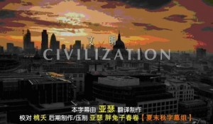
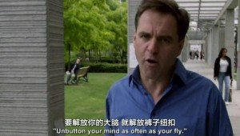
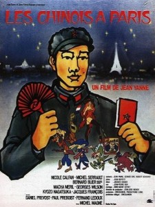

# ＜摇光＞阅片笔记

**对这一章的许多内容我比较持保留态度。但毕竟，若是有个温和，简朴的宗教，又不浪费纳税人的钱，礼拜的仪式又可以很节俭无需大张旗鼓浪费财力，还可以偶尔给民众励志一下打气一下，不如任其发展，把其当做一碗够大的心灵鸡汤来看待好了，至少比市面上的各种成功学演讲要靠谱。**  

# 阅片笔记

# ——文明：西方的历史？

# 《Civilization: Is the West History?》

## 文/刘三山（四川大学）

 

英国第四台制作的纪录片。主持人Niall分析了导致15世纪后的欧洲国家逐渐强大的因素，并总结出了让西方战胜世界上其他国家的六大“杀手锏”（killing apps)：竞争，科技，财产所有权，医药，消费，还有工作伦理。同时Niall在片中略带多愁善感地提出，他们这一代西方人会是目睹西方从鼎盛时期走向衰落的一代吗？

这种类型纪录片，一般都是会有不少历史典故，加上一些适合在餐桌上摆龙门阵的观点而组成。但是客观来说，即便不可能赞同里面的所有论点，也肯定能从里面学到不少东西。

下面就是这个纪录片里提到的现代西方社会六大“必杀技”，加上一些本人的看法，是为阅片笔记。

#### 1.竞争(Competition)

开篇就提到了明朝因宫廷斗争而放弃航海技术，从而将大航海时代的全球竞争优势拱手让出----我是第三次在最近的书籍或纪录片中看到这件事被提起了，已然是反面教材中最典型案例。

另一方面，即便明朝没有放弃航海技术，皇帝们又会拿这些技术做什么呢？

郑和下西洋，浩浩荡荡，但每到一个地方后所做的不过是让这个地方的土著宣誓“臣服”大明朝，捎带点地方土特产和奇异动物回中国而已。不像大航海时代的欧洲人，所到之处各种宝藏收刮了满满一船。

因此主持人Niall提出了一个问题：为什么中国皇帝派出的航海家们，对财富和金钱的渴望没有达伽马们的高？

纪录片给出的答案是：达伽马对金钱的渴望，来自于资本主义的地方自治所带来的城邦之间的激烈竞争。

而在中国，没有这种激烈的城邦竞争所带来的动力。中国向来都是一个庞大的，种族构成较单一的，中央集权的国家。如戴蒙得在《枪炮，病菌与钢铁》里说的那样，“中国人一直就是中国人了，几乎从它的有文字记载的历史的早期阶段就是中国人了。”

我的看法是，大一统的历史让国人都习惯了无条件服从那个远在千万里外的中央集权政府所颁布的一切法律和规定，即便这些规定不适合当地的情形。而碰巧，中国的历届政府和中国的大部分家长一样，以管得宽而闻名。

为了让这种大一统的统治方式从伦理上深入人心，统治阶级势必要提倡一些堂皇的能够深入人心的口号。Niall在纪录片中说：“太和殿，保和殿，中和殿，故宫最重要的几个宫殿都带有“和”字，和和和，这个‘和’（harmony）仿佛是大一统的密码，皇权统治不可分裂的象征。”

喂，这位主持人，你听说过和谐社会不？！

现在的情况要比建国后的前三十年要好得多，部分原因不过是中央将发展经济的很小一部分自主权下放给了地方政府。产生了张五常所说的“县际竞争”。

当然这种所谓的“县际竞争”的竞争领域实在是小而又小，体现在：一，仅仅局限于经济发展领域，确切地说是仅仅局限于招商引资领域的竞争，本质上不过是“客官你来我们餐馆吃饭嘛我们打75折比隔壁馆子的8折要便宜还吃100送50哦”类型；二，这种“县际竞争”的所面向的对象基本为大型企业，对本土草根创新企业的优惠政策则少之又少，也就是这个餐馆的75折优惠还只面向于单桌消费满一万元的顾客。

这种档次的竞争，距离当年欧洲城邦之间的竞争程度差远了。

欧洲地方自治的结果不仅导致了局部地区的富庶，而且这些“先富起来的”地区对中央政府和皇权则会不像其他地区一样敬畏。同时高度资本化竞争还带来了现代组织结构和职业的雏形。譬如治安官，市长，市议会，行业协会，议员……

相比之下中国“先富起来的”地区，比较其“五套班子”，可能和老少穷边地区的“五套班子”，并无太大不同。当然书记等一把手的思想可能会比较开放，但也就那样了。

节目的最后还提到了欧洲对外贸易所带来的很多意想不到好处，譬如引进了新的糖类和土豆等新的营养品，改善了生活条件，甚至一个国家人民健康状况和身高。欧洲人甚至得到有比茶叶更好的兴奋剂：咖啡。

这段略持保留意见，因为土豆和玉米这些作物也在同时期传入了中国，而且在很多地区普及开来。在动植物全球大迁移方面，天朝没有被拉下太多。

#### 2.科技(Science)

科技的进步是决定性的，一个科技落后的农耕国度，即便国君再英明神武，人民再安居乐业，但当科技发达的大工业时代敌人濒临城下一阵炮轰，什么都是浮云了。

令人惊讶的是几百年前，曾经的世界科技的先驱是穆斯林国家。但后来却莫名衰落，完全落后于欧洲。

纪录片中给出的结论是宗教的干涉程度不同。

在中世纪的奥斯曼帝国，尽管这个穆斯林国家在许多科技领域都取得了世界领先的成就，但科技和文化的发展依旧受到来自宗教的巨大压力。

奥斯曼帝国历史性的脑残时刻出现在1515年，谢里姆一世规定，发展印刷业的将会被处死，因为当时的穆斯林宗教认为，学者手书的墨迹被认为是神圣而不可玷污的。这个禁令直到18世纪才被废除。

这一决定简直如同一个国家在2000年的时候规定，切断所有互联网的线一样。从此奥斯曼帝国的学者们失去了了解世界先进文化和科研成果的渠道。

而奥斯曼帝国最杰出的科学家TAQIAL DIN由于其对1577年一颗划过伊斯坦布尔的流星的错误预言，导致他所筹建的天文台被迫关闭。

塔居丁有多牛，看看英文维基上对他的一句评价：“Taqi al-Din's method of finding coordinates of stars was reportedly more precise from his contemporary Tycho Brahe and Nicolas Copernicus.”

我的个人看法是，其实同时代的欧洲科研环境也好不到哪，从布鲁诺到哥白尼，直到十七世纪伽利略都被教廷威胁放弃日心说。但最庆幸的是，欧洲的分裂使得总有一些幸运的科学家，他们所处的国家拥有比较开明的君主，而且又不处于意大利罗马教廷的势力范围，拥有比较宽松的科研环境。意大利的学者被烧死了，还有德国的开普勒，英国的牛顿，丹麦的第谷等同行前仆后继。

这也算欧洲地区自治带来的好处之一。

基础科学的研究很重要。纪录片里提到，炮火的精确打击在很长一段时间内是西方保持军事优势的技术核心。而这个优势的背后，是牛顿的力学原理，微积分，以及由此推导出来的抛物线弹道方程式。

在300多年前，弹道抛物线计算公式就是20世纪的爱因斯坦质能转换方程。

穆斯林国家不是没有智者，他们当中的部分学者也意识到了穆斯林国家的衰落趋势，并撰写过各种研究报告上书皇帝，其中有奥斯曼学者提到，一个很重要的地方是：奥斯曼帝国的立法原则，基于的是宗教的伦理；但是在欧洲，立法最重要的原则是理性(The laws are invented by reason)。

必须放弃政教合一，将牧师、教士、僧侣手中的政治权力除去，让宗教伦理失去干涉科学研究的特权，成为一个世俗国家，才能实现这个国家的体制现代化。

奥斯曼帝国的统治者估计对这个建议纠结了很久很久，直到帝国崩溃，直到后来现代土耳其的国父凯末尔的横空出世。凯末尔采用了一种比较极端的手段进行了大刀阔斧的制度改革，废除了苏丹制，并使得土耳其全面进入世俗政治。

第一章里主持人Niall提到了，如果明朝没有放弃航海技术会如何？似乎东方的国度对于技术的态度似乎更倾向其于一种炫耀国家实力的意义，不会试图挖掘其巨大的实用功能和潜力。

其实，政府牵头的庞大科研项目的实质大部分都是这样。明朝的郑和下西洋，本朝的神舟载人航天，美国的阿波罗登月，苏联的太空计划，基本都可以归为国家实力肱二头肌的展现运动。

但在完成巨大的科研项目后，如果能通过各种渠道将这个过程中所诞生的各种技术和专利都转化到民用领域，这又是一个无穷无尽的宝藏。

诚然，如《战争的果实》里所描述的，许多时候，发明家产生了天才的构想或作出了一个伟大发明的草图，在这个发明能够被付诸于实，批量生产和广泛应用前，他需要一个实力雄厚，且足够疯狂，还不太计较短期商业回报的金主出资赞助，以便完善和改进。于是，好战的政府慷慨地伸出了手。而最疯狂的大规模科研项目，甚至直接由政府组织牵头。

但这个过程里面还有一个环节，就是当战争结束后，大部分发明和成果能从军用转换为民用，而不是火箭上天秀完了后所有的专利和成果都丢入机密档案中一封存就是50年。

#### 3. 财产所有权（Property)

我想节目制作者可能一开始是想把这一条换成“民主”的，因为在第一集里，Niall在白板上写的就是Democracy。但是最后又因各种考虑更换为了这一标题，所以整部片的基调最后被定位为“基于财产所有权的民主制度（Property-owning Democracy）”。

这无疑是针对西方发达国家的成熟民主制度的，更为精确的一种表达。

这一集的故事从欧洲古大陆开出的，分别满载了来自西班牙和英国移民，登陆到了南美和北美大陆的两条船讲起。如同物种入侵一样，两种不同教派，来自不同国家的殖民者，开始在北美和南美大陆上进行人类历史上最大规模的社会学实验。

若干年后，北美和拉丁美洲的结局却大相近庭。一个成为了世界科技和财富的中心，一个却如同马尔克斯笔下所描述的美洲那样，魔幻而曲折的社会进程，永远游离在现代文明的边缘。

Niall把这两个大陆在追求自由，独立和解放的过程中有何不同。譬如北美的清教徒殖民者大都勤劳朴实，抱着在扎根新大陆扎实打拼的理念勤劳工作（建设式殖民），而南美的天主教徒殖民者大都抱着“捞一把”的念头，只期盼在新大陆找到黄金白银后装满一船走人（掠夺式殖民）……但最后他认为，最大的不同在于北美新大陆一开始就确立了“财产所有权”，而南美则没有。

片中提到了哲学家（John Locke)参与起草的卡罗莱纳宪法（fundamental Constitution of Carolina)，认为虽然洛克的本意其实是为了在新大陆建立起贵族社会（宪法规定有土地方有投票权，即土地拥有者才拥有政治权利），但其在这部宪法中强调了个人所拥有的私产的权利，以及所有人通过劳动都可以获得50亩土地的条款，为北美未来的基于财产所有权的民主制度打下了坚实基础。

而在南美，被分配给个人的是劳力，不是土地。直到现在，南美许多地区农民和政府之间的最大纠纷的根源，还是土地问题。

南美的独立运动和现代革命，总是充满着激情的口号与传奇英雄人物，以及暴风雨般的战斗，之后一切又跌入万劫不复的轮回。

南美独立运动领袖玻利瓦尔，在革命战争胜利后，可能觉得一个原住民数量巨大的地方实施民主制度具有巨大风险，所以没有实行民主制度，理由是“我们的人民没有准备好充分行使其权利，他们缺乏共和主义者所特有的政治原则”。

听起来很耳熟是吧，清朝末年这句话的中文版叫“目前规制未备，民智未开”。

即便是在美国建国之后，所谓的自由权利仍旧存在着一个巨大的缺陷：“如何解释这个巨大的矛盾？一场以自由之名发动的革命（北美独立战争），是由一帮奴隶主发起的？”主持人Niall问道。

这一集里第35分50秒的时候，在即将描述北美蓄奴制的时候，有一个微妙的地方：主持人说了句“英式殖民地（British model of colonisation)开创了西方文明……”，而那个“殖民地”的单词发音明显和整个句子的音色不一致，似乎是后期录制的时候覆盖的。反复听了几遍，确定是后期加入的。但是原句是什么呢？可能是“英式民主制度（British model of democracy）？不得而知。但的确是个蛮有意思的细节。这个系列的纪录片整套看下来，修改痕迹最明显的就是这部。

言归正传，Niall提到，在卡罗莱纳宪法第110条，明文规定了每个“自由人”对其奴隶都有绝对权威和处置权。

也就是说，这个民主制度本来就是建立在奴隶制上的。而这个巨大的矛盾最后不得不通过美国内战来解决。

剩下的内容就是主持人对北美的蓄奴制进行了反思，并严厉驳斥了一些为种族隔离制度辩护的言论，西方主旋律啦。

#### 4. 医药(Medicine)

老实说，这一部分的内容比较出乎我的意料，因此也没有太多可写的。

这一部讲的是医药在欧洲殖民者征服非洲的过程中发挥的作用，同时相应取得了哪些对人类有益或有害的医学成果。

为什么在非洲殖民还需要给当地人治病先？因为疾病总是在人与人之间传播的，要在非洲殖民，你首先要保证能活下来，同时那些你用来打仗和做苦力的黑人，不要患上并传染给你这片大陆上的诸多劳什子疾病譬如疟疾，霍乱，狂犬病，昏睡病……

所以法国人占领某个地方后，干掉当地的土著统治者后，首先就是强行移植过来欧洲的医疗系统。还有取缔当地的巫医。这是对落后文明进行的一种比较强制性的措施来让其改变。但老实说，这一点上做的不错。

而医学在非洲的传播还一度荒腔走板，新生的“优生学”学科被曲解利用，变成了掺杂种族主义的理论。

法兰西斯·高尔顿是查尔斯·达尔文的的表兄，优生学的创始人，毁誉参半的人物。尽管很多人认为他创立优生学的初衷是好的，但不可否认的事实是优生学在历史上的确深刻影响了纳粹并被纳粹拿来用于其作为种族清洗的理论根据。

#### 5. 消费主义 (Consumerism)

牛仔裤，本是工人阶级艰苦朴素的最好象征，但在消费主义和商品经济的包装下，却成了时尚，年轻，叛逆的标志。

Niall认为，这是个很有意思的事情，牛仔裤本来是可以被苏联来作为“劳动人民艰苦朴素的象征”拿来宣传的，但是，最终，苏联却放弃了这个可以作为他们的意识形态形象代言的终极产品拱手让给西方，而苏联本身所宣传的着装风格则被全球爱好时尚年轻人所唾弃。“没人想打扮成一个宣传画上的共青团员形象！”

谈HIGH了Niall直接彪了句饭桌吹牛逼风格的评语：“忘了原子弹吧，冷战时候最大的终极武器，是牛仔裤。”

在20世纪，西方的服装业蓦然发现，搞啥子裁缝铺的西服量身定做哦，其实人类的身材也就那么几种，完全可以量化成几个标准尺寸，然后凡是设计出一个款式，定好各种SIZE，接着就是工厂开动流水线批量生产就是了。

于是最精彩的一幕就这样发生了，当消费时尚遇到了老福特的标准化生产流水线。洪水一般的牛仔裤流向全世界，抢占文化消费的滩头和年轻人的衣柜。

共产主义阵营的年轻人对来自腐朽西方阵营的产品毫无抵抗力，纷纷缴械。使得他们的政府不得不颁布针对着装的苛刻规定和惩罚。

片中提到了1968年法国巴黎的“五月革命”。同一时期，东方和西方阵营的年轻人都不约而同地产生了非理性的骚动，不得不说是一件有趣的事。

大学时候和一弹吉他的哥们聊天，聊到这个，我问说，有人说中国的文革大串联和西方的疯狂60，70年代的性质一样，你觉得这种说法有道理不？

那个哥们吐了口烟：“有个P道理，一个从下至上的自发的，一个从上至下被发动的，没得比。”

是这样的，一个是自发的，和戒严的警察和军队干仗；另一个是被忽悠的发动的，然后和一帮又一帮和自己身份一样的人民干仗。

而在这个部分，Niall则认为，两大阵营内部的年轻人造反运动最后结局大不一样，根源在于最终一方有倾听和交流的机制，一方没有。所以，尽管东西方的年轻人都挨了棒子，但只有西方的年轻人的运动最后能改变社会，东方这边，社会的话语权从来没有真正落入示威游行的人群当中。

至于当初法国年轻人起来抗争的缘由？有一条居然是为了通过大学男女宿舍之间人员的“自由流通”规定。他们的口号如下（尝试和Niall一样用英式口音朗读一遍，气势十足！）：

如我在几年前写的一篇《sex & revolution》里说的那样，革命或许大都发轫于下半身，但新制度的建立终究要在上半身完成。

这里再推荐一部神作：法国人1974年拍的《中国解放军占领巴黎》（Les chinois à Paris），各种自嘲同时将毛时代的中国人嘲笑到爆，堪称恶搞类型电影的祖师爷。

#### 6. 工作伦理(Work Ethic)。

最后一集讲的是工作伦理(Work Ethic)，其实就是基督教的新教的工作伦理。

16世纪的宗教改革以降，罗马教廷势力式微，新教得以广为传播。

当马克斯韦伯第一次来到美国的时候，他不由得对美国一个小镇上的教堂的密集程度感到吃惊。他不由得认为，这种经济增长和宗教普及间有一定的关系。与旧教以及其他弃世思想的宗教相比，新教所提倡的节俭和努力工作更能促进资本主义的发展。这也就是后来他写了《新教伦理和资本主义精神》的动力之一。

同时节目以基督教在欧洲古大陆的日渐没落和在美国新大陆的欣欣向荣现状做对比。认为这和欧洲古大陆资本主义经济日渐没落有一定关系。

这个持保留意见，个人认为欧洲目前经济不景气的最大原因是因为被社会福利拖垮的。而美国的机制则比较好的在低收入者福利和激发普通人群奋斗之间保持了平衡。

但基督教在古大陆的没落和新大陆的欣欣向荣是事实。所以Niall试图探究个中原因。他的结论是：美国的宗教自由竞争市场。

Niall跑到了美国一个叫Springfield镇上（Springfield？？真的？？你不是在拍辛普森一家吗？？）最大的教堂里，惊奇地发现了和欧洲古典严肃的教堂礼拜完全不一样的场景：摇滚乐队伴奏，唱诗班，高清投影仪，立体声音响，消瘦的牧师和乔布斯一样穿着黑上衣，牛仔裤，带着有返送的话筒耳机，像乔布斯主持苹果新产品发布会一样主持宗教仪式！

上图为cos-play乔帮主的当地牧师

这些新潮的教派在北美大陆开满了大小不一的教堂，“如同连锁快餐店一样，互相争抢客户，进行着激烈的竞争。”

我在中学的时候曾笑言三亚南山的大雄宝殿是“西天大雄宝殿连锁殿海南三亚旗舰殿”，现在看来，我的想象力还是不够，没有想到这种能把教堂开得比麦当劳还遍地开花的景象。

新大陆的教派为了竞争，真正做到了与时俱进。可能很多人会觉得这种类型的宗教过于商业化世俗化，但这毕竟是最好的选择。其他不说，不靠政府不花纳税人的钱这一点就很好。

政府收编的宗教都将失去活力，欧洲就是例子。主持人最后陈词说道。

我想到了去年齐聚光明顶唱红歌的国内各教派。

然后节目提到了基督教在中国的传播。中国的基督教徒数，据中国宗教协会的官方数据是2300万人。但若考虑到许多没有注册的，民间的自发小教会，这个数字可能远不止于此。纪录片里的数据是：4000万。

但要说这些基督教在中国的传播和中国经济的勃发以及中国人民的勤俭努力工作有什么内在联系。我不是很赞同这个观点。首先大部分底层的中国人努力工作，是逼不得已为了养家糊口，不是为了上帝。

其次，以我在深圳的个人经验来看，大部分中国人对努力工作这一信念的坚持，不是来自新教的职业道德伦理，老实说吧，来自华为教或腾讯教的职业伦理还差不多。

但是节目提到了一个例子：温州，这个基督教徒数占总人口15%以上地方，也是中国的经济热点地区之一。关于温州的情况，我就不敢妄下结论了。

对这一章的许多内容我比较持保留态度。但毕竟，若是有个温和，简朴的宗教，又不浪费纳税人的钱，礼拜的仪式又可以很节俭无需大张旗鼓浪费财力，还可以偶尔给民众励志一下打气一下，不如任其发展，把其当做一碗够大的心灵鸡汤来看待好了，至少比市面上的各种成功学演讲要靠谱。

 

（采编：宋晓慧 ； 责编：佛冉）

 
