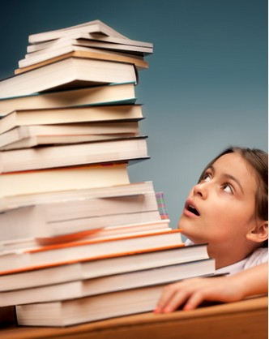

# ＜摇光＞阅读的命运——假若明天没有书

**抑或是一个皱巴巴的猫耳折页，一条洒上泪痕或茶渍的划线，一本书在书架上、床头柜边、厕所里的摆放位置，充盈在鼻腔里的某种胶水气味，藏在课桌洞里、包在粉色禁书封皮外的挂历纸，某张随手夹进消遣小说里的人民币，它们都是潜在作用于你的阅读记忆的暗流，它们本身就是一个完整循环在故事外的故事，帮助你完成阅读的最高使命：抵抗遗忘。**  

# 阅读的命运——假若明天没有书

## 文/黄昱宁（作家、译者、编辑）

 

副主教（克洛德）沉默不语，对庞然伟岸的建筑物凝视片刻，接着，一声叹息，伸出右手，指着桌上摊开的那本书，左手指着圣母院，忧伤的目光从书本转向教堂，说道：“不幸，这一个将要扼杀那一个。”

这段话出自《巴黎圣母院》，紧随其后的是宏大而冗长的、突然将爱斯美腊达和卡西莫多弃之不顾的议论，用去整整一章的篇幅——雨果几乎是倾尽了史诗情怀，阐述“这一个”何以将扼杀“那一个”。“那一个”是以巴黎圣母院为代表的建筑艺术，因为，曾经，“当原始人的记忆力不堪负担，当人类的记忆的积累太过沉重”，人们就以最为经久不变的方式，将符号（日后将演变成文字）记载到石头上、荒冢上、圆柱上、庙堂上——它们构成了最初的建筑，也承载着建筑艺术最动人心魄的功能：记录思想。“这一个”则是15世纪谷登堡发明的“散发着光辉的印刷机”，因为这“另一种方法”也可以永恒保存思想，它“不仅比建筑更持久，更能经受考验，而且更为简单易行”。作为对建筑艺术饱含眷恋的畅销作家（印刷术的直接受惠者），雨果在宣布“书籍将扼杀建筑”时，简直是在吟唱一曲暧昧的挽歌。但他的歌词并没有危言耸听，几百年以后回头看，我们无法否认，就文化意义而言，建筑在16世纪以后进入全面衰落期，实用性成了那些千篇一律的摩天大楼的第一准绳；同时，雨果所预测的印刷术的全面胜利，也伴随着“整个人类思想都顺着这个斜坡滑下去”的隐忧，成为现实。

五百多年后，仿佛在一夜之间，当年的“这一个”已经尴尬地站在了“那一个”的位置，整个世界的纸质图书出版人都笼罩在克洛德式的无奈和恐慌中，伟大的印刷术被电子书、被“大大小小的屏幕”逼到了墙角。“非得拼个你死我活吗？”（Does one have to win?）美国《新闻周刊》在描述纸质书与电子书的竞争时，用上了这样惊悚的标题。我们自己也搞不清，究竟是不敢，还是不忍，像雨果咏叹印刷术那样歌颂电子革命将要创造的文化新纪元！

如果不去考虑业内人士是否会丢掉饭碗，面对着显然更轻便、更环保，传播更迅速、更广泛，理论上也保存更持久的电子介质，我们究竟在疑虑什么？从石头到泥版到莎草到竹简到毛皮到纸浆到薄如蝉翼的屏幕，从手抄到印刷到几分钟搞定的下载，介质越来越轻，渐近于无。在这个过程里，我们得到的是信息的海量扩容，是知识财富的涓滴效应，是阅读人口和写作人口的高速膨胀，是一器在手、坐拥书城的幻象，是被超文本的视觉语汇大大拓宽的认知幅度——但是，且停一停，惬意地躺在时光传送带上向前飞奔的我们，难道就不会失去什么？

阅读是一项复杂的、至今让科学家无法透彻阐释其机理的脑力劳动。拿起一本书，构成我们阅读记忆的不仅是书上印的字，还有字与字、页与页在排列中构成的关系，书与书在储藏空间中构成的关系，以及这些关系与文本意义之间的互相作用。上千年来逐渐形成的排列规律，是“书”对诸多因素——脑容量、材质、时间、空间——妥协的结果，那些被我们称之为“阅读习惯”的东西，实际上是记忆生态的自然选择，它既推进着书业的每一步变革，反过来，它的末梢神经也必然受到介质变化的深刻刺激和微妙扭曲。

我们可以把这概念说得文学一点：捧起一本书来，你真的以为只是在读书里讲的故事吗？经过某个拐角书店时瞥见裙裾一角、进而买下了那本与裙子的颜色格外相称的软皮书，单手握住书脊处微微让虎口感到的酸，另一只手摩挲纸页纤维，于掌纹间留下的或光滑或粗粝的印象，抑或是一个皱巴巴的猫耳折页，一条洒上泪痕或茶渍的划线，一本书在书架上、床头柜边、厕所里的摆放位置，充盈在鼻腔里的某种胶水气味，藏在课桌洞里、包在粉色禁书封皮外的挂历纸，某张随手夹进消遣小说里的人民币，它们都是潜在作用于你的阅读记忆的暗流，它们本身就是一个完整循环在故事外的故事，帮助你完成阅读的最高使命：抵抗遗忘。再仿真的电子阅读器，面对这些个性化的诉求，怕是都要力怯气短吧。问题是，明天的读者，还会觉得这些是重要的吗？未来的我们，还需要抵抗遗忘吗？

沿着电子化指引的方向，我们大抵能看见未来读者的漫画像：他（她）“在电车上以自慰般的手势抚摸iPad”（宫崎骏语），那里储存着一个实时更新的小型图书馆，随手翻开某一本，不管点开哪个词都冒出一幅图片、一串链接来，他（她）早就习惯于被它们分神，也知道这本书照例不会看完。看不看完有什么关系呢，反正人类文明的碎片已如蛛网般密布在他周围，任何知识都触手可及、彼此勾连，那时候，连续的、纵深的、整块整块结结实实的、每跨过一个逻辑点都需要反复推演的思维模式，就跟曾经储存过它们的面貌各异的书籍一样，只有在古董店里才能须臾亲近。他（她）不觉得这样有什么不对，因为“阅读”这件事本身，也正在随着人工智能的不断完善，将主动吸收信息的方式全盘置换成被动接受。超文本链接，云计算，模糊搜索，图像识别……“电子书”的下一波潮流也许是大踏步地跳过古人（21世纪前的人）的记忆环节——没错，阅读的终极目标就是抛弃“阅读”，数据通过电子脉冲，源源不断地灌入大脑……记忆和思考的过程，将由此变得不那么艰辛，当然，也不那么快乐。

假若明天没有书——实体书，生活应该会更轻盈一些吧。正如现时的恋爱告终，连一叠可以烧出蓝色火苗的情书、几张可以撕成漫天飞雪的照片（它们都在电脑里）都找不到，点一点鼠标就能让春梦了无痕；未来的读者，在搬家时也不会像查尔斯·兰姆那样久久盘桓，像伊夫林·沃那样薄情寡义（二战伦敦被轰炸期间，沃先生忙不迭叫人把他的书悉数运抵相对安全的乡下，却让儿子留守伦敦），更不会像年轻的歌德那样丧魂落魄（目击一本书在法兰克福遭到焚毁，让他“感觉自己正在参加一场行刑”）。相应地，或许也不会再有秦始皇或者戈培尔式的无上快感了——对于以控制人类思想为目标的独裁者而言，还有什么会比亲自导演一场销毁书籍的仪式（柏林，摄影机运转，两万多册书，十多万亢奋的群众，熊熊火光，激烈演说……）更能象征“激进意志的胜利”？再也不可能伤神了，再也不需要借口了，图书的肉身从失重到湮灭，文明的魂魄便如气体般飞升，它充盈在我们的周围，没人掐得断它们大量扩散的路线，但我们伸出手，却又似乎抓不到一点赖以铭记的东西。

关于那阕献给建筑艺术的挽歌，雨果曾在《巴黎圣母院》的再版前言中反复提及，因为他“热烈希望终有一日，未来会证明他的看法错误”。对于书籍的未来，我不敢有那样热烈的期望，眼前却浮出这样一幅画面：听说，就在雨果的祖国，法国北部乡村的说书人至今仍保持着将书籍充当道具的习惯——哪怕要说的内容他们早已倒背如流。我不知道，这曾经充当“权威象征”的书籍，将来会不会改成一台笔记本，或者盈盈一握于掌间的kindle，又或者，连“说书人”这种“前印刷”时代兴盛的工种，到彼时也早就绝迹；但我总觉得，今时今日，他们煞有介事地捧着道具书本，仍是饶富象征的一幕，他们难道不是在为我们这一代，为那条似乎不可逆转的人类思维发展路径，留住一点点有形态、有重量的东西，抓紧文化之树的最后一条伸入记忆沃土的根须吗？

 

（采编：孙梦予 责编：应鹏华）

 
