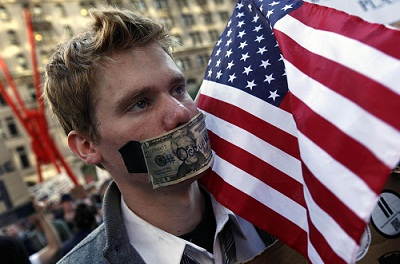

# ＜摇光＞青年作为社会变革的博弈力量

美国《时代》周刊12月14日宣布其“年度人物”为全世界“抗议者”。《时代》周刊给出的当选理由是：席卷中东北非的抗议活动已经蔓延至欧洲和美国，这些抗议者正在重塑全球政治，重塑了人民的力量。

抗议者成为年度致敬群体，让一九八二年就认为自己必将入选《时代》年度人物的乔布斯情何以堪，但从舆论来看，抗议者的获奖无疑得到世界的赞同。从突尼斯自焚小贩开始，抗议事件如同打开的潘多拉魔盒，直到从美国华尔街点燃的火柴头，到席卷全球的“占领”活动，以及最近备受瞩目的抗议俄罗斯选举舞弊事件。有媒体把2011年总结命名为“全球愤怒之年”。在这一系列的抗议事件中，突尼斯、埃及、利比亚先后垮台；以色列民众上街抗议，希腊雅典爆发政治骚乱，西班牙马德里出现静坐示威，英国伦敦发生打砸烧抢。此外，智利爆发大规模学生与工会游行，印度示威者现身街头。据不完全统计，受群众起义影响的国家人口加起来达到30亿。有人甚至大胆地发出警告：世界已经进入深刻变革的时代前夜。

西方有句谚语：“**想要变革，先表达你的愤怒**”。以色列中产阶级起义时的口号之一是“**我们在为看得见摸得着的未来而战**。”以色列总理不得不发出感叹：“权力金字塔正在被颠覆。”华尔街抗议者写上具有深刻意义的标语：“**当不义写进了法律，抵抗就成为了义务**。”而且，“愤怒之年”的愤怒，“不要左翼、不要右翼，要前途，要工作”的口号所表达并非有着理论指导的色彩，表达的只是自身的权利与权益。当权力政治无法解除后顾之忧时，愤怒的人类自然地选择了广场政治或街头政治。一段时期以来，欧美青年以不同方式愤怒地表达着对政府的强烈不满及对社会制度的抗争，抗议并挑战权威。而且，我们可以看出，青年抗议者是社会抗议浪中最活跃的力量之一，这也昭示了青年一代的重要性。

当然，我们很容易把社会抗议浪看得过于简单，认为这只是一些被边缘化的乌合之众在寻滋闹事。任何集体和权力都有自我扩张的本性，民主产生的权力也不例外。在这些暴力冲突发生之前，一些来自公权力的暴力行为提前发生。蒋方舟在《纪事中国2011》中写道：“公权力无恃无恐、奈我不何的官僚惯性思维，让老百姓不再假装相信了。没有安全感的社会，孕育不出稳定的社会阶层，而只有稳定的社会阶层才能滋生稳定的心理状态。”在安全感的丧失程度已经让民众无法忍受的时候，社会自然就会出现各类社会抗议事件，甚至发展成社会抗议浪潮，一不小心就有可能发展成为社会变革。哪里有压迫，哪里就有反抗。哪里有不公，哪里就有抗议。面对残酷现实的时候，历史潮流必将选择民众的一边，因为民众的选择在这个时候已经成为正义的队伍。虽然有时候历史潮流还可能会成为统治者压迫的理由，但今天的反抗者，明天必将还会继续反抗。

权力和权利的博弈，像猫和老鼠的关系一样是天下无国界。许知远说：“在独立的个体力量得到充分的生长，个体价值获得尊重之前，国家的强大是缺乏意义的，而且它经常导向某种出人意料的悲剧。”尤其在一个善于制造盛世幻象的国家里，人人都喜欢沉浸在国家崛起的民族喜悦之中，天鹅绒的怀柔政策容易让人忽略抗议的价值。对于转型时代的中国，大气罐的怨气在不断地生产和积聚，失灵的泄气降压功能却被统治阶级不闻不问。**在僵硬的专制极权体制中，权力几乎排斥一切社会运动。最具健康活力的社会不是从不发生社会运动的社会，而是把它纳入到制度轨道，能形成民众与政府、社会与国家的良性互动，使体制能按社会本性的要求不断调整自己。民众的合法抗议本来就是一种减压机制，属于一种不可缺少的健康政治生态，一旦这种政治生态平衡被打破被压制，将会带来没有理性预期的社会后果。**抗议，大到对政权的触动，小到对删帖的反对。就拿罗永浩针对西门子服务的抗议来说，对消费者合法权益的维护有着不可轻量的价值。所以，**抗议作为每个公民的必修课，只有把抗议哲学学到手，才能让社会发展达成官民之间、民众之间、权力与权利之间的理性博弈。**

****

回到《时代》的“年度人物”“抗议者”本身。拿美国“占领华尔街”来说，以“占领”为形式的抗议行动，在摄像机下成为一种社会景观，也成为他们所能够运用的政治资源。“占领华尔街”的抗议者们几乎没有什么政治影响力，但是在社会景观所形成的影响力下，却创造了巨大的政治影响力。在社会抗议浪潮中，抗议者与统治者的身份在社会进程中得到转化，抗议者化身为挑战决策者的政治对手，决策者也就被动地成为了被挑战者。在这种转化中，抗议者进而对决策者形成政治压力，迫使他们推行新政。而对于抗议群体中的青年抗议者，他们的在场参与，让他们在这场大规模的新型社会运动，得到了极大的淬炼和运动洗礼，这种在场者的经历所裹挟的经验，必定能够激发出一种运动精神，也必然会持之以恒地延续下去。无论社会的结构力量有多么的深远，统治阶层的意识形态根基有多么的稳定，在抗议群体的参与之下，历史潮流的推力显得无懈可击，社会高层也就显得无法抵挡了。所谓“水能载舟，亦能覆舟”，**民众不仅仅是穿行于历史之流的过客，他们更是承载历史、缔造历史的行动者。**

而且，个体的抗议一旦集聚起来，就会形成一股巨大的力量，改变着决策者的行为。在今年的各类抗议浪潮中，我们可以看到社会抗议正从个体抗议走向集体抗议，这种趋势表明了民众的集体意识和集体行动正在形成。广场的一顶顶帐篷所形成的力量，如同溪流汇成大海的社会景观。流动论坛、公社实验、民主大会、抗争学习班、网络新媒体传讯，以及通过组织纪律所践行的不抵抗主义、非暴力行动、和平集会，都在潜移默化地影响这批青年一代，为未来的社会运动培养菁英人才。华尔街运动这根火柴点燃之后，如星星之火，席卷各个国家，这种“外溢效果”所产生的社会经验，也必定会为今后的社会运动打下基石，并开拓出新的浪潮。

值得一说的是，美国不同时期的青年一代，从曾经被唤作“迷惘的一代”到“垮掉的一代”，今年的社会浪潮又被称之为“愤怒的一代”。这种标签式的命名，反映着青年一代的觉醒，而青年一代在今年所亲身体验的改变的力量，必定让他们将改变的火种继续延续下去，继续思考与行动，推动着国家与世界的前进。他们所联合起来的力量，在未来的社会发展中必定是一股不可抵挡的社会力量，不仅在今天改变着世界，也将在未来改变世界。对于中国也是一样，九十多年前的五四青年一代改变了中国，二十多年前的中国青年也改变了中国，作为新世纪的青年一代，互联网的崛起以及头脑的觉醒，也必将让他们改变着未来的中国。

最后，借用《时代》周刊编辑撰写的授奖文章，向正在改变世界、即将改变世界，以及梦想改变世界的青年一代致敬：“与往年不一样的是，年轻人们不再沉迷网络不问世事，他们通过网络聚集起来，一起走到街上为公正和自由抗争。”“他们深刻体现了这样一种思想，即个人行动可以带来集体的巨大变化。”“这些人遍布世界各地，他们冒着生命危险上街抗议，带来了没人敢想象的变革。这是一件真正的改变性的事情，我认为这会让世界向更好的方向转变。”

 

（采编：徐毅磊；责编：麦静）

 
