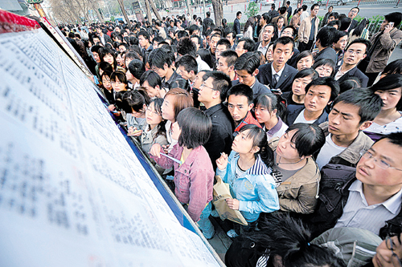

# ＜摇光＞青年的职业选择与自我修养

 **大学原本就不止是接受专业知识教育的所在，我在感激专业教育带给我知识背景和思维训练的同时，更欣慰于在大学期间认识的每一位有意思的师友，收获的每一个新思想。不经过大学的洗礼，我不会有现在的认知水平，但这并不决定于我所修读的专业。**  

# 青年的职业选择与自我修养

## 文/项栋梁 （华东理工大学）

 写下这个题目，其实心里非常忐忑，作为一名还没有真正走出校园的应届毕业生，我真的清楚自己所写的意味着什么吗？不过既已定下题目，还是谈谈自己的一点感受吧，我不想也不敢更不能告诉正在阅读的你应该如何选择，权且分享一些我曾有过的思考。 

经过平顺辉煌或是跌跌撞撞的十几年学生生涯，青年人们在毕业这一年终于意识到，社会对他们的期望如此之高，而自己能做的如此之少。路遥在《平凡的世界》中写道：“一茬又一茬的男人就是这样不知不觉地走上了严峻的生活舞台。”每一次仓惶间，我们面临的都“不是同一条河流”，每一次都得靠自己做出选择。 职业选择，是我辈青年成为独立社会人之前要面临的第一个，也是最重要的一个问题。 虽然在大一入校之时我就被教育应当有职业规划的意识，但在很长的一段时间里我都在极力回避。生活如此丰富，又何苦太早给自己作出定义？直到真的到了要被推向人生前台的当口我才明白过来：真的，要给自己定个方向了。 我要做的第一件事是理清专业和职业的关系，这意味着我要面对一个严峻的事实：我所学的生物工程专业既不是我填报志愿时所畅想的形象，也不是我所擅长的能够以之谋求更高发展的领域。因而，我所学的专业本身是否“有前途”就显得不是那么重要了。不适合意味着我要放弃专业知识这一“核心竞争力”，而放弃则意味着不可预知的风险，值得庆幸的是，承担自主选择带来的风险正是青年宣告独立走向成熟的过程。 于我而言，若能如早年预期的那样在专业领域不断积累进步并以之助推职业生涯发展，自然是最好的状态，但要披荆斩棘开辟一条新路倒也不至于为“虚度的时光”而惋惜。大学原本就不止是接受专业知识教育的所在，我在感激专业教育带给我知识背景和思维训练的同时，更欣慰于在大学期间认识的每一位有意思的师友，收获的每一个新思想。不经过大学的洗礼，我不会有现在的认知水平，但这并不决定于我所修读的专业。 接着我开始思考“我想做什么”这个问题。在我的个人体验中，这是整个职业选择体系中最难回答的一个问题，以至于我身边的很多同学直接跳过“我想做”转而思考 “我应该做什么”。从现实理性来看，“应该做”比“我想做”来得更实在更可行，但我还是忍不住对这样的逃避轻叹一声。如果在青春最闪耀的时候都不去憧憬未来的可能而不假思索地屈服于原本足以抗衡的现实压力，那将多么令人惋惜。我记得在最灰心丧气的时候也曾说过“别跟我谈理想，早戒了”这样的话，但我始终都 明白，童年是树立理想的时候，青年是实践理想的时候，说理想，从来不是可笑的事情。 在分析具体的职业与岗位之时我发现，要明确“我想做什么”，尤其是“只做什么”，需要有莫大的勇气和智慧，这一点我很难做到。不过，要我说出不想做什么，我却可以迅速地列出一张长长的名录。大概我们青年人就是这样，还没有经历足够多的庸碌生活，总还认为前方有无限的可能性，每一样都想抓住，哪一个都不愿放 弃。可是终究一次只能选一个。 

也许你希望赚到好多好多的钱，做实业好还是做金融好呢？也许你希望未来有很大很大的权力，考公务员好还是去基层历练好呢？也许你希望从事公益事业，是去推动 环保好还是去支援教育好呢？大概我是最贪心的，我希望实现个人价值与社会价值的统一。听起来好玄对吧？事实上，这还真是我在选择职业时最重要的指导原则。能够有相对新鲜、精彩的工作内容，收入能满足免于匮乏的生活，有一定的渠道能为推动社会进步而呐喊，这是促使我作为一名工科学生走上新闻传媒道路最关键的动因。相信你也能发现一些自己心仪的职业方向。 然后就该思考“我能做什么”的问题了。我的整个大学四年几乎都纠结于“我什么都能做”和“我什么都做不了”两个极端的自我矛盾中，直到经过半年的求职历程才渐渐有了一个相对清晰的认识。我相信，对于绝大多数完成了大学教育的青年来说，经过不长的职业训练后能够胜任的工作都有很多，完全没必要认为每份好工作都 需要一些你没有掌握的技能继而望之却步。当然，这样说的前提是我在并没有明确目标的学习实践中已经为自己心仪的工作做了一定的自我修养，通过校园工作、校外实习培养了一些职业所需的素质，虽然还不足以让我直接胜任未来的工作，但它们赋予了我宝贵的可能性。而这些，是每一位有心人都可以比较容易做到的，因此 我才得出上述结论。同时，也不需要担心自己现在所做的对未来的工作没有助益，因为沟通能力、协作能力、严密的思维、创新的意识这些“可迁移能力”是在哪里 都用得上而且很重要的，在提升自我修养的过程中何必执着于“术”？ 还有一些需要考虑的因素，诸如感情发展、家庭经济状况，行业总体前景等等。青年的职业选择之所以艰难正在于我们能够掌控的太少，需要背负的太多。好在我们拥 有人生最宝贵的青春，有青春的身体可以去拼搏，有青春的思想可以去创造，若抛弃了这一点，则青年的职业选择的基础不存在，剩下的就只有“找工作”了。  **编者注：作者为生物工程学院应届毕业生，校报学生通讯社社长，公益社团“爱心接力”创始人之一，同时也是北斗网编辑部副主编。曾在《羊城晚报》、《新闻晚报》、上海市科委等单位实习，现已签约南方报业传媒集团采编岗位。**  

（责编：黄理罡）
