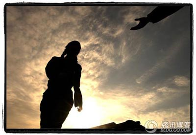
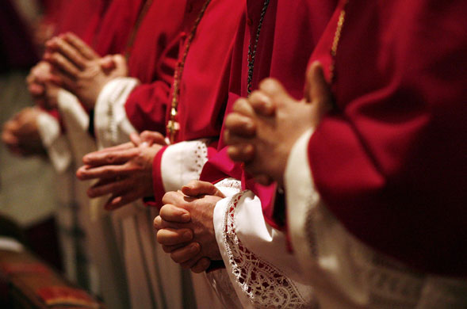

# ＜摇光＞青春

**无声的不只是他们，是这国家的几代人。他们从对单一信仰的毫不怀疑到开始对信仰变得无所谓，他们在被耽搁的青春的废墟上以顽强的生命力站起，跌跌撞撞被卷入改革的大潮，却也因着青春的孱弱，大多的仍匍匐在最底层。他们知道过往穷的可怕，于是被教导要去赞美这两极分化的富裕。他们知道因思想而生的迫害的残酷荒谬。却不再去想那荒谬的正当性，只是在逐渐丰沛的物质里寻求尽可能安全的活着。**

# 青春

## 文/吉米糕（中国政法大学）

在为爸妈准备旅欧材料和旅行计划的几个月里，无数次焦躁的情绪泛滥。偶尔人性的软弱占上风时，甚至会质疑这决定的正确性。

昨晚在送他们上回国的飞机之前，善感的妈妈流泪了。这一次我没哭，至少当着他们的面并没有。我努力地微笑，给他们大大的拥抱。妈妈的手还是那样柔软，却已是布满了皱纹，爸爸也再不是儿时眼里如参天大树的魁梧，唯有两鬓的白发在提醒着生命苦短的力量。仿佛一夜间我们彼此面对的至亲的人就跨越了一光年的长度，他们不可抑制的老去和我被时光逼促的成长，大概是人生最不可逆的忧伤。

于是在回程的车上，窗外疾驶着北德初秋冷滞的光。我再一次问自己，这个决定正确了吗？

在这四十几天里，一对青年人与一对中年人，行走在欧洲大地上。生活被从天朝那纷乱浮躁的模式里连根拔起，一夜间投掷到这星球上另一个远方。我们穿梭于或现代或古老的欧洲街巷，看黄昏下教堂的侧影，听卖艺人风里执拗的歌唱。这旅程有笑有哭，有在瑞士阿尔卑斯山面向着上苍杰作最大的赞叹，也有在波兰奥斯维辛集中营阴霾的一天里对人性至恶和苦难深度的目不忍视。我所期待的一切真的近乎完美的发生了，却又似乎远不止这些……

另一个完美，是那实际藏于行走背后的，是从旅途初始我内心便最最在乎的，是一种交会，关于我们彼此的青春和信仰。

他们的青春？如果那也是一种青春的面相，是的，一定是的。

一个偏远山村里贫困家庭的少年，进城前从没见过电灯的模样。在凄风苦雨的中国改革开放前夕，几十年的政治运动已使这国濒临崩溃死亡的年代，读书人刚刚开始有了存活的可能。他便依着自己的努力一点点走出去，终于走到了传说中的大城市，成为一名老师。那年的他书生意气，会写诗，会与志同道合的文坛好友把酒言欢，会作为优秀教师代表到省里参加赛课，会为自己的学生们义务理发。青春的轨迹，即使因着时代而艰苦卓绝，却也是飞扬的。

一个六口之家的长女，单纯，热情，在上山下乡的尾巴上，因着一点点便利的条件没能被发配到远方，去做那被流放的一代青春中的一份子，但继续读书的路却也因身为老大的责任就此戛然而止。她进了厂子，那曾经是该领域亚洲最大的企业。颇有才情的她很快进入了文宣部门，于是与文字有关的路就这样一直一直走下去了。那是个所有人真心向上的年代，凭粮票吃饭的日子不再了，食品开始逐渐丰富了，甚至还能看到海外的电视剧了，美好，多美好。

再后来他离开了学校，慢慢地也开始被这国制度所能延伸到的所有细枝末节浸染。在物质积累急速飞驰而精神却逐渐萎靡的改革中期以后，理想似乎成了空乏的说辞，生活逐渐陷入平庸的不断重复的境地。和他所处的这个中国东北城市的大多数男人一样，他在复杂的社会竞技场为家庭忙碌，向着某种这个国家所有人都认可的成功的含义走着。日子周而复始，温饱不再是问题，没有什么不知足的理由。可许多时候，却好像已经丧失了对人生诘问的能力，在这辈子，活着究竟意味着什么？

再后来那个辉煌时期叱咤风云的厂子也败了，那时一切都仿若顺理成章似的，并没有人哭，或是因为整个国家被遗弃的这群人早已习惯于沉默着寻找下一个活着的方向，便使那悲伤好像不那么强烈了。于是她也离开了，到了更大的舞台，只是那里的文字们大多是没生命的铅字，在没有出版和言论自由的国度，一群有知识的人为了求生存而放弃了知识自身的创造力，却也不觉得这有什么大问题。好或不好又能如何呢，再坏，也没有三十年前吃不上饭悲催。所以做顺民，关闭思想的门，不错的。

于是他们青春的轨迹，在被称为二十世纪尾声最震撼的改革开放的日子里，就这样慢慢走入了无声。

无声的不只是他们，是这国家的几代人。他们从对单一信仰的毫不怀疑到开始对信仰变得无所谓，他们在被耽搁的青春的废墟上以顽强的生命力站起，跌跌撞撞被卷入改革的大潮，却也因着青春的孱弱，大多的仍匍匐在最底层。他们知道过往穷的可怕，于是被教导要去赞美这两极分化的富裕。他们知道因思想而生的迫害的残酷荒谬。却不再去想那荒谬的正当性，只是在逐渐丰沛的物质里寻求尽可能安全的活着。这国的大地上每个周遭的灾难都是遥远虚幻的，于是美景也就多起来了。

就这样，他们被庞大的惯性挟持着低头为世界上或许最艰难的生存而努力，那生存里是有许多浅显的梦的——为了给子女在不平等的教育资源分配中尽量捞一杯羹，为了在未来孩子就业择偶的拼爹路上自己能尽量不那么寒碜，为了终其一生榨干血汗的钱能勉强凑得上给孩子在帝都郊区买个小房子的首付……

直到，因过往青春残留的遗迹与另一个崭新青春的碰撞，发出刺耳的声响。

这个青春，是他们女儿的。

她在童稚时期走过了和这国所有80后相同的路：加入少先队的那天会胸前系着拧巴的红领巾满楼跑着向旁人炫耀那传说中烈士鲜血的颜色，即使是七岁的孩子也会在握拳说“为共产主义事业时刻准备着”时，真心地血脉贲张。会在民族主义的熏染里振臂疾呼，也会在讲故事大会上为了英烈的神奇事迹泪流满面。在与父辈极其相似的对世界的既定模样毫不怀疑的路上，她和同龄人渐沦为了考试机器，一起向着某种不成功便成仁的命定的悲壮顽强走着，终于这顽强有了点回报，终于从边远走向了中央，走到了首都，世界却好像忽然间彻底变了样子。

在帝都的郊区，她最美好也最深刻的大学的四年，她从第一次接触这国苦难和真实的颤抖开始，便不可抑制地走上了一条无法回头的路。她无法忘记那年陕西大娘拉着她的手哭诉时无望干涸的眼，她的灵魂在迅速扭转的方向上以阅读为养料而变得丰盈，却也时常陷入最深的绝望和撕扯。很多年后有机会去到远方的她，不时回头无力地望着那依然被禁锢的故乡。在学法律的路上已经走了八年的她疲惫不堪，却又无法说服自己放弃对那束光的追寻，那是一道在梦里当真的划破了黑暗的光。

不屈服终于被察觉，矛盾愈演愈大，乃至猛烈到一发不可收拾。这开始于几十年前的荒谬的、延续至今的大时代，是两代人的青春尴尬对望却无法彼此触及的根。

青春，多么华丽也苍凉的字眼。

老去的人仿佛命定似的，开始作为曾经的自己的反对者，反对那个相信良善，愿意为了理想而付出的自己。

而正在绽放的人们，谁说不是正走在命定的路上。旁观者冷静的说，你们这些人啊，终有一日或是屈辱着投降，或是壮烈着死去，或是不得不退场。在这伟大瑰丽的国度，理想与现实的对抗，百年的沉浮间，历史从来都是以个体的牺牲作为注解。

于是，作为一种暗地里并不太被寄予希望的尝试，几十天前，两段青春开始在欧洲之夏第一次如此特别地相会了。他们不远万里而来，为着年轻时也曾听过的那个神秘的远方，后来已被生活的琐碎湮灭的浪漫，第一次有了重生的可能。而她，站在那里，兴奋也忐忑不安。

她带着他们来到了欧洲之巅的脚下，在湖光山色里，疲惫了大半生的人儿看到了人生本来的另一种可能。

她看着他们的背影在爱琴海的落日里微笑，生命的温存被大自然的神迹悄然唤醒。

他们一起行走在古城寂静的夜，看见了喝醉的流浪汉，看见了周末开过Party的疯狂青年们，与封闭和压抑截然相反的这世上另一群人的青春，他们也可以笑着觉得那是不错的了。

他们也第一次进到了教堂里，原来信仰不是传说中那样神乎可怕，它如宽厚的手臂，治疗人性天然的创伤。这里的人们所享受的广阔安定里，真切的有它的力量。

在休息的日子里，夜里的深谈平和也直白。她放了许多片子，与他们那代人的青春有关的图像，与历史的吊诡有关的残忍。他们第一次这样放松着去接近另一种话语对世界的诠释，感觉似乎也没那么糟糕。开始尝试着对彼此青春中最真实部分的袒露，原是如此伟大的。曾经愤怒的父亲，也许开始能够明白，他的女儿的倔强，和自己年轻时也曾有过的那股向善的执拗，和这自由的土地上自由生活的人们，有着怎样的关联。而在女儿的眼神里，他们看见了一种信心，那个渺茫无期的和故土有关的未来，即使有再多的理由去不相信，也是要迈开步去走的。

于是在长长故事的一个小结点上，对于篇首的回答已如此明白。这个写字的人欣喜地发现，路忽然不再可怕了。因着至亲的人所伸出的温暖的手告诉她，那从下生开始最紧密的关联，在这个夏天的尾巴，神奇的，以柔软的面貌，开始了阔别已久的更茁壮的生长。

而你知某一刻我有多感动，我最爱的人啊——

当你们真心地开怀大笑，在这自由的土地上。曾在灵魂匍匐的路上隐忍了如此久远的你们，这从历史的罅隙里艰难行走出来的你们，已距离青春二字无比遥远的你们，却活出了青春该有的模样，即使那片刻仅是短暂的荣光——

你们，终于自由了。

而这自由青春，终有一天，会属于那片土地上未来的孩子们。

 

（采编：管思聪 责编：管思聪）
