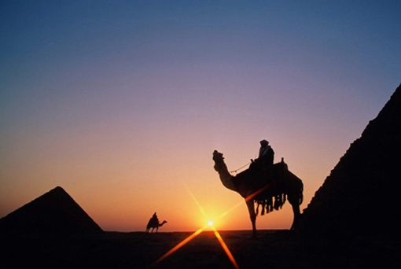
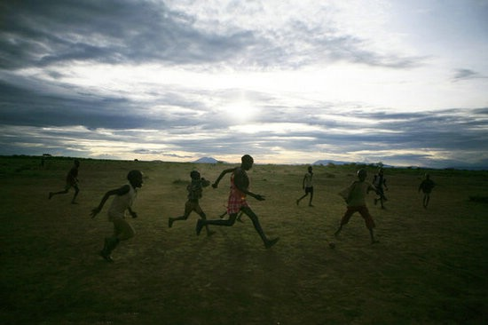
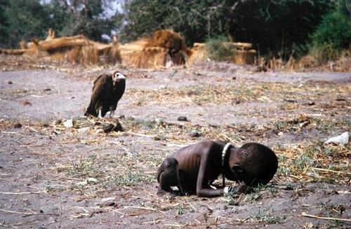
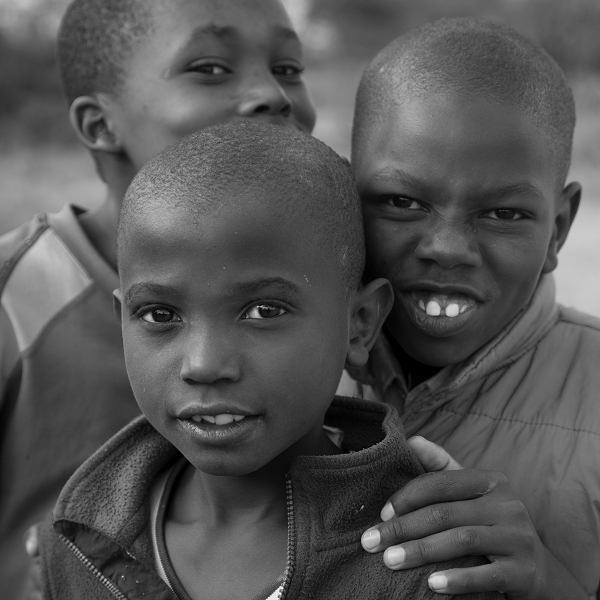

# ＜摇光＞非洲的戏剧

**根据近代科学越来越多的研究表明，非洲是人类诞生的摇篮。但是，在人类近几千年的文明史当中，这片大陆之上上演的却几乎一直是悲剧，尤其是在近四五百年之间，非洲大陆从来都没有赢得过世界真正的关注与尊重，直到二十一世纪伊始，依然在寻找一个不因不幸与灾难而能被记起的理由。这里是世界上最后一块未开化的土地，所有的问题错综复杂交织在一起，等待着下一出的继续。没有尾声，剧情未定。**  

# 非洲的戏剧

## 文/卢辰(Ecole de commerce ESC Rouen)

 

泰晤士报的老记者Richard Dowden在他的《Africa: Altered States, Ordinary Miracles》写到过一段在乌干达任教时的经历。他的学生中有一个叫做Willie的小孩，有一次偷了校长的钱，然后在消失了大半天之后，坐着一辆从城里开来的的士回到了学校，这时候的他身着崭新的西装与皮鞋——显然是刚刚用偷去的钱买来的，在所有同学的惊叹声中气宇轩昂了一番。毫无疑问，他这么做的后果是立马被学校开除，西装与皮鞋皆被没收。

Richard Dowden说，在他之后几十年的非洲经历中，每每见到一位甘冒身败名裂的下场也要穷奢极欲逞一时之欢的独裁者时，他的脑海里所想到的总是那个叫做Willie的小孩。他们的本质都充满了一种令人发指的自私与短视。所不同的是，那些最终成为了一国之大独裁者的Willies，在他们悍然盗取了校长的钱财挥霍一通之后再乘着的士回到学校时，他们的身边已经围绕着一群荷枪持弹的军人，纵使气宇轩昂不可一世，这个时候迎接他的也不会再是退学的制裁，而是每一个人因畏惧而颤抖着的目光。

津巴布韦的穆加贝无疑便是这些Willies中最杰出的代表，在其三十多年的英明领导之下，津巴布韦从曾经的“非洲面包篮”变为一片名符其实的人间地狱。年通货膨胀率高达100000%以上， 银行发行最高钞票面值500万亿，男性平均年龄37岁，女性平均年龄34岁，为全世界最短命的国度。暴政如虎，民不聊生。而穆加贝本人不仅拥有私人飞机，在伦敦等世界各地拥有豪宅，实际财富更是难以估量，举国俨然已为其一人之私。

如果有人惊诧于世界上居然还有这样的政权尚未垮台，事实的情况却是像津巴布韦这样的国家在非洲并非孤单，诸如博卡萨的中非共和国，阿明的乌干达，蒙博托的扎伊尔，姆斯瓦蒂的斯威士兰，班达的马拉维等等等等。当每一个独裁者的故事都显得异常同质之时，对于个例的描述已经显得毫无意义。非洲政治之腐朽有多么严重，只要举一个数据便可了然，根据世界银行的统计，2003年，非洲百分之六十的私人财富，将近400百亿美元，留在非洲大陆之外，相当于当年非洲接收到总的外部援助的两倍。

二战之后的1950年代，非洲的人均GDP曾经一度是亚洲的两倍。于此相伴的是政治上非洲各国的独立浪潮，当非洲人民满怀欣喜地将旧欧洲殖民主赶跑迎接自己的黑色皮肤的领导人时，这里曾经被全世界视为一片希望的田野，相较于东亚的人口稠密，资源匮乏，自然灾害频发，非洲则是一片人口适中，资源丰富，自然灾害较少的大陆。但是谁也不会想到，几十年之后，当年的对比已成为一纸笑谈。今日的亚洲，有中国日本印度世界三大可以撑起世界一极经济强国，有实力不可小觑的四小龙五小虎，还有通过卖油而富得流油的西亚穆斯林诸国。那么，非洲有什么？2010年，除去南非整个撒哈拉以南非洲的生产总值居然只能勉强抵上中国大陆最小的省份浙江省，或者韩国的一半。根据Dambisa Moyo购买力平价的统计，2008年的非洲人的实际人均收入还要低于1970年代；超过一半的非洲人口（约3.5亿）每天的生活费不足一美元。撒哈拉大沙漠以南的每48个非洲人中，有9个比1960年更贫困。

当亚洲迅速崛起的经济体经济体像洪潮一样一波又一波地冲击占据着全世界的市场之时，非洲依然还在为一锅饭一件衣最基本的生计问题而发愁；当恢复了自信力的亚洲的人在不断地肯定着自己的传统价值，迫切地寻找自我认同反抗着西方中心主义之时，非洲人依然在苦苦乞求着西方的援助与债务减免；当瘦弱的黄种人依靠着自己的智慧与精神深刻着改变人类二十一世纪之时，臂膀结实的黑种人站在荒废的土地上，不知道二十一世纪与他们祖先生活过的十八世纪区别何在。显然，今天的非洲已经远远地被排除在了世界经济的游戏之外。

历史的进程之吊诡令人无法预期，我们可以忽略中世纪某些基督教学者对所谓黑人是白人与魔鬼交媾而产生的后裔之说，也可以忽略如大哲学家休谟在《论民族的特征》中对黑人“与生俱来无法被文明化的”的论述，却无法无视三百年前的法国启蒙思想家对这块大陆悲观的认知，他们在竭力反对奴隶制的同时，亦一针见血地指出了黑人的习性：野蛮、懒惰、顽固、迷信。孟德斯鸠在其巨著《论法的精神》将非洲人的懒散归结为低纬度地区炎热的气候环境，容易使人们丧失劳作的热情，另一方面，非洲膏腴的土地又使得人可以较为轻易地获取生存必需品，从而进一步加剧了人们慵懒怠慢的性格。

但是，同样的理论不能解释为什么，同样炎热的东南亚与拉美已经渐渐走上了经济起飞的轨道，而非洲依然还在深渊的泥沼当中苦苦挣扎。

非洲落后的根源到底在哪里？

将历史的视野放长，近乎四百年的欧洲殖民史是一个无法绕开的原因。根据Duncan Clarke在《Africa's Future: Darkness to Destiny》的统计，四百年间欧洲人一共从非洲贩买走的奴隶总数约为2000万人，非洲实际损失的人口远远不止这个数量，保守估计也有一个亿。更为关键的是，相比较同时代西方列强在美洲的殖民活动，非洲在四百年的殖民化过程中极少受惠于马克思所言殖民主义的双重使命中的积极因素。众所周知，列强在美洲的掠夺与扩张史等同于一部美洲土著民居的灭绝史，哥伦布之后的两百年，欧洲人有意的枪弹与无意的疾病病毒使得95%的美洲土著居民灭绝消失，这也迫使得欧洲人不得不通过大量的移民来构建一套相对较为健全的社会体制。所以我们可以看到，十八世纪末建国之时的美国，已经有了一批完全不逊于老欧洲的精英群体，相对滞后的南美的种植园经济，也在以当时最先进的生产方式创造出大量财富，美洲成为欧洲人名副其实的“新大陆”。相比之下，非洲的价值长时间停留在劳动力市场阶段，欧洲人通过收买部族领袖，贩卖热兵器，挑动部族矛盾等等手段控制当地势力，开展了罪恶的奴隶贸易。除去葡萄牙人以外，鲜有欧洲人移民定居这片大陆。除去南非，和北非沿岸，非洲大部分地区饱受从未真正建立起自己的经济系统。整个非洲，在殖民时代被人为地割裂成了受过良好教育掌握技术与行政资源的殖民者与蒙昧无知的土著黑人两大群体，所以，当二战之后欧洲殖民者最后撤出这片大陆之时，非洲便如同被抽走了大脑，大陆上的诸多部族甚至还停留在刀耕火种、捕鱼狩猎最原始的生产阶段，手执国旗的当地黑人，更不知道到国家社会行政管理组织立法制度究竟为何物，整个非洲立即陷入极为严重的知识技能的断层之中。

欧洲殖民者走了，他们没有留给非洲人留下多少可以受益的遗产，却留下了日后成为诸国战祸纠纷根源的分界线。

现代非洲的国界主要形成于1884年底柏林西非会议之上，会议由著名的铁血宰相俾斯麦主持，西方十四国为划分各自的势力范围进行了数月的唇枪舌战，最终根据“有限占领”原则用红线肢解了整个非洲的躯体。根据统计，非洲的国界44%都由经线或纬线划分，30%的国界是用直线或曲线的几何方法划分，仅26%的国界是自然边界。这些国界大多数罔顾当地部族分布的实情，造成部族分裂，埋下日后部族之间冲突纠纷的火药桶。例如，巴刚果族被分割在安哥拉、刚果 （金）、刚果和加蓬四国。西非著名的富尔贝族甚至被分割在英法葡德等国的七块殖民地里。还有原来属于不同文化、语言和传统的民族被强行划迸在同一个国家里，像西非地区部分的豪萨族人、约鲁巴族人和伊博族人被强行划入尼日利亚境内。诸如此类不一而足。非洲殖民地独立后，除索马里与博茨瓦纳以外，几乎没有国家都是有上百，甚至数百个民族，诸如坦桑尼亚有120个民族，尼日利亚有250个民族。甚至国土只有47.5万平方公里的喀麦隆也竟有100多个民族。这种情况的自然后果便是严重地破坏了一个国家的团结，部族之间只有部族认同感而无国家认同感，各族之间的经济和文化的联系和交流亦被隔绝了。同时，由于国家内部民族成份复杂和零乱而所带来民族关系与国家建设中的问题，也成为了非洲国家迈向独立富强的最大阻碍。

其中最大的一个问题便是，中央政府的权力应该如何产生？

当西方人在津津乐道于他们的民主制度成功地将他们领导人关进笼子，并向全世界各国推销他们的普世价值之时，人们无奈的发现，这样的制度在非洲确实显得水土不服。一个最简单的道理便是，当卢旺达境内的图西族人只会把他们的票投给图西族候选人时，当安哥拉境内的姆本社族人只会把他们的票投给姆本社族候选人时，当科特迪瓦境内的阿肯族人只会把他们的票投给阿肯族候选人时，民主投票便完全失去了其本身的意义，而沦为一场纯粹人口数量的较量，民主化被部族力量所挟持，成为伪民主。最可能的结果便是，部族之间互不信服进而演变成暴力冲突。事实上，非洲百分之九十以上的动乱来源于国内的部族纠纷，而非国家之间。二十世纪的下半叶，三分之一的国家在严重的内战中度过。

战争文化尴尬地成为了塑造非洲性格的重要一环。Gerard Hanley在他一本关于索马里的专著的书《Warriors》中提到，在这个国家里没有人会显现出对死亡的畏惧，他们对痛苦的门槛非常非常的高。我曾经问过一位在非洲医疗援助国两年的朋友关于非洲病人与中国病人最大的区别，她给我的回复也是，在非洲，很少有病人会因为疼痛而抱怨而哭泣。非洲人对战争与死亡较少的畏惧，也更加剧了战乱爆发的频繁度。虽然，在历次内战中直接因为战斗而死伤人是少数，兵连祸结，大多数的人是因为战斗所导致的贫穷，饥荒，疾病，流离失所而死去，他们都是平民。

内战最可能导致的结果便是，一位拥有西方大国撑腰，可以统领四方的军事强人出现终止争端，然后开启另一端残暴的统治。

南非前总统曼德拉将强人政治归结为非洲落后的根源，但是显然强人政治的背后还有比强人政治本身更深的多的社会历史渊源。事实上，在大多数的军事强人上台之初，往往都还能得到相当高的民众支持，在稳定如旱季的大雨一样弥足珍贵之时，正义的力量已经显得微不足道，强人独裁也不过是没有选择中的选择。

与所以其他地方的强人统治相似，非洲的政治强人统治所依靠的无非也就是胡萝卜加大棒，大棒是坦克与枪支，不及多说，胡萝卜便是民粹主义政策，惯用的手法是没收剥夺白种人甚至黄种人的财产，讨好本国黑人，转移仇恨。有如穆加贝在津巴布韦发起过的“土地改革快车道”运动，驱赶白人农场主，无偿掠夺白人的私有土地，分给的阶级兄弟。自然而然，所以这些所有饮鸩止渴式的政策最终都只能造成国家经济的雪上加霜，进一步走向土崩瓦解。

无视规则，毫无原则，不可捉摸，凶残无度，腐败之至，关于非洲政治之阴暗，甚至已经到了一种让人觉得无法下笔叙说的状态，我一直有一种感觉，所有的中国的社会政治问题，只要放到非洲，根本都不是问题。无论是资源贫瘠，还是物产富饶，不论是沿河靠海，还是深锁内陆，非洲的每一个国家都分享着近乎相同的故事。

我们可以暂时把视角从政治抽出，从或许比政治更为深刻的文化教育视角观察非洲。艾滋病的预防与传播便是一个可以窥斑知豹的例子。

众所周知，艾滋病的传染方式有三种，性行为，母婴与血液输送，在我们正常的观念里，此三者都应该算是很难的感染方式。但偏偏便是这样一个看似不难预防的疾病，年年在非洲掠去数百万人的生命，早已成为非洲的第一杀手，甚至数倍于每年死于战乱与自然灾害的人数。即使像在南非这样相对发达的国家，成年人艾滋病毒的感染率都高达20%以上，联合国两年前发布的一份报告警告说，如果不及时采取措施，到2025年非洲可能会有8000万人死于艾滋病，感染人数将会上升到9000万。

根据调查统计，在非洲绝大部分的艾滋病患者是通过性行为感染上病毒的。如何预防？在生活条件恶劣的非洲，如果说性泛滥是一个难以被改变的习惯，那么避孕套的无法普及就有些令人费解。事实上，每年非洲各国的政府以及国际组织均投入大量的人力物力宣传使用避孕套的重要性，收效却是甚微。首先，在绝大多数的非洲人看来，避孕套被当做是一个会极大削弱男性性能力的工具，非洲男性普遍厌恶使用安全套，其次，男尊女卑的传统观念要求女性必须无条件服从男性的性请求，甚至在某些地方即使女性知情男性是为艾滋病病毒携带者，也不能拒绝与其发生性行为。在非洲的一些国度，流传着只要与一名处女发生性关系就可以治愈艾滋病的说法，如此荒谬的说法竟然也被相当多的人才信，后果可想而知，只能加速病毒的传播，甚至是强行传播。即使意识到避孕套的使用的重要性，许多非洲人也会做出重复使用避孕套甚至使用别人用过的避孕套这样令人难以想象的事情，根本原因依然是贫穷，在穷困潦倒的地方，没有什么是一次性的，人们不愿意丢掉一个看起来还没有坏掉的东西。

根深蒂固的文化观念是要依靠长期的教育而非一时宣传才能改变，长期的教育又依托于经济基础，这些条件，非洲都没有。

除此之外，Richard Dowden在他几十年的非洲亲历中也总结出一条艾滋病之所以可以如此泛滥的原因。因为在卫生条件极其恶劣的非洲，各种各样的疾病诸如疟疾，结核病，河盲，甚至一场普通的流感，都足以成为生命杀手，相比之下，艾滋病并不直接夺取人的生命，而是通过破坏免疫系统继而引发其他病症置人于死地。在喀麦隆，艾滋病被称为le poison lent，慢性毒药。所以，在如此朝不保夕的环境之下，人们自然而然放松了对艾滋病的警惕。甚至许多人至死去的时候也不知道，真正夺走自己生命的就是艾滋病病毒。

说来说去，还是因为贫穷。贫穷是整个恶性循环当中最沉重的一链，失学、愚昧、疾病、战乱、仇恨、报复，终究都是贫穷的恶之果，也是贫穷的种子。

那么，依靠国际援助能够帮助非洲走出最初的死结？答案是否定的。

当好莱坞的明星们顶着聚焦闪光抱起瘦干的非洲儿童而号召人们的捐助之时，已经有越来越多的人开始质疑国际援助所能带给这片大陆的实际影响。Dambisa Moyo在《Dead Aid》一书中指出，大量的国际援助非但使得非洲各国政府产生了有恃无恐的依赖感，使得他们的工作核心从如何发展本国经济沦落为如何争取到更多的援助；另一方面，相关的调查表明大多数的国际援助最终也都流入到了私人的腰包，甚至在非洲的许多国家，出现过军队强迫聚集饥民，以获得国际组织的援助的先例。按照另一位非洲问题学者David Shinn的话说，援助非洲本质上是一种“征收富裕国家穷人的税，补贴穷国富人”的行为。损不足以俸有余，终究不是一件可以为继的事情。

但是，当人们看到一个四肢如干柴的女童在寸草不生的黄土地上挖掘着草根充饥，她的背后是一只比她块头还要硕大的秃鹰，觊觎着这条垂死的生命时。难道除了无偿援助还有什么办法能够拯救他们的生命吗？

那张著名照片的摄影师最后以自杀告别了人世，据说，他的遗言是：这个世界上的痛苦多于快乐。用这一句话来形容非洲，或许并不为过。援助也不是，不援助也不是。所有的一切，看起来都只能加剧了这片大陆的绝望。

文章的最后我想讲一个自己亲历的故事。我在学校的时候，有一个卢旺达的朋友，有一天他和我说，他的另一个卢旺达老乡欠了他30欧元，但是当他去找他要钱的时候，那个人竟然坚决表示已经把钱亲手还给他了，明显是想要赖账。可以想象，当人与人之间如果连这样最基本的诚信都没有，一个社会的任何事情都会变得如何的寸步难行无比艰难。这件事更让我感到震惊的是，我的那个朋友在叙述故事之时虽然气愤，但亦没有表现出我想象出应有的勃然大怒。我的理解只能是，这样的事情在他们的文化中产生，并非是完全不可理喻。这个事情也让我想到了文章初的那个叫做Willie的孩子。

我在学校的时候曾经修过一门地缘政治的课，黑人老师在第一堂课上便让全班所有同学都谈一谈各自的人生理想。全班来自世界各国的同学都说完之后。那位老师和我们说：我曾经在非洲教了几年的书，我也总在每一门课程的第一堂课上询问过我的学生的人生理想，但是他们很少回答的出来，因为他们连自己能不能活到未来都不清楚，又何必奢谈理想？

当作为一个社会的希望的孩子，也已经没有希望之时，这个社会大概也没有再多的希望。

根据近代科学越来越多的研究表明，非洲是人类诞生的摇篮。但是，在人类近几千年的文明史当中，这片大陆之上上演的却几乎一直是悲剧，尤其是在近四五百年之间，非洲大陆从来都没有赢得过世界真正的关注与尊重，直到二十一世纪伊始，依然在寻找一个不因不幸与灾难而能被记起的理由。这里是世界上最后一块未开化的土地，所有的问题错综复杂交织在一起，等待着下一出的继续。没有尾声，剧情未定。

这便我所能想象的到的非洲的戏剧。

 

### 【参考书目】

 Bernard Lugan《Histoire de l'Afrique des origines à nos jours》 Duncan Clarke《Africa's Future: Darkness to Destiny》 Richard Dowden《Africa: Altered States, Ordinary Miracles》 Dambisa Moyo《Dead Aid》  

（责编：安镜轩；采编：安镜轩）

 
