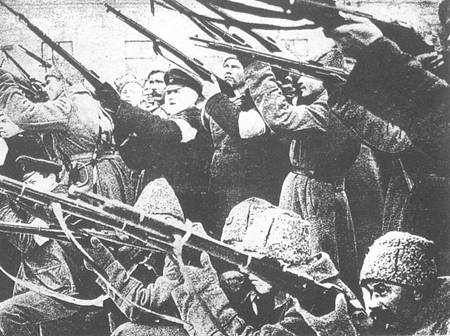

# ＜摇光＞革命的盛宴

**革命通常的结果不是罗伯斯皮尔挥刀斩向革命者，就是袁世凯换一个名义重登高位，或是斯大林借革命之名铲除掉那些不合群的分子。革命在实际的操作中陷入了由暴力和权力构造的陷阱之中。但是当革命者夺取政权之后，政治上的保守主义占据上风，人们便希冀于文化上的革命甚至灵魂中的革命，革命的目的不再是夺取政权而是建设道德理想国。**

 

# **革命的盛宴**** **

## **文****/****张凯阳****（华中科技）**

 

革命一词并非一开始就闪耀着正义和进步的神圣性光环，起初它只不过是一个政权暴力地取代另一个政权的托辞，因其与暴力有着扯不清的暧昧关系，近代依然饱受人们的诟病。在中国古代，革命不过是在天命的指引下武夫夺取已经被天命遗弃的政权，所谓“敬天命”和“克天命”而已，但这种上层阶级的语言游戏并未形成普通国人的信仰。直到达尔文的生物进化主义与马克思的唯物史观的联姻孕育出的“社会达尔文主义”在中国落地生根之后，人们发现“新大陆”的到来，“革命”方与“进步”一道进入庙堂之中，被人们高高供起。

自国民大革命以降，每一个胆敢挑战革命权威的人都被带上“反革命”的帽子，每一个失败的政权都难逃“反革命”这个词语的围剿。革命的话语俨然成为语言和逻辑的暴政。不仅如此，革命这一话语迅速从政治领域向思想领域、社会领域、私生活领域甚至灵魂深处扩散，每一个领域都高高举起革命的旗帜，似乎那是代表未来的而且正确的并且不容置疑的信仰，被革命的对象就是落后的、退步的、终将被历史和人们抛弃的东西。革命不仅为权力代言，而且为过去和未来代言，革命俨然成为一种新的宗教。

革命与权力一直存在合法共谋的关系。每一场革命都意味着权力和资源的重新分配，意味着对稍稍不满意的当今世界的彻底改观，因而每一场革命都受到无数蠢蠢欲动的理想少年、饱受现制度摧残的贫苦人士以及永远随风而动的投机分子的亲睐。但是革命不是请客吃饭（毛泽东语），而是向虽然腐朽但是依然强大的旧制度进行挑战，凡是堕入其中的人都要承担着断子绝孙的高风险。因此，不是绝望到一定地步，人们就很难投入革命的怀抱；但统治者的自以为是之处在于他们总希望通过一定的放松措施来减少不满的压力，殊不知，“革命往往是在弹簧刚开始放松而不是压得最紧的那一刹那发生”（朱学勤语）。正如我们看到的那样，是更开明的路易十六而不是专制的路易十五和路易十四被送上法国大革命的断头台，刚刚推行新政的清政府不久就被辛亥革命的车轮所碾碎，俄国沙皇刚刚予民以利时就遭遇到布什尔维克的革命。

革命要成功就必须拥抱一切群众，但它对多数暴民和精英都小心翼翼。无论在什么社会暴民都不安分，这一股不稳定的力量最终将被革命政权排除在外；精英拥有独立自主之思想，总会产生与不容置疑的纲领和伟大的信仰不合之处，因此这批人也是革命政权的重点盯防对象。而群众不一样，一块糖果就足以勾起他们的欲望，更何况对财富、土地的重新分配，更何况大变动中所能攫取到的权力和地位。至于那些孤独的人更会被革命由衷地吸纳，革命给他们提供一个在群体中被认同的位置，他们则带给革命无尽的狂热和躁动。“谁掌握群众，谁就掌握一切”——20世纪国民党的失败早已充分证明了这个依旧被人们质疑的真理。

同样而且同时“向苏俄学习”的国共两党遭遇到不同的命运的原因值得深究。他们的高明之处都在于为自己树立一个外部的敌人，起初是军阀，随后是帝国主义，此后就是二者的互相指责。外部敌人的建立不仅有利于将内部的危机压下，更是一股团结你我产生同仇敌忾的力量。但国民党的失策之处在于三民主义不如马克思主义能够沟通过去与未来，军政、训政、宪政的三段论不如列宁的“阶级斗争论”和斯大林的“不断革命论”更能引发参与者的献身精神。对未来的信仰使苏联民众在饱受斯大林的摧残时依旧保留着对共产主义的向往，因而他们不仅勇敢地阻击纳粹的攻击，而且欣然地“坦白”自己未曾犯下错误。

革命的引擎一旦发动，它就很难停下。被人们公认的世界三大革命的车轮至少转了近百年：1789年法兰西大革命推翻王朝的统治，但1960年代巴黎高师的学生依旧在街道上摆上了街垒；1910年代十月革命奠定了苏联的政权，但四五十年代苏联还在不断地在国家内部进行着“无产阶级专政下的不断革命”。清末就喊出“要独立，必须革命”的中国一直到改革前夕整个国度一直都被革命的思维所垄断。20世纪世界被革命的火焰所包围，到处都在嘶喊着“革命，革命”；其中汉语和法语的呼声最为激烈而高昂——“革命就是好，就是好”。

令人们失望的是，革命的终点并不一定意味着一个新开端，美国独立革命所创造出的共和国只是革命历史上的偶然的例外。革命通常的结果不是罗伯斯皮尔挥刀斩向革命者，就是袁世凯换一个名义重登高位，或是斯大林借革命之名铲除掉那些不合群的分子。革命在实际的操作中陷入了由暴力和权力构造的陷阱之中。但是当革命者夺取政权之后，政治上的保守主义占据上风，人们便希冀于文化上的革命甚至灵魂中的革命，革命的目的不再是夺取政权而是建设道德理想国。不得不承认的是，有一批革命中的理想主义者致力于通过革命将杂乱脏污的白纸抹平，重新发挥出一个灿烂的新世界。他们之所以这么自信，不仅是因为历史发展的规律或自然进化的规则给他们以未来的指引，而且是因为他们相信人类的理性已经足够建设出一个天国来。

1905年，邹容发表《革命军》，曰：扫除数千年种种之专制政体，脱去数千年种种之奴隶性质，诛绝五百万有奇之满洲种，洗尽二百六十年残惨虐酷之大耻辱。1924年，孙中山先生弥留之际瞩汪精卫曰：革命尚未成功，同志仍需努力。1927年，企图另立中央的蒋公介石先生曰：我只知道我是革命的，倘使有人妨碍我的革命，反对我的革命，我就要革他的命。1970年代，毛公润芝先生于天安门城楼之下面对无数红卫兵，曰：无产阶级大革命万岁。1978年，邓公小平曰：不管黑猫白猫，抓住老鼠就是好猫。于是判了“无产阶级专政下继续革命”的死刑，改革兴起。

改革意味革命的终结。随着发展的话语高起和“反革命罪”的废除，革命真正成了一个只代表着语言的话语。红色旅游的兴起只不过是对革命残余价值的利用，“人民公社”、“毛家公社”等饭店的兴起才是革命消费的高潮。虽然“毛泽东热”、“切格瓦拉热”或许让冷淡下来的革命稍稍温热了一番，但21世纪无疑是“告别革命 拥抱改革”的世纪。

 

（采编：佛冉 责编：黄理罡）

 
